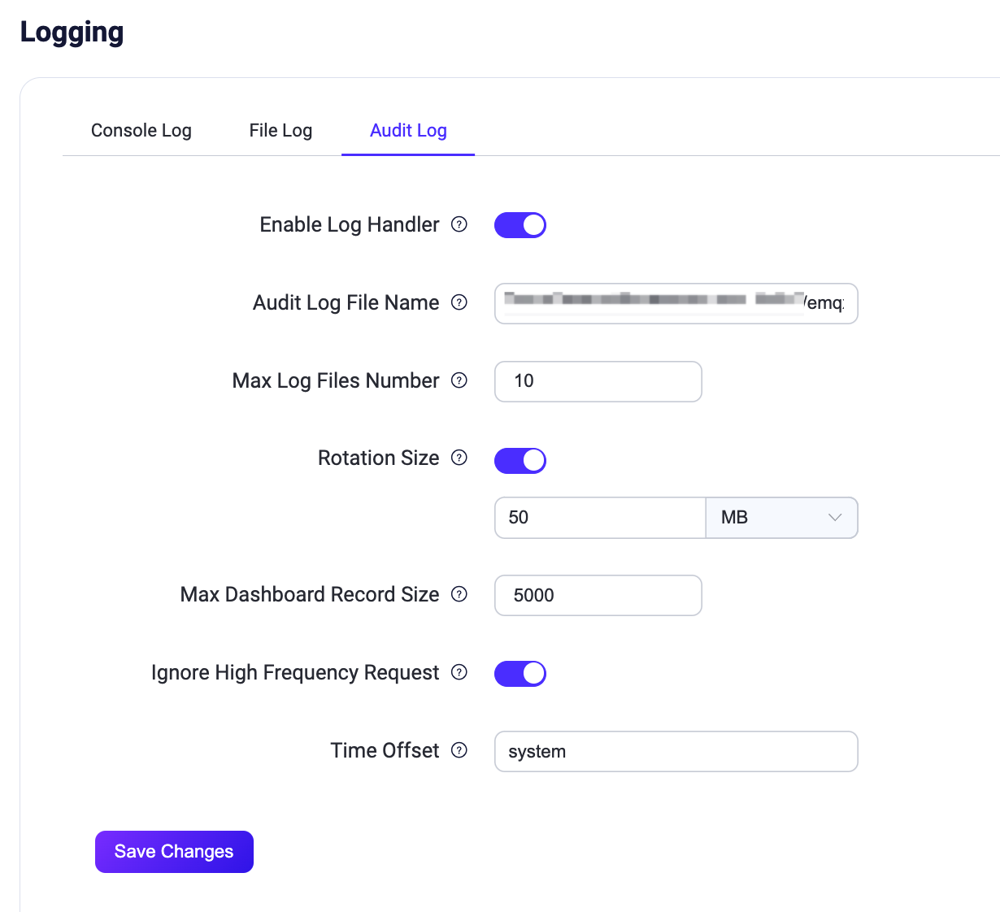
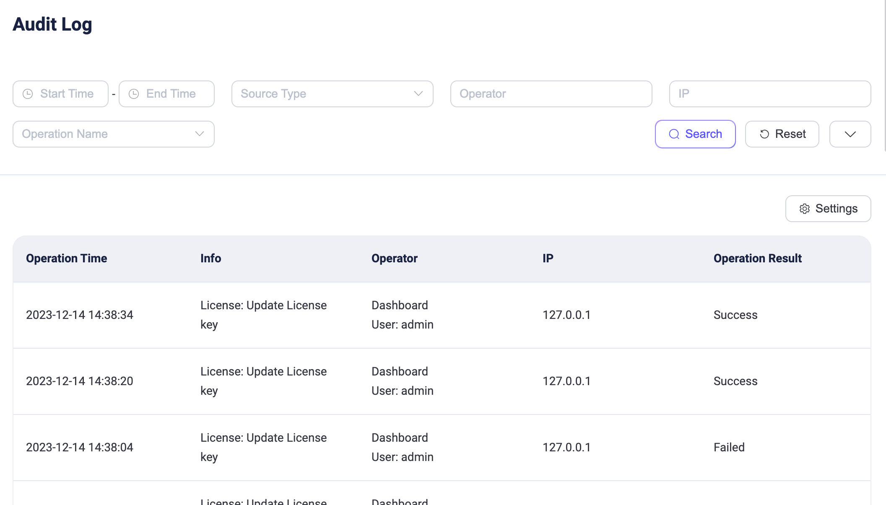

# Audit Log

Audit Log機能は、EMQXクラスターにおける重要な運用変更をリアルタイムで追跡することを可能にします。Audit Logを通じて、エンタープライズユーザーは誰がどの重要な操作を、どのように、いつ行ったのかを簡単に確認できます。これは、エンタープライズユーザーが規制要件に準拠し、運用中のデータセキュリティ監査を確実に行うための重要なツールです。

EMQX Audit Logは、[ダッシュボード](./introduction.md)、[REST API](../api.md)、および[CLI](../cli.md)からの変更に関連する操作を記録することをサポートしています。たとえば、ダッシュボードのユーザーログインやクライアント、アクセス制御、データ統合の変更などです。ただし、メトリクス取得やクライアントリストの照会などの読み取り専用操作は記録されません。

EMQXは、ダッシュボードのビューとログシステムとの統合を提供し、エンタープライズがAudit Logを管理しやすくしています。これらの方法を通じて、EMQXは柔軟かつ包括的なAudit Logのサポートを提供し、エンタープライズユーザーがニーズに応じて最適な方法でAudit Logを管理・閲覧できるようにしています。

## Audit Logアクセス

EMQX 6.0.4以降、クラスター全体のAudit Logは、ダッシュボードまたは`GET /api/v5/audit`を通じて、グローバル管理者およびグローバルビューアのみが閲覧可能です。Audit Logはすべてのネームスペースの操作を含み、呼び出し元のネームスペースによるフィルタリングは行われません。ネームスペース付きのダッシュボードユーザーやネームスペース付きAPIキーからのリクエストは、役割や割り当てられたスコープに関係なくHTTP `403`エラー（`UNAUTHORIZED_ROLE`）を返します。[`audit`スコープ](../api.md#built-in-api-key-scopes)はこの制限を上書きしません。

## Audit Logの有効化

Audit Log機能は、ダッシュボードおよび設定ファイルの両方から有効化および設定パラメータの調整が可能です。

### ダッシュボードからAudit Logを有効化

ダッシュボードでAudit Logを有効化し、設定パラメータを変更するには、**Management** -> **Logging** -> **Audit Log**、または**System** -> **Audit Log**に移動します。



Audit Logに対して以下のオプションを設定できます。

- **Enable Log Handler**: Audit Log処理プロセスの有効化・無効化。デフォルトで有効です。
- **Audit Log File Name**: Audit Logファイルのパスと名前を指定します。デフォルトは`${EMQX_LOG_DIR}/audit.log`で、`${EMQX_LOG_DIR}`は変数でありデフォルトは`./log`、最終的に`./log/audit.log.1`に保存されます。
- **Maximum Log Files Number**: ローテーションされるログファイルの最大数。デフォルトは`10`です。
- **Rotation Size**: ログファイルのサイズを設定し、指定サイズに達するとログファイルがローテーションされます。無効にするとログファイルは無制限に増加します。テキストボックスに値を入力し、ドロップダウンリストから`MB`、`GB`、`KB`などの単位を選択できます。デフォルトは`50MB`です。
- **Max Dashboard Record Size**: ダッシュボードおよび`/audit` APIを通じてアクセス・取得可能な、データベースに保存される最大レコード数を決定します。デフォルトは`5000`です。
- **Ignore High Frequency Request**: パブリッシュ／サブスクライブやクライアントのキックアウトなど、高頻度のリクエストを無視してAudit Logの洪水を防ぐかどうかを制御します。デフォルトで有効です。
- **Time Offset**: ログのタイムスタンプの形式を定義します。例："-02:00"や"+00:00"。デフォルトは`system`です。

### 設定ファイルからAudit Logを有効化

`base.hocon`ファイルの`log.audit`セクションでAudit Logを有効化し、設定オプションを変更することも可能です。以下は例です。

```bash
log.audit {
  path = "./log/audit.log"
  rotation_count = 10
  rotation_size = 50MB
  time_offset = system
  ignore_high_frequency_request = true
  max_filter_size = 5000
}
```

## ダッシュボードでAudit Logを閲覧

Audit Logが有効化されると、ダッシュボードの**System** -> **Audit Log**でログエントリを閲覧できます。



### 検索フィルター

以下の検索キーワードで操作ログをフィルタリング・検索できます。

- **開始時間** - **終了時間**: 操作が発生した時間範囲。
- **ソースタイプ**: 操作が行われた方法。`Dashboard`、`REST API`、`CLI`、`Erlang Console`が選択可能です。`Erlang Console`はEMQによるオンサイト技術サポート時に使用されるErlang Shellコンソールを指します。
- **オペレーター**: ダッシュボードのユーザー名またはREST API呼び出しに使用されたキー名。操作方法がDashboardまたはREST APIの場合のみ有効です。
- **IP**: ダッシュボードユーザーまたはREST APIを呼び出したクライアントの送信元IP。操作方法がDashboardまたはREST APIの場合のみ表示されます。
- **操作名**: Audit Logがサポートする操作名のドロップダウンリストから選択。
- **操作結果**: `Success`または`Failure`から選択。

### リストの説明

表示されるAudit Logリストの各列の説明は以下の通りです。

- **操作時間**: 操作が行われた時間。
- **情報**:
  - DashboardまたはREST APIの場合は操作名を表示。
  - CLIおよびConsoleの場合は実行されたコマンドを記録。
- **オペレーター**: 操作方法と対応するオペレーターを含みます。CLIおよびConsole操作の場合、オペレーターはコマンドが実行されたEMQXノード名です。
- **IP**: ダッシュボードユーザーまたはREST APIを呼び出したクライアントの送信元IP。操作方法がDashboardまたはREST APIの場合のみ表示。
- **操作結果**: `Success`または`Failure`。失敗にはフォーム検証エラーやリソース削除不能などが含まれます。DashboardまたはREST APIのみ表示され、CLIおよびConsoleでは操作結果は記録されません。

## ログファイルでAudit Logを閲覧

Audit LogがEMQXで有効化されると、変更に関連する操作は`./log/audit.log.1`ファイルにログ形式で保存されます。エンタープライズユーザーはAudit Logの詳細分析や既存のログ管理システムへの統合を容易に行え、コンプライアンスやデータセキュリティ要件を満たせます。

::: warning 注意

コマンドライン操作のAudit Logには機密情報が含まれる可能性があるため、ログコレクターに送信する際は注意が必要です。ログ内容のフィルタリングや暗号化通信の利用など、不正な情報漏洩を防ぐ対策を推奨します。

:::

Audit Logに含まれるフィールドは、操作記録のソースによって異なります。

### ダッシュボードまたはREST APIからの操作記録

ダッシュボードまたはREST APIの操作を記録したAudit Logには、操作ユーザー、操作対象、操作結果の情報が含まれます。ログメッセージのフォーマット例は以下の通りです。

```bash
{"time":1702604675872987,"level":"info","source_ip":"127.0.0.1","operation_type":"mqtt","operation_result":"success","http_status_code":204,"http_method":"delete","operation_id":"/mqtt/retainer/message/:topic","duration_ms":4,"auth_type":"jwt_token","from":"dashboard","source":"admin","node":"emqx@127.0.0.1","http_request":{"method":"delete","headers":{"user-agent":"Mozilla/5.0 (Macintosh; Intel Mac OS X 10_15_7) AppleWebKit/537.36 (KHTML, like Gecko) Chrome/119.0.0.0 Safari/537.36","sec-fetch-site":"same-origin","sec-fetch-mode":"cors","sec-fetch-dest":"empty","sec-ch-ua-platform":"\"macOS\"","sec-ch-ua-mobile":"?0","sec-ch-ua":"\"Google Chrome\";v=\"119\", \"Chromium\";v=\"119\", \"Not?A_Brand\";v=\"24\"","referer":"http://localhost:18083/","origin":"http://localhost:18083","host":"localhost:18083","connection":"keep-alive","authorization":"******","accept-language":"zh-CN,zh;q=0.9,zh-TW;q=0.8,en;q=0.7","accept-encoding":"gzip, deflate, br","accept":"*/*"},"body":{},"bindings":{"topic":"$SYS/brokers/emqx@127.0.0.1/version"}}}
```

以下の表は、ダッシュボードまたはREST APIの操作によって生成されるAudit Logエントリに含まれるフィールドを説明しています。

| フィールド名         | 型       | 説明                                                        |
| -------------------- | -------- | ----------------------------------------------------------- |
| time                 | Integer  | ログ記録時刻をマイクロ秒単位で表したタイムスタンプ。       |
| level                | String   | ログレベル。                                                |
| source_ip            | String   | 操作の送信元IPアドレス。                                   |
| operation_type       | String   | 操作の機能モジュール。REST APIのタグに対応。               |
| operation_result     | String   | 操作結果。"success"は成功、"failure"は失敗を示す。          |
| http_status_code     | Integer  | HTTPレスポンスステータスコード。                            |
| http_method          | String   | HTTPリクエストメソッド。                                   |
| duration_ms          | Integer  | 操作実行時間（ミリ秒単位）。                               |
| auth_type            | String   | 認証タイプ。認証に使用された方法や仕組みを示し、Dashboardは`jwt_token`、REST APIは`api_key`で固定。 |
| from                 | String   | リクエストの送信元。`dashboard`、`rest_api`はそれぞれダッシュボード、REST APIを示す。`cli`、`erlang_console`はCLIやErlang Shellからの操作を示し、このログ構造は適用されない。 |
| source               | String   | 操作を行ったダッシュボードのユーザー名またはAPIキー名。   |
| node                 | String   | 操作が実行されたノード名。                                 |
| operation_id         | String   | リクエストのREST APIパス。詳細は[REST API](../api.md)参照。 |
| http_request         | Object   | HTTPリクエストの詳細。                                     |
| http_request.method  | String   | HTTPリクエストメソッド。                                   |
| http_request.bindings| Object   | `operation_id`内のプレースホルダーに対応するパスパラメータの値。 |
| http_request.headers | Object   | HTTPリクエストヘッダー。機密情報と認識されるキーの値はマスクされる。 |
| http_request.body    | Object   | HTTPリクエストボディ。機密情報と認識されるキーの値はマスクされる。 |
| http_request.query_string | Object | 任意。解析済みのURLクエリパラメータ。クエリパラメータがない場合は省略。機密情報と認識されるキーの値はマスクされる。 |
| http_request.namespace | String | 任意。操作対象の解決済みネームスペース。グローバルネームスペースの場合は`global`。 |

#### ネームスペースとクエリパラメータ

EMQX 6.0.4以降、Audit Logの記録には監査対象のダッシュボードおよびREST APIリクエストの空でないクエリパラメータが`http_request.query_string`に含まれます。データバックアップ操作では、`http_request.namespace`にリクエストに`namespace`クエリパラメータが含まれているかに関わらず、解決済みの対象ネームスペースが記録されます。以下はグローバル管理者が`ns2`にバックアップをインポートする例です。

```json
{
  "http_request": {
    "method": "post",
    "body": {"filename": "emqx-export.zip"},
    "query_string": {"namespace": "ns2"},
    "namespace": "ns2"
  }
}
```

ネームスペース管理者が自身のネームスペースでクエリパラメータなしにデータバックアップ操作を行った場合、`http_request.query_string`は省略されますが、解決済みネームスペースは`http_request.namespace`に含まれます。

解決済みの対象ネームスペースは、バックアップファイルのエクスポート、インポート、アップロード、削除を行うデータバックアップ操作で記録されます。対象ネームスペースを解決しない他のエンドポイントでは`http_request.namespace`は省略されます。

### CLIまたはErlang Consoleからの操作記録

CLIまたはErlang Consoleの操作を記録したAudit Logには、実行されたコマンドや呼び出しパラメータなどの情報が含まれます。ログメッセージのフォーマット例は以下の通りです。

```bash
{"time":1695866030977555,"level":"info","msg":"from_cli","from": "cli","node":"emqx@127.0.0.1","duration_ms":0,"cmd":"retainer","args":["clean", "t/1"]}
```

以下の表は上記ログメッセージに含まれるフィールドを示します。

| フィールド名  | 型       | 説明                                                        |
| ------------ | -------- | ----------------------------------------------------------- |
| time         | Integer  | ログ記録時刻をマイクロ秒単位で表したタイムスタンプ。       |
| level        | String   | ログレベル。                                                |
| msg          | String   | 操作の説明。                                               |
| from         | String   | リクエストの送信元。`cli`、`erlang_console`はそれぞれCLI、Erlang Shellを示す。`dashboard`、`rest_api`の場合はダッシュボードまたはREST APIからの操作であり、このログ構造は適用されない。 |
| node         | String   | 操作が実行されたノード名。                                 |
| duration_ms  | Integer  | 操作の実行時間（ミリ秒単位）。                             |
| cmd          | String   | 実行された具体的なコマンド操作。対応コマンドは[CLI](../cli.md)を参照。 |
| args         | Array    | コマンドに付随する追加パラメータ。複数パラメータは配列で区切られる。 |
