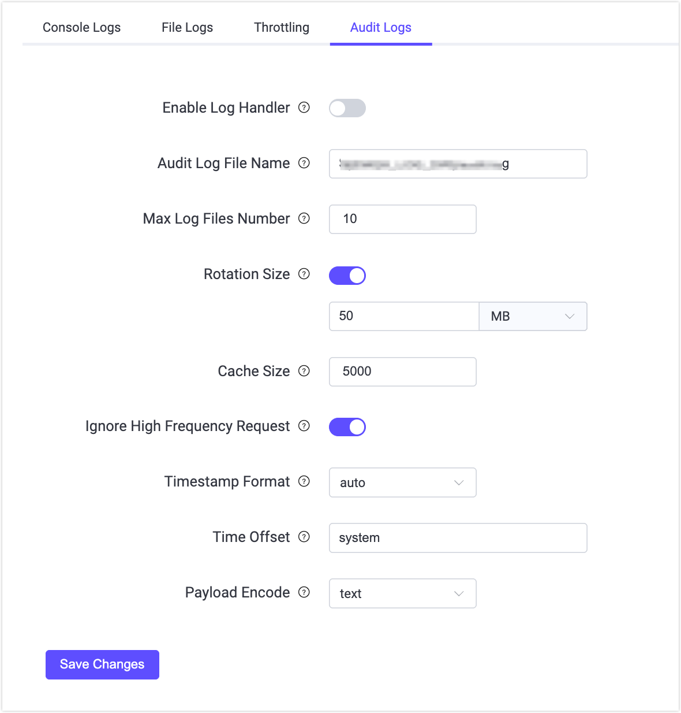

# Audit Log

Audit Log機能は、EMQXクラスター内の重要な運用変更をリアルタイムで追跡できるようにします。Audit Logを通じて、エンタープライズユーザーは誰がどの重要な操作をいつどのように行ったかを簡単に確認できます。これは、エンタープライズユーザーが規制要件を遵守し、運用中のデータセキュリティ監査を確実に行うための重要なツールです。

EMQX Audit Logは、[ダッシュボード](../dashboard/introduction.md)、[REST API](../api.md)、および[CLI](../cli.md)からの変更に関連する操作を記録することをサポートしています。例えば、ダッシュボードのユーザーログインやクライアント、アクセス制御、データ統合の変更などです。ただし、メトリクスの取得やクライアントリストの照会などの読み取り専用操作は記録されません。

EMQXは、エンタープライズがAudit Logを管理しやすいように、ダッシュボードビューとログシステムとの連携を提供しています。これらの方法を通じて、EMQXは柔軟かつ包括的なAudit Logのサポートを実現し、エンタープライズユーザーがニーズに応じて最適な方法でAudit Logを管理・閲覧できるようにしています。

## Audit Logの有効化

Audit Log機能は、ダッシュボードおよび設定ファイルの両方から有効化および設定パラメータの調整が可能です。

### ダッシュボードからAudit Logを有効化

ダッシュボードでAudit Logを有効化し、設定パラメータを変更するには、**管理** -> **ログ** -> **Audit Log**、または**システム** -> **Audit Log**に移動します。



Audit Logに対して以下のオプションを設定できます。

- **ログハンドラーを有効化**: Audit Log処理プロセスの有効化・無効化。デフォルトで有効です。
- **Audit Logファイル名**: Audit Logファイルのパスと名前を指定します。デフォルト値は`${EMQX_LOG_DIR}/audit.log`で、`${EMQX_LOG_DIR}`は変数でありデフォルトは`./log`です。つまり最終的には`./log/audit.log.1`に保存されます。
- **最大ログファイル数**: ローテーションされるログファイルの最大数。デフォルトは`10`です。
- **ローテーションサイズ**: ログファイルのサイズを設定し、指定サイズに達するとログファイルがローテーションされます。無効にするとログファイルは無制限に増大します。テキストボックスに希望の値を入力し、ドロップダウンリストから`MB`、`GB`、`KB`などの単位を選択できます。デフォルトは`50MB`です。
- **ダッシュボード最大レコード数**: データベースに保存される最大レコード数を設定します。ダッシュボードおよび`/audit` APIからアクセス・取得可能です。デフォルトは`5000`です。
- **高頻度リクエストを無視**: パブリッシュ／サブスクライブやクライアントのキックアウトなどの高頻度リクエストを無視し、Audit Logの過剰な記録を防ぐかどうかを制御します。デフォルトで有効です。
- **タイムオフセット**: ログのタイムスタンプの形式を定義します。例として"-02:00"や"+00:00"があります。デフォルトは`system`です。

### 設定ファイルからAudit Logを有効化

`base.hocon`ファイルの`log.audit`セクションでAudit Logを有効化し、設定オプションを変更することも可能です。以下は例です。

```bash
log.audit {
  path = "./log/audit.log"
  rotation_count = 10
  rotation_size = 50MB
  time_offset = system
  ignore_high_frequency_request = true
  max_filter_size = 5000
}
```

## ダッシュボードでAudit Logを閲覧

Audit Logが有効化されると、ダッシュボードの**システム** -> **Audit Log**でAudit Logの内容を閲覧できます。


### 検索フィルター

ログ操作をフィルターおよび検索できます。サポートされる検索キーワードは以下の通りです。

- **開始時間** - **終了時間**: 操作が発生した時間範囲。
- **ソースタイプ**: 操作を実行した方法。`Dashboard`、`REST API`、`CLI`、`Erlang Console`から選択可能です。ここで`Erlang Console`はEMQによる現地技術サポートで通常使用されるErlang Shellコンソールを指します。
- **オペレーター**: ダッシュボードのユーザー名またはREST API呼び出しに使用されたキー名。操作方法がダッシュボードまたはREST APIの場合のみ有効です。
- **IP**: ダッシュボードユーザーまたはREST APIを呼び出したクライアントの送信元IP。操作方法がダッシュボードまたはREST APIの場合のみ表示されます。
- **操作名**: Audit Logでサポートされている操作名のドロップダウンリストから選択します。
- **操作結果**: `Success`または`Failure`のドロップダウンリストから選択します。

### リストの説明

表示されるAudit Logリストの各列の説明は以下の通りです。

- **操作時間**: 操作が行われた時間。
- **情報**:
  - ダッシュボードまたはREST APIの場合、この列は操作名を表示します。
  - CLIおよびコンソールの場合、この列は実行されたコマンドを記録します。
- **オペレーター**: 操作方法と対応するオペレーターを含みます。CLIおよびコンソール操作の場合、オペレーターはコマンドが実行されたEMQXノードの名前です。
- **IP**: ダッシュボードユーザーまたはREST APIを呼び出したクライアントの送信元IP。操作方法がダッシュボードまたはREST APIの場合のみ表示されます。
- **操作結果**: `Success`または`Failure`。失敗にはフォーム検証エラーやリソース削除不可などのケースが含まれます。ダッシュボードまたはREST APIの場合のみ表示され、CLIおよびコンソールでは操作結果を記録できません。

## ログファイルでAudit Logを閲覧

EMQXでAudit Logが有効化されると、変更に関連する操作は`./log/audit.log.1`ファイルにログ形式で保存されます。エンタープライズユーザーはAudit Logの詳細な分析を行いやすく、既存のログ管理システムに統合してコンプライアンスやデータセキュリティ要件を満たすことが可能です。

::: warning 注意

コマンドライン操作のAudit Logには機密情報が含まれる可能性があるため、ログコレクターに送信する際は注意が必要です。ログ内容のフィルタリングや暗号化通信の利用を推奨し、不正な情報漏洩を防いでください。

:::

Audit Logに含まれるフィールドは、操作記録のソースによって異なります。

### ダッシュボードまたはREST APIからの操作記録

ダッシュボードまたはREST APIの操作を記録するAudit Logには、操作ユーザー、操作対象、操作結果の情報が含まれます。ログメッセージのフォーマット例は以下の通りです。

```bash
{"time":1702604675872987,"level":"info","source_ip":"127.0.0.1","operation_type":"mqtt","operation_result":"success","http_status_code":204,"http_method":"delete","operation_id":"/mqtt/retainer/message/:topic","duration_ms":4,"auth_type":"jwt_token","query_string":{},"from":"dashboard","source":"admin","node":"emqx@127.0.0.1","http_request":{"method":"delete","headers":{"user-agent":"Mozilla/5.0 (Macintosh; Intel Mac OS X 10_15_7) AppleWebKit/537.36 (KHTML, like Gecko) Chrome/119.0.0.0 Safari/537.36","sec-fetch-site":"same-origin","sec-fetch-mode":"cors","sec-fetch-dest":"empty","sec-ch-ua-platform":"\"macOS\"","sec-ch-ua-mobile":"?0","sec-ch-ua":"\"Google Chrome\";v=\"119\", \"Chromium\";v=\"119\", \"Not?A_Brand\";v=\"24\"","referer":"http://localhost:18083/","origin":"http://localhost:18083","host":"localhost:18083","connection":"keep-alive","authorization":"******","accept-language":"zh-CN,zh;q=0.9,zh-TW;q=0.8,en;q=0.7","accept-encoding":"gzip, deflate, br","accept":"*/*"},"body":{},"bindings":{"topic":"$SYS/brokers/emqx@127.0.0.1/version"}}}
```

以下の表は、上記ログメッセージサンプルに含まれるフィールドを示しています。

| フィールド名         | 型       | 説明                                                        |
| -------------------- | -------- | ----------------------------------------------------------- |
| time                 | Integer  | ログ記録の時刻をマイクロ秒単位で表したタイムスタンプ。      |
| level                | String   | ログレベル。                                                |
| source_ip            | String   | 操作の送信元IPアドレス。                                    |
| operation_type       | String   | 操作の機能モジュール。REST APIのタグに対応。                |
| operation_result     | String   | 操作結果。`success`は成功、`failure`は失敗を示す。          |
| http_status_code     | String   | HTTPレスポンスのステータスコード。                          |
| http_method          | String   | HTTPリクエストメソッド。                                    |
| duration_ms          | Integer  | 操作実行時間（ミリ秒単位）。                                |
| auth_type            | String   | 認証タイプ。認証に使用された方式やメカニズムを示し、`jwt_token`（ダッシュボード）または`api_key`（REST API）で固定。 |
| query_string         | Object   | HTTPリクエストのURLクエリパラメータ。                        |
| from                 | String   | リクエストの送信元。`dashboard`、`rest_api`はそれぞれダッシュボード、REST APIを示す。`cli`、`erlang_console`の場合はCLIまたはErlang Shellからの操作であり、このログ構造は適用されません。 |
| source               | String   | 操作を実行したダッシュボードのユーザー名またはAPIキー名。  |
| node                 | String   | 操作が実行されたノードまたはサーバーの名前。                |
| method               | String   | HTTPリクエストメソッド。`post`、`put`、`delete`はそれぞれ作成、更新、削除操作に対応。 |
| operate_id           | String   | リクエストのREST APIパス。[REST API](../api.md)を参照。 |

### CLIまたはErlangコンソールからの操作記録

CLIまたはErlangコンソールの操作を記録するAudit Logには、実行されたコマンド、呼び出されたパラメータなどの情報が含まれます。ログメッセージのフォーマット例は以下の通りです。

```bash
{"time":1695866030977555,"level":"info","msg":"from_cli","from": "cli","node":"emqx@127.0.0.1","duration_ms":0,"cmd":"retainer","args":["clean", "t/1"]}
```

以下の表は、上記ログメッセージサンプルに含まれるフィールドを示しています。

| フィールド名  | 型       | 説明                                                        |
| ------------ | -------- | ----------------------------------------------------------- |
| time         | Integer  | ログ記録の時刻をマイクロ秒単位で示すタイムスタンプ。        |
| level        | String   | ログレベル。                                                |
| msg          | String   | 操作の説明。                                                |
| from         | String   | リクエストの送信元。`cli`、`erlang_console`はそれぞれCLI、Erlang Shellを示す。`dashboard`、`rest_api`の場合はダッシュボードまたはREST APIからの操作であり、このログ構造は適用されません。 |
| node         | String   | 操作が実行されたノードまたはサーバーの名前。                |
| duration_ms  | Integer  | 操作の実行時間（ミリ秒単位）。                              |
| cmd          | String   | 実行された具体的なコマンド操作。対応コマンドは[CLI](../cli.md)を参照。 |
| args         | Array    | コマンドに付随する追加パラメータ。複数パラメータは配列で区切られます。 |
