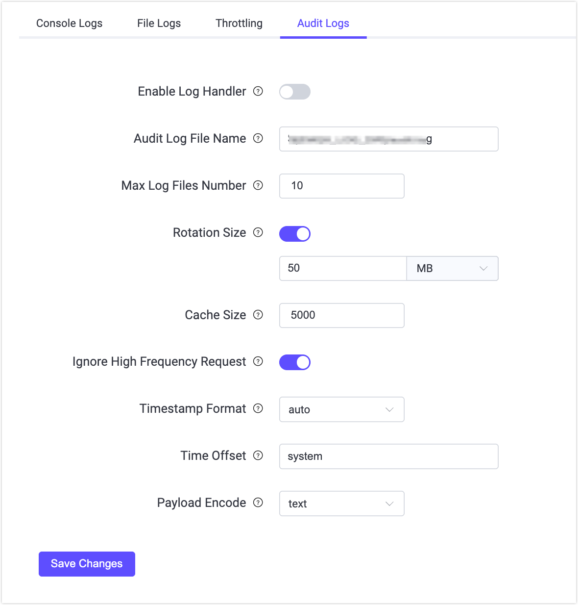

# Audit Log

Audit Log機能は、EMQXクラスターにおける重要な運用変更をリアルタイムで追跡することを可能にします。Audit Logを通じて、エンタープライズユーザーは誰がどの重要な操作をどのように、いつ実行したかを簡単に確認できます。これは、エンタープライズユーザーが規制要件を遵守し、運用中のデータセキュリティ監査を確保するための重要なツールです。

EMQX Audit Logは、[ダッシュボード](./introduction.md)、[REST API](../api.md)、および[CLI](../cli.md)からの変更関連操作の記録をサポートしています。例えば、ダッシュボードのユーザーログインやクライアント、アクセス制御、データ統合の変更などです。ダッシュボードおよびREST APIに関しては、メトリクス取得やクライアントリストの照会などの読み取り専用操作は記録されません。CLIコマンドはデータ変更の有無にかかわらず記録されますが、[CLIまたはErlangコンソールからの操作記録](#operation-records-from-cli-or-erlang-console)に記載の例外があります。

EMQXは、ダッシュボードビューとログシステムとの連携を提供し、エンタープライズがAudit Logを管理しやすい環境を整えています。これらの方法により、EMQXは柔軟かつ包括的なAudit Logのサポートを提供し、エンタープライズユーザーがニーズに応じて最適な管理・閲覧方法を選択できるようにしています。

## Audit Logへのアクセス

EMQX 6.3.2以降、ダッシュボードでクラスター全体のAudit Logを閲覧したり、`GET /api/v5/audit`で読み取れるのは、グローバル管理者およびグローバルビューアのみです。Audit Logにはすべてのネームスペースの操作が含まれ、呼び出し元のネームスペースによるフィルタリングは行われません。ネームスペース付きのダッシュボードユーザーやAPIキーからのリクエストは、役割や割り当てられたスコープにかかわらずHTTP `403`で`UNAUTHORIZED_ROLE`エラーコードが返されます。[`audit`スコープ](../api.md#built-in-api-key-scopes)はこの制限を上書きしません。

## Audit Logの有効化

Audit Log機能は、ダッシュボードおよび設定ファイルの両方から有効化および設定パラメータの調整が可能です。

### ダッシュボードからAudit Logを有効化

ダッシュボードでAudit Logを有効にし、設定パラメータを変更するには、**Management** -> **Logging** -> **Audit Log**、または**System** -> **Audit Log**に移動します。



Audit Logに対して以下のオプションを設定できます。

- **Enable Log Handler**: Audit Log処理プロセスの有効化・無効化。デフォルトで有効です。
- **Audit Log File Name**: Audit Logファイルのパスと名前を指定します。デフォルトは`${EMQX_LOG_DIR}/audit.log`で、`${EMQX_LOG_DIR}`は変数でありデフォルトは`./log`です。つまり最終的に`./log/audit.log.1`に保存されます。
- **Maximum Log Files Number**: ローテーションされるログファイルの最大数。デフォルトは`10`です。
- **Rotation Size**: ログファイルのサイズを設定し、指定サイズに達するとログファイルがローテーションされます。無効にするとログファイルは無制限に成長します。テキストボックスに値を入力し、ドロップダウンリストから`MB`、`GB`、`KB`などの単位を選択できます。デフォルトは`50MB`です。
- **Cache Size**: データベースに保存される最大レコード数を決定します。ダッシュボードおよび`/audit` APIからアクセス・取得可能です。デフォルトは`5000`です。

  ::: tip 注意
  `log.audit.max_filter_size`は後方互換のためエイリアスとして残されています。
  :::

- **Ignore High Frequency Request**: 高頻度リクエストを無視してAudit Logの洪水を防ぐかを制御します。例えばパブリッシュ／サブスクライブやクライアントのキックアウト関連のリクエストです。デフォルトで有効です。
- **Timestamp Format**: ログエントリーのタイムスタンプのフォーマット。選択肢は以下の通りです。
  - `auto`: ログフォーマッターに基づき最適な形式を自動選択。JSONは`epoch`、テキストは`rfc3339`。
  - `epoch`: マイクロ秒単位のUnixエポック時間。
  - `rfc3339`: RFC3339形式。
- **Time Offset**: ログエントリーのタイムスタンプをフォーマットする際の時間オフセット。選択肢は以下の通りです。
  - `system`: ローカルシステムの時間オフセット。
  - `utc`: UTC時間オフセット。
  - `+-[hh]:[mm]`: ユーザー指定の時間オフセット（例：`"-02:00"`や`"+00:00"`）。

  デフォルトは`system`です。
- **Payload Encode**: ログエントリー内のペイロードデータのエンコード方法。`text`、`hex`、`hidden`から選択可能。デフォルトは`text`です。

### 設定ファイルからAudit Logを有効化

`base.hocon`ファイルの`log.audit`以下に設定オプションを記述して、Audit Logを有効化および設定変更も可能です。例を以下に示します。

```hocon
log.audit {
  path = "./log/audit.log"
  rotation_count = 10
  rotation_size = 50MB
  cache_size = 5000
  ignore_high_frequency_request = true
  timestamp_format = auto
  time_offset = system
  payload_encode = text
}
```

## ダッシュボードでAudit Logを閲覧

Audit Logを有効にすると、ダッシュボードの**System** -> **Audit Log**でログエントリーを閲覧できます。


### 検索フィルター

ログ操作をフィルター・検索可能で、サポートされている検索キーワードは以下の通りです。

- **開始時間** - **終了時間**: 操作が発生した時間範囲。
- **ソースタイプ**: 操作の実行方法。選択肢は`Dashboard`、`REST API`、`CLI`、`Erlang Console`。ここで`Erlang Console`はEMQが提供する現地技術サポート時に使用されるErlang Shellコンソールを指します。
- **オペレーター**: ダッシュボードのユーザー名またはREST API呼び出しに使用されたキー名。操作方法がDashboardまたはREST APIの場合にのみ有効です。
- **IP**: ダッシュボードユーザーまたはREST APIを呼び出したクライアントの送信元IP。操作方法がDashboardまたはREST APIの場合にのみ表示されます。
- **操作名**: Audit Logでサポートされている操作名のドロップダウンリストから選択。
- **操作結果**: `Success`または`Failure`のドロップダウンリストから選択。

### リストの説明

表示されるAudit Logリストの各列の説明は以下の通りです。

- **操作時間**: 操作が行われた時間。
- **情報**:
  - DashboardまたはREST APIの場合は操作名を表示。
  - CLIおよびコンソールの場合は実行されたコマンドを記録。
- **オペレーター**: 操作方法と対応するオペレーターを含みます。CLIおよびコンソール操作の場合、オペレーターはコマンドが実行されたEMQXノードの名前です。
- **IP**: ダッシュボードユーザーまたはREST APIを呼び出したクライアントの送信元IP。操作方法がDashboardまたはREST APIの場合にのみ表示されます。
- **操作結果**: `Success`または`Failure`。失敗にはフォーム検証失敗やリソース削除不可などが含まれます。DashboardまたはREST APIの操作方法の場合にのみ表示され、CLIおよびコンソールでは操作結果を記録できません。

## ログファイルでAudit Logを閲覧

EMQXでAudit Logが有効化されている場合、変更関連操作は`./log/audit.log.1`ファイルにログ形式で保存されます。エンタープライズユーザーはAudit Logの詳細分析や既存のログ管理システムへの統合を容易に行え、コンプライアンスやデータセキュリティ要件を満たせます。

::: warning 注意

コマンドライン操作のAudit Logには機密情報が含まれる可能性があるため、ログコレクターに送信する際は注意が必要です。ログ内容のフィルタリングや暗号化通信の利用など、不正な情報漏洩防止策を推奨します。

:::

Audit Logに含まれるフィールドは、操作記録のソースによって異なります。

### ダッシュボードまたはREST APIからの操作記録

ダッシュボードまたはREST APIの操作を記録するAudit Logには、操作ユーザー、操作対象、操作結果の情報が含まれます。ログメッセージのフォーマット例は以下の通りです。

```bash
{"time":1702604675872987,"level":"info","source_ip":"127.0.0.1","operation_type":"mqtt","operation_result":"success","http_status_code":204,"http_method":"delete","operation_id":"/mqtt/retainer/message/:topic","duration_ms":4,"auth_type":"jwt_token","from":"dashboard","source":"admin","node":"emqx@127.0.0.1","http_request":{"method":"delete","headers":{"user-agent":"Mozilla/5.0 (Macintosh; Intel Mac OS X 10_15_7) AppleWebKit/537.36 (KHTML, like Gecko) Chrome/119.0.0.0 Safari/537.36","sec-fetch-site":"same-origin","sec-fetch-mode":"cors","sec-fetch-dest":"empty","sec-ch-ua-platform":"\"macOS\"","sec-ch-ua-mobile":"?0","sec-ch-ua":"\"Google Chrome\";v=\"119\", \"Chromium\";v=\"119\", \"Not?A_Brand\";v=\"24\"","referer":"http://localhost:18083/","origin":"http://localhost:18083","host":"localhost:18083","connection":"keep-alive","authorization":"******","accept-language":"zh-CN,zh;q=0.9,zh-TW;q=0.8,en;q=0.7","accept-encoding":"gzip, deflate, br","accept":"*/*"},"body":{},"bindings":{"topic":"$SYS/brokers/emqx@127.0.0.1/version"}}}
```

以下の表は、ダッシュボードまたはREST API操作によって生成されるAudit Logエントリーに含まれる可能性のあるフィールドを説明しています。

| フィールド名           | 型       | 説明                                                         |
| ---------------------- | -------- | ------------------------------------------------------------ |
| time                   | 整数     | ログ記録のタイムスタンプ（マイクロ秒単位）                   |
| level                  | 文字列   | ログレベル                                                   |
| source_ip              | 文字列   | 操作の送信元IPアドレス                                       |
| operation_type         | 文字列   | 操作の機能モジュール。REST APIのタグに対応                   |
| operation_result       | 文字列   | 操作結果。`success`は成功、`failure`は失敗を示す             |
| http_status_code       | 整数     | HTTPレスポンスステータスコード                               |
| http_method            | 文字列   | HTTPリクエストメソッド                                       |
| duration_ms            | 整数     | 操作実行時間（ミリ秒単位）                                   |
| auth_type              | 文字列   | 認証タイプ。認証に使用された方式やメカニズムを示し、`jwt_token`（ダッシュボード）または`api_key`（REST API）で固定 |
| from                   | 文字列   | リクエストの送信元。`dashboard`、`rest_api`はそれぞれダッシュボード、REST APIを示す。`cli`、`erlang_console`の場合はCLIまたはErlang Shellからの操作であり、このログ構造は適用されません。 |
| source                 | 文字列   | 操作を実行したダッシュボードのユーザー名またはAPIキー名     |
| node                   | 文字列   | 操作が実行されたノード名（ノードまたはサーバー）             |
| operation_id           | 文字列   | リクエストのREST APIパス。詳細は[REST API](../api.md)参照    |
| http_request           | オブジェクト | HTTPリクエストの詳細                                         |
| http_request.method    | 文字列   | HTTPリクエストメソッド。`post`、`put`、`delete`が可能       |
| http_request.bindings  | オブジェクト | `operation_id`内のプレースホルダーに対応するパスパラメータの値 |
| http_request.headers   | オブジェクト | HTTPリクエストヘッダー。機密と認識されたキーの値はマスクされる |
| http_request.body      | オブジェクト | HTTPリクエストボディ。機密と認識されたキーの値はマスクされる |
| http_request.query_string | オブジェクト | 任意。解析済みURLクエリパラメータ。クエリパラメータがない場合は省略。機密と認識されたキーの値はマスクされる |
| http_request.namespace | 文字列   | 任意。操作対象の解決済みネームスペース。グローバルネームスペースの場合は`global` |

#### ネームスペースとクエリパラメータ

EMQX 6.3.0以降、Audit Logはデータバックアップリクエストの非空クエリパラメータを`http_request.query_string`に含めます。データバックアップ操作では、リクエストに`namespace`クエリパラメータが含まれているかにかかわらず、`http_request.namespace`に解決済みの対象ネームスペースを記録します。

EMQX 6.3.1以降、クエリパラメータの記録はすべての監査対象ダッシュボードおよびREST APIリクエストに適用されます。対象ネームスペースを解決する操作は、リクエストに`ns`または`namespace`クエリパラメータが含まれているかにかかわらず、`http_request.namespace`に記録します。以下はグローバル管理者が明示的に`ns2`を対象にした例です。

```json
{
  "http_request": {
    "method": "put",
    "bindings": {"name": "test"},
    "query_string": {"ns": "ns2"},
    "namespace": "ns2"
  }
}
```

ネームスペース付き管理者が自身のネームスペース内のリソースをクエリパラメータなしで対象にした場合、`http_request.query_string`は省略されますが、解決済みネームスペースは`http_request.namespace`に含まれます。

認証、認可、コネクター、ブリッジ、ルール、トレース、データバックアップ、A2Aレジストリ、トピックメトリクスに関わるネームスペース付き操作は解決済み対象ネームスペースを記録します。対象ネームスペースを解決しない他のエンドポイントは`http_request.namespace`を省略します。

### CLIまたはErlangコンソールからの操作記録

すべてのCLIコマンドはAudit Logに記録されます。`emqx ctl status`のような読み取り専用コマンドも含みます。ただし例外として、トップレベルの使用法一覧は記録されません。つまり、コマンドなしで`emqx ctl`を実行したり、認識されないコマンドを実行した場合は、利用可能なコマンド一覧が表示されますが記録されません。無効な引数を受け取り自身の使用法メッセージを表示するコマンド（例：`emqx ctl status bad-arg`）は、そのコマンドの呼び出しとして記録されます。

CLIまたはErlangコンソール操作を記録するAudit Logには、実行されたコマンド、呼び出しパラメータなどの情報が含まれます。ログメッセージのフォーマット例は以下の通りです。

```bash
{"time":1695866030977555,"level":"info","msg":"from_cli","from": "cli","node":"emqx@127.0.0.1","duration_ms":0,"cmd":"retainer","args":["clean", "t/1"]}
```

以下の表は上記ログメッセージに含まれるフィールドを示します。

| フィールド名  | 型       | 説明                                                         |
| ------------ | -------- | ------------------------------------------------------------ |
| time         | 整数     | ログ記録のタイムスタンプ（マイクロ秒単位）                   |
| level        | 文字列   | ログレベル                                                   |
| msg          | 文字列   | 操作の説明                                                   |
| from         | 文字列   | リクエストの送信元。`cli`、`erlang_console`はそれぞれCLI、Erlang Shellを示す。`dashboard`、`rest_api`の場合はダッシュボードまたはREST APIの操作であり、このログ構造は適用されません。 |
| node         | 文字列   | 操作が実行されたノード名（ノードまたはサーバー）             |
| duration_ms  | 整数     | 操作の実行時間（ミリ秒単位）                                 |
| cmd          | 文字列   | 実行された具体的なコマンド操作。対応コマンドは[CLI](../cli.md)を参照 |
| args         | 配列     | コマンドに付随する追加パラメータ。複数パラメータは配列で区切られる |
