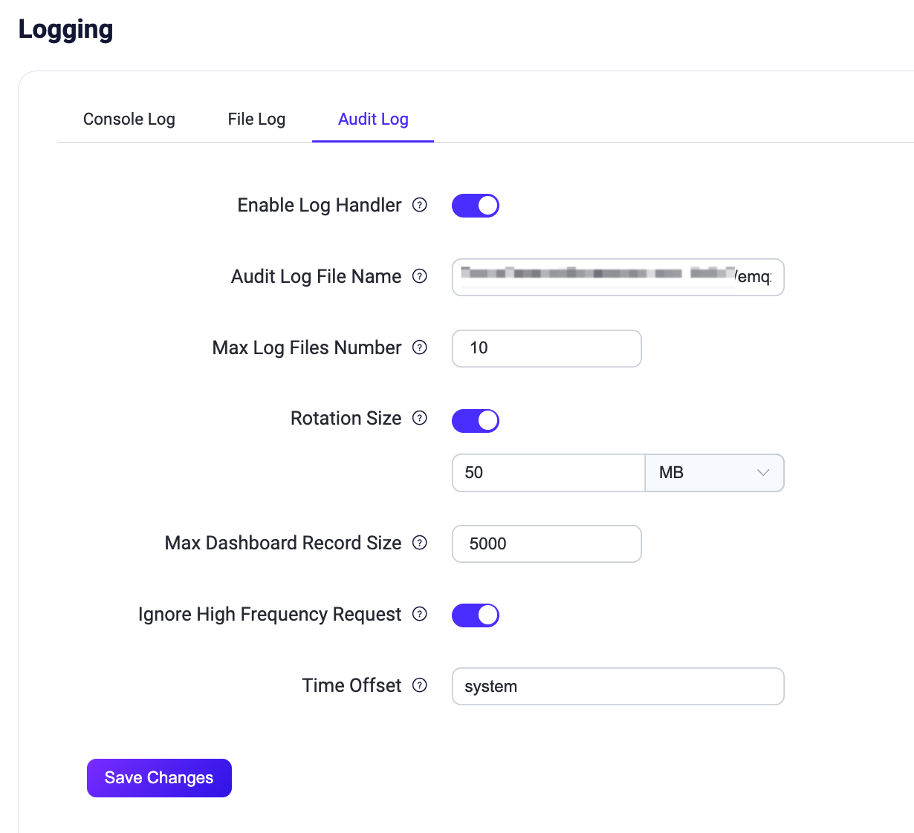
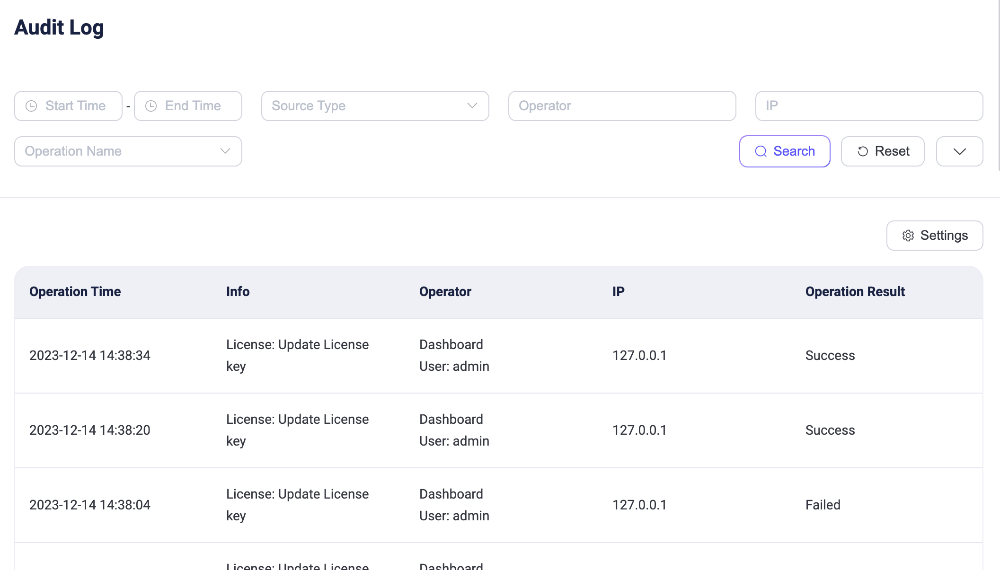

# Audit Log

Audit Log機能は、EMQXクラスターにおける重要な運用変更をリアルタイムで追跡することを可能にします。Audit Logを通じて、エンタープライズユーザーは誰がどのような重要な操作をいつ行ったかを簡単に把握できます。これは、規制要件の遵守や運用時のデータセキュリティ監査を確実に行うための重要なツールです。

EMQX Audit Logは、[ダッシュボード](./introduction.md)、[REST API](../api.md)、および[CLI](../cli.md)からの変更関連操作を記録します。例えば、ダッシュボードのユーザーログインやクライアント、アクセス制御、データ統合の変更などです。ただし、メトリクス取得やクライアントリスト照会などの読み取り専用操作は記録されません。

EMQXは、ダッシュボードビューとログシステムとの連携を提供し、エンタープライズユーザーがAudit Logを管理しやすい環境を整えています。これらの方法により、EMQXは柔軟かつ包括的にAudit Logをサポートし、ユーザーのニーズに応じた最適な管理・閲覧方法を選択可能にします。

## Audit Logのアクセス

EMQX 6.0.4以降、ダッシュボードでクラスター全体のAudit Logを閲覧できるのはグローバル管理者およびグローバルビューアのみです。また、`GET /api/v5/audit`を通じて読み取ることも可能です。Audit Logにはすべてのネームスペースの操作が含まれ、呼び出し元のネームスペースによるフィルタリングは行われません。ネームスペース限定のダッシュボードユーザーやAPIキーからのリクエストは、役割や割り当てられたスコープに関わらずHTTP `403` エラー（`UNAUTHORIZED_ROLE`）が返されます。[`audit`スコープ](../api.md#built-in-api-key-scopes)もこの制限を上書きしません。

## Audit Logの有効化

Audit Log機能は、ダッシュボードおよび設定ファイルの両方から有効化および設定パラメータの調整が可能です。

### ダッシュボードからAudit Logを有効化

ダッシュボードでAudit Logを有効化し、設定パラメータを変更するには、**Management** -> **Logging** -> **Audit Log** または **System** -> **Audit Log** にアクセスしてください。



Audit Logに対して以下のオプションを設定できます：

- **Enable Log Handler**：Audit Log処理プロセスの有効化・無効化。デフォルトで有効です。
- **Audit Log File Name**：Audit Logファイルのパスと名前を指定します。デフォルトは`${EMQX_LOG_DIR}/audit.log`で、`${EMQX_LOG_DIR}`は変数でデフォルトは`./log`、最終的には`./log/audit.log.1`に保存されます。
- **Maximum Log Files Number**：ローテーションされるログファイルの最大数。デフォルトは`10`です。
- **Rotation Size**：ログファイルのサイズを設定し、指定サイズに達するとログファイルをローテーションします。無効にするとログファイルは無制限に増加します。テキストボックスに値を入力し、ドロップダウンリストから`MB`、`GB`、`KB`などの単位を選択可能です。デフォルトは`50MB`です。
- **Max Dashboard Record Size**：データベースに保存され、ダッシュボードや`/audit` APIからアクセス可能な最大レコード数を決定します。デフォルトは`5000`です。
- **Ignore High Frequency Request**：高頻度リクエストを無視してAudit Logへの記録過多を防ぐかどうかの設定です。パブリッシュ／サブスクライブやクライアントキックアウトに関連するリクエストなどが対象です。デフォルトで有効です。
- **Time Offset**：ログのタイムスタンプのフォーマットを定義します。例："-02:00"や"+00:00"。デフォルトは`system`です。

### 設定ファイルからAudit Logを有効化

`base.hocon`ファイルの`log.audit`セクションでAudit Logを有効化し、設定オプションを変更することも可能です。以下は例です。

```bash
log.audit {
  path = "./log/audit.log"
  rotation_count = 10
  rotation_size = 50MB
  time_offset = system
  ignore_high_frequency_request = true
  max_filter_size = 5000
}
```

## ダッシュボードでAudit Logを閲覧

Audit Logを有効化すると、ダッシュボードの**System** -> **Audit Log**でログエントリを閲覧できます。



### 検索フィルター

以下の検索キーワードで操作ログをフィルタリング・検索できます：

- **Start Time** - **End Time**：操作が発生した時間範囲。
- **Source Type**：操作を行った手段。`Dashboard`、`REST API`、`CLI`、`Erlang Console`の選択肢があります。`Erlang Console`はEMQが提供するオンサイト技術サポート時に使われるErlang Shellコンソールを指します。
- **Operator**：ダッシュボードのユーザー名またはREST API呼び出しに使用されたキー名。操作方法がDashboardまたはREST APIの場合のみ有効です。
- **IP**：ダッシュボードユーザーまたはREST APIを呼び出したクライアントの送信元IP。操作方法がDashboardまたはREST APIの場合のみ表示されます。
- **Operation Name**：Audit Logでサポートされる操作名のドロップダウンリストから選択。
- **Operation Result**：`Success`または`Failure`から選択。

### リストの説明

表示されるAudit Logリストの各列の説明は以下の通りです：

- **Operation Time**：操作が行われた日時。
- **Info**：
  - DashboardまたはREST APIの場合は操作名を表示。
  - CLIおよびConsoleの場合は実行されたコマンドを記録。
- **Operator**：操作方法と対応するオペレーター。CLIおよびConsole操作の場合、オペレーターはコマンドが実行されたEMQXノード名です。
- **IP**：ダッシュボードユーザーまたはREST APIを呼び出したクライアントの送信元IP。DashboardまたはREST APIの場合のみ表示。
- **Operation Result**：`Success`または`Failure`。失敗にはフォーム検証失敗やリソース削除不可などが含まれます。DashboardまたはREST APIの場合のみ表示。CLIおよびConsoleは操作結果を記録できません。

## ログファイルでAudit Logを閲覧

Audit LogがEMQXで有効化されている場合、変更関連操作は`./log/audit.log.1`ファイルにログ形式で保存されます。エンタープライズユーザーはAudit Logの詳細分析や既存のログ管理システムへの統合を容易に行え、コンプライアンスやデータセキュリティ要件に対応できます。

::: warning 注意

コマンドライン操作のAudit Logには機密情報が含まれる可能性があるため、ログコレクターに送信する際は注意が必要です。ログ内容のフィルタリングや暗号化通信の利用など、不正な情報漏洩を防ぐ対策を推奨します。

:::

Audit Logに含まれるフィールドは、操作記録のソースによって異なります。

### ダッシュボードまたはREST APIからの操作記録

ダッシュボードやREST APIの操作を記録するAudit Logには、操作ユーザー、操作対象、操作結果の情報が含まれます。ログメッセージのフォーマット例は以下の通りです。

```bash
{"time":1702604675872987,"level":"info","source_ip":"127.0.0.1","operation_type":"mqtt","operation_result":"success","http_status_code":204,"http_method":"delete","operation_id":"/mqtt/retainer/message/:topic","duration_ms":4,"auth_type":"jwt_token","from":"dashboard","source":"admin","node":"emqx@127.0.0.1","http_request":{"method":"delete","headers":{"user-agent":"Mozilla/5.0 (Macintosh; Intel Mac OS X 10_15_7) AppleWebKit/537.36 (KHTML, like Gecko) Chrome/119.0.0.0 Safari/537.36","sec-fetch-site":"same-origin","sec-fetch-mode":"cors","sec-fetch-dest":"empty","sec-ch-ua-platform":"\"macOS\"","sec-ch-ua-mobile":"?0","sec-ch-ua":"\"Google Chrome\";v=\"119\", \"Chromium\";v=\"119\", \"Not?A_Brand\";v=\"24\"","referer":"http://localhost:18083/","origin":"http://localhost:18083","host":"localhost:18083","connection":"keep-alive","authorization":"******","accept-language":"zh-CN,zh;q=0.9,zh-TW;q=0.8,en;q=0.7","accept-encoding":"gzip, deflate, br","accept":"*/*"},"body":{},"bindings":{"topic":"$SYS/brokers/emqx@127.0.0.1/version"}}}
```

以下の表は、ダッシュボードまたはREST API操作によって生成されるAudit Logエントリに含まれるフィールドの説明です。

| フィールド名           | 型       | 説明                                                         |
| ---------------------- | -------- | ------------------------------------------------------------ |
| time                   | Integer  | ログ記録のタイムスタンプ（マイクロ秒単位）                   |
| level                  | String   | ログレベル                                                   |
| source_ip              | String   | 操作の送信元IPアドレス                                       |
| operation_type         | String   | 操作の機能モジュール。REST APIのTagに対応                   |
| operation_result       | String   | 操作結果。`success`は成功、`failure`は失敗を示す            |
| http_status_code       | Integer  | HTTPレスポンスステータスコード                               |
| http_method            | String   | HTTPリクエストメソッド                                       |
| duration_ms            | Integer  | 操作実行時間（ミリ秒単位）                                   |
| auth_type              | String   | 認証タイプ。認証に使用された方式やメカニズムを示し、Dashboardは`jwt_token`、REST APIは`api_key`で固定 |
| from                   | String   | リクエストの発信元。`dashboard`、`rest_api`はそれぞれダッシュボード、REST APIを示す。`cli`、`erlang_console`の場合はCLIやErlang Shellからの操作であり、このログ構造は該当しない |
| source                 | String   | 操作を行ったダッシュボードのユーザー名またはAPIキー名       |
| node                   | String   | 操作が実行されたノード名（ノードまたはサーバー）             |
| operation_id           | String   | リクエストのREST APIパス。詳細は[REST API](../api.md)参照    |
| http_request           | Object   | HTTPリクエストの詳細                                         |
| http_request.method    | String   | HTTPリクエストメソッド                                       |
| http_request.bindings  | Object   | `operation_id`内のプレースホルダーに対応するパスパラメータの値 |
| http_request.headers   | Object   | HTTPリクエストヘッダー。機密情報と認識されるキーの値はマスクされる |
| http_request.body      | Object   | HTTPリクエストボディ。機密情報と認識されるキーの値はマスクされる |
| http_request.query_string | Object | オプション。解析済みのURLクエリパラメータ。クエリパラメータがない場合は省略。機密情報と認識されるキーの値はマスクされる |
| http_request.namespace | String   | オプション。操作対象として解決されたネームスペース。グローバルネームスペースの場合は`global` |

#### ネームスペースとクエリパラメータ

EMQX 6.0.4以降、Audit Logの記録には監査対象のダッシュボードおよびREST APIリクエストの非空のクエリパラメータが`http_request.query_string`に含まれます。データバックアップ操作では、リクエストに`namespace`クエリパラメータがあってもなくても、`http_request.namespace`に解決された対象ネームスペースが記録されます。以下はグローバル管理者が`ns2`にバックアップをインポートする例です。

```json
{
  "http_request": {
    "method": "post",
    "body": {"filename": "emqx-export.zip"},
    "query_string": {"namespace": "ns2"},
    "namespace": "ns2"
  }
}
```

ネームスペース管理者が自身のネームスペースでクエリパラメータなしでデータバックアップ操作を行った場合、`http_request.query_string`は省略されますが、解決されたネームスペースは`http_request.namespace`に含まれます。

EMQX 6.1.5以降、認証、認可、コネクター、ブリッジ、ルール、トレースに関するネームスペース操作でも解決された対象ネームスペースが記録されます。対象ネームスペースを解決しないエンドポイントでは`http_request.namespace`は省略されます。

### CLIまたはErlang Consoleからの操作記録

CLIやErlang Consoleからの操作を記録するAudit Logには、実行されたコマンドや呼び出しパラメータなどの情報が含まれます。ログメッセージのフォーマット例は以下の通りです。

```bash
{"time":1695866030977555,"level":"info","msg":"from_cli","from": "cli","node":"emqx@127.0.0.1","duration_ms":0,"cmd":"retainer","args":["clean", "t/1"]}
```

以下の表は上記ログメッセージに含まれるフィールドの説明です。

| フィールド名  | 型       | 説明                                                         |
| ------------ | -------- | ------------------------------------------------------------ |
| time         | Integer  | ログ記録のタイムスタンプ（マイクロ秒単位）                   |
| level        | String   | ログレベル                                                   |
| msg          | String   | 操作の説明                                                   |
| from         | String   | リクエストの発信元。`cli`、`erlang_console`はそれぞれCLI、Erlang Shellを示す。`dashboard`、`rest_api`の場合はダッシュボードやREST APIの操作であり、このログ構造は該当しない |
| node         | String   | 操作が実行されたノード名（ノードまたはサーバー）             |
| duration_ms  | Integer  | 操作の実行時間（ミリ秒単位）                                 |
| cmd          | String   | 実行された具体的なコマンド操作。対応コマンドは[CLI](../cli.md)参照 |
| args         | Array    | コマンドに付随する追加パラメータ。複数パラメータは配列で区切られる |
