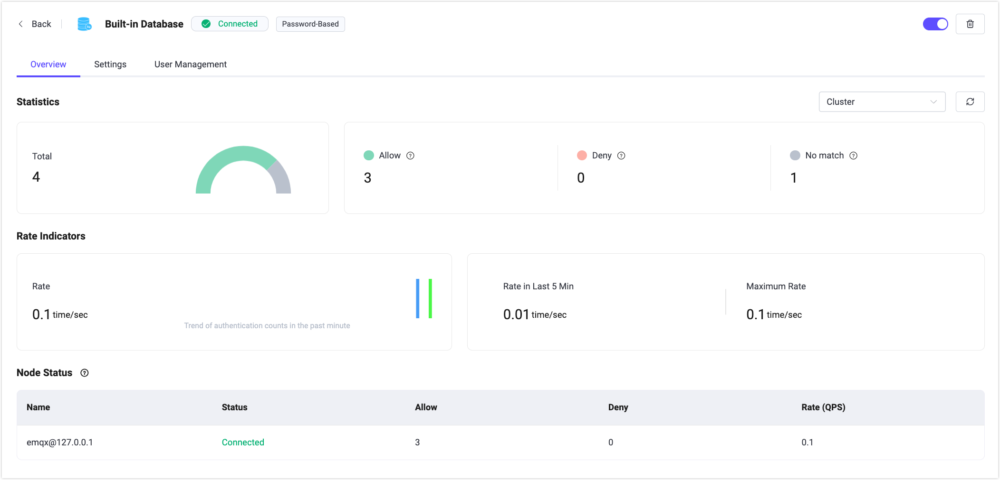

# 認証

EMQX ダッシュボードは、すぐに使える認証およびユーザー管理機能を提供しています。ユーザーはコードを書いたり設定ファイルを手動で編集したりすることなく、ユーザーインターフェースを通じてクライアント認証機構を迅速に設定できます。これにより、さまざまなデータソースや認証サービスと統合し、異なるレベルやシナリオでの安全な構成を実現できるため、開発効率を高めつつセキュリティの保証も強化されます。**認証**ページでは、さまざまな認証リソースを素早く作成・管理できます。

:::tip
認証バックエンドを設定した後は、デバイスやMQTTクライアントがEMQXに安全に接続できるよう、対応する認証情報を設定する必要があります。
:::

## 認証の作成

**作成**ボタンをクリックすると、**認証の作成**ページに移動します。認証を作成するには、まず認証機構を選択し、その後認証データを保存または取得するバックエンドを選択します（JWT認証を除く）。データはデータベースやHTTPサーバーなどのバックエンドから取得できます。最後に、バックエンドに接続するための接続情報を設定します。

### 認証機構

EMQXが提供する以下の認証機構から選択できます。

1. パスワードベース：クライアントIDまたはユーザー名とパスワードを使用。
2. JWT：クライアントがユーザー名またはパスワードにJWTトークンを含める方式。
3. SCRAM：MQTT 5.0の強化認証機能で、クライアントとサーバー間の双方向認証を可能にします。

### バックエンド

このステップでは、前のステップで選択した認証機構に基づいてバックエンドを選択します。

:::tip

一度認証に使用したバックエンドは再選択できません。

:::

バックエンドの詳細については、[EMQX Authenticators](../access-control/authn/authn.md#emqx-authenticator)を参照してください。

#### パスワードベース

`Password-Based`を選択した場合、認証データを格納するデータベースか、認証データを提供するHTTPサーバーのいずれかを選択できます。データベースは以下の2種類があります。

- EMQX組み込みデータベース（`Built-in Database`）
- 外部データベース：`MySQL`、`PostgreSQL`、`MongoDB`、`Redis`などの主要なデータベースに接続可能

また、認証データを提供できるHTTPサービス（`HTTP Server`）を直接利用することも可能です。

#### JWT

JWTを選択した場合は、バックエンドの選択は不要です。

#### SCRAM

MQTT 5.0の強化認証機能で、選択した場合は現在EMQX組み込みデータベース（Mnesia）のみ利用可能です。

強化認証はクライアントとサーバーの双方向認証を実現し、接続されたクライアントが正当なクライアントであること、クライアントが接続しているサーバーが正当なサーバーであることを相互に検証できるため、より高いセキュリティを提供します。

MQTT 5.0強化認証の詳細は、[SCRAM認証](../access-control/authn/scram.md)および[MQTT 5.0強化認証 - Kerberos](../access-control/authn/kerberos.md)を参照してください。

### 設定

最後に選択したバックエンドの設定を行います。各バックエンドには接続や利用に必要な設定項目があり、ユーザーが設定を完了したら**作成**をクリックします。

#### 組み込みデータベース

例えば、`Built-in Database`を使用する場合は、ユーザー名かクライアントIDのどちらを使うか、パスワードの暗号化方式などを設定します。MQTT 5.0の強化認証で組み込みデータベースを使う場合は、暗号化方式のみ設定すればよいです。

組み込みデータベースの詳細は、[組み込みデータベースの利用](../access-control/authn/mnesia.md)を参照してください。

#### 外部データベース

外部データベースを使う場合は、データベースのサーバーアドレス、データベース名、ユーザー名とパスワード、認証設定、データ取得のためのSQL文やその他のクエリ文を設定します。

MySQLやその他外部データベースの詳細は、[MySQLとの統合](../access-control/authn/mysql.md)や各データベースの設定ドキュメントを参照してください。

#### HTTPサーバー

HTTPサーバーを利用する場合は、HTTPサービスのリクエストメソッド（POSTまたはGET）、リクエストURL（httpまたはhttpsプロトコルを含む）、HTTPリクエストヘッダーの設定を行います。認証情報は`Body`フィールドに入力し、例えば`username`や`password`をJSON形式で記述します。

HTTPサーバーの詳細は、[HTTPサービスの利用](../access-control/authn/http.md)を参照してください。

#### JWTおよびJWKS

JWTを利用する場合は、バックエンドを選択せずにJWTの設定を直接行います。JWTトークンがクライアントの`username`か`password`のどちらから取得されるかを設定し、クライアントは接続時に対応するフィールドにトークンを入力するだけでJWT認証が可能です。暗号化方式に応じて`Secret`または`Public Key`を設定し、`Secret`のBase64エンコードの有無を指定します。最後に検証対象の情報を`Payload`に入力してJWT認証の設定を完了します。

`JWKS Endpoint`から最新のJWKSを定期的に取得できます。これは認可サーバーが発行しRSAまたはECDSAアルゴリズムで署名したJWTを検証するための公開鍵のセットです。JWKSの更新間隔（秒単位）も設定可能です。最後に`Payload`の設定を行い、JWKSの設定を完了します。

JWTの詳細は、[JWT認証](../access-control/authn/jwt.md)を参照してください。

## 認証機リスト

認証機を作成すると、認証機リストで確認・管理できます。

リストでは各認証機のバックエンドや認証機構、バックエンドの状態が表示されます。例えば外部データベースの接続に失敗した場合は状態が`Disconnected`と表示されます。このフィールドにカーソルを合わせると、EMQXクラスター内のすべてのノードの接続状態の詳細が表示されます。**有効**スイッチを切り替えることで認証設定を素早く有効化または無効化できます。

認証機リストの各エントリは、マウスドラッグや**操作**列の順序調整で並び替え可能です。認証機リストの順序は重要で、EMQXは複数の認証機を認証チェーンとして順次処理します。現在の認証機で認証情報が見つからない場合は、次の認証機に処理が継続されます。

**操作**列からは認証機の設定変更や削除も可能です。

:::tip 注意
認証を無効化すると、いかなるクライアントも認証されず、すべてのクライアントがEMQXに接続可能になります。十分に注意してご利用ください。
:::

## ユーザー管理

組み込みデータベースを利用しているユーザーは、認証機リストページの**ユーザー管理**をクリックすることで認証情報を管理できます。ユーザー名とパスワードの追加・削除が可能で、テンプレートをダウンロードして認証情報を記入後、**インポート**をクリックすることで認証関連のユーザー情報を一括作成できます。

## 概要

リストページの**認証機構とバックエンド**一覧から認証機名をクリックすると、概要ページに移動します。このページでは、EMQXクラスター内の認証機の認証成功数や失敗数、不一致数、現在接続中の認証率などのメトリクスを確認できます。

ページ下部のリストから各ノードのメトリクスデータを監視できます。

## 設定

リストページの**設定**をクリックすると、認証設定の変更が可能です。

設定ページでは、外部データベースの接続情報が変更になった場合や、組み込みデータベースの`UserID Type`をユーザー名またはクライアントIDに変更したい場合、パスワードの暗号化方式を変更したい場合などに現在の認証機の設定を修正できます。

:::tip 注意
組み込みデータベース利用時に**Password Hash**や**Salt Position**を更新すると、既存の認証データが利用できなくなるため、十分に注意してください。
:::

## 詳細情報

認証の詳細については、[認証](../access-control/authn/authn.md)を参照してください。
