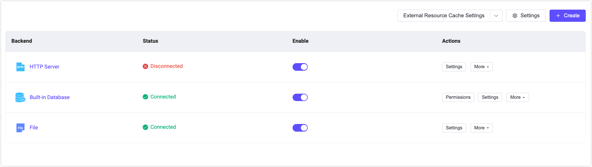
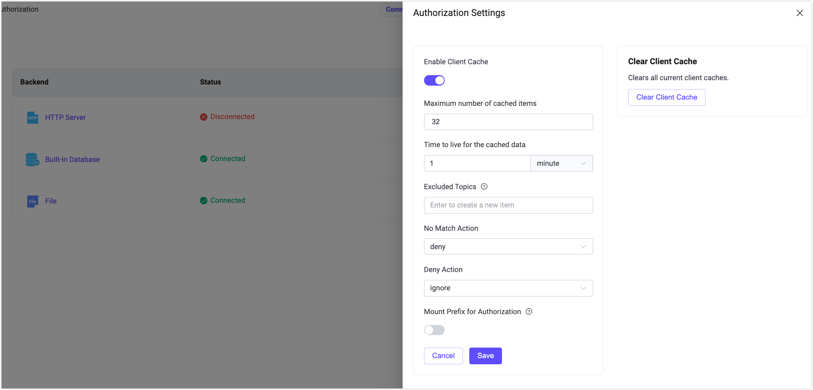

# 認可

EMQXは強力なアクセス制御機能を提供しており、EMQXダッシュボードではすぐに使える認可管理機能を備えています。ビジュアルインターフェースを通じて、ユーザーはコードを書いたり設定ファイルを手動で編集したりすることなく、EMQXの認可メカニズムを迅速に構成できます。これにより、クライアントの接続直後のパブリッシュやサブスクライブなどのMQTTクライアント操作を制御でき、さまざまなレベルやシナリオに応じた安全な設定が可能です。**認可**ページでは、さまざまな認可リソースを素早く作成・管理できます。

## 認可の作成

認可ページの右上にある**作成**ボタンをクリックすると、**認可の作成**ページに移動します。認可を作成するには、権限データの構成および保存に使用するバックエンドを選択する必要があります。

### バックエンド

バックエンドには、ファイル、組み込みデータベース、外部データベース、HTTPサーバーの利用オプションがあります。

ACLファイルを使用すると、ファイル内に定義された一連のルールをスキャンして、各パブリッシュまたはサブスクライブ要求が許可されているかを判断し、認可内容を編集・保存できます。

EMQXの組み込みデータベースを使用して認可ルールの構成および保存も可能です。

外部データベースを使用して認可ルールを保存でき、`MySQL`、`PostgreSQL`、`MongoDB`、`Redis`などの主流データベースを選択可能です。

事前定義されたHTTPサービスを使用して、認可要求を外部HTTPサーバーに委任できます。外部HTTPサービスは権限検証機能を含む必要があります。

### 設定

バックエンドを選択した後、認可の最終ステップとして選択したバックエンドの設定を行います。各バックエンドには接続や利用に関する設定があり、ユーザーが手動で設定する必要があります。または、ACLファイルのルール内容を編集・保存できます。設定が完了したら**作成**をクリックして認可設定を素早く完了します。注意：使用した認可バックエンドは再度選択できません。

#### ファイル

ACLファイルを使用する場合、設定パラメータページにテキスト編集ボックスが提供され、ファイル内の認可ルール内容を編集できます。ルールはErlangのタプルデータのリストです。（各ルールの末尾には必ずドット（.）が必要です）タプルは角括弧で囲まれ、要素はカンマで区切られています。

ファイルルールの編集方法の詳細は、[ACLファイル](../access-control/authz/file.md)を参照してください。

#### 組み込みデータベース

組み込みデータベースを認可に使用する場合、パラメータの設定は不要で、作成後にユーザーページで権限ルールを設定できます。

#### 外部データベース

外部データベースを使用する場合、アクセス可能なデータベースのアドレス、データベース名、ユーザー名、パスワードを設定し、認可データを取得するためのSQL文やその他のクエリ文を入力します。パブリッシュやサブスクライブ時に、認可データがデータベースから照会され、権限ルールの適用可否が判断されます。MySQLを例に挙げます。

MySQLやその他外部データベースの設定詳細は、[MySQL連携](../access-control/authz/mysql.md)や各データベースの設定ドキュメントを参照してください。

#### HTTPサーバー

HTTPサーバーを使用するには、事前に認可データの照合をサポートするHTTPサーバーを用意する必要があります。サブスクライブやパブリッシュ時に、EMQXはデータをHTTPサービスに転送し、HTTPから返された結果により操作が権限ルールを通過できるかを判断します。

サービスのアドレスやリクエストメソッド（POSTまたはGET）、サービスのヘッダーを設定し、パブリッシュやサブスクライブに必要な認可情報（例：`username`、`topic`、`action`）をJSONデータとして`Body`フィールドに設定します。

HTTPサーバー認可の設定詳細は、[HTTPサービスの利用](../access-control/authz/http.md)を参照してください。

## 認可リスト

認可設定が完了すると、認可リストで確認・管理できます。このリストではバックエンドとその状態が表示されます。例えば、外部データベースが展開されていないか正常に接続されていない場合、バックエンドの状態は`Disconnected`と表示されます。このフィールドにカーソルを合わせると、EMQXクラスター内のすべてのノードにおけるデータソースの接続状況を確認できます。**有効化**スイッチをクリックして認可設定を素早く有効化または無効化できます。

認証リストと同様に、認可リストの各行はマウスでドラッグして順序を調整したり、アクション列から並び替えたりできます。EMQXは複数の認可メカニズムを作成可能で、クライアントがパブリッシュやサブスクライブ操作を行う際に順次チェックします。例えば、ある認可設定でクライアントにマッチするACLが見つかれば、そのルールを適用し許可または拒否します。該当するルールがなければ、次の認可設定を順にチェックします。

**アクション**列では、認可設定の設定、順序調整、削除も行えます。

:::tip 注意
認可を無効にすると、クライアントのパブリッシュ／サブスクライブ時の権限動作に影響します。慎重に操作してください。
:::

## グローバル設定

リストページ右上の**設定**ボタンをクリックすると、認可のグローバル設定を行えます。

認可ルールにマッチしない場合の動作（許可または拒否）、拒否後にメッセージを無視するかクライアントを切断するかを設定可能です。認可データのキャッシュを有効化するとバックエンドへのアクセス負荷を軽減できます。右側の**キャッシュクリア**をクリックすると、現在の認可結果キャッシュを素早く全てクリアできます。

## 概要

リストページの**バックエンド**列にある認可名をクリックすると、その認可設定の概要ページに移動します。このページでは、EMQXクラスター内の認可に関する各種メトリクス（成功・失敗した認可数、ミスマッチ数、現在のレートなど）を確認できます。

ページ下部のノードステータスでは、リストにある各ノードの認可メトリクスデータを閲覧可能です。

## 権限

組み込みデータベースを使用している場合、リストページの**アクション**列にある**権限**をクリックすると、認可ルールの管理・設定ができます。クライアントをClient IDやユーザー名で区別したり、すべてのユーザーに対する認可ルールを追加したりできます。

認可ルールを設定するには、認可設定が必要なトピックを入力し、そのトピックのサブスクライブまたはパブリッシュ時に権限を適用するかを選択し、許可または拒否の設定を行います。

組み込みデータベースの認可設定方法の詳細は、[組み込みデータベースの利用](../access-control/authz/mnesia.md)を参照してください。

:::tip 注意

認可を無効にすると、クライアントのパブリッシュ／サブスクライブ権限に影響します。慎重に操作してください。

:::

## 設定

認可のバックエンドを変更する必要がある場合は、リストページの**アクション**列にある**設定**をクリックし、設定ページでACLファイルの権限ルール内容の変更や外部データベースの接続情報・クエリ文の変更などを行えます。

例えば、認可設定のバックエンドを変更したり、ACLの権限ルールを修正したり、外部データベースの接続情報やクエリ文に変更があった場合は、リストページの**アクション**列の**設定**をクリックして設定情報を修正してください。

## 詳細情報

認可の詳細については、[認可の概要](../access-control/authz/authz.md)をご覧ください。
