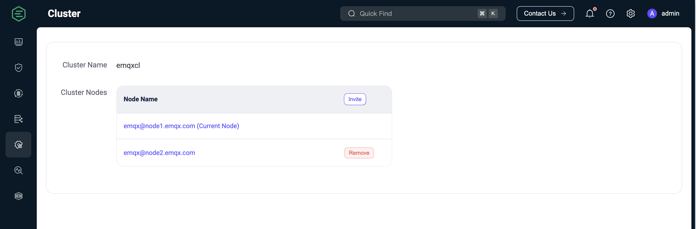

# クラスター設定

EMQXはホットコンフィギュレーション機能を提供しており、EMQXノードを再起動することなく、実行時に設定を動的に変更できます。EMQXダッシュボードはホットコンフィギュレーション機能を備えた視覚的な設定ページを提供し、EMQXの設定を簡単に変更できます。

クラスター設定モジュールは以下のサブモジュールを提供します：

- MQTT設定
- クラスター
- ネームスペース
- リスナー
- ロギング
- モニタリング
- クラスターリンク

## MQTT設定

**MQTT設定**ページはMQTTプロトコルに関連する設定機能を提供します。このページでは、以下を含む様々なMQTT関連パラメータを設定できます：

### 一般

**一般**タブページには、アイドルタイムアウト、最大パケットサイズ、最大クライアントID長、最大トピックレベル数、許可される最大QoSレベルなど、MQTTプロトコルの基本的な一般設定項目が含まれています。

### セッション

**セッション**タブページには、MQTTセッション管理に関連する設定項目が含まれており、セッション有効期限間隔（MQTT 5.0以外の接続のみ対応、MQTT 5.0接続はクライアント側で設定が必要）、最大サブスクリプション数、最大フライトウィンドウ、QoS 0メッセージの保存有無などがあります。

### Durable Sessions

**Durable Sessions**タブページには、[MQTT Durable Sessions](../durability/durability_introduction.md)機能に関連する設定項目が含まれており、メッセージ保持期間、メッセージクエリのバッチサイズ、アイドルポーリング間隔、セッションハートビート間隔などがあります。

### Retainer

**Retainer**タブページには、保持メッセージに関するMQTTプロトコル関連の設定項目が含まれており、保持メッセージの有効化、メッセージ保存タイプと方法、最大保持メッセージ数、保持メッセージのペイロードサイズ、メッセージ有効期限間隔などがあります。詳細は[保持メッセージの設定](./retained.md#retainer-settings)を参照してください。

> 保持メッセージが無効の場合、既存の保持メッセージは削除されません。

### システムトピック

**システムトピック**タブページは、EMQXの組み込みシステムトピックに関する設定項目を提供します。EMQXは定期的に運用状況、使用統計、リアルタイムクライアントイベントを`$SYS/`で始まるシステムトピックにパブリッシュします。クライアントがこれらのトピックをサブスクライブすると、関連情報がパブリッシュされます。システムトピックの設定項目には、メッセージパブリッシュ間隔やハートビート間隔などがあります。

### 強制シャットダウン

**強制シャットダウン**タブでは、リソース使用率の閾値に基づく自動シャットダウン動作を設定できます。この機能は、メッセージキューの長さやヒープサイズなどの過剰なリソース消費によるEMQXの不安定化を防止します。

**強制シャットダウン**タブページで設定可能な項目は以下の通りです：

- **強制シャットダウンを有効にする**：このトグルスイッチで強制シャットダウン機能を有効または無効にします。有効時は指定されたリソース閾値を超えるとクライアントプロセスのシャットダウンが自動的にトリガーされます。デフォルトで有効です。
- **最大ヒープサイズ**：システムで許容される最大ヒープサイズを指定します。このサイズを超えると、システムの安定性を保つために強制シャットダウンが開始されます。デフォルト値は`32 MB`です。
- **最大メールボックスサイズ**：メールボックスメッセージキューの最大長を定義します。この長さを超えると、システム過負荷を防ぐために強制シャットダウンがトリガーされます。デフォルト値は`1000`です。

## クラスター

**クラスター**設定ページでは、EMQXクラスターのノード管理が可能で、ノードの詳細表示、新規ノードの招待、既存ノードの削除が行えます。

ノードの詳細を表示するには、ノード名をクリックしてください。詳細情報のために**クラスター表示**ページにリダイレクトされます。

ノードを招待するには、**招待**をクリックし、**ノード名**欄にノードのIPアドレスまたはホスト名を入力し、**確認**をクリックします。

ノードを削除するには、**削除**をクリックします。削除前に確認ダイアログが表示されます。

EMQXはコマンドラインインターフェース（CLI）を使用したクラスターの作成および管理もサポートしています。詳細は[クラスターの作成と管理](../cluster/create-cluster.md)を参照してください。

## ネームスペース

EMQXのネームスペース機能は、単一クラスター内で異なるクライアントグループを論理的に分離します。ネームスペースは**ネームスペース**ページで管理できます。ネームスペースの管理および設定方法の詳細は[ネームスペース](../multi-tenancy/namespace-overview.md)を参照してください。

## リスナー

**リスナー**ページはデフォルトでリスナーの一覧を表示します。EMQXは以下の4つの一般的なリスナーを提供しています：

- ポート1883を使用するTCPリスナー
- ポート8883を使用するSSL/TLSセキュア接続リスナー
- ポート8083を使用するWebSocketリスナー
- ポート8084を使用するWebSocketセキュアリスナー

通常、これらのデフォルトリスナーは対応するポートとプロトコルタイプを指定して使用します。別のタイプのリスナーを追加するには、右上の**+リスナー追加**ボタンをクリックして新しいリスナーを作成します。

### リスナー追加

**リスナー追加**ポップアップパネルには、リスナー追加用のフォームが表示され、基本的な設定項目が含まれています。リスナーを識別するための名前を入力し、リスナータイプ（TCP、SSL、WS、WSS）を選択し、リスナーアドレス（IPアドレスとポート番号）を入力します。IPアドレスを指定することでリスナーのアクセス範囲を制限できます。またはポート番号のみを指定することも可能です。

#### レート制限

**リスナー追加**フォームの**リミッター**セクションでは、EMQX稼働中のメッセージ受信およびパブリッシュレートを制限できます。例えば：

- 最大接続レート（リスナー単位）
- 最大メッセージパブリッシュレート（クライアント単位）
- 最大メッセージパブリッシュトラフィック（クライアント単位）

レート制限を設定することで、メッセージデータの過負荷や過剰なクライアント要求発生時のシステムおよびネットワークの安定性を確保します。

レート制限の詳細設定は[レート制限](../rate-limit.md)を参照してください。

リスナー設定の詳細は[EMQX Enterprise設定マニュアル](https://docs.emqx.com/en/enterprise/v@EE_VERSION@/hocon/)を参照してください。

### リスナー管理

リスナーを追加すると一覧に表示されます。リスナー名をクリックすると編集ページに入り、設定の変更や削除が可能です。設定画面ではリスナー名、タイプ、リスナーアドレスの変更はできません。

編集ページの**削除**ボタンをクリックするとリスナーを削除できます。削除時にはリスナー名の入力による確認が必要です。リスナーの有効・無効はトグルスイッチで切り替えられます。リストには各リスナーの接続数も表示されます。

::: tip 警告

リスナーの変更および削除はリスクの高い操作ですので注意して行ってください。リスナーが更新または削除されると、そのリスナー上のクライアント接続は切断されます。

:::

## ロギング

**ロギング**ページには、**コンソールログ**、**ファイルログ**、**ログスロットリング**、**監査ログ**のタブがあります。

EMQXはコンソールログとファイルログの2種類のログ出力をサポートしており、必要に応じていずれかまたは両方を選択できます。対応する設定ページでは、ログハンドラーの有効・無効、ログレベル、ログフォーマットタイプ、ファイルログの場合はログファイルパスやログ名を設定できます。ログの詳細設定方法は[ダッシュボードによるロギング設定](../observability/log.md#configure-logging-via-dashboard)を参照してください。

**ログスロットリング**タブページでは、ログスロットリングの時間ウィンドウを設定できます。ログスロットリングの詳細は[ログレート制限](../observability/log.md#log-throttling)を参照してください。

**監査ログ**ページでは、EMQXの監査ログ機能を有効または無効にし、設定を行えます。詳細な設定方法は[監査ログ](../audit-log.md)を参照してください。

## モニタリング

::: tip 注意

モニタリング機能はEMQX Enterpriseエディションのみで利用可能です。

:::

**モニタリング**ページには以下の2つのタブがあります：

- **システム**：ユーザーのニーズに応じて、[アラーム](./diagnose.md#alarms)機能のアラーム閾値やチェック間隔などの設定をある程度調整できます。
- **統合**：サードパーティのモニタリングプラットフォームとの統合設定を提供します。

### システム

現在のアラームトリガー閾値やアラーム監視チェック間隔のデフォルト値が実際のニーズに合わない場合、このページで設定を調整できます。現在の設定は**Erlang VM**と**オペレーティングシステム**の2つのモジュールに分かれており、各設定項目のデフォルト値や説明は[アラーム](../observability/alarms.md)に記載されています。

### 統合

このページは主にサードパーティのモニタリングプラットフォームとの統合設定を提供します。現在、EMQXは**Prometheus**、**OpenTelemetry**、**Datadog**との統合をサポートしています。

`Prometheus`を使用する場合、このページで設定を素早く有効化し、プッシュデータのアドレスやデータ報告間隔などのパラメータを設定できます。EMQXが提供するAPI `/prometheus/stats`を直接使用してモニタリングデータを取得可能で、このAPI利用時に認証情報は不要です。詳細は[Prometheus](../observability/prometheus.md)を参照してください。

ほとんどの場合、EMQXのメトリクスデータ監視に`Pushgateway`は不要です。ただし、`Pushgateway`サービスアドレスを設定して監視データを`Pushgateway`にプッシュし、`Pushgateway`が`Prometheus`サービスにデータをプッシュする方法も選択可能です。詳細は[Pushgatewayの使用タイミング](https://prometheus.io/docs/practices/pushing/)を参照してください。

ページ下部の**ヘルプ**ボタンをクリックし、デフォルトまたは`Pushgateway`方式を選択し、提供された使用手順に従って関連サービスのアドレスやAPI情報を設定すると、対応する`Prometheus`設定ファイルを素早く生成できます。最後にこの設定ファイルを使用して`Prometheus`サービスを起動します。

ユーザーは`Grafana`でモニタリングデータをカスタマイズおよび修正可能です。`Prometheus`サービス起動後、ヘルプページの最後にある`Grafanaテンプレートをダウンロード`ボタンをクリックして、弊社提供のデフォルトダッシュボードの設定ファイルをダウンロードできます。ファイルを`Grafana`にインポートすると、可視化パネルを通じてEMQXのモニタリングデータを閲覧できます。テンプレートは[Grafana公式サイト](https://grafana.com/grafana/dashboards/17446-emqx/)からもダウンロード可能です。

OpenTelemetryおよびDatadog統合の詳細設定は[OpenTelemetryとの統合](../observability/opentelemetry/opentelemetry.md)および[Datadogとの統合](../observability/datadog.md)を参照してください。

## クラスターリンク

クラスターリンク機能は、複数の独立したEMQXクラスターを接続し、地理的に分散したクラスター間でクライアント同士の通信を可能にします。ユーザーはこのページでクラスターリンクの作成および設定ができます。作成および設定の詳細は[EMQXクラスターリンク](../../develop/cluster-linking/introduction.md)を参照してください。
