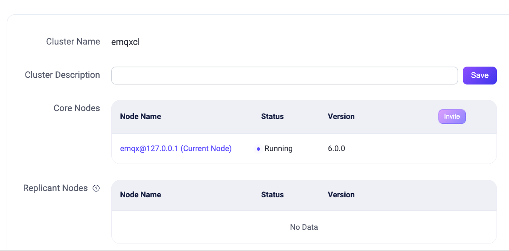
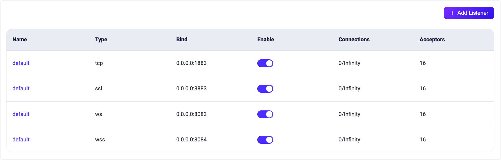

# クラスター設定

EMQXはホットコンフィギュレーション機能を提供しており、EMQXノードを再起動することなく実行時に設定を動的に変更できます。EMQXダッシュボードはホットコンフィギュレーション機能を備えた視覚的な設定ページを提供し、EMQXの設定を簡単に変更できます。

クラスター設定モジュールは以下のサブモジュールを提供します：

- MQTT設定
- クラスター
- ネームスペース
- ルールエンジンセキュリティ
- リスナー
- ロギング
- モニタリング
- クラスターリンク

## MQTT設定

**MQTT設定**ページはMQTTプロトコルに関連する設定機能を提供します。このページでは、以下を含む様々なMQTT関連パラメータを設定できます。

### 一般

**一般**タブページには、アイドルタイムアウト、最大パケットサイズ、最大クライアントID長、最大トピックレベル数、許可される最大QoSレベルなど、MQTTプロトコルの基本的な一般設定項目が含まれています。

### セッション

**セッション**タブページには、MQTTセッション管理に関連する設定項目が含まれており、セッション有効期限間隔（MQTT 5.0以外の接続のみサポート。MQTT 5.0接続はクライアント側で設定が必要）、最大サブスクリプション数、最大フライトウィンドウ、QoS 0メッセージの保存有無などを設定できます。

### Durable Sessions

**Durable Sessions**タブページには、[MQTT Durable Sessions](../durability/durability_introduction.md)機能に関連する設定項目が含まれており、メッセージ保持期間、メッセージクエリバッチサイズ、アイドルポーリング間隔、セッションハートビート間隔などを設定できます。

### Retainer

**Retainer**タブページには、保持メッセージに関するMQTTプロトコル関連の設定項目が含まれており、保持メッセージの有効化、メッセージ保存タイプと方法、最大保持メッセージ数、保持メッセージのペイロードサイズ、メッセージ有効期限間隔などを設定できます。詳細は[保持メッセージの設定](./retained.md#retainer-settings)を参照してください。

> 保持メッセージを無効にしても、既存の保持メッセージは削除されません。

### システムトピック

**システムトピック**タブページは、EMQXの組み込みシステムトピックに関する設定項目を提供します。EMQXは定期的に運用状況、使用統計、リアルタイムクライアントイベントを`$SYS/`で始まるシステムトピックにパブリッシュします。クライアントがこれらのトピックをサブスクライブすると、EMQXは関連情報をパブリッシュします。システムトピックの設定項目には、メッセージパブリッシュ間隔、ハートビート間隔などがあります。

### 強制シャットダウン

**強制シャットダウン**タブでは、リソース使用率の閾値に基づく自動シャットダウン動作を設定できます。この機能は、メッセージキュー長やヒープサイズなどの過剰なリソース消費によるEMQXの不安定化を防止します。

**強制シャットダウン**タブページで設定可能な項目は以下の通りです：

- **強制シャットダウンを有効化**：このトグルスイッチは強制シャットダウン機能の有効・無効を切り替えます。有効にすると、指定されたリソース閾値を超えた場合にクライアントプロセスのシャットダウンが自動的にトリガーされます。デフォルトで有効です。
- **最大ヒープサイズ**：システムで許容される最大ヒープサイズを指定します。ヒープサイズがこの制限を超えると、システムの安定性を維持するために強制シャットダウンが開始されます。デフォルト値は`32 MB`です。
- **最大メールボックスサイズ**：メールボックスメッセージキューの最大長を定義します。キューがこの長さを超えると、システム過負荷を防ぐために強制シャットダウンがトリガーされます。デフォルト値は`1000`です。

## クラスター

**クラスター**設定ページでは、EMQXクラスターのノード管理が可能で、詳細の閲覧、新規ノードの招待、既存ノードの削除が行えます。

::: tip 注意

EMQX Community Editionを使用している場合、新規ノードの招待はサポートされていません。クラスター機能はトライアル期間中のみ利用可能で、トライアル終了後は商用ライセンスが必要です。ライセンスがない場合、機能は無効化されます。

:::

EMQX v6.0.0以降、クラスターの目的や環境を識別するための**クラスター説明**を追加できるようになりました。入力欄に意味のある説明を入力し、**保存**をクリックして適用してください。

保存後、クラスター説明はダッシュボードの上部に表示され、**クラスター**や**クラスター概要**などのページで素早く参照できます。編集アイコンをクリックすると**クラスター**ページに戻り、説明を更新できます。

- ノードの詳細を確認するには、ノード名をクリックしてください。**クラスター表示**ページに遷移し、詳細情報が表示されます。

- ノードを招待するには、**招待**をクリックし、**ノード名**欄にノードのIPアドレスまたはホスト名を入力し、**確認**をクリックします。

- ノードを削除するには、**削除**をクリックします。削除前に確認ダイアログが表示されます。

EMQXはコマンドラインインターフェース（CLI）を使ったクラスターの作成・管理もサポートしています。詳細は[クラスターの作成と管理](../cluster/create-cluster.md)を参照してください。

## ネームスペース

EMQXのネームスペース機能は、単一クラスター内で異なるクライアントグループを論理的に分離します。ネームスペースは**ネームスペース**ページで管理できます。ネームスペースの管理・設定方法の詳細は[ネームスペース](../multi-tenancy/namespace-overview.md)を参照してください。

## ルールエンジンセキュリティ

EMQXのコネクター、ブリッジ、アクションは外部サービスへのアウトバウンドネットワーク接続を開きます。制御がなければ、誤設定や悪意のあるターゲットにより、EMQXが内部または機密性の高い宛先に意図しないリクエストを送る可能性があり、これはサーバーサイドリクエストフォージェリ（SSRF）と呼ばれる脆弱性の一種です。

EMQX 6.0.3以降、**ルールエンジンセキュリティ**ページでダッシュボードから組み込みのSSRF保護ポリシーを設定できます。EMQX 6.0.4以降、このポリシーはHTTPコネクターの`url`フィールドとMQTTコネクターの`server`フィールドのみを、設定のテスト、作成、更新時に検証します。ブロックされたターゲットはその時点で拒否されます。

::: warning 重要なお知らせ
SSRFポリシーは他のコネクタータイプ、コネクターの有効化・無効化操作、コネクター削除、実行時のアウトバウンド接続は検証しません。保存済みのHTTPまたはMQTTコネクターは、作成後にターゲットがブロック対象になっても有効化可能です。その他のコネクタータイプやポリシー変更を保存済み設定に適用する必要がある場合、DNSリバインディングや実行時アドレス変更には、`iptables`や`nftables`などホストレベルのイグレス制御を利用してください。詳細は[ルールエンジンポリシーとファイアウォールルールによるSSRF緩和](../cluster/security.md#mitigate-ssrf-with-rule-engine-policy-and-firewall-rules)を参照してください。
:::

### SSRF保護の有効化

**SSRF保護を有効化**をトグルしてポリシーのオン・オフを切り替えます。有効時、EMQXはHTTPコネクターの`url`とMQTTコネクターの`server`を設定のテスト、作成、更新時に評価します。評価順序は以下の通りです：

1. **拒否ホスト名**に対する完全一致（大文字小文字不問）：一致した場合は即座に拒否。
2. 解決されたIPが**許可CIDR範囲**に含まれるかチェック：含まれる場合は許可。
3. 解決されたIPが**拒否CIDR範囲**に含まれるかチェック：含まれる場合は拒否。

このポリシーは既存設定との互換性のためデフォルトで無効です。HTTPおよびMQTTコネクターの設定でブロック対象への接続を防ぎたい場合に有効化してください。内部サービスへの接続が必要な場合は、ポリシー有効化前に許可・拒否CIDR範囲を見直してください。

### 許可CIDR範囲

解決されたIPアドレスが常に許可されるCIDR範囲のリストです。拒否CIDR範囲に関係なく許可されます。HTTPまたはMQTTコネクターが到達すべき特定の内部サブネットを明示的に許可するために使用します。

このリストに一致するIPは拒否CIDRチェックをスキップします。

### 拒否CIDR範囲

HTTPまたはMQTTコネクター設定のテスト、作成、更新時にEMQXが拒否するCIDR範囲のリストです。デフォルトセットはSSRF攻撃でよく悪用されるアドレスをカバーしています：

| CIDR | 説明 |
|---|---|
| `127.0.0.0/8` | IPv4ループバック |
| `::1/128` | IPv6ループバック |
| `169.254.0.0/16` | IPv4リンクローカル（AWS/Azureメタデータ含む） |
| `fe80::/10` | IPv6リンクローカル |
| `10.0.0.0/8` | プライベートネットワーク（RFC 1918） |
| `172.16.0.0/12` | プライベートネットワーク（RFC 1918） |
| `192.168.0.0/16` | プライベートネットワーク（RFC 1918） |
| `fc00::/7` | IPv6ユニークローカル |
| `0.0.0.0/32` | 未指定アドレス |
| `224.0.0.0/4` | IPv4マルチキャスト |
| `ff00::/8` | IPv6マルチキャスト |
| `100.100.100.200/32` | Alibaba Cloudメタデータサービス |

::: warning 重要なお知らせ
デフォルト拒否CIDRリストからのエントリ削除はEMQXをSSRF攻撃にさらす可能性があります。特定の運用要件があり、セキュリティ影響を理解している場合のみ削除してください。
:::

HTTPまたはMQTTコネクターがデフォルト拒否リスト内のアドレスに到達する必要がある場合は、拒否リストから削除するのではなく、**許可CIDR範囲**に追加してください。許可リストが優先されます。

### 拒否ホスト名

HTTPまたはMQTTコネクター設定のテスト、作成、更新時にEMQXが拒否するホスト名のリストです。解決されたIPアドレスに関係なく拒否されます。ホスト名の一致は完全一致かつ大文字小文字不問です。既知のクラウドメタデータエンドポイントを名前でブロックするのに便利です。

変更を適用するには**変更を保存**をクリックしてください。

## リスナー

**リスナー**ページはデフォルトでリスナーの一覧を表示します。EMQXは以下の4つの一般的なリスナーを提供しています：

- ポート1883を使用するTCPリスナー
- ポート8883を使用するSSL/TLSセキュア接続リスナー
- ポート8083を使用するWebSocketリスナー
- ポート8084を使用するWebSocketセキュアリスナー

<!-- XXX: Listener Address Information and Screenshot Replacement
The Dashboard does not yet display `resolved_address` or `resolved_address_from`. After the UI is implemented, document how the listener list presents the configured bind and each node's address information. Replace `./assets/config-listener-list.png` with a screenshot showing a port-only bind and the implemented address-information view. Keep the existing screenshot until its replacement is available, then remove this note.
-->

通常、これらのデフォルトリスナーは対応するポートとプロトコルタイプを指定して使用できます。別のタイプのリスナーを追加するには、右上の**+リスナー追加**ボタンをクリックして新しいリスナーを作成します。

### リスナー追加

**リスナー追加**ポップアップパネルには、基本設定項目を含むリスナー追加フォームが表示されます。リスナーを識別するための名前を入力し、リスナータイプ（TCP、SSL、WS、WSS）を選択し、リスナーアドレス（IPアドレスとポート番号）を入力できます。IPアドレスを指定するとリスナーのアクセス範囲を制限できますし、ポート番号のみを指定することも可能です。

EMQX 6.3.1以降、新規作成するリスナー名は1～64バイトで、ASCIIの英数字で始まり、ASCIIの英数字、ハイフン（`-`）、アンダースコア（`_`）のみを含む必要があります。要件を満たさない場合はリスナー作成リクエストが拒否されます。詳細は[リスナー名の要件](../configuration/listener.md#listener-name-requirements)を参照してください。

EMQX 6.3.0以降、ポートのみのバインドで使用されるアドレスはノード設定とセキュリティプロファイルに依存するため、リスナーは他ホストからの接続を受け付けない場合があります。ダッシュボードは各ノードで解決されたアドレスではなく設定されたバインド値を表示します。アドレス選択ルールは[EMQXがリスナーアドレスを決定する方法](../configuration/listener.md#how-emqx-determines-the-listener-address)を参照してください。

#### レート制限

**リスナー追加**フォームの**リミッター**セクションでは、以下のレートおよびバースト制限を設定できます：

- **最大接続レート（リスナー）**および**最大接続バースト（リスナー）**
- **最大メッセージパブリッシュレート（クライアント単位）**および**最大メッセージパブリッシュバースト（クライアント単位）**
- **サブスクライブレート**および**サブスクライブバースト**
- **最大メッセージパブリッシュトラフィック（クライアント単位）**および**最大メッセージパブリッシュトラフィックバースト（クライアント単位）**
- **最大メッセージ配信レート（クライアント単位）**および**最大メッセージ配信バースト（クライアント単位）**
- **最大メッセージ配信トラフィック（クライアント単位）**および**最大メッセージ配信トラフィックバースト（クライアント単位）**

レート制限を設定することで、メッセージデータの過負荷や過剰なクライアント要求が発生した場合でもシステムとネットワークの安定性を確保できます。

レート制限の詳細設定は[レート制限](../rate-limit.md)を参照してください。

リスナー設定の詳細は[EMQX Enterprise設定マニュアル](https://docs.emqx.com/en/enterprise/v@EE_VERSION@/hocon/)をご覧ください。

### リスナー管理

リスナーを追加すると一覧に表示されます。リスナー名をクリックすると編集ページに入り、リスナー設定の変更や削除が可能です。リスナーアドレスは変更できますが、リスナー名とタイプは変更できません。

<!-- XXX: Edit Form Address Information and Screenshot Pending
After the address-information UI is implemented, document its behavior in the edit form and add `./assets/config-listener-edit-bind-info.png`. Show a port-only bind together with the implemented address-information view. Use the actual UI, without the red annotation boxes from the design discussion. Replace this note with the instructions and screenshot before publication.
-->

編集ページの**削除**ボタンをクリックするとリスナーを削除できます。削除時にはリスナー名の入力による確認が必要です。リスナーの有効・無効はトグルスイッチで切り替えられます。リストには各リスナーの接続数も表示されます。

::: tip 警告

リスナーの変更や削除はリスクの高い操作です。慎重に行ってください。リスナーを更新または削除すると、そのリスナー上のクライアント接続は切断されます。

:::

## ロギング

**ロギング**ページには**コンソールログ**、**ファイルログ**、**ログスロットリング**、**監査ログ**のタブがあります。

EMQXはコンソールログとファイルログの2種類のログ出力をサポートしています。必要に応じていずれかまたは両方を選択できます。対応する設定ページでログ出力の有効・無効、ログレベル、ログフォーマットタイプを設定でき、ファイルログの場合はログファイルパスとログ名を指定できます。ログの詳細設定は[ダッシュボードによるロギング設定](../observability/log.md#configure-logging-via-dashboard)を参照してください。

**ログスロットリング**タブページではログスロットリングの時間ウィンドウを設定できます。詳細は[ログレート制限](../observability/log.md#log-throttling)を参照してください。

**監査ログ**ページではEMQXの監査ログ機能を有効・無効化し、設定できます。詳細は[監査ログ](./audit-log.md)を参照してください。

## モニタリング

::: tip 注意

モニタリング機能はEMQX Enterpriseエディションのみ利用可能です。

:::

**モニタリング**ページには以下の2つのタブがあります：

- **システム**：ユーザーのニーズに応じて、[アラーム](./alarm_dashboard.md)機能のアラーム閾値、チェック間隔などの設定をある程度調整できます。
- **統合**：サードパーティモニタリングプラットフォームとの統合設定を提供します。

### システム

現在のアラームトリガー閾値や監視チェック間隔のデフォルト値が実際のニーズに合わない場合、このページで調整可能です。設定は**Erlang VM**と**オペレーティングシステム**の2モジュールに分かれており、各設定項目のデフォルト値と説明は[アラーム](../observability/alarms.md)に記載されています。

### 統合

このページは主にサードパーティモニタリングプラットフォームとの統合設定を提供します。EMQXは**Prometheus**、**OpenTelemetry**、**Datadog**との統合をサポートしています。

Prometheus利用時はこのページでPullモードまたはPushモードを設定できます。PullモードではPrometheusが`/api/v5/prometheus/*`配下のAPIからメトリクスをスクレイプします。EMQX 6.3.0以降、これらのAPIはデフォルトで認証が必要です。`monitoring`スコープを持つ専用APIキーでスクレイパーを設定してください。設定詳細は[Prometheusとの統合](../observability/prometheus.md)を参照してください。

通常、EMQXのメトリクス監視に`Pushgateway`を使う必要はありません。`Pushgateway`サービスアドレスを設定して監視データを`Pushgateway`にプッシュし、`Pushgateway`が`Prometheus`にデータを送る構成も選択可能です。[Pushgatewayの利用タイミング](https://prometheus.io/docs/practices/pushing/)を参照してください。

ページ下部の**ヘルプ**ボタンをクリックし、デフォルトまたは`Pushgateway`方式を選択、提供された手順に従って関連サービスのアドレスやAPI情報を設定すると、対応する`Prometheus`設定ファイルが素早く生成されます。最後にこの設定ファイルを使って`Prometheus`サービスを起動してください。

ユーザーは`Grafana`で監視データをカスタマイズ・修正可能です。`Prometheus`サービス起動後、ヘルプページ末尾の`Grafanaテンプレートをダウンロード`ボタンから当社提供のデフォルトダッシュボード設定ファイルをダウンロードし、`Grafana`にインポートすると、可視化パネルでEMQXの監視データを閲覧できます。テンプレートは[Grafana公式サイト](https://grafana.com/grafana/dashboards/17446-emqx/)からも入手可能です。

OpenTelemetry設定時は**OpenTelemetryタイプ**で**Generic**または**Dynatrace**を選択できます。**Generic**は標準OpenTelemetry設定でメトリクス、トレース、ログをサポートし、**Dynatrace**はトレースとログをサポートしOAuth2認証を使用します。

OpenTelemetry、Dynatrace、Datadog統合の詳細設定は[OpenTelemetryとの統合](../observability/opentelemetry/opentelemetry.md)、[DynatraceとのOpenTelemetry統合](../observability/opentelemetry/dynatrace.md)、[Datadogとの統合](../observability/datadog.md)を参照してください。

## クラスターリンク

クラスターリンク機能は複数の独立したEMQXクラスターを接続し、地理的に分散したクラスター間でクライアント同士の通信を可能にします。ユーザーはこのページでクラスターリンクの作成と設定ができます。作成・設定の詳細は[EMQXクラスターリンク](../../develop/cluster-linking/introduction.md)を参照してください。
