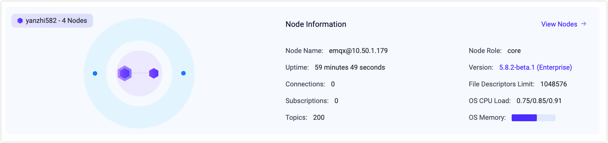
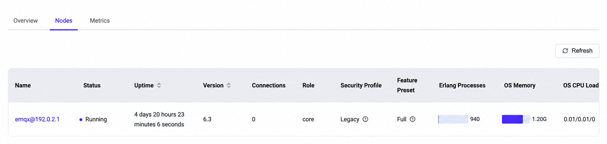
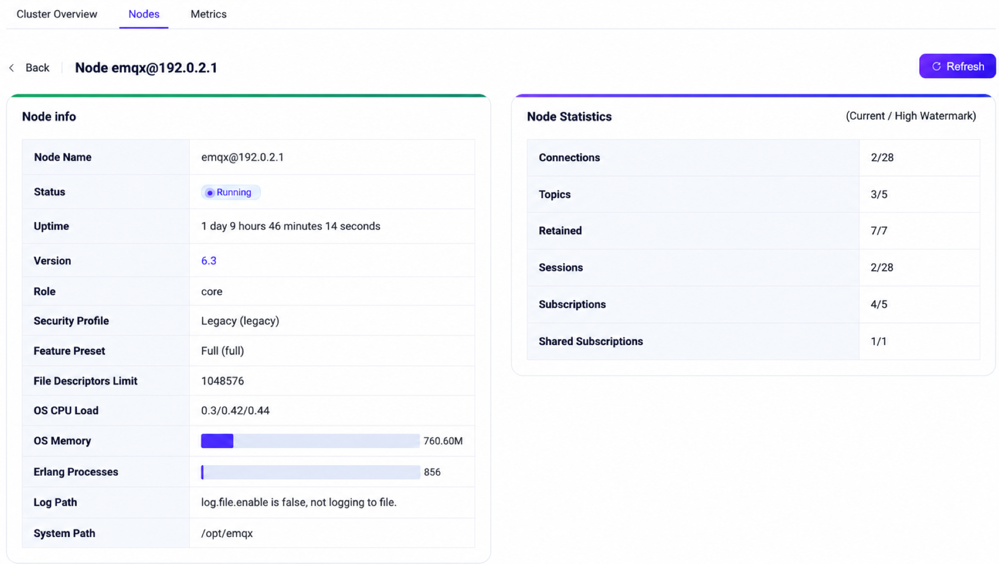
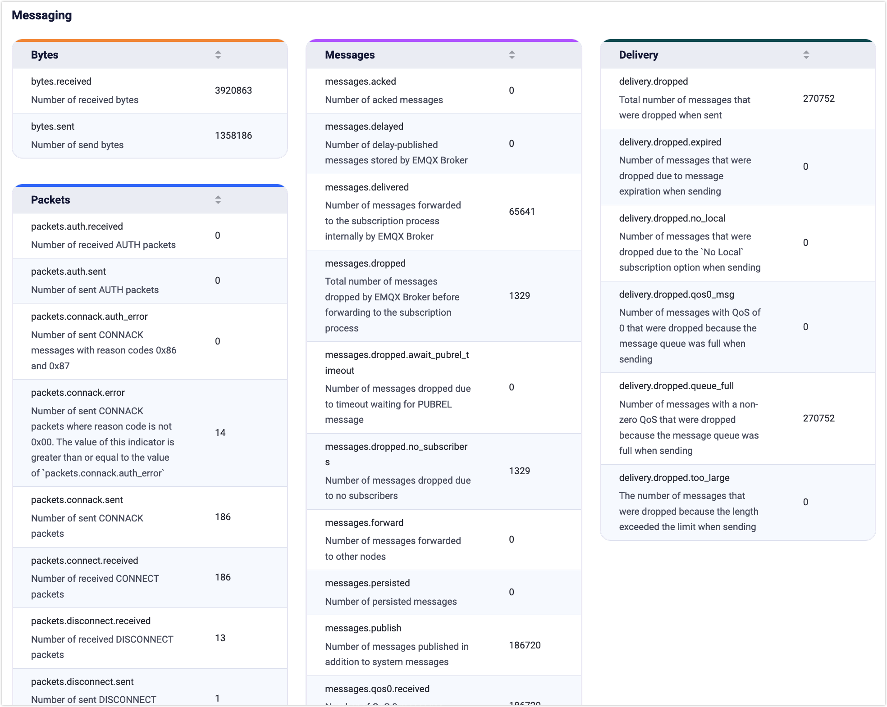

# ダッシュボード ホームページ

ログインに成功すると、EMQXダッシュボードのホームページ、具体的には**クラスター概要**ページにアクセスできます。このページには以下のタブがあります。

- **クラスター概要**：クラスター全体のデータ概要を表示します。
- **ノード**：クラスター内のノード一覧およびノードごとの情報を表示します。
- **メトリクス**：クラスター全体または個別ノードのすべてのデータメトリクスを表示します。

## クラスター概要

このページでは、稼働中のEMQXクラスター全体のデータ概要を提供し、以下の情報を含みます。

### メッセージレート

EMQXにおいて、メッセージはすべての接続されたMQTTクライアントや実デバイスが送受信する主要なデータを表します。クライアントやデバイスはトピックを介してメッセージを送受信し、相互にデータ通信を行います。

概要ページの左上のカードは、システム内の現在のメッセージの入出力量の変化率（メッセージレートは1秒あたりのメッセージ数で測定）を、リアルタイムのレート値で可視化し、より分かりやすく監視できるようにしています。

### 接続数とサブスクリプション数

MQTTブローカーとして、EMQXに接続されている接続数およびサブスクライブされているトピック数は重要な指標です。接続数は現在EMQXに接続されているMQTTクライアントや実デバイスの数、サブスクリプション数は各クライアントで現在サブスクライブされているトピックの総数、トピックはユニークなサブスクリプションを指します。

概要ページの右上のカードでは、クラスター内の接続数、サブスクリプション数、トピック数を素早く確認できます。接続やサブスクリプショントピックが更新されると、カード内の統計はリアルタイムで更新されます。

::: tip

サブスクリプションはクライアントごとに区別されますが、トピックはユニークなサブスクリプションであり、同じトピックが異なるクライアントに含まれる場合があります。

:::

リアルタイム統計の提供に加え、ページ下部には接続数とサブスクリプション数の時間による過去および現在の変化を視覚的に確認できるチャートがあります（時間形式：YYYY/MM/DD HH:mm）。これにより、EMQXクラスター全体の接続数とサブスクリプション数の推移をより明確かつ直感的に監視できます。チャートにカーソルを合わせ、右上のアイコンをクリックするとチャートを拡大できます。

### メッセージ数

メッセージ数はクライアントやデバイス間で転送されたデータ数の統計であり、ページには受信、送信、ドロップされたメッセージ数が含まれます。

概要ページの下部ではメッセージ数の視覚的チャートを確認でき、時間による過去および現在のメッセージ数の変化（時間形式：YYYY/MM/DD HH:mm）を閲覧できます。これにより、ユーザーは現在のEMQXクラスター内のすべてのメッセージのリアルタイム変化を動的に監視しやすくなります。チャートにカーソルを合わせ、右上のアイコンをクリックするとチャートを拡大できます。

ページ右側の「監視データをリセット」ボタンをクリックすると、クラスター概要ページのチャートデータがクリアされ、現在時点から新しい監視データの表示が開始されます。

::: tip

上記の時間変動チャートはすべて、左上の時間範囲選択で閲覧可能です：過去1時間、過去6時間、過去12時間、過去1日、過去3日、過去7日のデータ変化を統計できます。

:::

## ノード

IoT向けで最もスケーラブルなMQTTブローカーであるEMQXは、クラスター展開をサポートしており、クラスター内の各EMQXインスタンスはノードとして機能します。

### ノードデータ

概要ページ中央のカードでEMQXクラスター全体を監視でき、クラスター内のすべてのノードの関連性と分布を可視化するトポロジーダイアグラムを含みます。

トポロジーダイアグラム上のノードにカーソルを合わせると、その基本情報と稼働状況を確認できます。情報にはノード名、ノードの役割、接続数、サブスクリプション数、トピック数、現在のEMQXバージョンが含まれます。バージョン番号をクリックすると、現在のバージョンの更新内容を素早く確認できる変更履歴が開きます。さらに、ノードが展開されているOSのCPU負荷とメモリ使用率も確認可能です（メモリメトリクスはLinux展開ノードのみ対応）。

::: tip

トポロジーダイアグラム上のノードが灰色になっている場合、そのノードは現在停止中であることを示します。

:::

### ノード一覧

ノードカード右上の**ノードを見る**をクリックするか、上部の**ノード**タブを選択するとノードページに移動します。このページでは、EMQXクラスター内のすべてのノードが一覧表示され、各ノードの名前、状態、アップタイム、バージョン、接続数、Erlangプロセス数、メモリ使用量、CPU負荷などの主要メトリクスを素早く確認できます。右上の**更新**ボタンをクリックすると、最新のノード情報にリアルタイムで更新されます。

### ノード詳細

ノード一覧ではノードの基本情報のみ表示されます。ノードの詳細情報を確認するには、**名前**列のノード名をクリックしてノード詳細ページにアクセスします。詳細ページには以下のカードがあります。

- **ノード情報**カードでは、基本的なノード情報に加え、現在のノードの最大ファイルハンドル数、システムパス、ログパスなどの詳細を確認できます（ログパスの表示には設定でファイルログ処理を有効にする必要があります）。
- **ノード統計**カードでは、現在のノードに関する各種統計情報を確認できます。接続数、サブスクリプション数、トピック数、保持メッセージ数、セッション数、共有サブスクリプション数などが含まれます。統計値はスラッシュ（"/"）で区切られた2つの部分に分かれており、左側がリアルタイムデータ、右側が現在のデータのピーク値（ハイウォーターマーク）を示します。

## メトリクス

上部の**メトリクス**タブをクリックすると、EMQXクラスター全体または特定ノードの稼働中に生成されたすべてのデータメトリクスを閲覧できるメトリクスページにアクセスできます。ここではメッセージ情報、メッセージ統計、トラフィックの送受信統計などを確認でき、現在のサービス状況を把握できます。

右上のドロップダウンメニューでクラスター全体のデータか単一ノードのデータかを選択可能です。隣の**更新**ボタンをクリックすると、現在のページでメトリクスデータのリアルタイム監視が可能になります。

メトリクスデータの詳細な説明や包括的な情報については、[メトリクス](../observability/metrics-and-stats.md)をご参照ください。

### 接続、セッション、およびアクセス

メトリクスデータはバイト数、パケット数、メッセージ数、イベントの4つの側面をカバーしています。カードでは接続セッションや認証・認可イベントなどのイベントに関するメトリクスデータを確認できます。

### ルールとアクション（シンク）

このセクションではデータ統合に関連するメトリクスを提供し、ルールのマッチ回数やアクション（シンク）の実行回数を把握できます。

### メッセージング

以下の4つのカードは、メッセージ送信時に生成されるデータの統計を提供します。送受信トラフィック（バイト単位）、パケット数、メッセージ数、配信済みメッセージ数の統計が含まれます。

