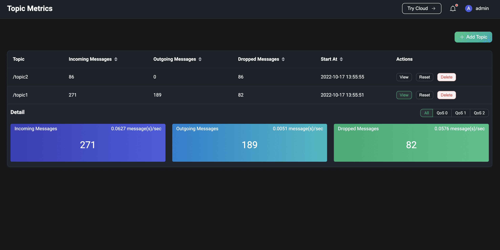
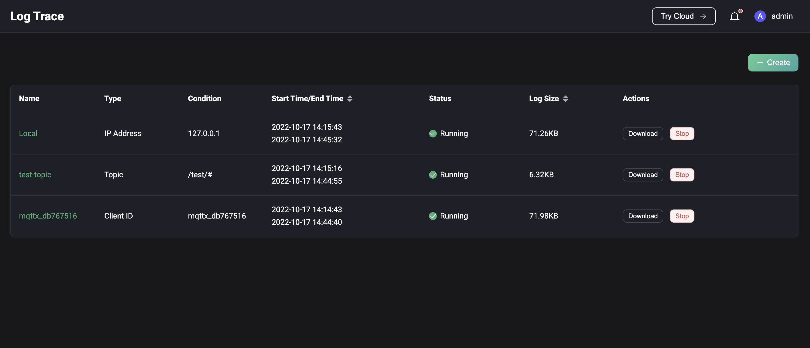

# Diagnose

Diagnoseモジュールは、ユーザーが使用中のエラーや問題をデバッグ・特定するためのいくつかのデバッグツールを提供します。

- **WebSocketクライアント**：ページ上のWebSocketクライアントを使用して、迅速な接続およびパブリッシュ・サブスクライブのデバッグを行えます。
- **トピックモニタリング**：トピックに基づいて、メッセージの受信、送信、およびドロップされたデータを監視・表示します。
- **スローサブスクリプション**：スローサブスクリプション統計を有効にすると、クライアントIDに基づいてメッセージ伝送の全体フローにかかる時間が設定した閾値を超えるサブスクリプションをページ上で確認できます。
- **ログトレース**：特定のクライアント、トピック、またはIPのログをリアルタイムでフィルタリングし、ページ上で閲覧またはダウンロードできます。

## WebSocketクライアント

左側の**Diagnose**メニューから**WebSocket Client**をクリックすると、WebSocketクライアントページに移動します。WebSocketクライアントページは、接続、サブスクライブ、パブリッシュ機能を備えたシンプルながら効果的なMQTTテストツールを提供し、クライアントの接続、パブリッシュ、サブスクライブ機能の迅速なデバッグや、自身が送受信したメッセージデータの確認が可能です。ページ上部の**+**ボタンをクリックすると複数のWebSocket接続を追加でき、ページをリフレッシュするとすべての接続の状態および送受信データはクリアされます。

## トピックメトリクス

左側の**Diagnose**メニューから**Topic Monitoring**をクリックすると、トピックメトリクスページに移動します。トピックモニタリングでは、ページ右上の`Create`ボタンをクリックし、監視したいトピックを入力して`Add`をクリックすると、新しいトピックメトリクス統計を作成できます。作成に成功すると、そのトピックごとにメッセージの受信数、送信数、ドロップ数およびそれらのレートを確認でき、詳細では各QoSごとのデータも閲覧可能です。`Reset`ボタンをクリックすると、既存のトピック統計をリセットできます。テーブルのヘッダーにある統計指標をクリックすると、昇順・降順で監視リストを並べ替えられます。

> 全体的なパフォーマンスの観点から、現在トピック統計はトピック名のみ対応しており、`+`や`#`のワイルドカードを含むトピックフィルター（例：a/+など）はサポートしていません。

## スローサブスクリプション

左側の**Diagnose**メニューから**Slow Subscriptions**をクリックすると、スローサブスクリプションページに移動します。スローサブスクリプション統計を利用するには、まずスローサブスクリプションの基本設定を行い、この機能を有効化する必要があります。各設定項目の詳細は[スローサブスクリプションの設定と有効化](../observability/slow-subscribers-statistics.md#configure-and-enable-slow-subscriptions)をご参照ください。有効化すると、メッセージ伝送の全フローにかかる時間が設定した`time delay threshold`を超えたメッセージが統計対象となります。統計リストはデフォルトでレイテンシの降順にサブスクライバーとトピック情報を表示します。`Client ID`をクリックすると、そのサブスクライバーの接続詳細ページに遷移し、接続情報を確認してスローサブスクリプションの原因調査が可能です。

## ログトレース

左側の**Diagnose**メニューから**Log Trace**をクリックすると、ログトレースページに移動します。特定のクライアント、トピック、またはIPのログをリアルタイムでフィルタリングし、デバッグやトラブルシューティングに役立てることができます。ページ右上の`Create`ボタンをクリックし、トレース対象を選択します。クライアントIDおよびIPは完全一致で入力が必要で、トピックは完全一致に加えてワイルドカードマッチングもサポートします。進行中のトレースはリストから手動で停止でき、停止したトレースはリストから削除可能です。

リストには現在のすべてのトレースが表示され、特定のトレースのログを閲覧またはダウンロードできます。クラスター環境では、リストの`Download`ボタンをクリックするとダッシュボードに対応するノードのログがダウンロードされ、`View`ボタンをクリックするとログの閲覧およびダウンロード用にノードを選択できます。

