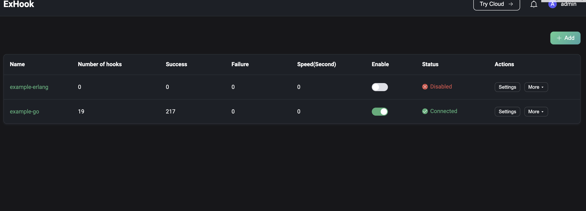
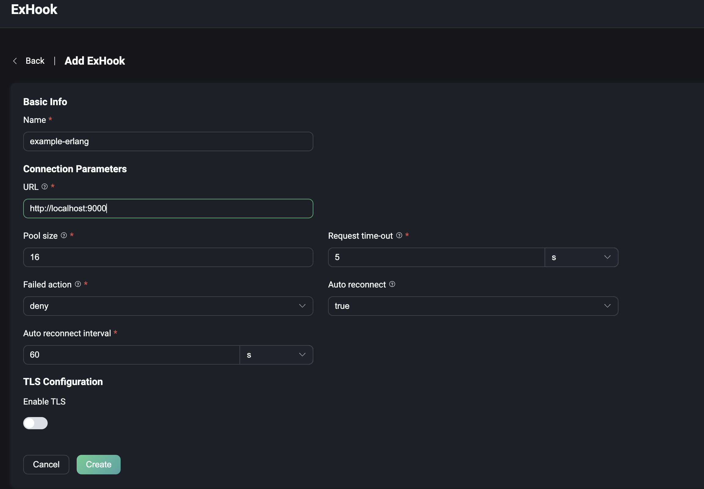

# Extensions

Extensions機能を使用すると、ゲートウェイを介して非MQTTプロトコルの接続およびメッセージのパブリッシュ／受信が可能になり、プラグインやExHookを使ってシステムの修正や拡張ができます。**Management**をクリックし、下にスクロールして**Extensions**セクションに移動すると、以下が表示されます。

- **Gateways**：すべての非MQTTプロトコルの接続、認証、メッセージの送受信を処理し、それらに対して統一されたユーザーレイヤーのインターフェースと概念を提供します。
- **ExHook**：他の言語を使ってEMQXのシステム機能を修正または拡張する機能を提供します。
- **Plugins**：Erlangで書かれたプラグインをインストールすることでシステム機能を修正または拡張します。

## Gateways

EMQXのマルチプロトコルゲートウェイは、すべての非MQTTプロトコルの接続、認証、メッセージの送受信をサポートし、さまざまなプロトコルに対して統一された概念モデルを提供します。

ゲートウェイのページでは、ゲートウェイを有効化し、リスナー設定などの基本設定を行えます。EMQXはカスタム設定オプションも提供しています。詳細な設定方法は、以下の一般的なゲートウェイのクイックスタートドキュメントを参照してください。

- [MQTT-SN](../../develop/gateway/mqttsn.md)
- [STOMP](../../develop/gateway/stomp.md)
- [CoAP](../../develop/gateway/coap.md)
- [LwM2M](../../develop/gateway/lwm2m.md)
- [ExProto](../../develop/gateway/exproto.md)

- [OCPP](../../develop/gateway/ocpp.md)
- [GB/T 32960](../../develop/gateway/gbt32960.md)
- [JT/T 808](../../develop/gateway/jt808.md)

ゲートウェイを有効化する前に、適切にセットアップする必要があります。セットアップ後は、**Gateways**ページで有効化された各プロトコルゲートウェイの接続数を監視し、ゲートウェイの状態（有効／無効）を管理できます。

::: tip
ゲートウェイを無効化すると、そのゲートウェイに属するすべての接続が切断され、再接続が必要になります。ご注意ください。
:::

### Gateway Setup

Gatewaysページで有効化したいプロトコルゲートウェイを選択し、**Action**列の**Setup**ボタンをクリックします。プロトコルゲートウェイの初期化ページは以下の3ステップで構成されています。

1. 基本設定の構成
2. リスナーの設定
3. 認証の設定

設定項目はプロトコルゲートウェイによって異なります。初期化完了後も、[Gateway Details](#gateway-details)ページで設定項目を更新可能です。

> Dashboard経由で設定されたゲートウェイの設定はクラスター全体に反映されます。

#### 基本設定

設定項目はプロトコルゲートウェイごとに異なります。詳細な設定方法は各ゲートウェイのドキュメントを参照してください。

#### リスナー

基本設定完了後、ゲートウェイのリスナー設定に進みます。各ゲートウェイはプロトコルに応じて複数のリスナーを有効化できます。以下の表は各プロトコルゲートウェイがサポートするリスナーの種類を示しています。

|            | TCP  | UDP  | SSL  | DTLS | Websocket | Websocket over TLS |
| ---------- | ---- | ---- | ---- | ---- | --------- | ------------------ |
| STOMP      | ✔︎    |      | ✔︎    |      |           |                    |
| CoAP       |      | ✔︎    |      | ✔︎    |           |                    |
| ExProto    | ✔︎    | ✔︎    | ✔︎    | ✔︎    |           |                    |
| MQTT-SN    |      | ✔︎    |      | ✔︎    |           |                    |
| LwM2M      |      | ✔︎    |      | ✔︎    |           |                    |
| OCPP       |      |      |      |      | ✔︎         | ✔︎                  |
| JT/T 808   | ✔︎    |      | ✔︎    |      |           |                    |
| GB/T 32960 | ✔︎    |      | ✔︎    |      |           |                    |

#### 認証

リスナー設定後、必要に応じてプロトコルゲートウェイのアクセス認証を設定できます。認証機能を設定しない場合は、任意のクライアントが接続可能です。各プロトコルゲートウェイがサポートする認証タイプは以下の通りです。

|            | HTTP Server | Built-in Database | MySQL | MongoDB | PostgreSQL | Redis | DTLS | JWT  | Scram | LDAP |
| ---------- | ----------- | ----------------- | ----- | ------- | ---------- | ----- | ---- | ---- | ----- | ---- |
| STOMP      | ✔︎           | ✔︎                 | ✔︎     | ✔︎       | ✔︎          | ✔︎     | ✔︎    | ✔︎    |       |      |
| CoAP       | ✔︎           | ✔︎                 | ✔︎     | ✔︎       | ✔︎          | ✔︎     | ✔︎    | ✔︎    |       |      |
| MQTT-SN    | ✔︎           |                   |       |         |            |       |      |      |       |      |
| LwM2M      | ✔︎           |                   |       |         |            |       |      |      |       |      |
| ExProto    | ✔︎           | ✔︎                 | ✔︎     | ✔︎       | ✔︎          | ✔︎     |      | ✔︎    |       | ✔︎    |
| OCPP       | ✔︎           | ✔︎                 | ✔︎     | ✔︎       | ✔︎          | ✔︎     |      | ✔︎    |       | ✔︎    |
| GB/T 32960 | ✔︎           |                   |       |         |            |       |      |      |       |      |

### Gateway Details

プロトコルゲートウェイを有効化すると、**Gateways**ページにリダイレクトされます。ここでゲートウェイの設定を管理・カスタマイズできます。

- **カスタマイズ設定**：**Actions**列の**Settings**ボタンをクリックして、ゲートウェイの基本設定、リスナー設定、認証設定を必要に応じて更新できます。
- **接続クライアントの表示**：**Actions**列の**Clients**ボタンをクリックすると、プロトコルゲートウェイ経由でサーバーに接続しているクライアントの一覧が表示されます。クライアントID、ユーザー名、IPアドレス（Clientsページと同じ表示）、状態、接続または登録時間が確認できます。クライアントを切断するには、**Actions**列の**Kick Out**ボタンをクリックしてください。
- **クライアント検索**：クライアントID、ユーザー名、ノードでフィルターをかけて特定のクライアントを素早く検索できます。

## ExHook

Hookは特定のイベントポイントでカスタムコードを実行できる一般的な拡張機構です。ExHookは他のプログラミング言語を使ってシステム機能を修正・拡張する機能を提供します。EMQXがサポートするHook機構により、モジュール関数呼び出し、メッセージ送受信、イベント配信をインターセプトして、柔軟にシステム機能を修正または拡張できます。

ExHookページでは、現在追加されているHookの基本情報や状態を確認でき、追加や設定も可能です。

ExHookの定義や開発ガイドラインは[hooks](../extensions/hooks.md)をご参照ください。

### ExHookの追加

ページ右上の**+ Add**ボタンをクリックすると、ExHook追加ページに移動します。追加するExHookの基本情報や接続パラメータを設定し、**Create**をクリックしてデータを送信します。作成に成功すると、ExHook一覧ページにリダイレクトされます。

### 詳細の表示

作成成功後、ExHook一覧ページのExHook名をクリックすると詳細ページにアクセスできます。詳細ページでは、登録済みHookの総数、成功実行数、失敗実行数、全Hookの現在の実行率などのExHookメトリクスを確認できます。基本情報を編集し、**Update**ボタンで保存可能です。

**Registered hooks**タブをクリックすると、現在ExHookが実装しているHookの一覧と、それぞれのパラメータや実行メトリクスを確認できます。

## Plugins

EMQXはプラグインを通じてカスタムビジネスロジックを拡張したり、プラグインのプロトコル拡張インターフェースを使って他のプロトコルの対応を実装したりできます。Pluginsページでは、開発済みプラグインパッケージのインストールや起動、保守や設定を行えます。詳細な使い方は[Plugins](../extensions/plugins.md)をご参照ください。

システムプラグインの管理は、左メニューの**Extensions**内の**Plugins**から行います。

### プラグイン一覧

**Plugins**ページにはインストール済みプラグインの一覧が表示され、プラグイン名、バージョン、作者、稼働状況などの詳細が確認できます。ページ上部のフィルターで名前や稼働状況を指定して特定のプラグインを検索可能です。

### プラグインのインストール

詳細な手順は[Dashboard経由でプラグインをインストールする](../extensions/plugins.md#install-plugins-via-dashboard)をご参照ください。

パッケージのインストールに成功するとプラグイン一覧ページにリダイレクトされます。新規インストールされたプラグインはデフォルトで停止状態です。有効化するには、該当プラグインの横にある**Start**ボタンをクリックしてください。

### プラグインの実行順序管理

複数プラグインがある場合、実行順序は有効化された順序で決まります。順序は以下の方法で調整可能です。

- ページ上でドラッグ＆ドロップする
- **Actions**列の**More**メニュー内のソートオプションを使う

変更した実行順序は次回ノード再起動時に反映されます。

### プラグインのアンインストール

プラグインを削除するには、**Actions**列の**More**メニュー内の**Uninstall**ボタンをクリックしてください。

### プラグイン詳細

プラグイン名をクリックすると詳細ページにアクセスできます。このページでは以下を確認できます。

- **ドキュメント**：左ペインにプラグインインストールパッケージ内の`README.md`ファイルが表示されます。
- **プラグイン情報**：右ペインに`release.json`ファイルのメタデータ（バージョン、作者、その他情報）が表示されます。

プラグインのドキュメントに開発者ウェブサイトのリンクがある場合は、右上の**Read More**をクリックしてアクセス可能です。

