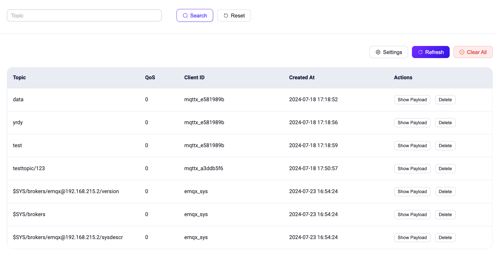
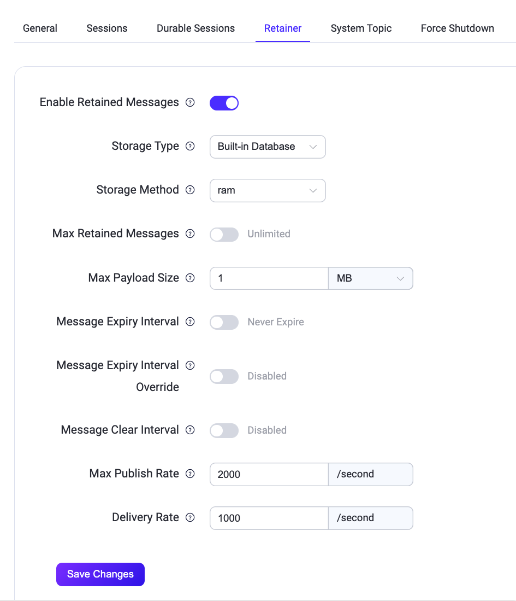

# Retained Messages

EMQXの**Retained Messages**ページでは、すべての保持メッセージを確認できます。ユーザーが保持メッセージをパブリッシュすると、EMQXはこのメッセージをシステム内に保存します。ユーザーはRetained Messagesページでこのメッセージを閲覧でき、保持メッセージのトピックをサブスクライブすると、EMQXはそのメッセージをトピックにパブリッシュし、ユーザーは即座にメッセージを受信できます。保持メッセージは、ユーザーが手動で削除しない限り、デフォルトで期限切れにはなりません。

## Retained Messages List

Retained Messages Listには、現在システムに保存されているすべての保持メッセージが表示されます。リストにはトピック、QoS（サービス品質）レベル、パブリッシャーのクライアントID、保持メッセージがパブリッシュされた時間が含まれます。リスト内では、**Show Payload**ボタンと**Delete**ボタンをクリックして、それぞれ保持メッセージのペイロードを確認したり、保持メッセージを削除したりできます。右上の**Refresh**ボタンをクリックすると現在の保持メッセージリストが更新され、**Settings**をクリックすると保持メッセージ設定ページに遷移します。

EMQXはデフォルトで3つのシステムトピックのメッセージを保持します。クラスター環境では、異なるシステムトピックの保持メッセージはノード名に基づいて保存されます。

- $SYS/brokers/+/sysdescr: 現在のEMQXノードのシステム説明。
- $SYS/brokers/+/version: 現在のEMQXノードのバージョン番号。
- $SYS/brokers: 現在のEMQXクラスター内のすべてのノードの数と名前。

### Delete Retained Message

通常、保持メッセージはクライアントから保持メッセージのトピックに空メッセージをパブリッシュすることで削除できます。この方法に加えて、保持メッセージリストの**Delete**ボタンをクリックして特定の保持メッセージを削除することも可能です。さらに、**Clear All**ボタンを使ってクラスター全体の保持メッセージを一括削除することもできます。保持メッセージの有効期限は保持メッセージ設定ページで設定でき、有効期限に達した保持メッセージはEMQXによって自動的に削除されます。

### View Payload

保持メッセージのペイロードを確認したい場合は、保持メッセージ項目の**Actions**列にある**Show Payload**をクリックしてください。

ポップアップウィンドウの右下にある**Copy**ボタンをクリックするとペイロードをコピーできます。また、左下のドロップダウンリストからペイロードの表示形式を選択でき、JSONや16進数（Hex）などの特殊なペイロード形式をより直感的に表示できます。

## Retainer Settings

**Retained Messages**ページ右上の**Settings**ボタンをクリックすると、**Management** -> **MQTT Settings**ページの**Retainer**タブに遷移し、保持メッセージ機能の有効・無効切り替えや保持メッセージの各種設定が行えます。

::: tip

保持メッセージ機能をトグルスイッチで無効にすると、Retained Messagesページに**Enable**ボタンが表示されます。このボタンをクリックすると、**Retainer**タブに遷移します。

:::

以下に各項目の詳細を示します。

| 設定項目                | 種類     | オプション値       | デフォルト値     | 説明                                                         |
| ----------------------- | -------- | ------------------ | --------------- | ------------------------------------------------------------ |
| Storage Type            | -        | Built-in Database  | -               | -                                                            |
| Storage Method          | Enum     | `ram`, `disc`      | `ram`           | `ram`: メモリのみで保存 `disc`: メモリとハードディスクに保存。 |
| Max Retained Messages   | Integer  | ≥ 0                | 0（無制限）      | 0は無制限。 最大保持メッセージ数を設定すると、上限に達した際に既存のメッセージが置き換えられます。ただし、新しいトピックの保持メッセージは上限を超えて保存できません。 |
| Max Payload Size        | Bytesize |                    | 1MB             | メッセージの最大ペイロードサイズ。ペイロードが最大値を超える場合、EMQXは保持メッセージとしてではなく通常のメッセージとして扱います。 |
| Message Expire Interval | Duration |                    | 期限切れなし    | 保持メッセージの有効期限。0は期限切れなしを意味します。PUBLISHパケットにメッセージ有効期限が設定されている場合は、そちらが優先されます。 |
| Message Clear Interval  | Duration |                    | 無効           | 期限切れメッセージをクリーンアップする間隔。                           |
| Max Publish Rate        | Integer  | ≥ 0                | 2000            | 保持メッセージのパブリッシュ最大レート。上限を超えたメッセージは配信されますが、保持メッセージとしては保存されません。 |
| Deliver Rate            | Integer  | ≥ 0                | 1000            | 保持メッセージの配信最大レート。                                   |
