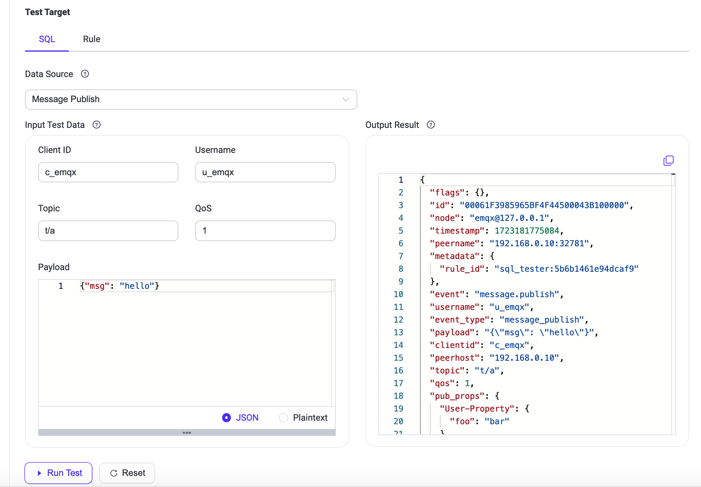
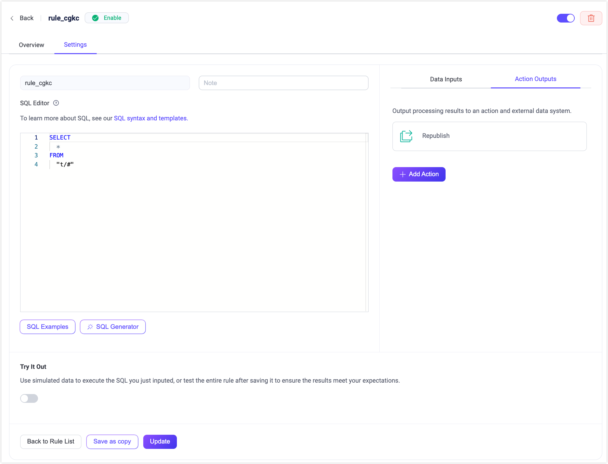

# Rules

EMQXは強力かつ効率的な組み込みデータ処理機能であるルールエンジンを提供しています。SQLライクな構文を活用することで、ユーザーはさまざまなソースからデータを容易に抽出、変換、強化できます。処理されたデータは、ルールによってトリガーされるアクション（組み込みアクションやSink/Sourceを含む）を通じて外部システムに配布または統合できます。また、処理済みデータをMQTTクライアントやデバイスに再パブリッシュすることも可能です。

ルールエンジンはEMQXのデータ統合機能の中核コンポーネントです。データ統合を活用した柔軟なビジネス統合ソリューションを提供し、ビジネス開発プロセスを簡素化し、ユーザーの利便性を向上させ、ビジネスシステムとEMQX間の結合度を低減します。詳細については[ルールエンジン](../../develop/data-integration/rules.md)をご参照ください。

ルールの作成および管理は、左メニューの**Integration** -> **Rules**をクリックして**Rules**ページにアクセスできます。

## ルールの作成

ルールを作成するには、Rulesページ右上の**Create**をクリックします。また、Connectorページの既存コネクターの**Action**列から**Create Rule**をクリックして素早くルールを作成することも可能です。

### SQLエディター

ルール作成ページにはSQLエディターがあり、SQL文を使ってルールロジックを定義できます。これにより、クライアントやシステム間で交換されるデータをリアルタイムにクエリ、フィルタリング、変換、強化できます。

ルールを識別・整理するために、ルールIDと任意のノートを入力します。ルールIDは自動的に一意のものが生成されますが、任意で指定することも可能です。ノート欄にはルールの目的を簡潔に説明できます。

SQLエディター下の**SQL Examples**をクリックすると、右側に一般的なSQL例が表示されます。以下のSQL例を参考にして素早くルールを作成できます。

デフォルトのSQL文は `SELECT * FROM "t/#"` で、これはクライアントがトピック`t/#`にメッセージをパブリッシュした際に、ルールエンジンがそのイベント下のすべてのデータを取得することを意味します。

`SELECT`キーワードはメッセージ内のすべてのフィールドを取得できます。例えば、現在のメッセージの`Payload`だけを取得したい場合は、`SELECT payload from "t/#"`に変更できます。データは[組み込み関数](../../develop/data-integration/rule-sql-builtin-functions.md)を使って処理・変換可能です。

`FROM`キーワードの後には1つ以上のデータソースが続きます。利用可能なイベントトピックは、SQLエディター下の**Try It Out**エリアで確認できます。`WHERE`キーワードを使うことで条件フィルタリングも追加可能です。SQL構文の詳細は[SQL構文と例](../../develop/data-integration/rule-sql-syntax.md)をご覧ください。

### Try It Out

SQL文の作成が完了したら、ページ下部の**Try It Out**トグルスイッチをオンにして、このエリアでルールのテストを実行できます。

SQLテストでは、**Data Source**ドロップダウンからイベントやデータソースを選択し、シミュレートするテストデータを入力して**Run Test**をクリックすると、右側の**Output Result**に実行結果が表示されます。

SQL文を変更するたびにこのテストでルールの出力データを確認し、ルールの正確性を検証できます。

::: tip

SQL実行時に`412`エラーコードが表示された場合、テストデータとの不整合が原因の可能性があります。データソースがSQL文に合致しない場合、対応するイベントやデータソースの選択を促されます。更新されたデータソースイベントはテストデータに自動反映されます。

:::

シミュレートされるデータソースは実際のシナリオと同様で、いくつかのMQTTイベントが含まれます。メッセージ部分では、以下の異なるメッセージイベントを選択してデータをシミュレート可能です。

- メッセージパブリッシュ（mqttトピック）
- メッセージ配信済み（$events/message/delivered）
- メッセージアック済み（$events/message/acked）
- メッセージドロップ（$events/message/dropped）

その他のイベントでは、以下のクライアントおよびセッションイベントを選択してデータをシミュレートできます。

- クライアント接続（$events/client/connected）
- クライアント切断（$events/client/disconnected）
- クライアントconnack（$events/client/connack）
- クライアント認可チェック完了（$events/auth/check_authz_complete）
- クライアント認証チェック完了（$events/auth/check_authn_complete）
- サブスクライブ済み（$events/session/subscribed）
- サブスクライブ解除済み（$events/session/unsubscribed）

対応するデータソースはエディター内のSQL文と一致している必要があります。メッセージイベントを利用してデータを取得する場合は、`FROM`キーワードの後に対応するイベントトピック（括弧内の内容）をSQL文に記述してください。ルールは複数イベントの利用もサポートしています。データソースおよびイベントの詳細は[SQLデータソースとフィールド](../../develop/data-integration/rule-sql-events-and-fields.md)をご参照ください。

また、テストエリアでルールのテストを行うことも可能です。詳細なテスト手順は[Test Rule](../../develop/data-integration/rule-get-started.md#test-rule)をご覧ください。

### アクション出力

SQL文の編集とルールのデバッグが完了し、要件を満たす出力データが得られたら、ページ右側の**Action Outputs**タブでルールがトリガーされた後に実行するアクションを選択できます。**Add Action**ボタンをクリックすると、2つの組み込みアクションおよび各種Sink/Sourceからアクションタイプを選択し、ルールの出力データをさらに処理できます。アクション作成の詳細は[Add Action](../../develop/data-integration/rule-get-started.md#add-action)をご参照ください。

## ルールの閲覧

ルール作成後、ルール一覧でルールID、ルールのアクセス元データ（イベント、トピック、データブリッジなど）、ルールノート、有効状態、作成日時などの基本情報を確認できます。ルールの設定、削除、有効化、無効化などの操作が可能です。アクションバーからルールの複製や修正もでき、ルールの再利用性を高められます。

一覧上部には検索バーがあり、ルールID、トピック、有効状態、ノートを複数条件で検索できます。これにより条件に合致するルールを素早く見つけて閲覧・設定できます。なお、ルールIDとノートはあいまい検索に対応し、トピックはワイルドカード検索に対応しています。

## ルール実行統計

ルール一覧ページでルールIDをクリックすると、ルール概要ページに素早く遷移します。ルール概要ページにはルールの基本的なデータ統計が含まれ、ルールの実行統計や当該ルール下のアクション実行統計が表示されます。例として、マッチ数、通過数、失敗数、ルールの実行率、アクションの成功・失敗実行数などがあります。右上の**Refresh**ボタンをクリックすると、現在のルールのリアルタイム実行データ統計を確認できます。

## 設定

ルール一覧の**Action**列にある**Settings**タブまたは**Settings**ボタンをクリックすると、設定ページに入れます。このページはルール作成ページと同様にルールの基本情報を含み、ルールの修正やデバッグが可能です。例えば、当該ルール下の実行アクションの修正、ルールノートの変更、SQL文の再編集などが行えます。

