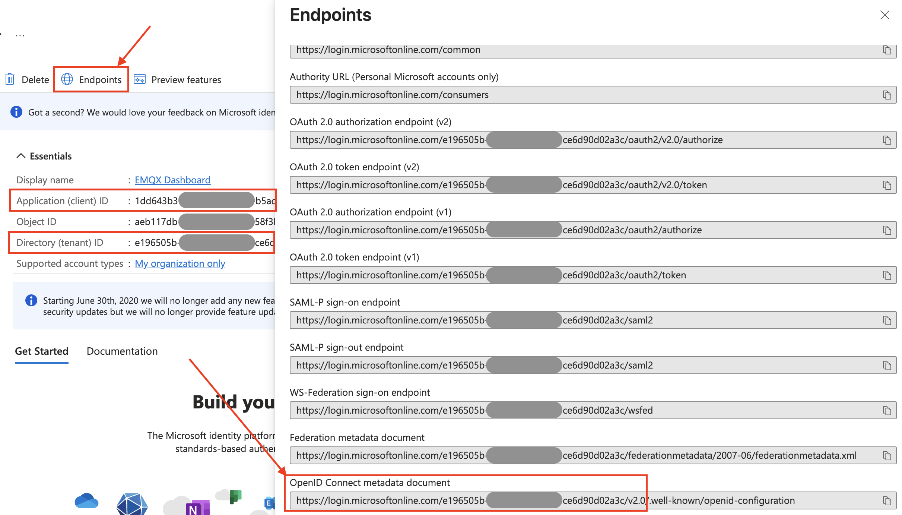

# OIDCベースのSSOの設定

このページでは、OpenID Connect（OIDC）プロトコルに基づくシングルサインオン（SSO）の設定と使用方法について説明します。

::: tip 前提条件

[シングルサインオン（SSO）](./sso.md)の基本概念に慣れていることを推奨します。

:::

## 対応するOIDCプロバイダー

EMQXダッシュボードは、OIDCプロトコルをサポートするアイデンティティサービスと連携してOIDCベースのSSOを実現できます。例えば以下のようなサービスです：

- [Microsoft Entra ID](https://www.microsoft.com/en-us/security/business/identity-access/microsoft-entra-id)
- [Okta](https://www.okta.com/)

## Microsoft Entra IDとの連携によるSSOの設定

このセクションでは、Microsoft Entra IDをアイデンティティプロバイダー（IdP）として使用し、SSOを設定する方法を案内します。Microsoft側とEMQXダッシュボード側の両方で設定を完了する必要があります。

### ステップ1：EMQXダッシュボードでOIDCを有効化する

1. EMQXダッシュボードで、**System** -> **SSO** に移動します。
2. **OIDC**カードの**Enable**ボタンをクリックします。

### ステップ2：Microsoft Entra IDにアプリケーションを登録する

1. 管理者として[MS Azureポータル](https://portal.azure.com/)にログインします。

2. **Microsoft Entra ID** -> **Enterprise Applications** -> **New Application** に進み、**Create your own application**をクリックします。

   

3. アプリケーション名（例：`EMQX Dashboard`）を入力し、**Register an application to integrate with Microsoft Entra ID (App you're developing)** を選択して、**Create**をクリックします。

   

4. **Register an application**ページで、サポートするアカウントタイプを選択し、EMQXダッシュボードの**ステップ1**で提供された情報を使って**Redirect URL**を設定します：

   - **Redirect URL**：`Web`を選択し、ダッシュボードで提供された**Sign-in Redirect URI**（例：`http://localhost:18083/api/v5/sso/oidc/callback`）を入力します。

5. **Certificates and Secrets** -> **Client secrets**タブに移動し、**New client secret**をクリックします。説明を入力し、有効期限を選択して**Add**をクリックします。生成されたシークレット値をコピーします。これは**ステップ3**で必要になります。

### ステップ3：EMQXダッシュボードの設定を完了する

1. 設定ページで以下の情報を入力します：
   - **Provider**：`Generic`のままにします。

   - **Issuer URL**：これは**OpenID Connect metadata document**に対応し、**ステップ2**のアプリケーション概要ページの**Endpoints**タブで確認できます。ただし、`/.well-known/openid-configuration`の部分はEMQXが自動で追加するため含めません。例：`https://login.microsoftonline.com/<tenant_id>/v2.0`（`<tenant_id>`はディレクトリ（テナント）IDです）。

   - **Client ID**：**ステップ2**のアプリケーション概要ページにある**Application (client) ID**に対応します。

     

   - **Client Secret**：**ステップ2**で生成したシークレット値を使用します。

   - **Dashboard Address**：ユーザーがダッシュボードにアクセスするためのベースURLを入力します（例：`http://localhost:18083`）。このアドレスはIdP側の設定用に**SSO Address**および**Metadata Address**の生成に自動で組み合わされます。

     

   - **Enable TLS**：**Issuer URL**が`https`スキームの場合はこのトグルをオンにし、`http`の場合はオフにします。EMQX 6.0.4以降、Issuer URLのスキームとTLS設定が一致しない場合、OIDC設定の作成または更新を拒否します。

2. **Update**をクリックして設定を完了します。

## Oktaとの連携によるSSOの設定

このセクションでは、Oktaをアイデンティティプロバイダー（IdP）として使用し、SSOを設定する方法を案内します。Okta側とEMQXダッシュボード側の両方で設定を完了する必要があります。

### ステップ1：EMQXダッシュボードでOIDCを有効化する

1. EMQXダッシュボードで、**System** -> **SSO** に移動します。
2. **OIDC**カードの**Enable**ボタンをクリックします。

### ステップ2：OktaのアプリケーションカタログにOIDCアプリケーションを追加する

1. 管理者としてOktaにログインし、**Okta Admin Console**にアクセスします。

2. **Applications -> Applications**ページに進み、**Create App integration**ボタンをクリックします。ポップアップでサインイン方法として`OIDC - OpenID Connect`を選択します。

3. **Application type**として`Web Application`を選択し、**Next**をクリックします。

4. **General Settings**タブでアプリケーション名（例：`EMQX Dashboard`）を入力し、**Next**をクリックします。

5. **LOGIN**タブで、EMQXダッシュボードの**ステップ1**で提供された情報を使って設定します：

   - **Sign-in redirect URIs**：ダッシュボードで提供された**Sign-in Redirect URI**（例：`http://localhost:18083/api/v5/sso/oidc/callback`）を入力します。
   - その他の設定は任意で、必要に応じて調整してください。

6. 設定内容を確認し、**Save**をクリックします。

詳細な手順は[Oktaのドキュメント](https://help.okta.com/en-us/content/topics/apps/apps_app_integration_wizard_oidc.htm)を参照してください。

### ステップ3：EMQXダッシュボードの設定を完了する

1. 設定ページで以下の情報を入力します：
   - **Force MFA**：必要に応じて有効にすると、このバックエンドのすべてのユーザーにログイン時のTOTP検証を要求します。デフォルトは無効です。詳細は[SSOユーザーの強制MFA](../multi-factor-authn/multi-factor-authentication.md#forced-mfa-for-sso-users)を参照してください。
   - **Provider**：`Okta`を選択するか、その他のプロバイダーの場合は`Generic`を選択します。
   - **Issuer URL**：Oktaの認可サーバーのURL（例：`https://example-org.okta.com`）を入力します。
   - **Client ID**：**ステップ2**で作成したアプリケーションからコピーします。
   - **Client Secret**：**ステップ2**で作成したアプリケーションからコピーします。
   - **Dashboard Address**：ユーザーがダッシュボードにアクセスするためのベースURLを入力します（例：`http://localhost:18083`）。このアドレスはIdP側の設定用に**SSO Address**および**Metadata Address**の生成に自動で組み合わされます。
   - **Enable TLS**：**Issuer URL**が`https`スキームの場合はこのトグルをオンにし、`http`の場合はオフにします。EMQX 6.0.4以降、Issuer URLのスキームとTLS設定が一致しない場合、OIDC設定の作成または更新を拒否します。
2. **Update**をクリックして設定を完了します。

## ログインとユーザー管理

OIDC SSOを有効にすると、EMQXダッシュボードのログインページにSSOオプションが表示されます。**OIDC**ボタンをクリックすると、OIDCプロバイダーのログインページに遷移し、割り当てられたユーザー資格情報でログインできます。

認証に成功すると、EMQXは自動的にダッシュボードユーザーを追加します。ユーザーの役割や権限は[Users](./system.md#users)で管理できます。OIDCユーザーにログイン時のTOTP二要素認証を必須にする場合は、[SSOユーザーの強制MFA](../multi-factor-authn/multi-factor-authentication.md#forced-mfa-for-sso-users)を参照してください。

## ログアウト

ユーザーはダッシュボードの上部ナビゲーションバーにあるユーザー名をクリックし、ドロップダウンメニューの**Logout**ボタンをクリックしてログアウトできます。これはダッシュボードからのログアウトのみを行い、IdP側のログアウトは行いませんのでご注意ください。
