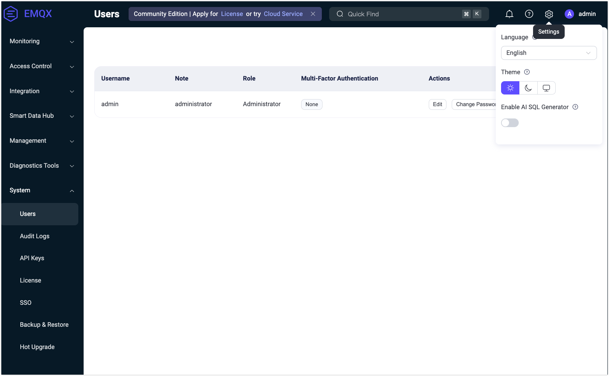

# システム

EMQXダッシュボードの**システム**メニューでは、ユーザーおよびロール管理、監査ログ、APIキー、ライセンス、SSO、データのバックアップと復元、一般設定などのシステム管理オプションにアクセスできます。

## ユーザー

**ユーザー**ページでは、[CLI](../cli.md)で生成されたものを含む、すべてのアクティブなダッシュボードユーザーの概要を確認できます。

新しいユーザーを追加するには、ページ右上の**+ 作成**ボタンをクリックします。ポップアップダイアログが表示され、必要なユーザー情報の入力を求められます。入力後、**作成**ボタンをクリックしてユーザーアカウントを生成します。アクション列からは、ユーザーの編集、パスワード更新、ユーザー情報の削除などの管理操作に簡単にアクセスできます。

> セキュリティ上の理由から、EMQX 5.0.0以降、ダッシュボードユーザーはREST API認証には使用できません。

EMQX 5.3以降、ダッシュボードではEMQX Enterpriseユーザー向けにロールベースアクセス制御（RBAC）機能が導入されました。

RBACにより、組織内の役割に基づいてユーザーに権限を割り当てることができます。この機能は認可管理を簡素化し、アクセス制限によるセキュリティ強化や組織のコンプライアンス向上に寄与し、ダッシュボードの重要なアクセス制御機構となっています。

現在、ユーザーには以下の2つの事前定義されたロールのいずれかを設定できます。ユーザー作成時に**ロール**のドロップダウンから選択可能です。

+ **管理者（Administrator）**

    管理者はクライアント管理、システム設定、APIキー、ユーザー管理を含むすべてのEMQX機能とリソースの管理権限を持ちます。

+ **閲覧者（Viewer）**

    閲覧者はすべてのEMQXデータと設定にアクセスでき、REST APIのすべての`GET`リクエストに対応します。ただし、データの作成、変更、削除権限はありません。

### ログインユーザースコープ

EMQX 5.10以降、ダッシュボードログインユーザーに対して、ロール内でアクセス可能なAPIの範囲をさらに制限するスコープを割り当てられます。[10のAPIキー用スコープ](../api.md#built-in-scopes)に加え、ダッシュボードユーザーにはブラウザセッションにのみ適用される4つの追加スコープがあります。

| スコープ | 必要なロール | 用途 |
| --- | --- | --- |
| `user_management` | 管理者 | ダッシュボードユーザーの管理（作成／更新／削除）。 |
| `sso_management` | 管理者 | SSOバックエンドおよびSSOユーザーレコードの管理。 |
| `api_key_management` | 管理者 | APIキーの管理。 |
| `mfa_management` | すべて | 自身のMFA管理。管理者は他ユーザーのMFAも管理可能。 |

これらのうち、`user_management`、`sso_management`、`api_key_management`は管理者ロールが必要で、閲覧者には割り当てられません。例外は`mfa_management`で、閲覧者も保持可能ですが、自身のMFA管理のみ許可され、他ユーザーのMFA設定にはアクセスできません。これは閲覧者アカウントが追加権限なしに自身の認証器を再登録または復旧できるようにするために有用です。

ユーザー作成または編集時の**Scopes**フィールドは任意です。空欄の場合、ロールに基づくデフォルトスコープセットが割り当てられます。

- **管理者**：上記4つのログイン専用スコープを含むすべてのスコープ。
- **閲覧者**：一般的なAPIキー用スコープすべて。`mfa_management`は明示的に割り当てた場合のみ付与。

::: warning 広範囲スコープは管理者相当とみなす

以下のスコープは本質的に広範囲であり、他のスコープが割り当てられていなくても管理者権限を実質的に付与します。

- `system` は設定管理（`/configs*`, `/data/*`など）をカバーし、保持者は任意の設定サブツリーの更新や、ユーザーおよびAPIキー情報を含むバックアップアーカイブの復元が可能です。
- `user_management` は他のダッシュボードユーザーの作成・変更を許可し、任意のスコープセットを持つユーザーも含みます。
- `api_key_management` は任意のスコープセットを持つAPIキーの作成・変更を許可します。

これらのスコープを制限付きスコープリストと同時に同一ユーザーに付与しても制限は確実に適用されません。設定変更、バックアップインポート、新規アカウントやキーのプロビジョニングにより制限区域にアクセス可能となります。これら3つのスコープは完全に信頼できるユーザーにのみ付与し、ユーザーに必要なスコープだけを付与してください。

:::

#### ロール変更とスコープの互換性

ユーザーのロールを変更する際、EMQXは現在のスコープが新しいロールと互換性があるかをチェックします。互換性がない場合、HTTP 400エラーでリクエストは拒否されます。解決するには、新しいロールに適合する`scopes`リストを同時に含めてリクエストしてください。

例えば、管理者を閲覧者に降格する場合、`user_management`、`sso_management`、`api_key_management`を保持していると拒否されます。閲覧者互換のスコープのみを含む`scopes`リストを指定して変更を完了してください。（`mfa_management`は管理者専用でなく、拒否の原因にはなりません。）

### デフォルト管理者保護

`dashboard.default_username`アカウント（`dashboard.default_password`で設定されたパスワードで作成）は緊急用のブレークグラスアカウントです。ほかの管理者が誤設定やアクセス喪失した場合でもシステムが常に復旧可能となるよう、以下の保護が適用されます。

- ダッシュボードやREST APIから**削除できません**。削除ボタンは無効化されています。
- ロールは`administrator`から**変更できません**。
- スコープセットは**カスタマイズできず**、常に完全な管理者スコープを保持します。
- 説明およびパスワードは通常通り編集可能です。

ほかの管理者は影響を受けず、システムに管理者が1人以上残っていれば削除可能です。

### セルフサービスの範囲

すべてのダッシュボードユーザーはスコープに関係なく以下のセルフサービス操作が許可されています。

- 自身のパスワード変更
- 自身のTOTP／MFAの登録または再登録。管理者がユーザーにMFA必須を設定していない限り、MFAの無効化も可能です。その場合は`mfa_management`スコープが無効化に必要です。

その他のプロフィール更新（説明、ロール、管理者によるスコープ割り当て）は、操作ユーザーに適切なスコープが必要であり、対象が操作ユーザー自身でも例外はありません。

## 監査ログ

**監査ログ**ページでは、管理者がEMQXクラスター内の重要な運用変更をリアルタイムで監視するための監査ログ設定を行えます。

監査ログ機能の詳細は[監査ログ](../audit-log.md)をご参照ください。

## APIキー

**APIキー**ページでは、[HTTP API](../api.md)へのアクセスに使用するAPIキーの作成および管理が可能です。APIキーの作成・管理方法、ロールやスコープの割り当てについては[APIキーの作成](../api.md#create-api-keys)をご覧ください。

## ライセンス

左側の**システム**メニューから**ライセンス**をクリックすると、ライセンス情報ページにアクセスできます。このページでは、現在のライセンスの基本情報（ライセンス接続クォータ使用状況、EMQXバージョン、顧客情報、発行情報など）を確認できます。

**ライセンス更新**をクリックするとライセンスキーをアップロードできます。**ライセンス設定**セクションでは、ライセンス接続クォータ使用量の高水準・低水準の閾値を設定可能です。ライセンスの詳細については[EMQX Enterpriseライセンスの利用](../../get-started/deploy/license.md)をご参照ください。

## SSO

**SSO**ページでは、管理者がユーザーログイン管理のためのSSO機能を設定できます。SSO機能の詳細は[シングルサインオン（SSO）](../sso.md)をご覧ください。

## バックアップと復元

**バックアップと復元**ページでは、運用データと設定ファイルのバックアップ設定を行えます。このページからデータのインポートおよびエクスポート操作も可能です。バックアップと復元機能の詳細は[バックアップと復元](../backup-restore.md)をご参照ください。

## 設定

設定にアクセスするには、ダッシュボード右上の歯車アイコンをクリックします。

**設定**メニューでは、ダッシュボードの言語とテーマをカスタマイズできます。

- **言語**：表示言語を選択します。
- **テーマ**：ライトテーマとダークテーマの切り替え、またはOSのテーマに自動同期する設定が可能です。同期を有効にすると、テーマはOS設定に従い、手動選択は無効になります。

さらに、設定メニューには**ルール**ページの[AI SQLジェネレーター](../../develop/data-integration/rule-get-started.md#sql-generator)機能の有効／無効切り替えトグルも含まれています。

