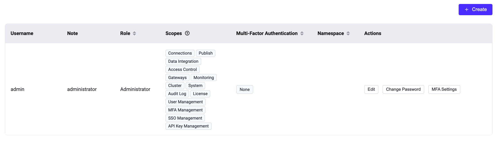
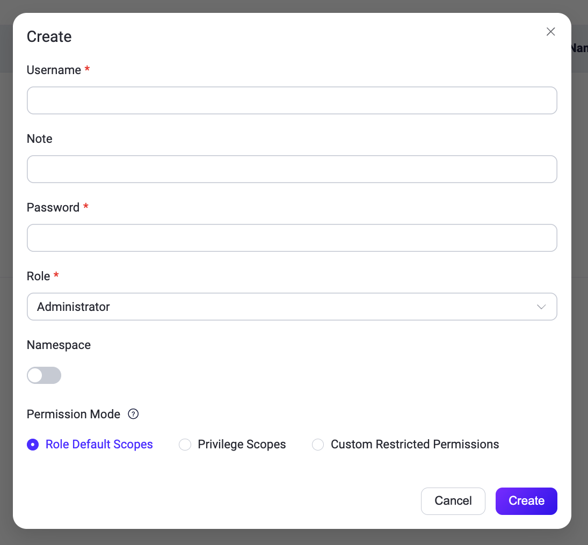
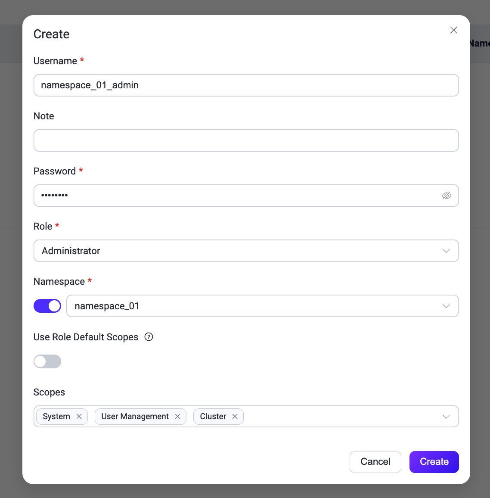
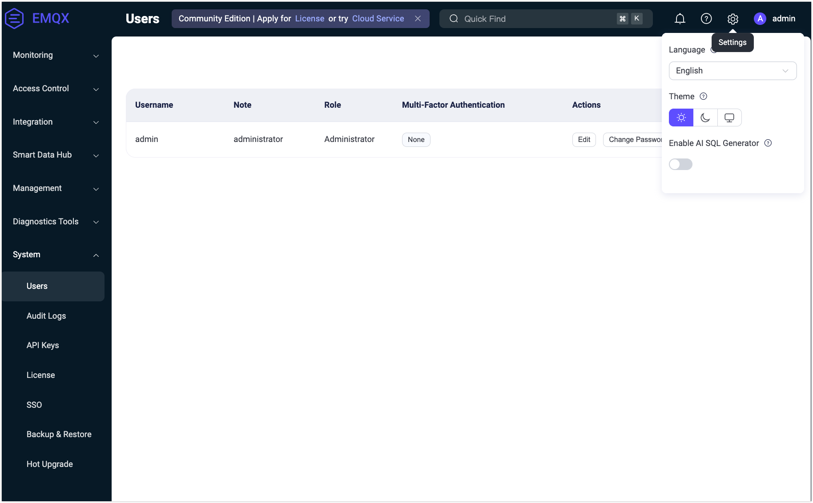

# システム

EMQXダッシュボードの**システム**メニューでは、ユーザーおよびロール管理、監査ログ、APIキー、ライセンス、SSO、データのバックアップと復元、ホットアップグレード、一般設定などのシステム管理オプションにアクセスできます。

## ユーザー

**ユーザー**ページでは、[CLI](../cli.md)で生成されたものを含む、すべてのアクティブなダッシュボードユーザーの概要を確認できます。

新しいユーザーを追加するには、ページ右上の**+ 作成**ボタンをクリックします。ポップアップダイアログが表示され、必要なユーザー情報の入力を求められます。入力後、**作成**ボタンをクリックしてユーザーアカウントを生成します。ユーザーの編集、パスワード更新、削除などの管理は、アクション列から簡単にアクセスできます。

> EMQX 5.0.0以降、ダッシュボードのユーザー名とパスワードはREST APIリクエストのBasic認証資格情報として直接使用できません。REST APIアクセスにダッシュボードユーザーの認証情報を使用するには、[ダッシュボードのログインフロー](../api.md#bearer-token-authentication)を通じてベアラートークンを取得してください。



### ロールベースアクセス制御

EMQX 5.3以降、ダッシュボードではEMQX Enterpriseユーザー向けにロールベースアクセス制御（RBAC）機能を導入しています。

RBACにより、組織内のユーザーの役割に基づいて権限を割り当てることができます。この機能は認可管理を簡素化し、アクセス制限によってセキュリティを強化し、組織のコンプライアンスを向上させるため、ダッシュボードにおける重要なアクセス制御メカニズムです。

現在、ユーザーには以下のいずれかの事前定義されたロールを設定できます。ユーザー作成時に**ロール**ドロップダウンから選択可能です。

+ **Administrator（管理者）**

    クライアント管理、システム設定、APIキー、ユーザー管理など、すべてのEMQX機能とリソースを完全に管理できます。

+ **Viewer（閲覧者）**

    すべてのEMQXデータと設定にアクセスでき、REST APIのすべての`GET`リクエストに相当します。ただし、データの作成、変更、削除はできません。

### ログインユーザースコープ

ダッシュボードのログインユーザーには、ロール内でアクセス可能なAPIの範囲をさらに制限するためにスコープを割り当てることができます。EMQX 6.3.2以降、ダッシュボードユーザーは[11のAPIキー用スコープ](../api.md#built-in-api-key-scopes)と、ブラウザセッションにのみ適用される4つの追加スコープを利用できます。

| スコープ | 必要なロール | 用途 |
| --- | --- | --- |
| `user_management` | Administrator | ダッシュボードユーザーの管理（作成／更新／削除）。 |
| `sso_management` | Administrator | SSOバックエンドおよびSSOユーザーレコードの管理。 |
| `api_key_management` | Administrator | APIキーの管理。 |
| `mfa_management` | グローバル管理者またはグローバル閲覧者 | 自身のMFA管理。管理者は他ユーザーのMFAも管理可能。 |

これらのうち3つのスコープ（`user_management`、`sso_management`、`api_key_management`）はAdministratorロールが必要で、Viewerには割り当てられません。グローバルユーザーの場合、例外は`mfa_management`で、グローバル閲覧者も保持可能ですが、自身のアカウントのMFA管理のみ許可され、他ユーザーのMFA設定にはアクセスできません。これは、グローバル閲覧者アカウントが追加権限なしに自身の認証器を再登録または回復できるようにするために有用です。EMQX 6.3.2以降、ネームスペースユーザーには`mfa_management`を割り当てられません。

ダッシュボードでグローバルユーザーを作成する際、**Namespace**オプションはオフで、**Permission Mode**はデフォルトで**Role Default Scopes**に設定されています。以下のモードから選択します。

- **Role Default Scopes**：選択したロールのデフォルトスコープを使用。ロールデフォルトの変更は自動的に反映されます。
- **Privilege Scopes**：`system`、`user_management`、`api_key_management`、`sso_management`から選択。管理者相当の権限を持ちます。
- **Custom Restricted Permissions**：管理者相当以外のロールに割り当て可能なスコープ（例：`connections`、`publish`、`data_integration`、`monitoring`、`plugin_api`、`mfa_management`）から選択。空欄の場合、スコープ保護されたAPIにアクセスできません。



ネームスペースユーザーは別のスコープ割り当てフローを使用し、利用可能なスコープはロールとネームスペースにより制限されます。設定手順は[ネームスペースロールのユーザー作成](#create-a-user-with-a-namespaced-role)を参照してください。

| ユーザー種別 | デフォルト権限 |
| --- | --- |
| グローバル管理者 | 15スコープすべて：11のAPIキー用スコープと4つのログイン専用スコープ。 |
| グローバル閲覧者 | 11のAPIキー用スコープ。`mfa_management`は明示的に割り当てた場合のみ付与。 |
| ネームスペース管理者 | Connections、Monitoring、Data Integration、Access Control、System、Cluster、License、Plugin API、User Management、API Key Management。 |
| ネームスペース閲覧者 | Connections、Monitoring、Data Integration、Access Control、System、Cluster、License、Plugin API。ログイン専用スコープは含まれません。 |

::: warning 管理者相当スコープは単独で割り当てる必要があります

以下の管理者相当スコープはダッシュボードの**Privilege Scopes**にまとめられ、検証メッセージでは`privilege scopes`と呼ばれます。

- `system`：設定管理(`/configs*`、`/data/*`など)。`system`を持つユーザーは任意の設定サブツリーを更新でき、ユーザーおよびAPIキー記録を含むバックアップアーカイブの復元も可能です。
- `user_management`：他のダッシュボードユーザーの作成・変更が可能で、任意のスコープ設定のユーザーも含みます。
- `api_key_management`：任意のスコープ設定のAPIキーの作成・変更が可能です。
- `sso_management`：SSOバックエンドのローテーションや再設定が可能で、管理者の認証方法を変更できます。

これらのスコープは管理者相当の権限を付与します。これらのスコープと管理者相当以外のスコープを組み合わせても、ユーザーの実効権限は減少しません。

EMQX 6.0.4以降、グローバルダッシュボードユーザーの明示的なスコープリストは、上記管理者相当スコープとそれ以外のスコープを混在させることはできません。作成または更新リクエストはHTTP 400を返し、スコープ変更は適用されません。必要な権限に応じて、管理者相当スコープのみ、またはそれ以外のスコープのみを割り当ててください。`mfa_management`は管理者相当グループ外です。

EMQX 6.0.4以前に作成された混在スコープのユーザーは引き続き動作し、管理者相当スコープは有効です。ダッシュボードでそのようなグローバルユーザーを編集すると、互換性警告が表示され、保存前に**Privilege Scopes**、**Custom Restricted Permissions**、**Role Default Scopes**のいずれかを選択する必要があります。明示的なスコープリストは管理者相当スコープのみ、またはそれ以外のみを含む必要があります。ロールデフォルトを使用するかスコープを付与しない場合はこの制限は適用されません。

この相互排他ルールはネームスペースダッシュボードユーザーには適用されません。これらのユーザーはネームスペースロールで許可されたスコープを組み合わせられますが、自分のネームスペース内の操作とリソースにのみアクセス可能です。

:::

#### ロール変更とスコープの互換性

ダッシュボードでユーザー設定中にロールやネームスペースを変更すると、そのロールやネームスペースでサポートされないスコープはフォームから削除され、警告が表示されます。REST APIでは、ユーザーのスコープが新しいロールと互換性があるかをチェックし、互換性のないリクエストはHTTP 400で拒否されます。エラーを解決するには、新しいロールに有効な`scopes`リストを同時に含めてください。

例えば、グローバル管理者を閲覧者に降格し、そのユーザーが`user_management`、`sso_management`、`api_key_management`を保持している場合、これらのスコープは管理者ロールが必要なためリクエストは拒否されます。閲覧者に適合するスコープのみを含む`scopes`リストを指定して変更を完了してください。`mfa_management`はグローバル閲覧者と互換性があります。EMQX 6.3.2以降、ネームスペース閲覧者には`connections`、`monitoring`、`data_integration`、`access_control`、`system`、`cluster_operations`、`license`、`plugin_api`のみが許可され、それ以外のスコープを含むリクエストはHTTP 400を返します。

### デフォルト管理者保護

`dashboard.default_username`アカウント（`dashboard.default_password`で設定されたパスワードで作成）はブレークグラスアカウントです。システム管理者が誤設定やアクセス喪失した場合でもシステムを回復できるよう、デフォルトユーザーは誤ってロックアウトされないよう保護されています。

- ダッシュボードやREST APIから**削除できません**。削除ボタンは無効化されています。
- ロールは`administrator`以外に**変更できません**。
- スコープセットはカスタマイズできず、常に完全な管理者権限を使用します。
- 説明とパスワードは通常通り編集可能です。

他の管理者は影響を受けず、システムに管理者が1人以上いる限り削除可能です。

### セルフサービスの範囲

すべてのダッシュボードユーザーはスコープに関係なく、以下の2つのセルフサービス操作が許可されています。

- 自身のパスワード変更。
- 自身のTOTP／MFAの登録または再登録。MFAの無効化も可能ですが、管理者がユーザーにMFAを必須にしている場合は`mfa_management`スコープが必要です。

その他のプロフィール更新（説明、ロール、管理者が割り当てたスコープ）は、操作ユーザーに適切なスコープが必要であり、対象が自身でも例外ではありません。

### ネームスペースロール

EMQX 6.0以降、ダッシュボードはネームスペースロールをサポートしています。この機能はロールベースアクセス制御を拡張し、マルチテナンシーを実現します。各ユーザーは特定のネームスペース内でのみ操作を制限できます。

::: warning 信頼されたデプロイメントのみ

ネームスペース管理者アクセスは、組織内のチームや事業部門を分離して誤操作によるクロスチーム設定変更のリスクを減らすための信頼された内部デプロイメント向けです。この機能は強力な分離保証を提供せず、公開または信頼できないマルチテナント環境のセキュリティ境界としては適しません。

委譲管理者にネームスペーススコープリソースの管理を許可する場合は、**Management** -> **Cluster Settings** -> **[Rule Engine Security](./cluster_settings.md#rule-engine-security)**でSSRF保護を有効にしてください。EMQX 6.0.4以降、このポリシーはコネクター設定のテスト、作成、更新時にHTTPおよびMQTTコネクターのターゲットを検証します。その他のコネクタータイプやランタイム接続は対象外です。完全なアウトバウンドネットワーク境界を強制するには、`iptables`や`nftables`などのホストレベルのイングレス制御を追加してください。[Rule EngineポリシーとファイアウォールルールによるSSRF軽減](../cluster/security.md#mitigate-ssrf-with-rule-engine-policy-and-firewall-rules)を参照してください。

:::

::: tip

ネームスペースの詳細は[Namespace](../multi-tenancy/namespace-overview.md)をご覧ください。

:::

#### ネームスペースロールのユーザー作成

ダッシュボードで新規ユーザーを作成する際、**Namespace**オプションはデフォルトでオフです。有効にしてネームスペースを選択すると、ネームスペースロールのユーザーを作成できます。

::: tip 前提条件

1. ダッシュボードで管理対象ネームスペース（例：`namespace_01`）を作成してください。手順は[Create Namespaces](../multi-tenancy/create-namespace.md)を参照。
2. EMQXライセンスとクラスターがEMQX 6.0以降で稼働していることを確認してください。

:::

1. **システム** -> **ユーザー**に移動し、**+ 作成**をクリックします。
2. ユーザーを設定します：
   - **ユーザー名**：ユーザーの一意識別子。
   - **メモ**：任意の説明。
   - **パスワード**：ログインパスワード。
   - **ロール**：**Administrator**または**Viewer**を選択。
   - **Namespace**：デフォルトはオフ。オンにして既存のネームスペース（例：`namespace_01`）を選択。
   - **Use Role Default Scopes**：**Namespace**をオンにすると表示され、3択の**Permission Mode**に代わる項目です。デフォルトで有効。選択したネームスペースロールのデフォルトスコープを使用する場合はオンのまま、明示的にスコープを割り当てる場合はオフにします。
   - **Scopes**：**Use Role Default Scopes**をオフにすると表示されます。選択したロールがネームスペース内で保持可能なスコープから選択。空欄の場合はスコープなし。

   

3. **作成**をクリックして完了します。

CLIやAPIでユーザーを作成する場合、ロールは以下の形式で明示的に指定する必要があります。

```
ns:<NAMESPACE>::<ROLE>
```

例：

- `ns:namespace_01::administrator`
- `ns:namespace_01::viewer`

EMQX 6.3.0以降、ネームスペースロールのネームスペースは`multi_tenancy.deny_namespaces`に含まれていてはなりません。拒否された名前を使うロールはEMQXにより拒否されます。設定詳細は[Denied Namespace Names](../multi-tenancy/namespace-global-settings.md#denied-namespace-names)を参照してください。

#### ネームスペースユーザーの動作

- **スコープ付きリソース**：ネームスペースユーザーは割り当てられたネームスペース内のリソース（コネクター、アクション、ソース、ルール、その他ネームスペース対応モジュール）の閲覧と管理のみ可能です。
- **クラスター全体設定**：ネームスペース非対応の設定は読み取り専用で、グローバル管理者のみが変更可能です。
- **メッセージコンテンツ関連エンドポイントの制限**：MQTTメッセージの生データにアクセス・操作する一部のREST APIエンドポイントはネームスペースユーザーに対して利用不可で、`403 Forbidden`を返します。これらはグローバル管理者のみアクセス可能です。
  - Mqueueメッセージ：`GET /clients/:clientid/mqueue_messages`
  - Inflightメッセージ：`GET /clients/:clientid/inflight_messages`
  - Retainedメッセージ：`GET /mqtt/retainer/messages`、`GET /mqtt/retainer/message/:topic`、`DELETE /mqtt/retainer/message/:topic`、`DELETE /mqtt/retainer/messages`
  - Delayedメッセージ：`GET /mqtt/delayed/messages`、`GET /mqtt/delayed/messages/:node/:msgid`、`DELETE /mqtt/delayed/messages/:node/:msgid`、`DELETE /mqtt/delayed/messages/:topic`
- **グローバル限定のファイル転送コンテンツエンドポイント**：ファイル転送ストアはグローバルでネームスペース非対応です。呼び出し元のネームスペース外のクライアントがアップロードしたファイルへのアクセスを防ぐため、以下のエンドポイントはネームスペースユーザーおよび全ロールのAPIキーで利用不可です。
  - ファイル一覧：`GET /file_transfer/files`
  - 転送ファイル一覧：`GET /file_transfer/files/:clientid/:fileid`
  - ファイルダウンロード：`GET /file_transfer/file`

  グローバルダッシュボードユーザーとAPIキーはロールとスコープに応じてアクセス可能です。`/file_transfer`の設定エンドポイントは影響を受けません。
- **トレースのスコーピング**：トレースエンドポイントにアクセスする際、ネームスペースユーザーは自身のネームスペースに属するトレースのみ閲覧可能です。別ネームスペースのトレースの停止、ダウンロード、ログストリーム、削除（`PUT /trace/:name/stop`、`GET /trace/:name/download`、`GET /trace/:name/log`、`GET /trace/:name/log_detail`、`DELETE /trace/:name`）は`404 Not Found`を返し、存在情報を漏らしません。全削除エンドポイント（`DELETE /trace`）はネームスペースユーザーに`403 Forbidden`を返し、全トレースのクリアはグローバル管理者のみ可能です。
- **監査ログアクセス**：EMQX 6.3.2以降、ネームスペースユーザーはクラスター全体の監査ログを閲覧できません。監査ログエントリはグローバル管理者とグローバル閲覧者のみ閲覧可能です。詳細は[監査ログアクセス](./audit-log.md#audit-log-access)を参照してください。
- **APIキー管理**：ネームスペース管理者は自身のネームスペース内でAPIキーの作成、一覧表示、読み取り、更新、削除が可能です。グローバルAPIキーや他ネームスペースのキーは作成できず、非表示です。REST APIの詳細動作は[ネームスペース管理者によるAPIキー管理](../api.md#manage-api-keys-as-a-namespaced-administrator)を参照してください。
- **デフォルトランディングページ**：ネームスペースユーザーは通常通りダッシュボードにログインし、**概要**ページから開始します。すべてのメニュー項目は表示されますが、リソースデータは自動的にネームスペースでフィルタリングされます。
- **ライセンス管理**：ネームスペースユーザーはライセンス通知を表示しません。ライセンス管理はシステム管理者の責任です。

#### ネームスペース内のロール意味

- **Administrator（管理者）**：割り当てられたネームスペース内のリソースに対する作成、更新、削除、読み取りの完全な制御。
- **Viewer（閲覧者）**：割り当てられたネームスペース内の読み取り専用アクセス（`GET`リクエスト相当）。

## 監査ログ

**監査ログ**ページでは、グローバル管理者がEMQXクラスター内の重要な運用変更をリアルタイムで監視するための監査ログ設定を行えます。EMQX 6.3.2以降、グローバル管理者とグローバル閲覧者は監査ログエントリを閲覧可能ですが、ネームスペースユーザーは閲覧できません。

監査ログ機能の詳細は[監査ログ](./audit-log.md)をご覧ください。

## APIキー

**APIキー**ページでは、[HTTP API](../api.md)へのアクセス用APIキーの作成と管理が行えます。ロールやスコープの割り当てを含むAPIキーの作成・管理手順は[APIキーの作成](../api.md#create-api-keys)を参照してください。

## ライセンス

左側の**システム**メニューから**ライセンス**をクリックすると、ライセンスページにアクセスできます。このページでは現在のライセンスの基本情報（ライセンス接続クォータ使用状況、EMQXバージョン、顧客情報、発行情報）を確認できます。

**ライセンス更新**をクリックしてライセンスキーをアップロードします。**ライセンス設定**セクションでは、ライセンス接続クォータ使用率の高水位・低水位の閾値を設定可能です。ライセンスの詳細は[EMQX Enterpriseライセンスの利用](../../get-started/deploy/license.md)をご覧ください。

## SSO

**SSO**ページでは、管理者がユーザーログイン管理のためのSSO機能を設定できます。SSO機能の詳細は[シングルサインオン（SSO）](./sso.md)をご覧ください。

## バックアップと復元

**バックアップと復元**ページでは、運用データおよび設定ファイルのバックアップ設定を行えます。グローバル管理者は**グローバル**または特定のネームスペースを切り替えて、そのスコープ内のバックアップファイルを管理可能です。ネームスペース選択時はバックアップファイルのアップロード、ダウンロード、削除、復元が可能ですが、バックアップの作成はできません。詳細は[バックアップと復元](../backup-restore.md)を参照してください。

## 設定

設定にアクセスするには、ダッシュボード右上の歯車アイコンをクリックします。

**設定**メニューでは、ダッシュボードの言語とテーマをカスタマイズできます。

- **言語**：表示言語を選択します。
- **テーマ**：ライトテーマとダークテーマの選択、またはOSのテーマに自動同期を有効にできます。同期を有効にすると、テーマはOS設定に従い、手動選択は無効になります。

さらに、設定メニューには**ルール**ページの[AI SQLジェネレーター](../../develop/data-integration/rule-get-started.md#sql-generator)機能の有効／無効切り替えトグルも含まれています。


