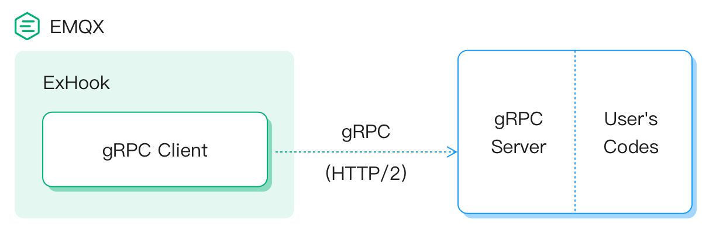

# gRPC Hook Extension

**Extension Hook** は **emqx-exhook** プラグインによってサポートされています。これにより、ユーザーは他のプログラミング言語を使用して EMQX の [Hooks](./hooks.md) を処理することが可能になります。

この仕組みにより、他のプログラミング言語で emqx のイベントを処理し、emqx のカスタマイズや拡張を行うことができます。例えば、以下のような実装が可能です。

- クライアント接続の認証
- パブリッシュ／サブスクライブの認可
- メッセージのパーシステンスおよびブリッジング
- クライアントの接続／切断イベントの処理


## 設計

**emqx-exhook** プラグインは RPC の通信フレームワークとして [gRPC](https://www.grpc.io) を使用しています。

アーキテクチャは以下の図の通りです。



これは EMQX が gRPC クライアントとして動作し、EMQX からユーザーの gRPC サーバーへフックイベントを送信することを示しています。

EMQX ネイティブのフックと同様に、計算および返却にチェーン方式もサポートしています。

[コールバック関数のチェーン](./hooks.md#callback-functions-chain)


## API

イベントハンドラー、つまりユーザーが実装する gRPC サーバー側として、マウントすべきフックのリストを定義し、各イベント到着時の処理方法をコールバック関数として実装します。

これらのインターフェースは `HookProvider` という gRPC サービスとして定義されています。

```
syntax = "proto3";

package emqx.exhook.v2;

service HookProvider {

  rpc OnProviderLoaded(ProviderLoadedRequest) returns (LoadedResponse) {};

  rpc OnProviderUnloaded(ProviderUnloadedRequest) returns (EmptySuccess) {};

  rpc OnClientConnect(ClientConnectRequest) returns (EmptySuccess) {};

  rpc OnClientConnack(ClientConnackRequest) returns (EmptySuccess) {};

  rpc OnClientConnected(ClientConnectedRequest) returns (EmptySuccess) {};

  rpc OnClientDisconnected(ClientDisconnectedRequest) returns (EmptySuccess) {};

  rpc OnClientAuthenticate(ClientAuthenticateRequest) returns (ValuedResponse) {};

  rpc OnClientAuthorize(ClientAuthorizeRequest) returns (ValuedResponse) {};

  rpc OnClientSubscribe(ClientSubscribeRequest) returns (EmptySuccess) {};

  rpc OnClientUnsubscribe(ClientUnsubscribeRequest) returns (EmptySuccess) {};

  rpc OnSessionCreated(SessionCreatedRequest) returns (EmptySuccess) {};

  rpc OnSessionSubscribed(SessionSubscribedRequest) returns (EmptySuccess) {};

  rpc OnSessionUnsubscribed(SessionUnsubscribedRequest) returns (EmptySuccess) {};

  rpc OnSessionResumed(SessionResumedRequest) returns (EmptySuccess) {};

  rpc OnSessionDiscarded(SessionDiscardedRequest) returns (EmptySuccess) {};

  rpc OnSessionTakenover(SessionTakenoverRequest) returns (EmptySuccess) {};

  rpc OnSessionTerminated(SessionTerminatedRequest) returns (EmptySuccess) {};

  rpc OnMessagePublish(MessagePublishRequest) returns (ValuedResponse) {};

  rpc OnMessageDelivered(MessageDeliveredRequest) returns (EmptySuccess) {};

  rpc OnMessageDropped(MessageDroppedRequest) returns (EmptySuccess) {};

  rpc OnMessageAcked(MessageAckedRequest) returns (EmptySuccess) {};
}
```

HookProvider 部分：

- `OnProviderLoaded`：HookProvider のロード方法を定義します。このメソッドはマウントすべきフックのリストを返します。このリストにあるフックのみがユーザーの HookProvider サービスにコールバックされます。
- `OnProviderUnloaded`：HookProvider が emqx からアンインストールされたことをユーザーに通知します。

フックイベント部分：

- `OnClient`、`OnSession`、`OnMessage` で始まるメソッドは [hooks](./hooks.md) のメソッドに対応しており、呼び出しタイミングや引数リストも類似しています。
- `OnClientAuthenticate`、`OnClientCheckAcl`、`OnMessagePublish` のみが EMQX に戻り値を返すことが許可されており、他のコールバックは戻り値をサポートしていません。

インターフェースおよびパラメータの詳細は以下を参照してください。  
[exhook.proto](https://github.com/emqx/emqx/blob/master/apps/emqx_exhook/priv/protos/exhook.proto)


## 開発ガイド

ユーザーは EMQX からのコールバックイベントを受け取るために `HookProvider` の gRPC サービスを実装する必要があります。

主な開発手順は以下の通りです。

1. `lib/emqx_exhook-<x.y.z>/priv/protos/exhook.proto` ファイルをプロジェクトにコピーします。
2. 対応するプログラミング言語の gRPC フレームワークを使い、`exhook.proto` の gRPC サーバー側コードを生成します。
3. 必要に応じて exhook.proto で定義されたインターフェースを実装します。

開発完了後は、EMQX と通信可能なサーバーにサービスをデプロイし、ポートが開放されていることを確認してください。

[EMQX ダッシュボード](http://127.0.0.1:18083/#/exhook) から ExHook サービスの管理および監視が可能です。

各言語向けの gRPC フレームワークは以下で確認できます。  
[grpc-ecosystem/awesome-grpc](https://github.com/grpc-ecosystem/awesome-grpc)

また、いくつかの主要なプログラミング言語向けのサンプルプログラムも提供しています。  
[emqx-extension-examples](https://github.com/emqx/emqx-extension-examples)
