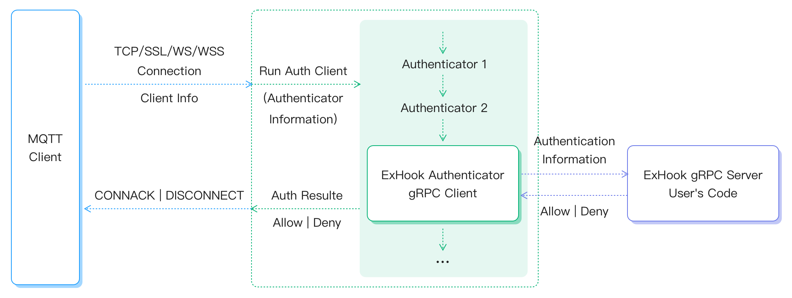
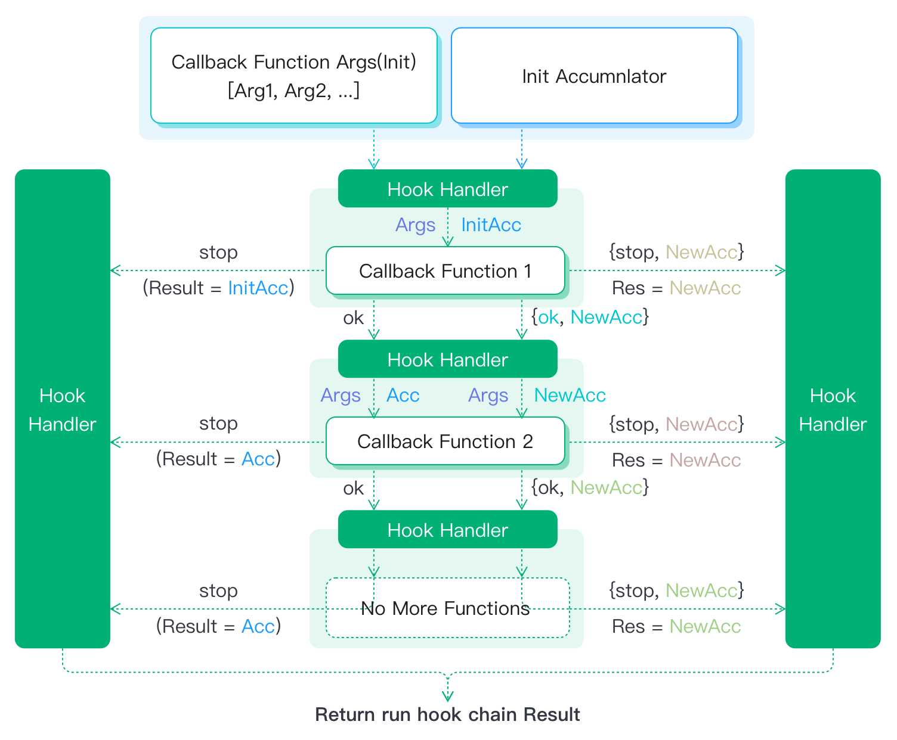
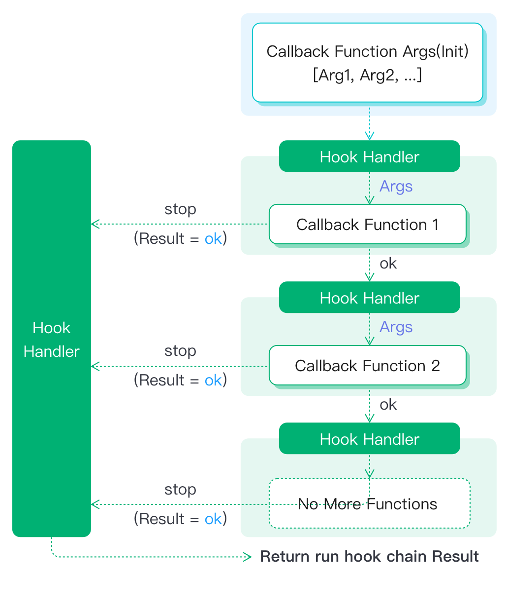

# Hooks

[Hooks](https://reactjs.org/docs/getting-started.html) は、クラスを書かずに状態管理やその他のReact機能を利用できる拡張機構です。

EMQXでも、関数呼び出し、メッセージの送受信、モジュール間のイベント伝達をインターセプトすることで、システム機能を修正・拡張するためにHooksを利用できます。

## 動作原理

システムが**Hooks**機構を採用していない場合、イベントの入力からハンドラー処理、結果に至るまでの一連のイベント処理フローは見えず、変更もできません。

しかし、処理の途中にHookPointを設けて関数をマウントできるようにすると、外部プラグインが複数のコールバック関数をマウントして呼び出しチェーンを形成できます。これにより、内部のイベント処理を拡張・修正可能になります。


EMQXのいくつかの機能はこのhook機能を使って実装されています：

1. メッセージの多段階ストリーミング処理（エンコード／デコードなど）をhookシステムで実現
2. メッセージパブリッシュ時のキャッシュ処理（設定に基づく）
3. hookのブロック機構を使いメッセージパブリッシュの遅延制御

システムでよく使われる認証／認可もこのロジックに従って実装されています。例として[多言語拡張](./exhook.md)を挙げます：

`Built-in Database`認証のみ有効な場合、イベント処理ロジック（上図参照）に従い、認証モジュールの処理は以下の通りです：

1. EMQXがユーザーの認証リクエスト（Authenticate）を受信
2. EMQXが`ClientInfo`とデフォルトの`AccIn`で認証イベントのhookを実行
```erlang
%% デフォルトAccIn
{ok, #{is_superuser => false}}
```
3. `emqx_exhook`モジュールにコールバックし、この認証を有効と判断し、**allow, is_superuser**の結果を取得
```erlang
%% AuthNResult
{ok, #{is_superuser => true}}
```
4. **認証成功**を返し、クライアントはスーパーユーザーとして正常にシステムにアクセス可能となる



このように、**Hooks**はEMQXの柔軟性を大幅に向上させます。EMQXの挙動をカスタマイズしたい場合、コアコードを変更する必要はなく、EMQXが特定箇所に用意した**HookPoint**に関数をhookするだけで済みます。

この一連の流れで注意すべきは：

1. **HookPoint**の位置：役割、実行タイミング、マウントとアンマウントの方法
2. **コールバック関数**の実装：入力パラメータ数、役割、データ構造、返却値の意味
3. **チェーン上のコールバック関数実行機構**：実行順序、チェーンの途中での実行終了方法

拡張プラグイン開発でhooksを使う場合は、上記3点を十分理解し、**hooks内でブロッキング関数を使わないように注意してください。システムのスループットに影響します。**

## コールバック関数チェーン

単一の**HookPoint**に複数のプラグインがイベントを監視し対応処理を行う場合があり、複数のコールバック関数が存在します。

これら複数のコールバック関数が順次実行される連鎖を**コールバック関数チェーン**と呼びます。

**コールバック関数チェーン**は現在、[Chain-of-Responsibility](https://en.wikipedia.org/wiki/Chain-of-responsibility_pattern)パターンに基づいて実装されています。hookの機能性と柔軟性を満たすため、以下の特徴を持ちます：

- **順序付き**：チェーン上のコールバック関数は決まった順序で実行される必要があります。
- **入力パラメータ**：初期化パラメータが1つ以上存在し、オプションでチェーン内で修正される累積値を持ちます。
- **出力結果**：チェーン内の各関数は出力を持ち、結果を気にしない場合は`ok`を返します。例えば通知系イベントで「クライアントが正常にログインした」などは戻り値不要です。
- **伝達性**：チェーン内のコールバック関数の結果は伝達されます。hookの柔軟性のため、返却値の扱いには**2つのモード**があります。
  - **結果伝達モード**<br />
    チェーン内の各関数はチェーンの入力と前関数の返却値（累積値）を引数に受け取り、最後の関数の返却値がチェーン全体の返却値となります。チェーン呼び出し時に初期累積値を渡します。
  - **結果透過モード**<br />
    各関数はチェーンの入力のみを気にし、前関数の返却値は無視します。チェーンの返却値は常に`ok`です。<br />
    これは結果伝達モードの特殊ケースであり、初期累積値が`ok`で、各関数が`ok`を返す場合に相当します。通知系イベントの多くはこのロジックに従います。これにより一般的な**コールバック関数チェーン**実行モジュールを提供しています。
- **チェーンの途中終了と無視**を許容
  - **途中終了**：ある関数の実行終了後、チェーンの実行を即座に終了し、それ以降のコールバック関数は無視されます。<br />例えば認証で「このクライアントは他の認証プラグインをチェックする必要なし」と判断した場合に使います。
  - **無視**：チェーン上の処理結果を変更せず、前関数の返却値をそのまま次関数に渡します。<br />例えば複数認証プラグインがあり、あるプラグインが「このクライアントは自分の認証範囲外」と判断した場合に使います。

以上より、チェーン上のコールバック関数の返却値の扱いに基づき、以下2つの処理フロー図が得られます。

### 結果伝達モード


図の意味：
1. チェーンには3つのコールバック関数`Fun1`、`Fun2`、`Fun3`が登録されており、図の順序で実行される
2. 実行順は優先度で決まり、同じ優先度はマウント順
3. チェーンの入力パラメータは読み取り専用の`Args`と、関数で修正可能な`InitAcc`
4. チェーンの実行がどのように終了しても、返却値は返される。返却値の形式は以下の通り：
   - コールバック関数が返す値：
     - `ok`：処理を無視し、読み取り専用の`Args`と前関数の`Acc`でチェーンを継続
     - `{ok, NewAcc}`：`Acc`の内容を修正し、`Args`と新しい`NewAcc`でチェーンを継続
   - また以下も返せる：
     - `stop`：チェーンの伝達を停止し、前関数の`Acc`を即座に返す
     - `{stop, NewAcc}`：チェーンの伝達を停止し、この関数の修正した`NewAcc`を即座に返す

### 結果透過モード


このモードは、前述の結果伝達モードの特殊ケースです。
初期累積値が`ok`で、チェーン上の各関数が`ok | {ok, ok} | stop | {stop, ok}`を返す場合に相当します。

以上がコールバック関数チェーンの主な設計思想であり、hook上のコールバック関数の実行ロジックを規定しています。

以下の[HookPoint](#hookpoint)と[コールバック関数](#callback)の2節では、hookの全操作は[emqx](https://github.com/emqx/emqx)が提供するErlangコードレベルのAPIに依存しています。これがhookロジック全体の基盤です。
- 他言語でのhook利用は[Extension Hook](./exhook.md)を参照してください。

## HookPoint一覧

EMQXはクライアントのライフサイクルにおける主要なアクティビティに基づき、多数の**HookPoint**をあらかじめ用意しています。システムにプリセットされたマウントポイントは以下の通りです：

| 名称                 | 説明                         | 実行タイミング                                                                            |
|----------------------|------------------------------|------------------------------------------------------------------------------------------|
| client.connect       | 接続パケット処理             | サーバーがクライアントから接続パケットを受信した時                                    |
| client.connack       | 接続応答発行                 | サーバーが接続応答メッセージを発行する準備ができた時                                  |
| client.connected     | 接続成功                     | クライアント認証完了後、正常にシステムに接続された時                                    |
| client.disconnected  | 切断                         | クライアントの接続層が切断準備完了した時                                              |
| client.authenticate  | 接続認証                     | `client.connect`実行後                                                                |
| client.post_authn    | 認証後書き換え               | `client.authenticate`の認証チェーン完了後（6.1.2で追加）                               |
| client.authorize     | Pub/Sub認可                  | `publish/subscribe`操作実行前                                                         |
| client.subscribe     | トピックのサブスクライブ     | サブスクライブメッセージ受信後、`client.authorize`実行前                              |
| client.unsubscribe   | サブスクライブ解除           | アン・サブスクライブパケット受信後                                                    |
| session.created      | セッション作成               | `client.connected`完了後、新規セッション作成時                                        |
| session.subscribed   | セッションのサブスクライブ   | サブスクライブ操作完了後                                                               |
| session.unsubscribed | セッションのサブスクライブ解除 | アン・サブスクライブ操作完了後                                                         |
| session.resumed      | セッション再開               | `client.connected`実行時、旧セッション情報が正常に再開された時                         |
| session.discarded    | セッション破棄               | **discarded**によりセッションが終了した後                                            |
| session.takenover    | セッション奪取               | **takenover**によりセッションが終了した後                                            |
| session.terminated   | セッション終了               | その他理由でセッションが終了した後                                                    |
| message.publish      | メッセージパブリッシュ       | サーバーがメッセージをパブリッシュ（ルーティング）する前                              |
| message.delivered    | メッセージ配信               | メッセージがクライアントに配信される直前                                              |
| message.acked        | メッセージアック受信         | クライアントからメッセージACKを受信後                                                |
| message.dropped      | メッセージ破棄               | パブリッシュされたメッセージが破棄された後                                            |

::: tip
- **セッション破棄（discarded）**：クライアントが`clean session`方式でログインした場合、サーバーに既存のセッションがあれば古いセッションは破棄されます。
- **セッション奪取（takenover）**：クライアントが`Reserved Session`方式でログインした場合、サーバーに既存のセッションがあれば新しい接続により古いセッションが奪取されます。
:::

### HookとUnhook

EMQXはhookの登録と解除のためのAPIを提供しています。

**Hook:**

```erlang
%% Name: hook名（hook point）、例：'client.authenticate'
%% {Module, Function, Args}: コールバック関数のモジュール、関数、追加引数
%% Priority：整数、デフォルトは0
emqx:hook(Name, {Module, Function, Args}, Priority).
```

hook登録後、コールバック関数は優先度順、同優先度の場合はhook登録順に実行されます。公式プラグインのhookはすべて優先度`0`です。

**Unhook**：

```erlang
%% Name: hook名（hook point）、例：'client.authenticate'
%% {Module, Function}: コールバック関数のモジュールと関数
emqx:unhook(Name, {Module, Function}).
```

## コールバック関数

コールバック関数の入力パラメータと返却値は以下の表の通りです。

パラメータのデータ構造は[emqx_types.erl](https://github.com/emqx/emqx/tree/master/apps/emqx/src/emqx_types.erl)を参照してください。

| 名称                 | 入力パラメータ                                              | 返却値             |
| -------------------- | ------------------------------------------------------------ | ------------------ |
| client.connect       | `ConnInfo`：クライアント接続層パラメータ<br />`Props`：MQTT v5.0接続パケットのプロパティ | 新しい`Props`      |
| client.connack       | `ConnInfo`：クライアント接続層パラメータ<br />`Rc`：戻りコード<br />`Props`：MQTT v5.0接続応答パケットのプロパティ | 新しい`Props`      |
| client.connected     | `ClientInfo`：クライアント情報パラメータ<br />`ConnInfo`：クライアント接続層パラメータ | -                  |
| client.disconnected  | `ClientInfo`：クライアント情報パラメータ<br />`ConnInfo`：クライアント接続層パラメータ<br />`ReasonCode`：理由コード | -                  |
| client.authenticate  | `ClientInfo`：クライアント情報パラメータ<br />`AuthNResult`：認証結果 | 新しい`AuthNResult` |
| client.post_authn    | `Context`：`#{client_info := ClientInfo}`のマップ（認証応答の`client_attrs`を含む統合クライアント情報） | 新しい`Context` または 拒否時は`{error, Reason}`（6.1.2で追加） |
| client.authorize     | `ClientInfo`：クライアント情報パラメータ<br />`Topic`：パブリッシュ／サブスクライブトピック<br />`PubSub`：パブリッシュ／サブスクライブ種別<br />`AuthZResult`：認可結果 | 新しい`AuthZResult` |
| client.subscribe     | `ClientInfo`：クライアント情報パラメータ<br />`Props`：MQTT v5.0サブスクライブメッセージのプロパティ<br />`TopicFilters`：サブスクライブトピックのリスト | 新しい`TopicFilters` |
| client.unsubscribe   | `ClientInfo`：クライアント情報パラメータ<br />`Props`：MQTT v5.0アン・サブスクライブメッセージのプロパティ<br />`TopicFilters`：アン・サブスクライブトピックのリスト | 新しい`TopicFilters` |
| session.created      | `ClientInfo`：クライアント情報パラメータ<br />`SessInfo`：セッション情報 | -                  |
| session.subscribed   | `ClientInfo`：クライアント情報パラメータ<br />`Topic`：サブスクライブトピック<br />`SubOpts`：サブスクライブ操作の設定オプション | -                  |
| session.unsubscribed | `ClientInfo`：クライアント情報パラメータ<br />`Topic`：アン・サブスクライブトピック<br />`SubOpts`：アン・サブスクライブ操作の設定オプション | -                  |
| session.resumed      | `ClientInfo`：クライアント情報パラメータ<br />`SessInfo`：セッション情報 | -                  |
| session.discarded    | `ClientInfo`：クライアント情報パラメータ<br />`SessInfo`：セッション情報 | -                  |
| session.takenover    | `ClientInfo`：クライアント情報パラメータ<br />`SessInfo`：セッション情報 | -                  |
| session.terminated   | `ClientInfo`：クライアント情報パラメータ<br />`Reason`：終了理由<br />`SessInfo`：セッション情報 | -                  |
| message.publish      | `Message`：メッセージオブジェクト                            | 新しい`Message`    |
| message.delivered    | `ClientInfo`：クライアント情報パラメータ<br />`Message`：メッセージオブジェクト | 新しい`Message`    |
| message.acked        | `ClientInfo`：クライアント情報パラメータ<br />`Message`：メッセージオブジェクト | -                  |
| message.dropped      | `Message`：メッセージオブジェクト<br />`By`：破棄者<br />`Reason`：破棄理由 | -                  |

これらhookの利用例は[emqx_plugin_template](https://github.com/emqx/emqx-plugin-template)を参照してください。
