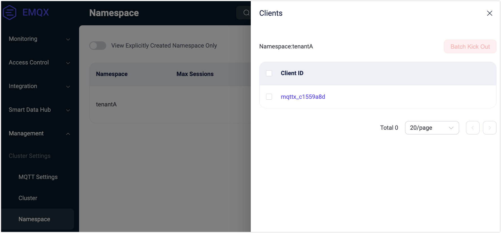
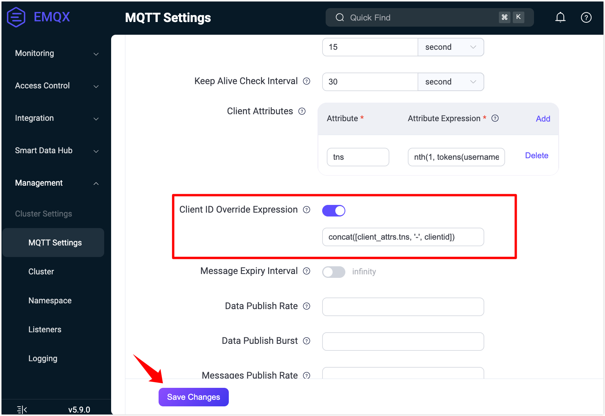

# クイックスタート：ネームスペースの体験

このセクションでは、[MQTTXクライアント](https://mqttx.app)を使用してEMQXに接続し、ネームスペース機能のコア機能であるテナント識別、クライアント分離、トピック分離を素早く体験する方法を案内します。

## ネームスペース識別のために `tns` 属性を有効化する

1. まず、`base.hocon` にクライアント属性を設定し、ユーザー名からネームスペース（テナント識別子）を抽出します：

   ```
   mqtt.client_attrs_init = [{expression = "nth(1, tokens(username, '-'))", set_as_attr = tns}]
   ```

   > 例：クライアントがユーザー名 `tenantA-user1` で接続すると、EMQXは `tenantA` をネームスペース（`tns`）として抽出します。

   または、ダッシュボードからも設定可能です：

   

2. MQTTXを使って、テナント `tenantA` をシミュレートするMQTTクライアント接続を作成し、ユーザー名を `tenantA-user1` に設定します。クライアントをEMQXに接続してください。

3. ダッシュボードの **Namespace** ページに移動し、**View Explicitly Created Namespace Only** のトグルをオフにします。自動的に作成されたネームスペース `tenantA` が表示されるはずです。

   **Actions** 列の **Clients** をクリックすると、このネームスペースに接続しているクライアントを確認できます。

   

## ネームスペース分離の設定と検証

1. ネームスペース間でクライアントIDとトピックを分離するために、以下の設定を `base.hocon` に追加します：

   ```
   mqtt.clientid_override = "concat([client_attrs.tns, '-', clientid])"
   listener.tcp.default.mountpoint = "${client_attrs.tns}/"
   ```

   この設定により：

   - クライアントIDにテナントプレフィックスが自動的に付加され、衝突を回避します。
   - トピック名にネームスペースプレフィックスが自動的に付加され、テナント間でトピックレベルの分離が実現します。

   ダッシュボードからも設定可能です：

   

   

2. MQTTXを使って、2つのMQTTクライアント接続を作成し、2つのテナント `tenantA` と `tenantB` をシミュレートします。

   **クライアントA（テナント：tenantA）**：

   | パラメータ | 値               |
   | ---------- | ---------------- |
   | Client ID  | `client1`        |
   | Username   | `tenantA-user1`  |
   | Subscribe  | `test/topic`     |

   **クライアントB（テナント：tenantB）**：

   | パラメータ | 値               |
   | ---------- | ---------------- |
   | Client ID  | `client1`        |
   | Username   | `tenantB-user2`  |
   | Publish    | `test/topic`     |

3. クライアントBでメッセージをパブリッシュし、MQTTXおよびEMQXダッシュボードで結果を確認します：

   - 両クライアントは同じクライアントID（`client1`）を使用していますが、プレフィックスルールにより `tenantA-client1` と `tenantB-client1` として接続され、衝突を回避しています。
   - 両クライアントは同じトピック（`test/topic`）を使用していますが、クライアントAはネームスペースで分離されているため、クライアントBがパブリッシュしたメッセージを**受信しません**。
   - ダッシュボードの **Monitoring** -> **Clients** ページでは：
     - クライアントAのサブスクライブしているトピックは `tenantA/test/topic` と表示されます。
     - クライアントBのパブリッシュしたトピックは `tenantB/test/topic` と表示されます。
