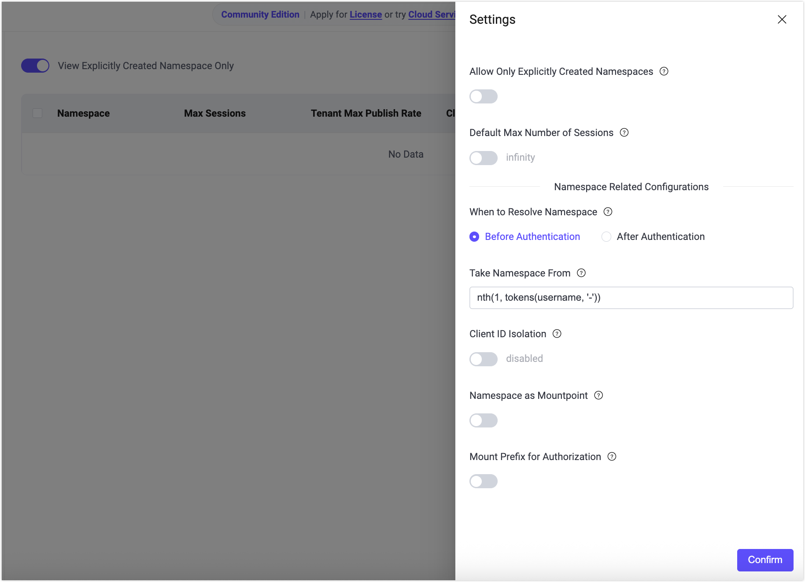
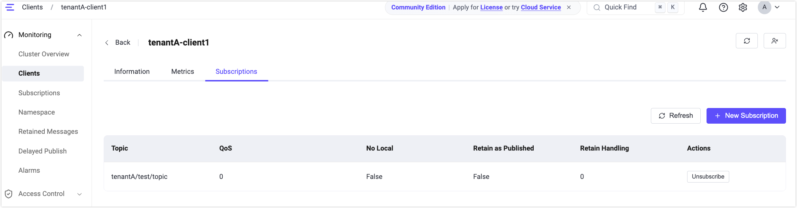

# クイックスタート: ネームスペースの体験

このセクションでは、[MQTTXクライアント](https://mqttx.app) を使用してEMQXに接続し、ネームスペース機能のコア機能であるテナント識別、クライアントおよびトピックの分離、ACL分離を素早く体験する方法を案内します。

## ネームスペースソースの有効化（`tns`属性の生成）

ネームスペースソースを設定することで、EMQXはクライアント接続情報からネームスペースを識別し、クライアントが接続した際に対応するネームスペースを自動的に作成できます。

### 設定ファイルによる有効化

`base.hocon` に以下の設定を追加し、ユーザー名からネームスペース識別子を抽出します。

```
mqtt.client_attrs_init = [
  { expression = "nth(1, tokens(username, '-'))", set_as_attr = tns }
]
```

**例**

クライアントがユーザー名 `tenantA-user1` で接続すると、EMQXは `tenantA` をネームスペース識別子として抽出します。

### ダッシュボードによる有効化

ダッシュボードでもネームスペースソースを設定できます。

1. **管理** -> **ネームスペース** -> **設定** に移動します。

2. **ネームスペースを解決するタイミング** はデフォルトの **認証前** のままにします。

3. **ネームスペースを取得する場所** に以下の式を入力します。

   ```
   nth(1, tokens(username, '-'))
   ```

4. **確認** をクリックして設定を保存します。



### ネームスペースの自動作成を確認する

1. MQTTXを使い、テナント `tenantA` を模擬したMQTTクライアント接続を作成します。

   - ユーザー名：`tenantA-user1`
   - EMQXに接続します。

2. **ネームスペース** ページで **明示的に作成されたネームスペースのみ表示** を無効にします。

3. ネームスペース `tenantA` が自動的に作成されていることを確認します。

4. **操作** 列の **クライアント** をクリックし、このネームスペースに接続しているクライアントを表示します。

   

## ネームスペース分離の設定と確認

### クライアントIDおよびトピックの分離を有効化

異なるネームスペース間でクライアントIDとトピックを分離するには、グローバルネームスペース設定で該当オプションを有効にする必要があります。

#### 設定ファイルによる有効化

`base.hocon` に以下の設定を追加します。

```hocon
mqtt.clientid_override = "concat([client_attrs.tns, '-', clientid])"
mqtt.namespace_as_mountpoint = true
```

これらの設定により：

- クライアントIDにネームスペースのプレフィックスが自動付与され、ネームスペース間のクライアントID競合を防止します。
- ブローカー内部でトピックに `{namespace}/` プレフィックスが自動付与され、ネームスペース単位でのトピック分離を実現します。

#### ダッシュボードによる有効化

1. ダッシュボードで **管理** -> **ネームスペース** -> **設定** に移動します。

2. 以下のオプションを有効にします。

   - **クライアントID分離**（デフォルト値は `concat([client_attrs.tns, '-', clientid])`）
   - **ネームスペースをマウントポイントとして使用**

3. **確認** をクリックして設定を保存します。

### クライアントおよびトピック分離の確認

1. MQTTXを使い、2つのテナント `tenantA` と `tenantB` を模擬したMQTTクライアント接続を作成します。

   **クライアントA（テナント：tenantA）**：

   | パラメータ | 値               |
   | ---------- | ---------------- |
   | クライアントID | `client1`       |
   | ユーザー名   | `tenantA-user1`  |
   | サブスクライブ | `test/topic`    |

   **クライアントB（テナント：tenantB）**：

   | パラメータ | 値               |
   | ---------- | ---------------- |
   | クライアントID | `client1`       |
   | ユーザー名   | `tenantB-user2`  |
   | パブリッシュ | `test/topic`    |

2. クライアントBでメッセージをパブリッシュします。MQTTXおよびEMQXダッシュボードで結果を確認します。

   - 両クライアントは同じクライアントID（`client1`）を使用していますが、プレフィックスルールにより `tenantA-client1` と `tenantB-client1` として接続され、競合を回避しています。
   - 両クライアントは同じトピック（`test/topic`）を使用していますが、ネームスペースで分離されているため、クライアントAはクライアントBがパブリッシュしたメッセージを**受信しません**。

3. **モニタリング** -> **クライアント** ページで以下を確認します。

   - クライアントAのサブスクライブトピックは `tenantA/test/topic` として表示されます。
   - クライアントBのパブリッシュトピックは `tenantB/test/topic` として表示されます。




## マウントポイントベースのACLチェックを有効化

デフォルトでは後方互換性を維持するため、認可（ACL）チェックはトピックプレフィックス（マウントポイント）を含みません。つまり、認可ルールは名前空間付きトピック（例：`tenantA/test/topic`）ではなく、元のトピック名（例：`test/topic`）に対してマッチングされます。

EMQX 6.1以降では、トピックプレフィックスを含む認可チェックを有効にし、ネームスペース単位のACL分離を強制できます。

### 設定ファイルによる有効化

`base.hocon` に以下の設定を追加します。

```hocon
authorization.include_mountpoint = true
```

### ダッシュボードによる有効化

1. ダッシュボードで **管理** -> **ネームスペース** -> **設定** または **アクセス制御** -> **クライアント認可** -> **設定** に移動します。

2. **認可にマウントプレフィックスを含める** を有効にします。

3. 設定を保存します。

::: tip 補足

`authorization.include_mountpoint = true` を有効にすると、すべての認可ルールはトピックマッチングパターンにトピックプレフィックスを含める必要があります。

例えば、クライアントがトピックプレフィックス `tenantA/` を持つリスナー経由で接続し、`test/topic` をサブスクライブする場合、対応する認可ルールは `tenantA/test/topic` として設定する必要があります。

:::
