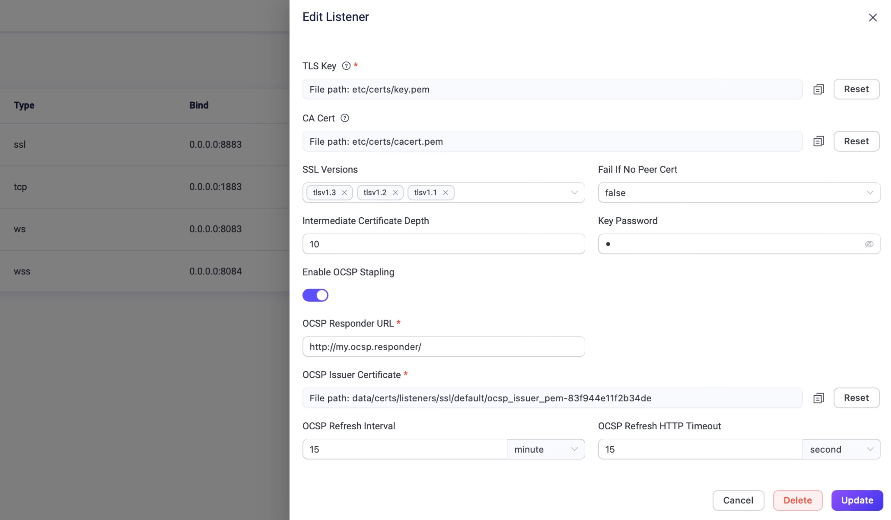

# OCSP Stapling

OCSP（Online Certificate Status Protocol）は、SSL/TLS証明書の失効状況を取得するためのインターネットプロトコルで、安全な通信を確保します。EMQXはIoTアプリケーションにおける主要なMQTTブローカーとして、セキュリティを重視しています。EMQX Enterprise v5.0.3以降では、MQTTのSSLリスナーに対してOCSP Staplingをサポートし、セキュリティを強化しています。

注意：QUICリスナーのSecure WebSocketは現時点でサポートされていません。

リスナーでOCSP Staplingを有効にするには、リスナー設定内の該当オプションを有効化し、必要なOCSP発行者証明書およびOCSPレスポンダーURLを指定します。EMQXは自身のサーバー証明書に対するOCSPレスポンスを取得してキャッシュし、安全かつ効率的なSSL/TLS接続を実現します。

EMQXはダッシュボードおよび設定ファイルの両方からSSLリスナーに対してOCSPを有効化することが可能です。

::: tip 前提条件

OCSP発行者証明書は設定前に準備しておいてください。

:::

## ダッシュボードでの設定

EMQXダッシュボードで、**管理** -> **リスナー** に移動し、**リスナー**ページを開きます。デフォルトのSSLリスナーでOCSP機能を有効にするには、その名前をクリックして**リスナー編集**ページを開きます。右側に表示されるダイアログの下部までスクロールし、**OCSP Staplingを有効にする**のトグルスイッチを見つけてください。



以下の項目を設定します：

- **OCSPレスポンダーURL**：OCSPレスポンダーサービスのURLを入力します。このURLはSSL/TLS証明書のAuthority Information Access（AIA）拡張に記載されています。
- **OCSP発行者証明書**：SSL/TLS証明書を発行した認証局（CA）の証明書を設定します。EMQXはこの証明書を使ってOCSPレスポンスの正当性を検証します。
- **OCSP更新間隔**：EMQXが新しいOCSPレスポンスを取得する間隔を設定します。デフォルトは5分です。
- **OCSP更新HTTPタイムアウト**：EMQXがOCSPリクエストの失敗と判断するまでのタイムアウト時間を設定します。デフォルトは15秒です。

設定後、**更新**をクリックして変更を確定してください。

## 設定ファイルでの設定

EMQXは設定ファイル`base.hocon`を通じてOCSP Staplingを有効化することも可能です。

この機能を有効にするには、設定ファイルの末尾に該当の設定項目を追加してください。変更を反映させるためにEMQXを再起動する必要があります。

**設定例**：

```hcl
listeners.ssl.default {
  bind = "0.0.0.0:8883"
  ssl_options {
    keyfile = "/etc/emqx/certs/server.key"
    certfile = "/etc/emqx/certs/server.pem"
    cacertfile = "/etc/emqx/certs/ca.pem"
    ocsp {
      enable_ocsp_stapling = true
      issuer_pem = "/etc/emqx/certs/ocsp-issuer.pem"
      responder_url = "http://ocsp.responder.com:9877"
      refresh_interval = 15m
      refresh_http_timeout = 15s
    }
  }
}
```

上記の証明書および秘密鍵のパスは、ご自身の環境に合わせて変更し、OCSPレスポンダーURLも適切に設定してください。
