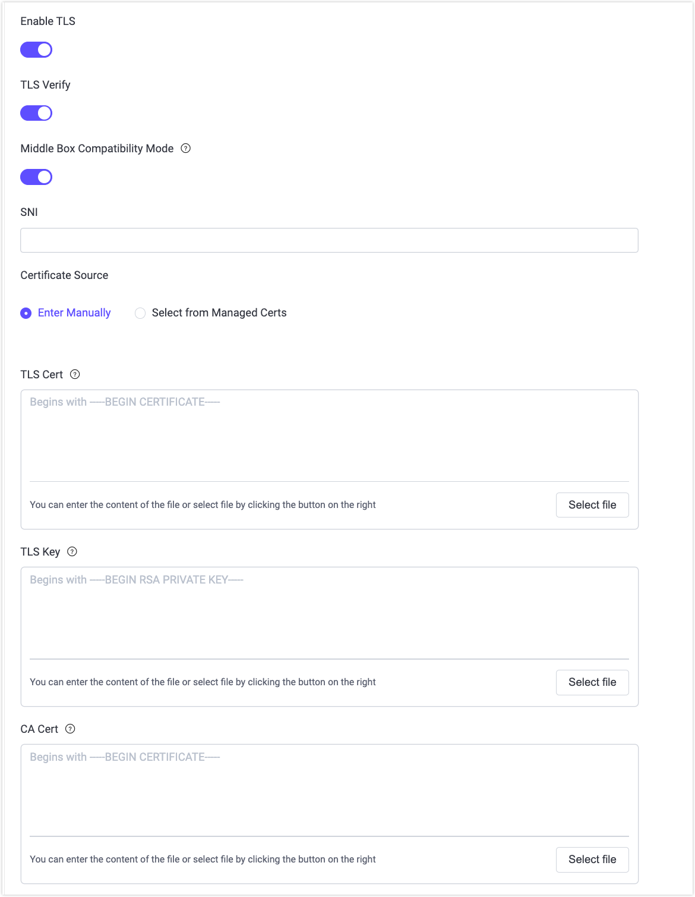

# ネットワークとTLS

IoTシナリオにおけるエンドツーエンドの暗号化通信では、セキュリティが不可欠です。Secure Sockets Layer（SSL）およびTransport Layer Security（TLS）プロトコルは、ネットワーク通信においてデータ伝送の機密性を確保し、攻撃者による傍受や改ざんを防ぐために広く採用されています。SSL/TLS暗号化機能はトランスポート層でネットワーク接続を暗号化し、デジタル証明書を用いて通信当事者の認証と安全な通信チャネルの確立を行います。

EMQXは以下の場合にSSLおよびTLS暗号化プロトコルを採用し、安全なネットワーク通信を実現しています。

- MQTTクライアントとEMQX間の接続確立時
- データベースなど外部リソースへの接続時
- クラスター内の異なるEMQXノード間の通信時

EMQXは一方向／双方向認証およびX.509証明書認証を含む、SSL/TLS機能を包括的にサポートしています。

## クライアント接続のTLS

EMQXはMQTTクライアント接続に対してSSL/TLS暗号化をサポートし、クライアントとブローカー間の安全で暗号化された通信を可能にします。TLSリスナーは、セキュリティ要件に応じて一方向認証（サーバー認証のみ）または双方向認証（mTLS）をサポートするよう設定できます。

本章の[Enable SSL/TLS Connections](./emqx-mqtt-tls.md)では、Dashboardや設定ファイルを用いたMQTTクライアント向けTLSリスナーの設定手順を詳しく解説しています。

### 証明書管理

EMQXはSSL/TLSの証明書取得、保存、管理、リスナーやその他TLS対応コンポーネント間での再利用を統一的に管理する証明書管理モデルを提供しています。これは従来のパスベース証明書だけでなく、ライフサイクルを集中管理するマネージド証明書も含みます。

EMQXにおける証明書の概念やワークフローの全体像については、[SSL/TLS Certificates](./tls-certificate.md)をご参照ください。

### 証明書検証と失効確認

TLSセキュリティをさらに強化するため、EMQXは証明書検証および失効確認をサポートしています。

- **CRLチェック**：証明書失効リストを用いて証明書が失効していないか検証します。詳細は[CRL Check](./crl.md)をご覧ください。
- **OCSP Stapling**：オンライン証明書状態プロトコルを用いて証明書の失効状況を確認します。詳細は[OCSP Stapling](./ocsp.md)をご覧ください。

これらの機能はTLSリスナー設定時に有効化でき、侵害された証明書の使用を防止します。

### クライアント側TLSの例

[Client TLS](./mqtt-client-tls.md)では、SSL/TLSを用いてEMQXに安全に接続するためのMQTTクライアントコード例やサンプルプロジェクトを提供しています。クライアント証明書やTLSオプションの設定方法も実践的に解説しています。

## 外部リソースアクセスのTLS

EMQXはHTTPベースの認証サービス、データベース、その他のデータ統合サービスなど外部リソースへのアクセス時にもSSL/TLS暗号化をサポートしています。対応機能の設定時にDashboard上で**Enable TLS**オプションを有効にすることでTLSを利用可能です。

### DashboardでのTLS設定オプション

TLSを有効化すると、以下のオプションが利用可能になります。

- **TLS Verify**：外部リソースのサーバー証明書を検証するかどうかを制御します。有効にするとEMQXはサーバーの証明書チェーンを検証します。
- **Middle Box Compatibility Mode**：TLS 1.3接続に対する互換モードを有効にします。一部のネットワークミドルボックスが標準のTLS 1.3ハンドシェイクを正しく処理できない場合に、TLS 1.2に似たハンドシェイクに適応し接続成功率を向上させます。
- **SNI**：Server Name Indication。TLSハンドシェイク時にサーバードメイン名と証明書が一致するか検証します。空欄の場合はホスト名検証を行いません。
- **Certificate Source**：クライアント証明書が必要な場合の提供方法を指定します。
  - **Enter Manually**：証明書内容やファイルを直接入力。
  - **Select from Managed Certs**：EMQXが集中管理する証明書バンドルから選択（EMQX 6.1以降）。証明書の再利用やローテーションが容易になります。証明書バンドルの作成・管理については[Managed Certificates](./tls-certificate.md#managed-certificates)をご覧ください。
- **TLS Cert / TLS Key**：外部サーバーがクライアント証明書を検証する（相互TLS）場合に必要です。
- **CA Cert**：**TLS Verify**が有効な場合に、サーバー証明書の検証に使用します。



### 設定ファイルによるTLS設定

外部リソースアクセスのTLSは設定ファイルの`ssl`オプションを設定することでも有効化できます。例えばHTTPベース認証バックエンドの設定例は以下の通りです。

```hocon
authentication {
  url = "https://127.0.0.1:8080"
  backend = "http"

  ...

  ssl {
    enable = true
    cacertfile = "etc/certs/cacert.pem"
    certfile = "etc/certs/cert.pem"
    keyfile = "etc/certs/key.pem"
    verify = verify_peer
  }
}
```

**SSL設定項目の説明**：

- **`enable`**：外部リソースへのアウトバウンド接続でSSL/TLSを有効にします。
- **`cacertfile`**：HTTPクライアントがHTTPサーバーの正当性を検証するために使用する信頼済み認証局（CA）証明書をPEM形式で格納したファイルのパス。
- **`certfile`**：クライアントが提示するSSL/TLS証明書チェーンをPEM形式で格納したファイルのパス。ルートCAから直接発行されていない場合は、中間CA証明書をクライアント証明書の後に連結して完全なチェーンを形成します。
- **`keyfile`**：`certfile`で指定したクライアント証明書に対応するPEM形式の秘密鍵ファイルのパス。
- **`verify`**：サーバー証明書検証の挙動を制御します。
  - **`verify_peer`**：サーバー証明書チェーンを検証します。
  - **`verify_none`**：サーバー証明書を検証しません。

マネージド証明書は設定ファイルでもリスナーと同様の証明書管理モデルに従って参照可能です。設定オプションの詳細は[Enable SSL/TLS with One-Way Authentication](./emqx-mqtt-tls.md#enable-via-configuration-file)をご参照ください。

## ノード間通信のTLS

クラスター接続におけるSSL/TLSの有効化手順は本章では扱っていません。詳細は[Cluster Security](../cluster/security.md)をご覧ください。

## IPv6サポート

EMQXはクライアント接続、ダッシュボード、ノード間クラスター通信、外部サービスへのアウトバウンド接続においてIPv6を完全にサポートしています。設定の詳細は[IPv6](./ipv6.md)をご参照ください。
