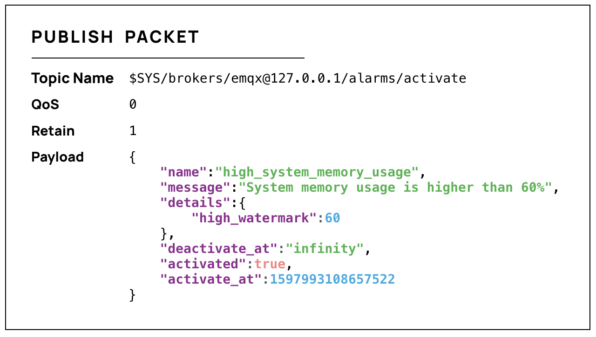
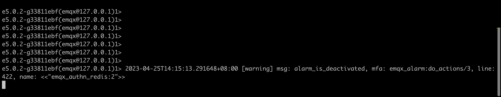
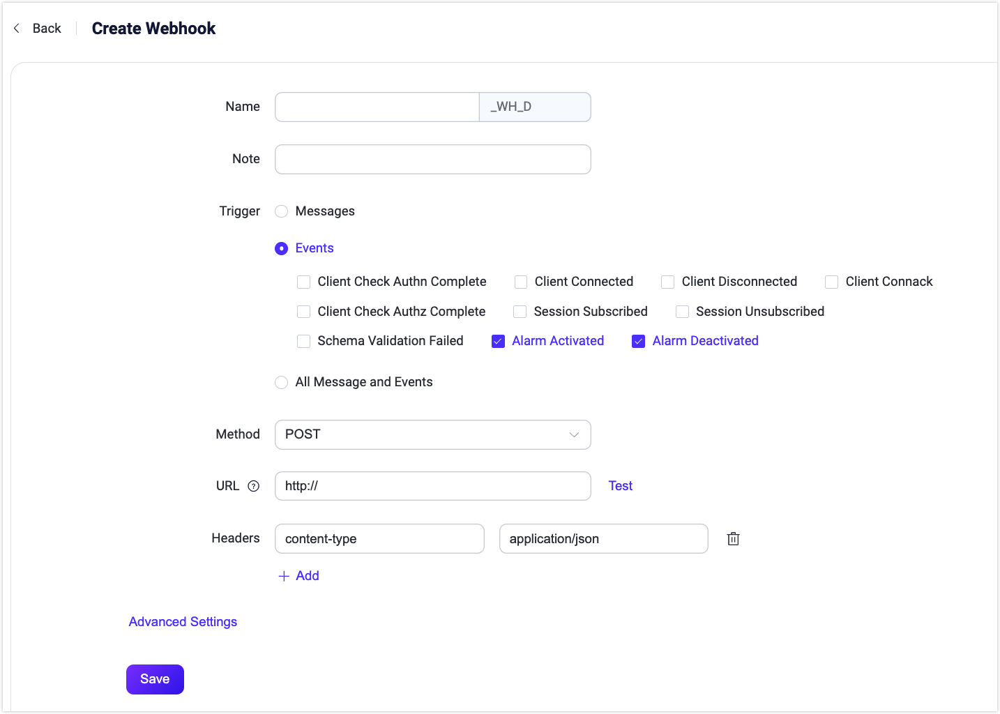
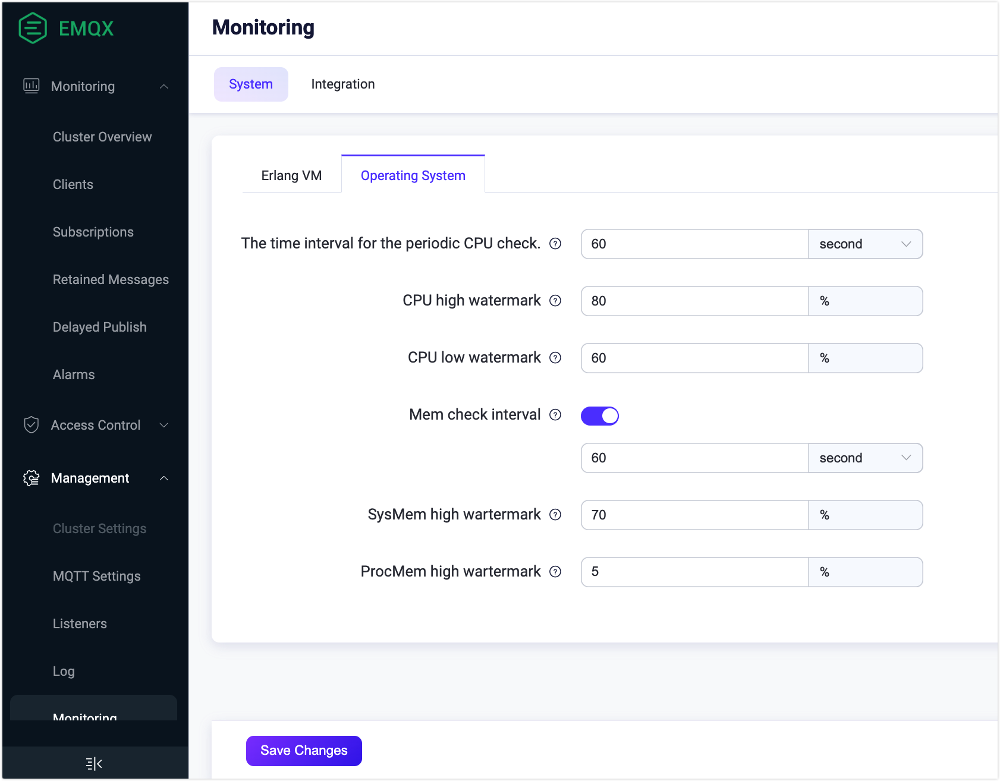

# アラーム

EMQX は、CPU 使用率、システムおよびプロセスメモリ使用率、プロセス数、ルールエンジンのリソース状態、クラスターのパーティションおよび修復など、内部状態の変化を監視するための組み込みの監視およびアラーム機能を提供しています。EMQX は、これらの変化が閾値を超えたり期待値から逸脱した場合にアラームを発動・記録し、状態が復旧するとリストから削除します。

本ページでは、EMQX が提供するアラーム情報、詳細なアラーム情報の取得および確認方法、アラーム設定および閾値の設定方法について紹介します。監視およびアラーム機能により、運用中の潜在的な問題を通知し続けます。適切な閾値を設定してアラームを構成することで、EMQX の安全性、安定性、信頼性を確保できます。

## アラーム一覧

以下の表は、システム監視中に潜在的な問題を示すために発動可能なアラームを示しています。

::: tip

アラームは、システムへの影響度や重大度に応じて3つのレベルに分かれます。

- **Error（エラー）**: ユーザー設定によるエラー。クライアントはエラーを認識し、再試行可能です。

- **Warning（警告）**: 時折発生するエラー。頻発する場合は注意が必要です。

- **Critical（重大）**: クライアントとサーバー間での不可逆的なデータ損失が発生し、通信や業務に支障をきたします。

これらのレベルは開発視点で定義された推奨値であり、業務要件に応じて独自のアラームレベルを定義可能です。

:::

| **アラーム**                          | レベル     | 説明                                                         | **詳細**                                    | **閾値**                                                    |
| :----------------------------------- | ---------- | :------------------------------------------------------------ | :------------------------------------------- | :----------------------------------------------------------- |
| high_system_memory_usage             | Warning    | システムメモリ使用率が高い                                    | システムメモリ使用率が約 ~p% を超えている     | `os_mon.sysmem_high_watermark = 70%`                         |
| high_process_memory_usage            | Warning    | 単一の Erlang プロセスのメモリ使用率が高い（システムメモリ使用率の割合） | プロセスメモリ使用率が約 ~p% を超えている     | `os_mon.procmem_high_watermark = 5%`                         |
| high_cpu_usage                      | Warning    | CPU 使用率が高い                                              | 約 ~p% の CPU 使用率                         | `os_mon.cpu_high_watermark = 80%` `os_mon.cpu_low_watermark = 60%` |
| too_many_processes                  | Warning    | プロセス数が多すぎる                                         | 約 ~p% のプロセス使用率                       | `vm_mon.process_high_watermark = 80%` `vm_mon.process_low_watermark = 60%` |
| license_quota                      | Warning    | ライセンスの接続数がクォータを超過                            | ライセンス：接続数が % を超過                  | `license.connection_high_watermark_alarm = 80%` `license.connection_low_watermark_alarm = 75%` |
| license_expiry                     | Critical   | ライセンスが期限切れ                                          | ライセンスは % に期限切れとなる予定            | -                                                            |
| mnesia_transaction_manager_overload | Warning  | mnesia が過負荷状態。メールボックスサイズ: N                 | メールボックスサイズ = N                       | `sysmon.mnesia_tm_mailbox_threshold = 500`                   |
| broker_pool_overload               | Warning    | ブローカープールが過負荷状態。メールボックスサイズ: N         | メールボックスサイズ = N                       | `sysmon.broker_pool_mailbox_threshold = 500`                 |
| partition                        | Critical   | ノードでパーティションが発生                                  | ノード ~s でパーティションが発生               | -                                                            |
| resource                         | Critical   | リソースが切断されている                                     | リソース ~s(~s) がダウンしている               | -                                                            |
| conn_congestion                  | Critical   | 接続プロセスの輻輳                                          | 接続が輻輳している                             | -                                                            |

## アラームの取得

EMQX では、アラームの取得および詳細情報の確認に複数の方法を提供しています。1つは EMQX ダッシュボードを使い、アクティブおよび履歴のアラームをユーザーフレンドリーなインターフェースで確認する方法です。ここは発動したアラームの概要を簡単に把握できる中央拠点となります。

さらに、MQTT のシステムトピックをサブスクライブしてリアルタイムにシステムアラームの通知を受け取る方法もあります。Webhook 統合を使えば、アラームイベントを外部の HTTP サービスに送信して処理できます。アラームはログや REST API からも取得可能です。

### ダッシュボードでアラームを確認する

EMQX ダッシュボードで、**Monitoring** -> **Alarms** をクリックします。次に、**Active** または **History** タブを選択すると、現在アクティブなアラームや過去のアラーム一覧が表示されます。

### システムトピックでアラームを取得する

アラームが発動または解除されると、EMQX は MQTT メッセージをシステムトピック `$SYS/brokers/<Node>/alarms/activate` または `$SYS/brokers/<Node>/alarms/deactivate` にパブリッシュします。ユーザーはこれらのトピックをサブスクライブしてアラーム通知を受け取れます。

アラーム通知メッセージのペイロードは JSON 形式で、以下のフィールドを含みます。

| フィールド名       | 型               | 説明                                                         |
| ------------------ | ---------------- | ------------------------------------------------------------ |
| `name`             | string           | アラーム名                                                   |
| `details`          | object           | アラームの詳細                                               |
| `message`          | string           | 人間が読みやすいアラームの説明                              |
| `activate_at`      | integer          | アラーム発動時刻をマイクロ秒単位の UNIX タイムスタンプで表現 |
| `deactivate_at`    | integer / string | アラーム解除時刻をマイクロ秒単位の UNIX タイムスタンプで表現。アクティブなアラームの場合は `infinity`。 |
| `activated`        | boolean          | アラームが発動中かどうか                                    |

例として、システムメモリ使用率が高いアラームの場合、以下のようなメッセージを受け取ります。

同じ種類のアラームは繰り返し発報されません。例えば高 CPU 使用率のアラームが発動中は、同じアラームは再度発生しません。監視対象の値が正常に戻ると自動的にアラームは解除されますし、手動で解除することも可能です。

### ログからアラームを取得する

アラームの発動および解除はログ（コンソールまたはファイル）に記録されます。メッセージ送信やイベント処理の失敗時に詳細情報をログに残せるほか、ログ解析を通じてアラートを検知することも可能です。以下の例は、ログに出力された詳細なアラーム情報を示しています。ログレベルは `warning` で、`msg` フィールドはそれぞれ `alarm_is_activated` と `alarm_is_deactivated` です。

### REST API でアラームを取得する

API を通じてアラームの照会および管理が可能です。UI の左側ナビゲーションメニューで **Alarms** をクリックすると、この API リクエストを実行できます。EMQX API の利用方法は [REST API](../api.md) を参照してください。

### Webhook 統合でアラームイベントを送信する

EMQX バージョン 5.8.5 以降、ルールエンジンは以下の2つの新しいアラームイベントをサポートしています。

- [$events/sys/alarm_activated](../../develop/data-integration/rule-sql-events-and-fields.md#system-alarm-activated-event-events-sys-alarm-activated)
- [$events/sys/alarm_deactivated](../../develop/data-integration/rule-sql-events-and-fields.md#system-alarm-deactivated-event-events-sys-alarm-deactivated)

これらのイベントにより、Webhook 統合を通じて外部 HTTP サービスにアラームの発動・解除通知を送信できます。

Webhook 統合の設定手順は以下の通りです。

1. EMQX ダッシュボードで **Monitoring** -> **Alarms** に移動します。
2. 右上の **Set Up Webhook** ボタンをクリックし、Webhook 統合設定ページを開きます。
3. Webhook 統合の名前と任意のメモを入力します。**Trigger** フィールドには `Alarm Activated` と `Alarm Deactivated` が事前選択されています。
4. 通知を送信したい Webhook URL を入力します。
5. 詳細な設定は [Create Webhook](../../develop/data-integration/webhook.md) を参照してください。
6. 設定が完了したら **Save** をクリックします。

## アラーム設定

アラーム設定は、アラームの表示・保存方法を決めるアラーム設定と、アラームを発動させる閾値を定めるアラーム閾値の設定に分かれます。これにより、業務要件に合わせてアラームの挙動をカスタマイズ可能です。

### アラームの動作設定

アラームの設定は、設定ファイル内の設定項目を修正することでのみ行えます。以下の表はアラーム設定に利用可能な設定項目を示しています。

| 設定項目             | 説明                                                                                      | デフォルト値           | 選択可能な値       |
| -------------------- | ----------------------------------------------------------------------------------------- | ---------------------- | ------------------ |
| alarm.actions        | アラーム発動・解除時にログ（コンソールまたはファイル）への書き込みおよびシステムトピック `$SYS/brokers/<node_name>/alarms/activate` と `$SYS/brokers/<node_name>/alarms/deactivate` への MQTT メッセージのパブリッシュを行うアクション。 | `["log", "publish"]`   | -                  |
| alarm.size_limit     | 非アクティブなアラームの履歴として保持する最大件数。この上限を超えると最も古いアラームから削除されます。 | `1000`                 | `1-3000`           |
| alarm.validity_period | 非アクティブなアラームの保持期間。アラームは解除後すぐに削除されず、一定期間経過後に削除されます。 | `24h`                  | -                  |

### ダッシュボードでアラーム閾値を設定する

アラーム閾値は EMQX ダッシュボードで設定可能です。閾値設定用の **Monitoring** ページを開く方法は2通りあります。

1. **Alarms** ページで **Setting** ボタンをクリックすると **Monitoring** ページに遷移します。
2. 左側ナビゲーションメニューから **Management** -> **Monitoring** をクリックします。

**Monitoring** -> **System** タブの **Erlang VM** タブでは、Erlang 仮想マシンのシステムパフォーマンスに関する以下の項目を設定できます。

- **Process limit check interval**: プロセス数の定期チェック間隔（秒）。デフォルトは `30` 秒です。
- **Process high watermark**: ローカルノードに同時存在可能なプロセス数の閾値。割合がこの値を超えるとアラームが発動します。デフォルトは `80` パーセントです。
- **Process low watermark**: ローカルノードに同時存在可能なプロセス数の閾値。割合がこの値まで下がるとアラームが解除されます。デフォルトは `60` パーセントです。
- **Enable Long GC monitoring**: デフォルトは無効。有効にすると、Erlang プロセスが長時間ガベージコレクションを行った場合に警告レベルのログ `long_gc` を出力し、システムトピック `$SYS/sysmon/long_gc` に MQTT メッセージをパブリッシュします。
- **Enable Long Schedule monitoring**: デフォルトは有効。Erlang VM が長時間スケジュールされたタスクを検知すると警告レベルのログ `long_schedule` を出力します。タスクの適切なスケジュール時間をテキストボックスで設定可能です。デフォルトは `240` ミリ秒です。
- **Enable Large Heap monitoring**: デフォルトは有効。Erlang プロセスが大きなヒープ領域を消費した場合に警告レベルのログ `large_heap` を出力し、システムトピック `$SYS/sysmon/large_heap` に MQTT メッセージをパブリッシュします。ヒープ領域のバイトサイズ上限をテキストボックスで設定可能です。デフォルトは `32` MB です。
- **Enable Busy Distribution Port monitoring**: デフォルトは有効。クラスター内の他ノードと通信するための RPC 接続が過負荷状態になると、警告レベルのログ `busy_dis_port` を出力し、システムトピック `$SYS/sysmon/busy_dist_port` に MQTT メッセージをパブリッシュします。
- **Enable Busy Port monitoring**: デフォルトは有効。ポートが過負荷状態になると、警告レベルのログ `busy_port` を出力し、システムトピック `$SYS/sysmon/busy_port` に MQTT メッセージをパブリッシュします。

設定完了後は **Save Changes** をクリックしてください。

**Operating System** タブでは、システムパフォーマンスに関する以下の項目を設定できます。

- **The time interval of the periodic CPU check**: CPU 使用率の定期チェック間隔（秒）。デフォルトは `60` 秒です。
- **CPU high watermark**: システム CPU 使用率の閾値。割合がこの値を超えると対応するアラームが発動します。デフォルトは `80` パーセントです。
- **CPU low watermark**: システム CPU 使用率の閾値。割合がこの値まで下がると対応するアラームが解除されます。デフォルトは `60` パーセントです。
- **Mem check interval**: メモリ使用率の定期チェック間隔（秒）。デフォルトは `60` 秒で有効です。
- **SysMem high watermark**: システムメモリ使用率の閾値。割合がこの値を超えると対応するアラームが発動します。デフォルトは `70%` です。
- **ProcMem high watermark**: 単一の Erlang プロセスによるメモリ使用率の閾値。割合がこの値を超えると対応するアラームが発動します。デフォルトは `5%` です。

設定完了後は **Save Changes** をクリックしてください。

### 設定項目でアラーム閾値を設定する

設定ファイル内のアラーム閾値に関する設定項目を修正しても、アラーム閾値を設定できます。現在修正可能な設定項目は以下の通りです。

| 設定項目                          | 説明                                                                                      | デフォルト値     |
| --------------------------------- | ----------------------------------------------------------------------------------------- | --------------- |
| sysmon.os.cpu_check_interval      | CPU 使用率のチェック間隔                                                                   | `60s`           |
| sysmon.os.cpu_high_watermark      | CPU 使用率の高水位閾値。アラーム発動の閾値。                                              | `80%`           |
| sysmon.os.cpu_low_watermark       | CPU 使用率の低水位閾値。アラーム解除の閾値。                                              | `60%`           |
| sysmon.os.mem_check_interval      | メモリ使用率のチェック間隔                                                                | `60s`           |
| sysmon.os.sysmem_high_watermark   | システムメモリ使用率の高水位閾値。総メモリ使用率がこの値に達するとアラームが発動します。    | `70%`           |
| sysmon.os.procmem_high_watermark  | プロセスメモリ使用率の高水位閾値。単一プロセスのメモリ使用率がこの値に達するとアラームが発動します。 | `5%`            |
| sysmonn.vm.process_check_interval | プロセス数のチェック間隔                                                                  | `30s`           |
| sysmon.vm.process_high_watermark  | プロセス占有率の高水位閾値。作成済みプロセス数/最大数の比率で測定。閾値到達でアラーム発動。 | `80%`           |
| sysmon.vm.process_low_watermark   | プロセス占有率の低水位閾値。閾値以下でアラーム解除。                                      | `60%`           |
| sysmonn.vm.long_gc                | Long GC 監視を有効にするかどうか                                                         | `disabled`      |
| sysmon.vm.long_schedule           | Long Schedule 監視を有効にするかどうか                                                   | `disabled`      |
| sysmon.vm.large_heap              | Large Heap 監視を有効にするかどうか                                                      | `disabled`      |
| sysmon.vm.busy_dist_port          | Busy Distribution Port 監視を有効にするかどうか                                         | `true`          |
| sysmon.vm.busy_port               | Busy Port 監視を有効にするかどうか                                                      | `true`          |
| sysmonn.top.num_items             | 監視グループごとのトッププロセス数                                                      | `10`            |
| sysmon.top.sample_interlval       | トッププロセスのチェック間隔                                                             | `2s`            |
| sysmon.top.max_procs              | VM 内のプロセス数がこの値を超えた場合、データ収集を停止                                  | `1000000`       |

EMQX Enterprise では、ライセンスの期限が30日未満になるか、接続数が高水位閾値を超えるとアラームを発動します。接続数の高水位・低水位閾値は、設定ファイル内の以下の設定項目を修正して調整可能です。ライセンス設定の詳細は [License](../configuration/license.md) を参照してください。

| 設定項目                              | 説明                                                                                      | デフォルト値     |
| ------------------------------------- | ----------------------------------------------------------------------------------------- | --------------- |
| license.connection_high_watermark_alarm | ライセンスがサポートする最大接続数の高水位閾値。アクティブ接続数/最大接続数の比率で測定。閾値到達でアラーム発動。 | `80%`           |
| license.connection_low_watermark_alarm  | ライセンスがサポートする最大接続数の低水位閾値。閾値以下でアラーム解除。                   | `75%`           |
