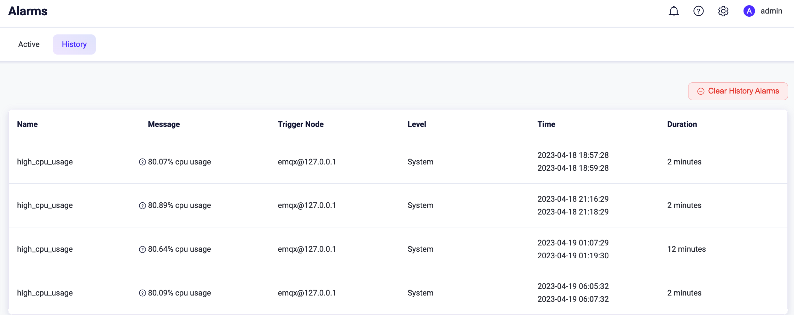
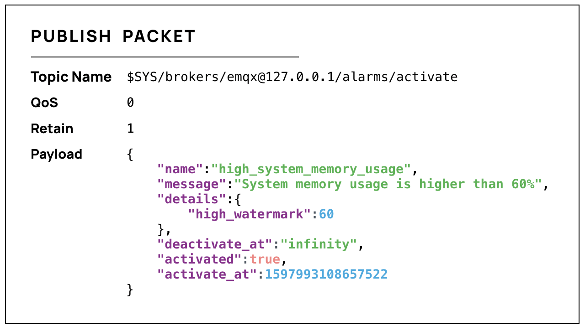
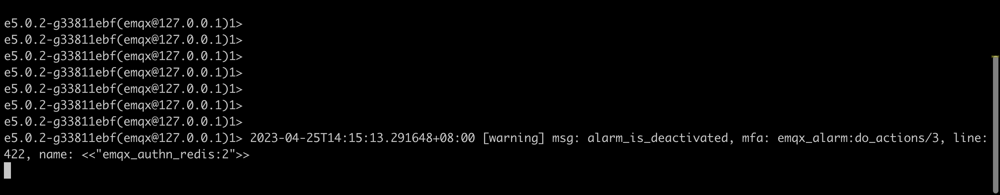
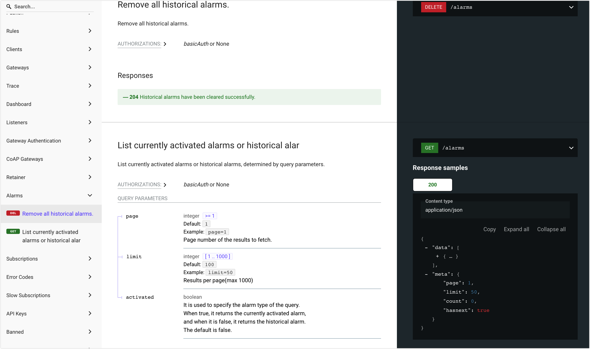
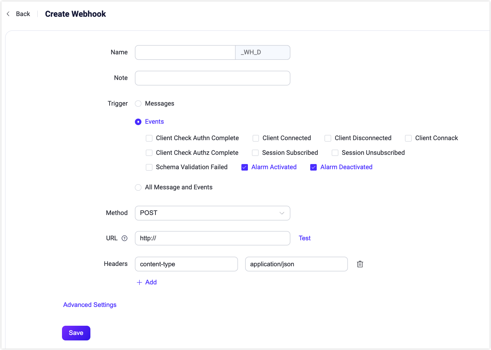
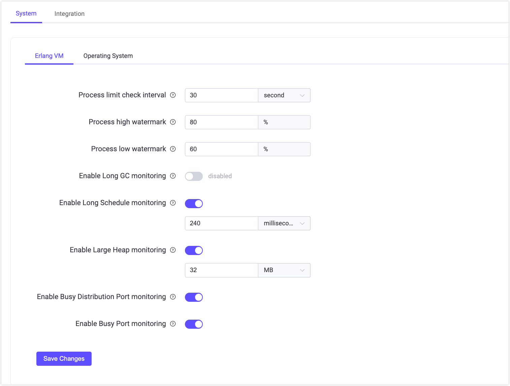
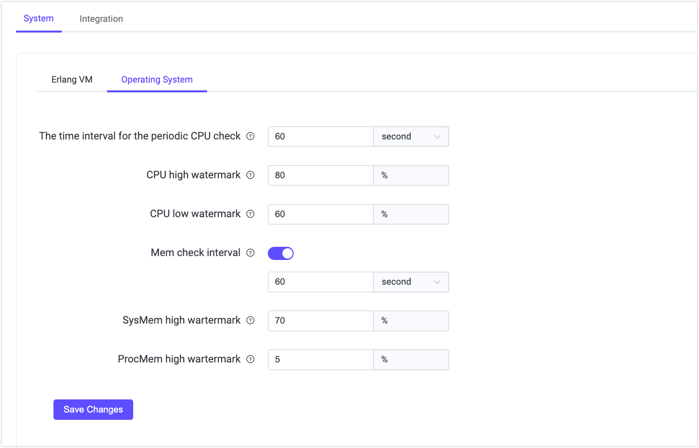

# アラーム

EMQX は、CPU 使用率、システムおよびプロセスメモリ使用率、プロセス数、ルールエンジンのリソース状態、クラスターのパーティションおよび修復など、内部状態の変化を監視するための組み込みの監視およびアラーム機能を提供しています。EMQX は、これらの変化がしきい値を超えたり期待値から逸脱した場合にアラームをトリガーして記録し、状態が復旧するとリストから削除します。

本ページでは、EMQX が提供するアラーム情報の概要、詳細なアラーム情報の取得および確認方法、さらに EMQX におけるアラーム設定およびしきい値の設定方法について紹介します。監視およびアラーム機能により、運用中の潜在的な問題を通知し、適切なしきい値を設定することで、EMQX の安全性、安定性、信頼性を維持できます。

## アラーム一覧

以下の表は、システム監視中に潜在的な問題を示すためにトリガーされる可能性のあるアラームの一覧です。

::: tip

アラームはシステムへの影響度や重大度に応じて、3つのレベルに分類されます：

- **Error（エラー）**：ユーザー設定によるエラー。クライアントはエラーを認識しリトライ可能です。

- **Warning（警告）**：断続的なエラーであり、頻発する場合は注意が必要です。

- **Critical（重大）**：クライアントとサーバー間での不可逆的なデータ損失が発生し、通信や業務が中断されます。

これらのレベルは開発視点で定義されており、あくまで推奨です。ビジネスニーズに応じて独自のアラームレベルを定義可能です。

:::

| **アラーム**               | レベル    | 説明                                                        | **詳細**                                    | **しきい値**                                                |
| :------------------------ | -------- | :----------------------------------------------------------- | :------------------------------------------- | :----------------------------------------------------------- |
| high_system_memory_usage  | Warning  | システムメモリ使用率が高すぎる                              | システムメモリ使用率が約 ~p% を超えている    | `os_mon.sysmem_high_watermark = 70%`                         |
| high_process_memory_usage | Warning  | 単一の Erlang プロセスメモリ使用率が高すぎる（システムメモリ使用率の割合） | プロセスメモリ使用率が約 ~p% を超えている    | `os_mon.procmem_high_watermark = 5%`                         |
| high_cpu_usage            | Warning  | CPU 使用率が高すぎる                                        | 約 ~p% の CPU 使用率                         | `os_mon.cpu_high_watermark = 80%` `os_mon.cpu_low_watermark = 60%` |
| too_many_processes        | Warning  | プロセス数が多すぎる                                       | 約 ~p% のプロセス使用率                      | `vm_mon.process_high_watermark = 80%` `vm_mon.process_low_watermark = 60%` |
| license_quota             | Warning  | ライセンスのクォータを超過                                  | ライセンス：接続数が % を超過                 | `license.connection_high_watermark_alarm = 80%` `license.connection_low_watermark_alarm = 75%` |
| license_expiry            | Critical | ライセンスの期限が切れそう、または切れている                | EMQX 6.3.2 以降、アラームメッセージは `The license expires on YYYY-MM-DD.`、`The license expires today, YYYY-MM-DD.`、または `The license expired on YYYY-MM-DD.` となります | 残り30日未満、またはライセンス期限切れ                        |
| license_tps               | Warning  | TPS 使用率がライセンス上限を超過                            | ライセンス：TPS 上限（例：10）を超過          | -                                                            |
| partition                 | Critical | ノードでパーティションが発生                                | ノード ~s でパーティションが発生              | -                                                            |
| resource                  | Critical | リソースが切断されている                                   | リソース ~s(~s) がダウン                      | -                                                            |
| conn_congestion           | Critical | 接続プロセスの輻輳                                       | 接続が輻輳している                            | -                                                            |

## アラームの取得

EMQX は、アラームを取得し詳細情報を確認するための複数の方法を提供しています。1つは EMQX ダッシュボードを利用する方法で、アクティブなアラームおよび履歴アラームをユーザーフレンドリーなインターフェースで閲覧できます。これにより、トリガーされたアラームの概要を一元的に把握できます。

また、MQTT のシステムトピックをサブスクライブすることで、システムアラームのリアルタイム通知を受け取ることも可能です。さらに Webhook 統合を利用すれば、アラームイベントを外部 HTTP サービスに送信して処理できます。アラームはログや REST API からもアクセス可能です。

### ダッシュボードでのアラーム表示

EMQX ダッシュボードで、**Monitoring** -> **Alarms** をクリックします。次に、**Active** タブまたは **History** タブを選択すると、現在アクティブなアラームおよび過去のアラーム一覧が表示されます。

EMQX ダッシュボードでのアラーム管理の詳細は、[Alarms](../dashboard/alarm_dashboard.md) を参照してください。

### システムトピック経由でアラーム取得

アラームがトリガーまたは解除されると、EMQX は MQTT メッセージをシステムトピック `$SYS/brokers/<Node>/alarms/activate` または `$SYS/brokers/<Node>/alarms/deactivate` にパブリッシュします。ユーザーはこれらのトピックをサブスクライブしてアラーム通知を受け取れます。

アラーム通知メッセージのペイロードは JSON 形式で、以下のフィールドを含みます：

| フィールド名         | 型               | 説明                                                        |
| -------------------- | ---------------- | ----------------------------------------------------------- |
| `name`               | string           | アラーム名                                                  |
| `details`            | object           | アラームの詳細                                              |
| `message`            | string           | 人間が読みやすいアラームの説明                              |
| `activate_at`        | integer          | アラームが有効になった時刻をマイクロ秒単位の UNIX タイムスタンプで表現 |
| `deactivate_at`      | integer / string | アラームが無効になった時刻をマイクロ秒単位の UNIX タイムスタンプで表現。有効なアラームの場合は `infinity` となる。 |
| `activated`          | boolean          | アラームが有効かどうか                                      |

高いシステムメモリ使用率のアラームを例にすると、以下のようなアラームメッセージを受け取ります：

同じ種類のアラームは繰り返し報告されません。例えば、高い CPU 使用率のアラームが有効化されると、同じタイプの別のアラームは発生しません。監視対象の指標が正常に戻ると自動的にアラームは解除されるか、手動で解除可能です。

### ログからアラーム取得

アラームの有効化および無効化はログ（コンソールまたはファイル）に記録されます。メッセージ送信やイベント処理で障害が発生した場合、詳細情報がログに記録され、ログ解析を通じてアラートを検知することも可能です。以下の例は、ログに出力された詳細なアラーム情報です：

ログレベルは `warning` で、`msg` フィールドは `alarm_is_activated` および `alarm_is_deactivated` となっています。

### REST API 経由でアラーム取得

API を通じてアラームの照会および管理が可能です。UI の左ナビゲーションメニューで **Alarms** をクリックすると、この API リクエストが実行されます。EMQX API の利用方法は [REST API](../api.md) を参照してください。

### Webhook 統合によるアラームイベント送信

EMQX バージョン 5.8.5 以降、ルールエンジンは以下の2つの新しいアラームイベントをサポートしています：

- [$events/sys/alarm_activated](../../develop/data-integration/rule-sql-events-and-fields.md#system-alarm-activated-event-events-sys-alarm-activated)
- [$events/sys/alarm_deactivated](../../develop/data-integration/rule-sql-events-and-fields.md#system-alarm-deactivated-event-events-sys-alarm-deactivated)

これらのイベントにより、Webhook 統合を通じて外部 HTTP サービスへアラームの発生・解除通知を送信できます。

Webhook 統合の設定手順は以下の通りです：

1. EMQX ダッシュボードで **Monitoring** -> **Alarms** に移動します。
2. 右上の **Set Up Webhook** ボタンをクリックし、Webhook 統合設定ページを開きます。
3. Webhook 統合の名前と任意のメモを入力します。**Trigger** フィールドには `Alarm Activated` と `Alarm Deactivated` があらかじめ選択されています。
4. 通知を送信する Webhook URL を入力します。
5. 詳細な設定オプションは [Create Webhook](../../develop/data-integration/webhook.md) を参照してください。
6. 設定が完了したら **Save** をクリックします。

## アラーム設定

アラーム設定には、アラームの動作設定とアラームしきい値の設定が含まれます。動作設定はアラームメッセージの表示方法や保存方法を決定し、しきい値設定は潜在的な問題を検知してアラームをトリガーする閾値を定義します。これにより、ビジネスニーズに合わせてアラームの動作やしきい値をカスタマイズ可能です。

### アラーム動作設定

アラームの動作設定は、設定ファイル内の設定項目を変更することでのみ行えます。以下の表はアラーム動作設定に利用可能な設定項目です。

| 設定項目              | 説明                                                        | デフォルト値          | 選択可能な値     |
| --------------------- | ------------------------------------------------------------ | -------------------- | --------------- |
| alarm.actions         | アラームが有効化または無効化された際に、ログ（コンソールまたはファイル）への書き込みと、システムトピック `$SYS/brokers/<node_name>/alarms/activate` および `$SYS/brokers/<node_name>/alarms/deactivate` への MQTT メッセージのパブリッシュを行うアクション。 | `["log", "publish"]` | -               |
| alarm.size_limit      | 無効化されたアラームの履歴として保持する最大件数。この上限を超えると、最も古いアラームから削除される。 | `1000`               | `1-3000`        |
| alarm.validity_period | 無効化されたアラームの保持期間。アラームは無効化後すぐに削除されず、一定期間経過後に削除される。 | `24h`                | -               |

### ダッシュボードでのアラームしきい値設定

アラームのしきい値は EMQX ダッシュボードで設定可能です。しきい値設定用の **Monitoring** ページを開く方法は以下の2通りです：

1. **Alarms** ページで **Setting** ボタンをクリックすると、**Monitoring** ページに遷移します。
2. 左ナビゲーションメニューから **Management** -> **Monitoring** をクリックします。

**Monitoring** -> **System** タブの中の **Erlang VM** タブでは、Erlang 仮想マシンのシステムパフォーマンスに関する以下の項目を設定できます：

- **Process limit check interval**：プロセス数の定期チェック間隔（秒）。デフォルトは `30` 秒です。
- **Process high watermark**：ローカルノードで同時に存在可能なプロセス数のしきい値。割合がこの値を超えるとアラームが発生します。デフォルトは `80` パーセントです。
- **Process low watermark**：ローカルノードで同時に存在可能なプロセス数の解除しきい値。割合がこの値を下回るとアラームが解除されます。デフォルトは `60` パーセントです。
- **Enable Long GC monitoring**：デフォルトは無効。有効化すると、Erlang プロセスが長時間ガベージコレクションを行った際に警告レベルのログ `long_gc` が出力され、システムトピック `$SYS/sysmon/long_gc` に MQTT メッセージがパブリッシュされます。
- **Enable Long Schedule monitoring**：デフォルトは有効。Erlang VM が長時間スケジュールされたタスクを検出すると、警告レベルログ `long_schedule` が出力されます。タスクの適切なスケジュール時間はテキストボックスで設定可能で、デフォルトは `240` ミリ秒です。
- **Enable Large Heap monitoring**：デフォルトは有効。Erlang プロセスが大きなヒープメモリを消費した場合、警告レベルログ `large_heap` が出力され、システムトピック `$SYS/sysmon/large_heap` に MQTT メッセージがパブリッシュされます。ヒープサイズの制限はテキストボックスで設定可能で、デフォルトは `32` MB です。
- **Enable Busy Distribution Port monitoring**：デフォルトは有効。クラスター内の他ノードとの通信に用いる RPC 接続が過負荷状態になると、警告レベルログ `busy_dis_port` が出力され、システムトピック `$SYS/sysmon/busy_dist_port` に MQTT メッセージがパブリッシュされます。
- **Enable Busy Port monitoring**：デフォルトは有効。ポートが過負荷状態になると、警告レベルログ `busy_port` が出力され、システムトピック `$SYS/sysmon/busy_port` に MQTT メッセージがパブリッシュされます。

設定完了後は **Save Changes** をクリックしてください。

**Operating System** タブでは、システムパフォーマンスに関する以下の項目を設定できます：

- **The time interval of the periodic CPU check**：CPU 使用率の定期チェック間隔（秒）。デフォルトは `60` 秒です。
- **CPU high watermark**：使用可能なシステム CPU の上限しきい値。割合がこの値を超えるとアラームが発生します。デフォルトは `80` パーセントです。
- **CPU low watermark**：使用可能なシステム CPU の解除しきい値。割合がこの値を下回るとアラームが解除されます。デフォルトは `60` パーセントです。
- **Mem check interval**：メモリ使用率の定期チェック間隔（秒）。デフォルトは `60` 秒で有効化されています。
- **SysMem high watermark**：システムメモリ使用率の上限しきい値。割合がこの値を超えるとアラームが発生します。デフォルトは `70%` です。
- **ProcMem high watermark**：単一の Erlang プロセスによるメモリ使用率の上限しきい値。割合がこの値を超えるとアラームが発生します。デフォルトは `5%` です。

設定完了後は **Save Changes** をクリックしてください。

### 設定項目によるアラームしきい値設定

設定ファイル内のアラームしきい値設定項目を変更することでも、アラームしきい値を設定可能です。現在変更可能な設定項目は以下の通りです：

| 設定項目                         | 説明                                                        | デフォルト値   |
| -------------------------------- | ------------------------------------------------------------ | ------------- |
| sysmon.os.cpu_check_interval      | CPU 使用率のチェック間隔                                     | `60s`         |
| sysmon.os.cpu_high_watermark      | CPU 使用率の上限しきい値。アラーム発生の閾値。              | `80%`         |
| sysmon.os.cpu_low_watermark       | CPU 使用率の解除しきい値。アラーム解除の閾値。              | `60%`         |
| sysmon.os.mem_check_interval      | メモリ使用率のチェック間隔                                   | `60s`         |
| sysmon.os.sysmem_high_watermark   | システムメモリ使用率の上限しきい値。合計使用率がこの値に達するとアラームが発生。 | `70%`         |
| sysmon.os.procmem_high_watermark  | プロセスメモリ使用率の上限しきい値。単一プロセスの使用率がこの値に達するとアラームが発生。 | `5%`          |
| sysmon.vm.process_check_interval  | プロセス数のチェック間隔                                     | `30s`         |
| sysmon.vm.process_high_watermark  | プロセス占有率の上限しきい値。作成済みプロセス数／最大数の比率で測定。 | `80%`         |
| sysmon.vm.process_low_watermark   | プロセス占有率の解除しきい値。作成済みプロセス数／最大数の比率で測定。 | `60%`         |
| sysmon.vm.long_gc                 | Long GC 監視の有効化設定                                    | `disabled`    |
| sysmon.vm.long_schedule           | Long Schedule 監視の有効化設定                              | `disabled`    |
| sysmon.vm.large_heap              | Large Heap 監視の有効化設定                                 | `disabled`    |
| sysmon.vm.busy_dist_port          | Busy Distribution Port 監視の有効化設定                     | `true`        |
| sysmon.vm.busy_port               | Busy Port 監視の有効化設定                                  | `true`        |
| sysmon.top.num_items              | 監視グループごとのトッププロセス数                          | `10`          |
| sysmon.top.sample_interval        | トッププロセスのチェック間隔                                | `2s`          |
| sysmon.top.max_procs              | VM 内のプロセス数がこの値を超えた場合、データ収集を停止     | `1000000`     |

EMQX Enterprise では、ライセンスの期限が残り30日未満になった場合や接続数が上限を超えた場合にアラームを発生させます。接続数の上限・下限しきい値は、設定ファイル内の以下の設定項目を変更して調整可能です。ライセンス設定の詳細は [License](../configuration/license.md) を参照してください。

| 設定項目                              | 説明                                                        | デフォルト値   |
| ------------------------------------- | ------------------------------------------------------------ | ------------- |
| license.connection_high_watermark_alarm | ライセンスがサポートする最大接続数の上限しきい値。アクティブ接続数／最大接続数の比率で測定し、この値を超えるとアラームが発生。 | `80%`         |
| license.connection_low_watermark_alarm  | ライセンスがサポートする最大接続数の解除しきい値。アクティブ接続数／最大接続数の比率で測定し、この値を下回るとアラームが解除。 | `75%`         |
