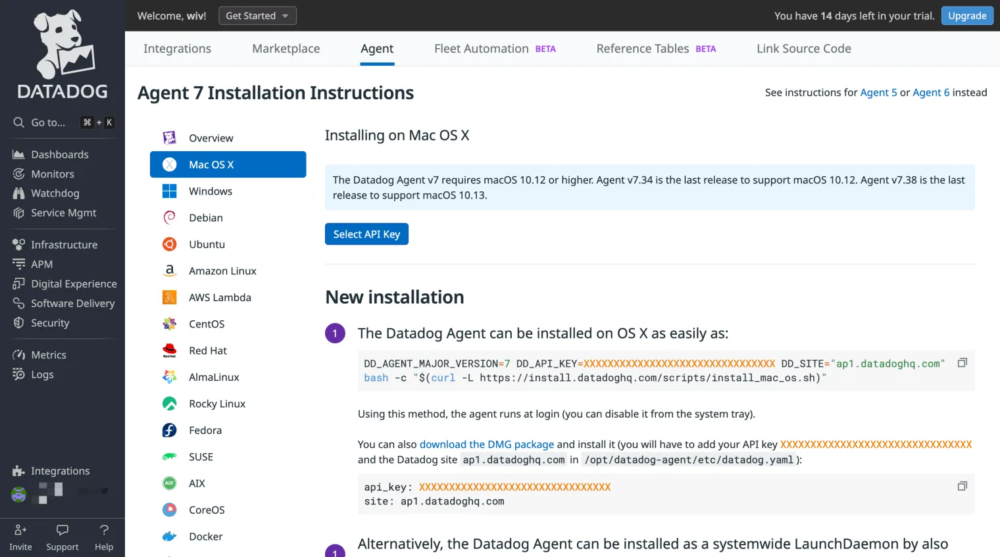
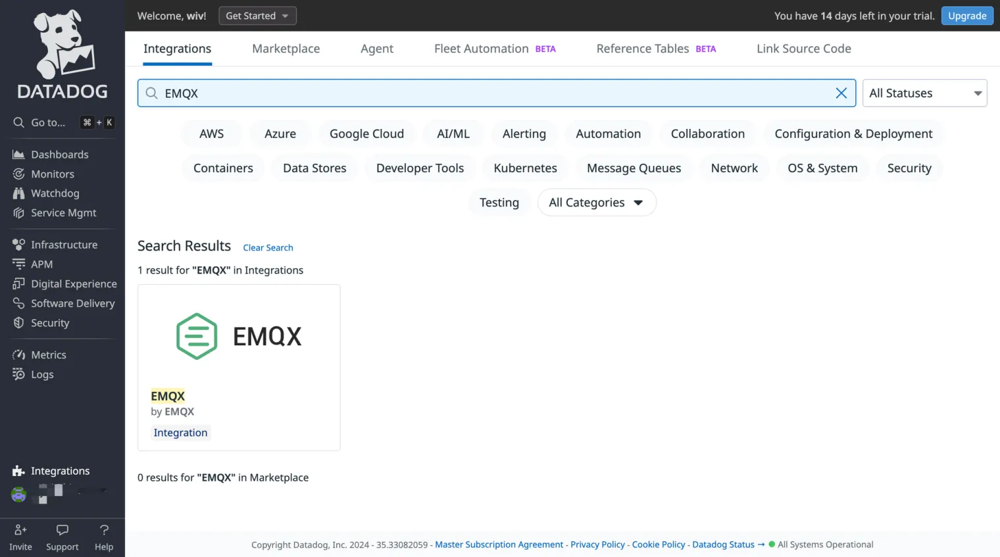
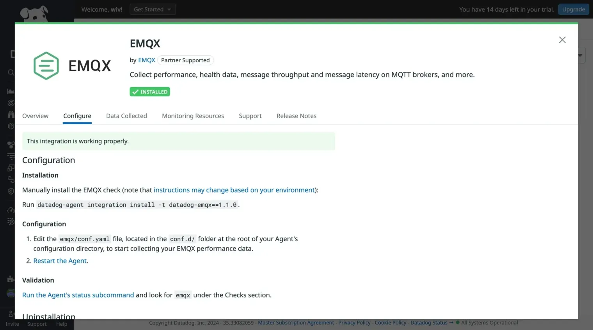
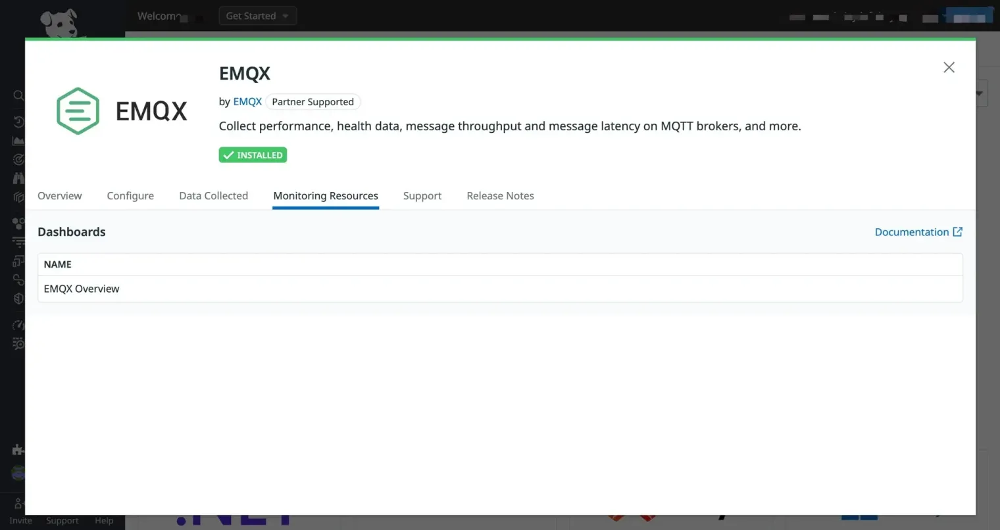
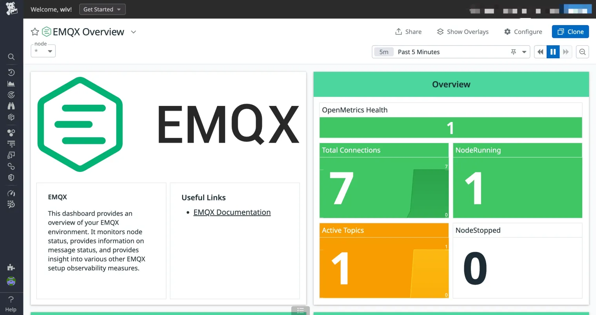
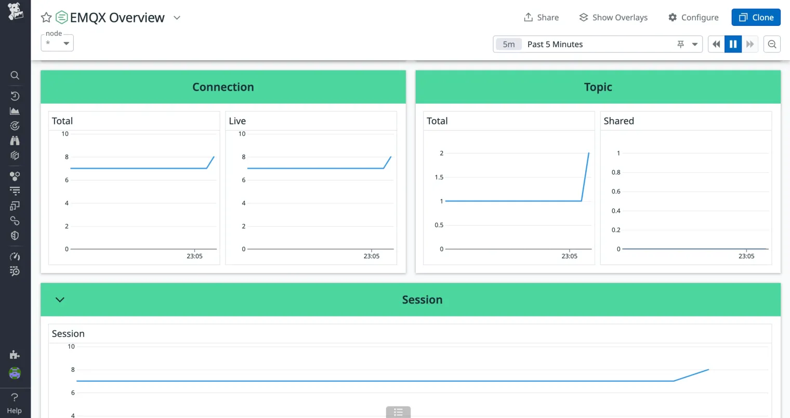
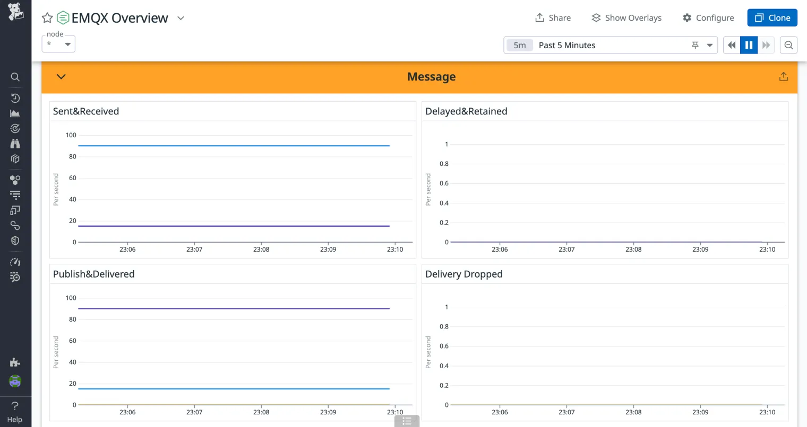
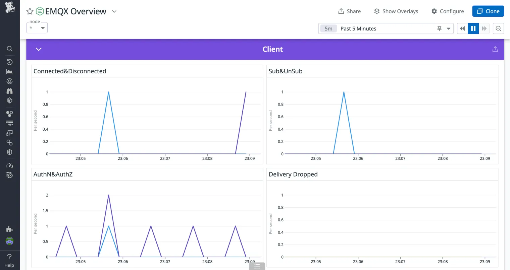

# Datadogとの連携

[Datadog](https://www.datadoghq.com/) は、クラウドベースのオブザーバビリティおよびセキュリティプラットフォームであり、自動化されたインフラ監視、アプリケーションパフォーマンス監視、ログ管理、リアルユーザーモニタリングを提供します。これらの機能をリアルタイムのアプリケーションソリューションとして統合し、開発者がパフォーマンスと信頼性を容易に監視、分析、最適化できるようにします。

EMQXは、EMQXの稼働状況をよりよく理解し、システムパフォーマンスの監視やトラブルシューティングを支援するために、標準で利用可能な[Datadog連携](https://docs.datadoghq.com/integrations/emqx/)を提供しています。これにより、ユーザーはより効率的で信頼性の高いリアルタイムデータ伝送のIoTアプリケーションを構築できます。

## Datadog連携の仕組み

EMQXとDatadogの連携は新機能ではなく、EMQXの既存機能をフル活用しています。動作原理は以下の通りです：

1. EMQXクラスター側にDatadog Agentをインストールし、DatadogがEMQX向けに提供する標準プラグインである[Datadog - EMQX連携](https://docs.datadoghq.com/integrations/emqx/)を追加します。

2. 連携のプリセット設定を変更し、Datadog AgentがEMQXのPrometheusプル型REST APIから定期的に指標データを取得できるようにします。取得した指標データはDatadog Agentで処理され、Datadogプラットフォームにアップロードされます。

3. Datadogクラウドプラットフォーム上で、連携のプリセットダッシュボードチャートを通じて各種指標データを閲覧できます。

以下では、上記の手順に従ってセットアップを行います。

## Datadog Agentのインストール

[Datadog Agent](https://docs.datadoghq.com/getting_started/agent/)は、EMQXのメトリクスを収集しDatadogクラウドに送信します。EMQXクラスターが稼働するサーバー、またはEMQXノードにアクセス可能なサーバーにデプロイする必要があります。

初めてDatadogを利用する場合は、[Datadog](https://www.datadoghq.com/)にアクセスしてアカウントを作成し、Datadogコンソールにログインしてください。次に、EMQXが稼働するサーバーにDatadog Agentをインストールします。手順は以下の通りです：

1. メニューバーから **Integrations** → **Agent** に移動し、Agentインストール手順のページを開きます。

2. 使用しているOSのバージョンを選択し、表示される手順に従ってインストールを行います。



## DatadogにEMQX連携を追加

EMQXは標準で利用可能な[Datadog連携](https://docs.datadoghq.com/integrations/emqx/)を提供しており、以下の手順でDatadogコンソールに簡単に組み込めます：

1. Datadogコンソールを開き、メニューバーから **Integrations** → **Integrations** に移動します。

2. 検索ボックスに `EMQX` と入力し、同名かつ同じ作者の連携を探します。

3. ポップアップの右上にある **Install Integration** ボタンをクリックし、EMQX連携をDatadogに追加します。



4. インストール完了後、**Configure** タブに移動し、EMQX連携の設定ガイドラインを確認します。Datadog Agent内で必要な設定を行います。



## Datadog AgentにEMQX連携を追加・有効化

設定ガイドラインに従い、Datadog AgentにEMQX連携を追加してEMQXメトリクスの収集・報告を設定します。

1. Datadog Agentが稼働するサーバーで、以下のコマンドを実行してEMQX連携を追加します。例ではバージョン1.1.0を使用していますが、最新のガイドラインで適切なバージョンを確認してください：

    ```bash
    datadog-agent integration install -t datadog-emqx==1.1.0
    ```

2. インストール完了後、Agentの設定ファイルを編集してEMQX連携を有効化します。

    Agent設定ディレクトリ（通常は `/opt/datadog-agent/etc/conf.d/`）に移動し、その中の `emqx.d` ディレクトリを探します。`emqx.d` 内にあるサンプル設定ファイル `conf.yaml.example` を同じディレクトリにコピーし、`conf.yaml` にリネームします。

    `conf.yaml` ファイルを編集し、以下の設定項目を調整します：

    ```bash
    instances:
      - openmetrics_endpoint: http://localhost:18083/api/v5/prometheus/stats?mode=all_nodes_aggregated
    ```

    `openmetrics_endpoint` はDatadog AgentがOpenMetrics形式のメトリクスデータを取得するアドレスを指定します。この例ではEMQXのHTTP APIアドレスを指定しています。Datadog Agentからアクセス可能なアドレスに置き換えてください。

    APIでは、`mode` クエリパラメータで取得するメトリクスの範囲を指定できます。各パラメータの意味は以下の通りです：

    | **パラメータ**           | **説明**                                                    |
    | ------------------------ | ----------------------------------------------------------- |
    | node                     | リクエストされた現在のノードのメトリクスを返します。`mode`パラメータが指定されない場合はこれがデフォルトです。 |
    | all_nodes_unaggregated    | クラスター内の各ノードのメトリクスを個別に返します。結果にはノード名が含まれ、メトリクスの独立性が保たれます。 |
    | all_nodes_aggregated      | クラスター内の全ノードのメトリクスを集約した値を返します。 |

    統一されたビューを得るには、`mode=all_nodes_aggregated` オプションを使用してください。これによりDatadog側でEMQXクラスター全体の値を確認できます。

3. [こちらのドキュメント](https://docs.datadoghq.com/agent/guide/agent-commands/#start-stop-and-restart-the-agent)を参照してAgentを再起動します。macOSの場合の例：

    ```bash
    launchctl stop com.datadoghq.agent
    launchctl start com.datadoghq.agent
    ```

4. システム再起動後、以下のコマンドでEMQX連携が正常に有効化されているか確認します。`Instance ID: ... [OK]` と表示されれば成功です。

    ```bash
    $ datadog-agent status | grep emqx -A 4
        emqx (1.1.0)
        ------------
          Instance ID: emqx:1865f3a06d300ccc \[OK\]
          Configuration Source: file:/opt/datadog-agent/etc/conf.d/emqx.d/conf.yaml
          Total Runs: 17
          Metric Samples: Last Run: 166, Total: 2,822
          Events: Last Run: 0, Total: 0
          Service Checks: Last Run: 1, Total: 17
          Average Execution Time : 43ms
          Last Execution Date : 2024-05-11 17:35:41 CST / 2024-05-11 09:35:41 UTC (1715420141000)
          Last Successful Execution Date : 2024-05-11 17:35:41 CST / 2024-05-11 09:35:41 UTC (1715420141000)
    
    ```

これでDatadog Agent側の設定は完了です。AgentはEMQXの稼働データを定期的に収集し、Datadogに送信します。

次にDatadogコンソールでメトリクスが正しく収集されているか確認しましょう。

## DatadogコンソールでEMQXメトリクスを確認

Datadog AgentのEMQX連携は、ノード状態やメッセージ状態などの詳細なオブザーバビリティメトリクスを表示する標準のダッシュボードチャートを提供しています。利用手順は以下の通りです：

1. Datadogコンソールを開き、メニューバーから **Integrations** → **Integrations** に移動します。

2. インストール済みのEMQX連携を探してクリックします。

3. ポップアップ内の **Monitoring Resources** タブに切り替え、**Dashboards** 内の **EMQX Overview** チャートを開きます。

    

**チャートには以下の情報が表示されます：**

- **OpenMetrics Health**：アクティブなメトリクスコレクターの数
- **Total Connections**：セッションを維持する切断済み接続も含む全接続数
- **NodeRunning**：クラスター内の稼働中ノード数
- **Active Topics**：現在アクティブなトピック数
- **NodeStopped**：停止中ノード数
- **Connection**
  - **Total**：セッションを維持する切断済み接続も含む接続総数
  - **Live**：アクティブなTCP接続数
- **Topic**
  - **Total**：トピック総数
  - **Shared**：共有トピック数
- **Session**：セッション総数
- **Erlang VM**：Erlang仮想マシンのCPU、メモリ、キュー使用状況
- **Retainer & Delayed**
  - **Retained**：保持中のメッセージ数
  - **Delayed**：遅延メッセージ数
- **Message**
  - **Sent & Received**：送受信メッセージのレート
  - **Delayed & Retained**：遅延および保持メッセージのレート
  - **Publish & Delivered**：パブリッシュおよび配信メッセージのレート
  - **Delivery Dropped**：配信中に破棄されたメッセージ数
- **Client**
  - **Connected & Disconnected**：接続確立および切断のレート
  - **Sub & UnSub**：サブスクライブおよびサブスクライブ解除のレート
  - **AuthN & AuthZ**：認証および認可のレート情報
  - **Delivery Dropped**：破棄された配信メッセージ数
- **Mria**：Mriaトランザクション総数

以下は代表的な概要メトリクスチャートのスクリーンショットです。値はEMQXの負荷やクライアントの活動に応じて動的に変化します。









## 次のステップ

DatadogのEMQX連携に組み込まれたチャートは主要なメトリクスの一部のみを表示しています。すべての報告されるEMQXメトリクスは[こちらのドキュメント](https://docs.datadoghq.com/integrations/emqx/#metrics)で確認でき、これらを基に独自の監視チャートを作成可能です。

これらのメトリクスを基にDatadogでアラートルールを設定できます。特定のメトリクスが設定した閾値に達したり異常が発生した場合、Datadogが通知を送信し、迅速な対応を促します。これによりシステム障害がビジネスに与える影響を最小限に抑えられます。
