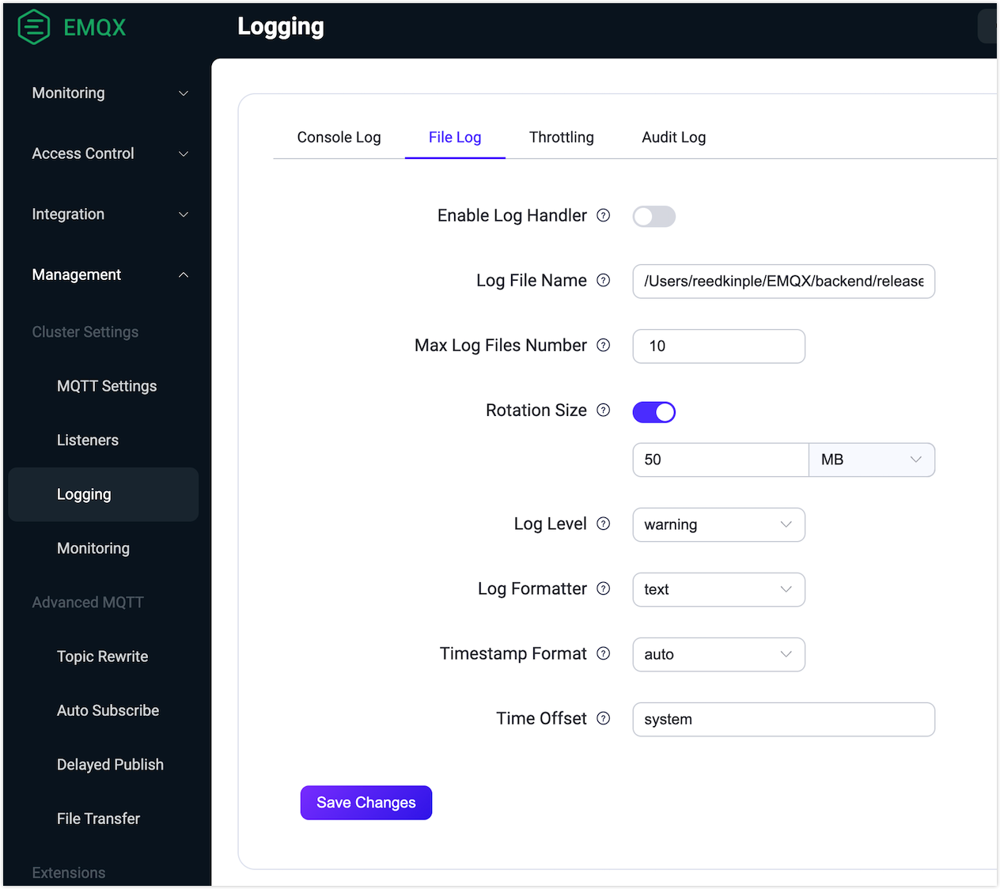

# ログ

ログはトラブルシューティングやシステムパフォーマンスの最適化において信頼できる情報源を提供します。EMQXのログからアクセス、動作、ネットワークの問題に関する記録を確認できます。

EMQXはコンソールログとファイルログの両方をサポートしています。ログデータの出力方法は2種類あり、必要に応じて出力方法を選択するか、両方を有効にすることも可能です。コンソールログはログデータをコンソールやコマンドラインインターフェースに出力することを指し、主に開発やデバッグ時に使用されます。これにより、EMQXの稼働中にリアルタイムでログデータを素早く確認できます。ファイルログはログデータをファイルに出力するもので、主に本番環境で使用され、ログデータを長期間保存して解析やトラブルシューティングに役立てます。

システムのデフォルトのログ処理動作は環境変数 `EMQX_DEFAULT_LOG_HANDLER` によって設定可能で、以下の設定を受け付けます。

- `file`: ログ出力をファイルに向ける。
- `console`: ログ出力をコンソールに向ける。

環境変数 `EMQX_DEFAULT_LOG_HANDLER` のデフォルトは `console` ですが、systemdの `emqx.service` ファイル経由でEMQXを起動する場合は明示的に `file` に設定されます。

ログデータが多すぎる場合やログ書き込みが遅い場合など、システム運用への影響を最小限に抑えるために、EMQXはデフォルトでオーバーロード保護機構を有効にしており、ユーザーにより良いサービスを提供しています。

## ログレベル

EMQXのログには8段階中6段階のレベルがあり（[RFC 5424](https://www.ietf.org/rfc/rfc5424.txt)準拠）、デフォルトは `warning` です。低い順に以下の通りです。

```bash
debug < info < notice < warning < error < critical
```

以下の表は各ログレベルの意味と出力内容の例を示しています。

| ログレベル | 意味                                                         | 出力例                                                         |
| ---------- | ------------------------------------------------------------ | -------------------------------------------------------------- |
| debug      | プログラム内部の詳細情報で、コードのデバッグや診断に役立ちます。<br />本番環境で直接出力することは推奨されません。代わりに特定のクライアントに対して[Log Trace](./tracer.md)を有効にしてください。 | 変数の値、関数呼び出しスタックなど詳細なデバッグ情報。           |
| info       | debugレベルより一般的な有用情報。                            | 認可拒否などの軽微な異常や、設定変更成功などの管理操作結果。     |
| notice     | イベント発生を示す重要なシステム情報で、特に対応は不要。     | ダッシュボードやCLIからのリクエストによるコンポーネントの再起動。 |
| warning    | 対応が必要な潜在的な問題やエラー。重大問題になる前の監視に使用。 | 切断、接続タイムアウト、認証失敗などの類似イベント。             |
| error      | エラー発生を示し、管理者が迅速に検知・対応できるようにする。 | 外部データベース接続失敗、存在しないトピックのサブスクライブ失敗、設定ファイル解析失敗など。 |
| critical   | システムクラッシュや機能停止を引き起こす重大エラー。管理者が即時対応すべき。 | 設定ミスによりコンポーネントが起動・正常動作できない場合。       |

::: warning 重要なお知らせ

接続およびパーサーエラーのログに含まれる生のMQTTパケットデータはデフォルトでマスクされています。トラブルシューティングのために一時的に生パケットデータをログに記録するには、リスナーの `allow_log_packet_data_from` オプションに信頼できるクライアントのIPアドレスまたはCIDR範囲を追加してください。このオプションは信頼できるクライアントに対してのみ、かつ診断時のみ有効にしてください。生パケットデータには認証情報などの機密情報が含まれる可能性があります。

:::

## ダッシュボードでのログ設定

このセクションでは主にEMQXダッシュボードを使ったログ設定方法を説明します。変更は即時反映され、ノードの再起動は不要です。

EMQXダッシュボードにアクセスし、左側のナビゲーションメニューから **Management** -> **Logging** をクリックします。コンソールログまたはファイルログの設定はそれぞれ対応するタブを選択してください。

### コンソールログの設定

**Logging** ページで **Console Log** タブを選択します。


コンソールログハンドラーの以下の設定を行います。

- **Enable Log Handler**: トグルスイッチをクリックしてコンソールログハンドラーを有効化します。

- **Log Level**: ドロップダウンリストからログレベルを選択します。デフォルトは `warning` です。

- **Log Formatter**: ログフォーマットをドロップダウンリストから選択します。選択肢は `text` と `JSON` で、デフォルトは `text` です。

- **Timestamp Format**: ログのタイムスタンプ形式を選択します。選択肢は以下の通りです。
  - `auto`: 使用しているログフォーマッターに応じて自動判別します。textフォーマッターの場合は `rfc3339`、JSONフォーマッターの場合は `epoch` 形式を使用します。
  - `epoch`: マイクロ秒精度のUnixエポック形式。
  - `rfc3339`: RFC3339準拠の日時文字列形式。例：`2024-03-26T11:52:19.777087+00:00`

- **Time Offset**: ログのタイムスタンプのUTCからのオフセットを指定します。デフォルトはシステムに従い、値は `system` です。

設定が完了したら **Save Changes** をクリックしてください。

### ファイルログの設定

**Logging** ページで **File Log** タブを選択します。



ファイルログハンドラーの以下の設定を行います。

- **Enable Log Handler**: トグルスイッチをクリックしてファイルログハンドラーを有効化します。

- **Log File Name**: ログファイル名を入力します。デフォルトは `log/emqx.log` です。

- **Max Log Files Number**: ローテーションされる最大ログファイル数を指定します。デフォルトは `10` です。

- **Rotation Size**: ログファイルが指定サイズに達したらローテーションします。デフォルトで有効です。下のテキストボックスに具体的なサイズを入力できます。無効にすると値は `infinity` となり、ログファイルは無制限に成長します。

- **Log Level**: ドロップダウンリストからログレベルを選択します。選択肢は `debug`、`info`、`notice`、`warning`、`error`、`critical` で、デフォルトは `warning` です。

- **Log Formatter**: ログフォーマットをドロップダウンリストから選択します。選択肢は `text` と `JSON` で、デフォルトは `text` です。

- **Timestamp Format**: ログのタイムスタンプ形式を選択します。選択肢は以下の通りです。

  - `auto`: 使用しているログフォーマッターに応じて自動判別します。textフォーマッターの場合は `rfc3339`、JSONフォーマッターの場合は `epoch` 形式を使用します。

  - `epoch`: マイクロ秒精度のUnixエポック形式。

  - `rfc3339`: RFC3339準拠の日時文字列形式。例：`2024-03-26T11:52:19.777087+00:00`

- **Time Offset**: ログのタイムスタンプのUTCからのオフセットを指定します。デフォルトはシステムに従い、値は `system` です。

設定が完了したら **Save Changes** をクリックしてください。

ファイルログが有効な場合（`log.to = file` または両方）、ログディレクトリに以下のファイルが生成されます。

- **emqx.log.N:** `emqx.log` を接頭辞とするログファイルで、EMQXの全ログメッセージを含みます。例：`emqx.log.1`、`emqx.log.2` など。
- **emqx.log.siz` と `emqx.log.idx`:** ログローテーション情報を記録するシステムファイルです。**手動で変更しないでください**。

## 設定ファイルによるログ設定

EMQXのログ設定は設定ファイルからも行えます。例えば、警告レベルのログをファイルに出力したりコンソールに出力したりしたい場合は、`base.hocon` の `log` 以下の設定項目を以下のように変更します。設定はノード再起動後に反映されます。設定ファイルによるログ設定の詳細は [Configuration - Logs](../configuration/logs.md) を参照してください。

```bash
log {
  file {
    default {
      enable = true
      formatter = text
      level = warning
      path = "/Users/emqx/Downloads/emqx-560/log/emqx.log"
      rotation_count = 10
      rotation_size = 50MB
      time_offset = system
      timestamp_format = auto
  }
  console {
    formatter = json
    level = debug
    time_offset = system
    timestamp_format = auto
  }
}
```

## ログフォーマット

ログメッセージのフォーマット（各フィールドはスペースで区切られます）は以下の通りです。

```
**timestamp level tag clientid msg peername username ...**
```

各フィールドの意味は以下の通りです。

- **timestamp:** ログエントリ作成時刻を示すRFC-3339形式のタイムスタンプ。
- **level:** ログの重大度レベルを角括弧で囲んだもの。例：`[info]`、`[warning]`、`[error]` など。
- **tag:** ログを分類するためのすべて大文字の単語。検索や分析を容易にするために使用されます。例：`MQTT`、`AUTHN`、`AUTHZ`。
- **clientid:** 特定のクライアントに関するログの場合に含まれ、そのクライアントを識別します。
- **msg:** ログメッセージの内容。検索性と可読性を高めるため、多くは `snake_case` 形式（例：`mqtt_packet_received`）を採用しています。ただしすべてのメッセージがこの形式とは限りません。
- **peername:** クライアントの接続元IPアドレスとポート番号を `IP:port` 形式で示します。
- **username:** 指定された空でないユーザー名を持つクライアントに関連するログにのみ含まれます。該当クライアントのユーザー名を示します。
- **...:** msgフィールドの後に任意の追加フィールドが続く場合があります。必要に応じて詳細情報を提供します。

### ログメッセージ例

```bash
2024-03-20T11:08:39.568980+01:00 [warning] tag: AUTHZ, clientid: client1, msg: cannot_publish_to_topic_due_to_not_authorized, peername: 127.0.0.1:47860, username: user1, topic: republish-event/1, reason: not_authorized
```

## ログスロットリング

ログスロットリングは、同一イベントの繰り返しによるログの洪水を防ぐため、指定時間内に最初のイベントのみをログに記録し、以降の同一イベントを抑制する機能です。これにより、観測性を損なわずにログ管理の効率化が図れます。

ダッシュボードで設定する場合は、**Management** -> **Logging** を選択し、**Throttling** タブをクリックします。デフォルトの時間ウィンドウは1分で、最小値は1秒です。


設定ファイルで直接時間ウィンドウを指定する場合は以下のようにします。

```
log {
  throttling {
    time_window = "5m"
  }
}
```

ログスロットリングはデフォルトで有効で、認証失敗やメッセージキューのオーバーフローなど特定のログイベントに適用されます。ただし、`console` または `file` のログレベルが `debug` に設定されている場合は、詳細なログ取得のためスロットリングは無効になります。

スロットリングが適用されるログイベントは以下の通りです。

- "authentication_failure"
- "authorization_permission_denied"
- "cannot_publish_to_topic_due_to_not_authorized"
- "cannot_publish_to_topic_due_to_quota_exceeded"
- "connection_rejected_due_to_license_limit_reached"
- "data_bridge_buffer_overflow"
- "dropped_msg_due_to_mqueue_is_full"
- "dropped_qos0_msg"
- "external_broker_crashed"
- "failed_to_fetch_crl"
- "failed_to_retain_message"
- "handle_resource_metrics_failed"
- "retain_failed_for_payload_size_exceeded_limit"
- "retain_failed_for_rate_exceeded_limit"
- "retained_delete_failed_for_rate_exceeded_limit"
- "socket_receive_paused_by_rate_limit"
- "transformation_failed"
- "unrecoverable_resource_error"
- "validation_failed"

::: tip 補足
スロットリング対象イベントのリストは更新される可能性があります。
:::

時間ウィンドウ内でイベントがスロットリングされた場合、各タイプのドロップされたイベント数を集計した警告メッセージがログに記録されます。例えば、1つのウィンドウ内で5回の認可拒否サブスクライブ試行があった場合、以下のようにログが記録されます。

```
2024-03-13T15:45:11.707574+02:00 [warning] clientid: test, msg: authorization_permission_denied, peername: 127.0.0.1:54870, username: test, topic: t/#, action: SUBSCRIBE(Q0), source: file
2024-03-13T15:45:53.634909+02:00 [warning] msg: log_events_throttled_during_last_period, period: 1 minutes, 0 seconds, dropped: #{authorization_permission_denied => 4}
```

最初の "authorization_permission_denied" イベントは完全にログに記録され、次の4件はドロップされますが、その数は "log_events_throttled_during_last_period" の統計で記録されます。
