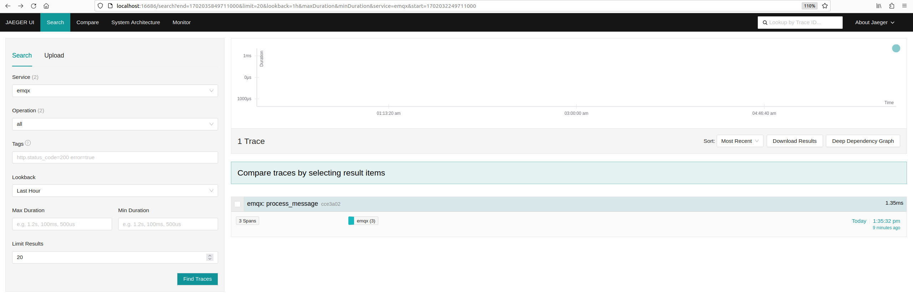
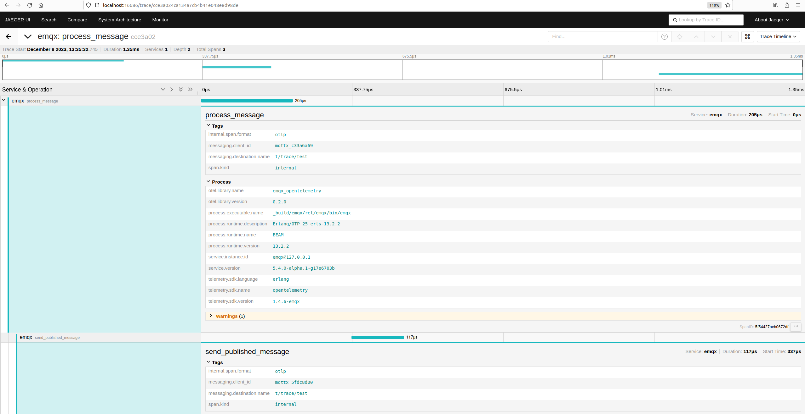

# OpenTelemetryトレーシングの統合

[OpenTelemetryトレーシング](https://opentelemetry.io/docs/concepts/signals/traces/)は、分散システムにおけるリクエストの流れをトレースするための仕様であり、リクエストが分散システム内でどのように流れるかを追跡し、リクエストのパフォーマンスや挙動を可視化・分析することを可能にします。MQTTのシナリオでは、この概念をMQTTメッセージ送信の異なる参加者（パブリッシャー - MQTTサーバー - サブスクライバー）間でのリクエストのトレースに利用できます。

「トレースコンテキスト」は、複数のシステムやサービスにまたがるリクエストやトランザクションを追跡・識別するために分散トレーシングで用いられる仕組みです。[W3C Trace Context MQTT](https://w3c.github.io/trace-context-mqtt/)ドキュメントでは、この概念がMQTTプロトコルに適用されており、MQTTメッセージ送信の異なる参加者間でリクエストを追跡できるようにしています。これにより、システム管理者や開発者はメッセージがシステム内でどのように流れているかを理解できます。

EMQXはトレースコンテキストを伝播する機能を備えており、分散トレーシングシステムにシームレスに参加できます。この伝播は、メッセージのパブリッシャーからサブスクライバーへ`traceparent`および`tracestate`のユーザープロパティを単純に転送することで実現されます。EMQXがアプリケーションメッセージをクライアントに転送する際、トレースコンテキストの整合性を保ち、変更せずに送信します。この方法は[MQTT仕様3.3.2.3.7](https://docs.oasis-open.org/mqtt/mqtt/v5.0/os/mqtt-v5.0-os.html#_Toc3901116)に完全準拠しており、トレースデータの送信における一貫性と信頼性を保証します。

::: tip 注意

User-PropertyはMQTT 5.0で導入されたため、EMQXはMQTT 5.0を使用している場合にのみトレースコンテキストを抽出・伝播できます。

MQTT 5.0以外のクライアントの場合、EMQXの**Traces All Messages**オプションを有効にする必要があります。EMQXは内部の分散トレーシングのために自動的にメッセージにトレースIDを付加します。

:::

OpenTelemetry分散トレーシングにより、EMQXのシステム管理者や開発者はIoTアプリケーションのパフォーマンスや挙動をリアルタイムで監視・分析できます。問題発生時の迅速な検知と解決が可能です。

本ページでは、OpenTelemetryトレーシングをEMQXに統合する方法を紹介します。OpenTelemetry Collectorのセットアップ、EMQXでのOpenTelemetryトレース統合の有効化・設定、トレーシングスパンの過負荷管理について詳述します。

## OpenTelemetry Collectorのセットアップ

EMQXとOpenTelemetryトレースを統合する前に、[OpenTelemetry Collector](https://opentelemetry.io/docs/collector/getting-started)および可能であればOpenTelemetry対応のオブザーバビリティプラットフォーム（例：[Jaeger](https://www.jaegertracing.io/docs/latest/deployment/)）をデプロイ・設定する必要があります。以下はデプロイと設定の手順です。

1. OpenTelemetry Collectorの設定ファイル`otel-trace-collector-config.yaml`を作成します。

   ```yaml
   receivers:
     otlp:
       protocols:
         grpc:

   exporters:
     otlp:
       endpoint: jaeger:4317
       tls:
         insecure: true

   processors:
     batch:

   extensions:
     health_check:

   service:
     extensions: [health_check]
     pipelines:
       traces:
         receivers: [otlp]
         processors: [batch]
         exporters: [otlp]
   ```

2. 同じディレクトリにDocker Composeファイル`docker-compose-otel-trace.yaml`を作成します。

   ```yaml
   version: '3.9'
   services:
     jaeger:
       image: jaegertracing/all-in-one:1.51.0
       restart: always
       ports:
         - "16686:16686"

     otel-collector:
       image: otel/opentelemetry-collector:0.90.0
       restart: always
       command: ["--config=/etc/otel-collector-config.yaml", "${OTELCOL_ARGS}"]
       volumes:
         - ./otel-trace-collector-config.yaml:/etc/otel-collector-config.yaml
       ports:
         - "13133:13133" # Health check extension
         - "4317:4317"   # OTLP gRPC receiver
       depends_on:
         - jaeger
   ```

3. Docker Composeでサービスを起動します。

   ```bash
   docker compose -f docker-compose-otel-trace.yaml up
   ```

4. 起動後、OpenTelemetry CollectorはホストマシンのデフォルトgRPCポート（4317）で待機し、JaegerのWEB UIは http://localhost:16686 でアクセス可能です。

## EMQXでOpenTelemetryトレーシングを有効化する

このセクションでは、EMQXでOpenTelemetryトレーシングを有効にし、マルチノード構成での分散トレーシング機能を示します。

`opentelemetry.exporter.endpoint`には1つのURLを指定します。URLは`http`または`https`スキームを使用し、明示的なポート番号を含む必要があります。例えば`http://localhost:4317`は有効ですが、`localhost:4317`や`http://localhost`は無効です。

1. EMQXの`cluster.hocon`ファイルに以下の設定を追加します（EMQXがローカルで動作している場合の例）。

   ```bash
   opentelemetry {
     exporter { endpoint = "http://localhost:4317" }
     traces {
      enable = true
      # すべてのメッセージをトレースするかどうか
      # メッセージからトレースIDを抽出できない場合は新しいトレースIDが生成されます。
      # filter.trace_all = true
    }
   }
   ```

   また、ダッシュボードの**Management** -> **Monitoring**にある**Integration**タブからOpenTelemetryトレース統合を設定することも可能です。

2. EMQXノードを起動します。例として、ノード名`emqx@127.0.0.1`と`emqx1@127.0.0.1`の2ノードクラスターで分散トレーシング機能をデモします。

3. 異なるノード・ポートで[MQTTX CLI](https://mqttx.app/cli)クライアントを使い、同じトピックにサブスクライブします。

   - `emqx@127.0.0.1`ノード（デフォルトMQTTリスナー1883ポート）:

     ```bash
     mqttx sub -t t/trace/test -h localhost -p 1883
     ```

   - `emqx1@127.0.0.1`ノード（1884ポートのリスナー）:

     ```bash
     mqttx sub -t t/trace/test -h localhost -p 1884
     ```

4. 有効な`traceparent`ユーザープロパティを含むメッセージをトピックにパブリッシュしてトレースコンテキストを送信します。

   ```bash
   mqttx pub -t t/trace/test -h localhost -p 1883 -up "traceparent: 00-cce3a024ca134a7cb4b41e048e8d98de-cef47eaa4ebc3fae-01"
   ```

5. 約5秒後（EMQXのトレースデータエクスポートのデフォルト間隔）、JaegerのWEB UI [http://localhost:16686](http://localhost:16686/) にアクセスしトレースデータを確認します。

   - `emqx`サービスを選択し、**Find Traces**をクリックします。`emqx`サービスがすぐに表示されない場合は数秒後にリロードしてください。メッセージトレースが表示されます。

     

   - トレースをクリックすると、詳細なスパン情報とトレースタイムラインが表示されます。

     

この例では、EMQXは2種類のスパンをトレースしています。

 - `process_message`スパンは、EMQXノードがPUBLISHパケットを受信・解析した時点で開始し、メッセージがローカルサブスクライバーに配信されるか、アクティブなサブスクライバーがいる他ノードに転送されるまで継続します。各スパンは1つのトレースされたパブリッシュメッセージに対応します。

 - `send_published_message`スパンは、トレースされたメッセージがサブスクライバーの接続制御プロセスに届いた時点で開始し、送信パケットがシリアライズされ接続ソケットに送信されるまで継続します。各アクティブサブスクライバーに対して1つの`send_published_message`スパンが生成されます。

## トレーシングスパンの過負荷管理

EMQXはトレーシングスパンを蓄積し、定期的にバッチでエクスポートします。エクスポート間隔は`opentelemetry.trace.scheduled_delay`パラメータで制御され、デフォルトは5秒です。

バッチ処理スパンプロセッサには過負荷保護機構が組み込まれており、蓄積できるスパン数には上限があり、デフォルトは2048スパンです。この上限は以下の設定で変更可能です。

```bash
opentelemetry {
  traces { max_queue_size = 2048 }
}
```

`max_queue_size`の上限に達すると、新しいトレーシングスパンは現在のキューがエクスポートされるまで破棄されます。

::: tip 注意

トレースされたメッセージが非常に多くのサブスクライバーに配信される場合（`max_queue_size`の値を大幅に超える場合）、エクスポートされるスパンはごく一部に限られ、ほとんどのスパンは過負荷保護により破棄されることが予想されます。

`max_queue_size`の増加はパフォーマンスやメモリ消費に影響を与えるため、慎重に行ってください。

:::
