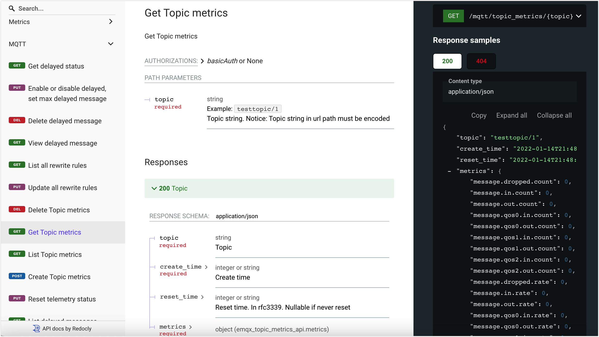

# トピックメトリクス

EMQXのトピックメトリクス機能は、指定したトピックに関する詳細な統計情報を提供します。これには、送受信されたメッセージ数、メッセージレート、その他関連するメトリクスが含まれます。この機能にアクセスするには、EMQXダッシュボードの **Diagnostics Tools** -> **Topic Metrics** に移動してください。あるいは、REST APIを通じてトピックメトリクスを取得することも可能です。

## ダッシュボードでトピックメトリクスを表示する

トピックメトリクス機能を有効化した後、ページ右上の **Add Topic** ボタンをクリックして新しいトピック監視ルールを追加できます。なお、`+` や `#` といったワイルドカードを含むトピックフィルターは現時点ではサポートされていません。特定のトピック名を使用する必要があります。

**Actions** 列の **View** ボタンをクリックすると、指定したトピックにおける1秒あたりの受信、送信、およびドロップされたメッセージ数の詳細情報を確認できます。また、異なるQoSレベルごとに情報をフィルタリングすることも可能です。

トピックメトリクスリストには以下の項目が含まれます：

- **Topic**：監視対象のトピック名。
- **Incoming messages**：現在のトピックにおける受信メッセージの総数と1秒あたりの受信メッセージ数。
- **Outgoing Messages**：現在のトピックにおける送信メッセージの総数と1秒あたりの送信メッセージ数。
- **Dropped Messages**：現在のトピックでドロップされたメッセージの総数と1秒あたりのドロップ数。
- **Start at**：このトピック監視レコードを作成した日時。
- **Actions**：このトピック監視レコードに対して実行できる操作。
  - **View**：異なるQoSレベルごとのトピック詳細メトリクスを表示。
  - **Reset**：このボタンをクリックして監視を再起動。
  - **Delete**：レコードを削除。

## REST APIでトピックメトリクスを取得する

トピックメトリクスはAPIを通じても取得可能です。EMQXのAPIの使い方については、[REST API](../api.md)をご参照ください。

