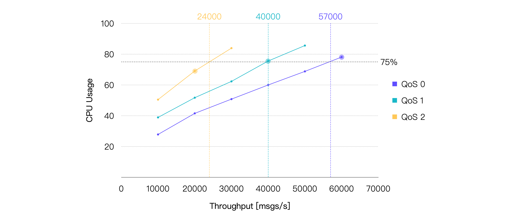
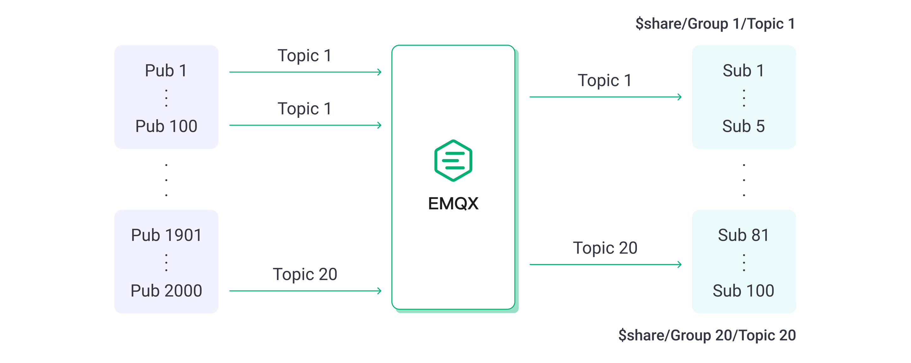
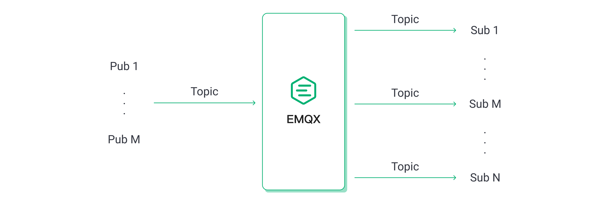
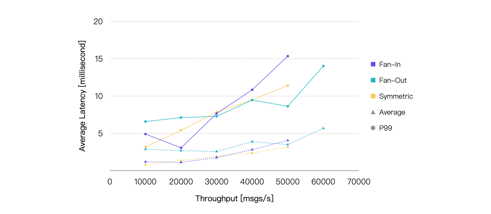

# 参照用テストシナリオと結果

本ページでは、さまざまなシナリオ下で実施した一連のベンチマークテストに基づくEMQXの詳細なパフォーマンス分析を紹介します。評価では、QoS（サービス品質）レベルの違い、ペイロードサイズ、パブリッシュ・サブスクライブモデル、MQTTメッセージブリッジングの影響など、さまざまな条件におけるEMQXの挙動と能力を検証しています。

厳密なテストと計測を通じて得られたこれらの結果は、実際の環境におけるEMQXの性能に関する実用的な洞察を提供し、IoTアプリケーション向けのEMQXデプロイメント最適化に役立つ指針を示します。

## テスト環境

本節のすべてのテストは、単一ノードにデプロイした**EMQX v5.1.6（オープンソース版）**を対象としています。EMQXとテストサーバー間にはピアリング接続を構築し、外部ネットワークのレイテンシ干渉を排除しています。EMQXを実行するサーバーの仕様は以下の通りです。

- **CPU**: 4vCPU（Intel Xeon Platinum 8378A CPU @ 3.00GHz）
- **メモリ**: 8 GiB
- **システムディスク**: General Purpose SSD | 40 GiB
- **最大帯域幅**: 8 Gbit/s
- **最大パケット毎秒数**: 800,000 PPS
- **OS**: CentOS 7.9

ファンインシナリオを除き、テストクライアント数は各シナリオで10台です。ファンインシナリオでは20台のテストクライアントを使用し、メッセージの送受信を行っています。

## テストシナリオと結果

### シナリオ1：異なるQoSにおけるEMQXのパフォーマンス

MQTTパケットのやり取りはQoSレベルが上がるほど複雑になり、メッセージ配信時のシステムリソース消費が増加します。したがって、各QoSレベルのパフォーマンス影響を理解することは重要です。

本シナリオでは、1,000のパブリッシャーと1,000のサブスクライバーによる1対1通信を行い、128バイトのペイロードメッセージを使用しました。つまり、合計1,000のトピックがあり、各トピックに1つのパブリッシャーと1つのサブスクライバーが存在します。

メッセージのパブリッシュレートを徐々に増加させて負荷を上げ、各負荷下でEMQXを5分間稼働させて安定性を確認しました。異なるQoSレベルおよび負荷条件でのEMQXのパフォーマンスとリソース消費（平均メッセージレイテンシ、P99メッセージレイテンシ、平均CPU使用率など）を記録しました。

最終的なテスト結果は以下の通りです。

> **レイテンシ**は、メッセージがパブリッシュされてから受信されるまでの時間を指します。**スループット**はメッセージのインバウンドスループットとアウトバウンドスループットを含みます。

これらの結果から、同等の負荷条件下でQoSレベルが高くなるほど平均CPU使用率が増加することが分かります。したがって、同じシステムリソースではQoSレベルが高いほどスループットは相対的に低下します。

平均CPU使用率約75％を推奨される日常負荷と仮定すると、提供されたハードウェアおよびテストシナリオにおける推奨負荷は、QoS 0で約57K TPS、QoS 1で約40K TPS、QoS 2で約24K TPSと結論付けられます。以下はCPU使用率が約75％に最も近いテストポイントのパフォーマンスデータです。

| **QoSレベル** | **推奨負荷（TPS、イン＋アウト）** | **平均CPU使用率（％、1 - アイドル）** | **平均メモリ使用率（％）** | **平均レイテンシ（ms）** | **P99レイテンシ（ms）** |
| :------------ | :------------------------------ | :---------------------------------- | :-------------------------- | :---------------------- | :------------------ |
| QoS 0         | 60K                             | 78.13                               | 6.27                        | 2.079                   | 8.327               |
| QoS 1         | 40K                             | 75.56                               | 6.82                        | 2.356                   | 9.485               |
| QoS 2         | 20K                             | 69.06                               | 6.39                        | 2.025                   | 8.702               |

### シナリオ2：異なるペイロードサイズにおけるEMQXのパフォーマンス

より大きなメッセージペイロードは、OSがネットワークパケットを受信・送信するためのソフト割り込みを増加させ、パケットのシリアライズおよびデシリアライズに必要な計算リソースを増やします。多くのMQTTメッセージは通常1KB未満ですが、より大きなメッセージを送信するシナリオも存在します。そこで、ペイロードサイズの違いがパフォーマンスに与える影響を検証しました。

引き続き1,000のパブリッシャーと1,000のサブスクライバーによる1対1通信を行い、メッセージのQoSは1に固定、パブリッシュレートは20K msg/sに設定しました。ペイロードサイズを増加させてテスト負荷を上げ、各負荷下でEMQXを5分間稼働させて安定性を確認しました。各負荷条件でのパフォーマンスとリソース使用率を記録しました。

結果は以下の通りです。

ペイロードが大きくなるにつれてCPU使用率は徐々に上昇し、メッセージのエンドツーエンドレイテンシも比較的緩やかに増加しています。ただし、ペイロードサイズが8KBに達しても、平均レイテンシは10ミリ秒未満、P99レイテンシは20ミリ秒未満を維持しています。

| **ペイロードサイズ（KB）** | **推奨負荷（TPS、イン＋アウト）** | **平均CPU使用率（％、1 - アイドル）** | **平均メモリ使用率（％）** | **平均レイテンシ（ms）** | **P99レイテンシ（ms）** |
| :------------------- | :---------------- | :---------------------------------- | :-------------------------- | :---------------------- | :------------------ |
| 1                    | 40K               | 75.9                                | 6.23                        | 3.282                   | 12.519              |
| 8                    | 40K               | 90.82                               | 9.38                        | 5.884                   | 17.435              |

したがって、QoSレベルに加え、ペイロードサイズも重要な考慮事項です。ここでテストしたよりもはるかに大きなペイロードサイズを扱う場合は、より高いハードウェア構成が必要になる可能性があります。

### シナリオ3：異なるパブリッシュ・サブスクライブモデルにおけるEMQXのパフォーマンス

MQTTのパブリッシュ・サブスクライブ機構は、ビジネス要件に応じて柔軟にモデルを調整可能です。代表的なシナリオにはファンイン、ファンアウト、対称モデルがあります。

- ファンインモデルでは、多数のセンサー機器がパブリッシャーとして機能し、少数または単一のバックエンドアプリケーションがサブスクライバーとしてセンサーデータを蓄積・分析します。
- ファンアウトモデルでは、少数のパブリッシャーから多数のサブスクライバーにメッセージをブロードキャストします。
- 対称モデルでは、パブリッシャーとサブスクライバーが1対1で通信します。

MQTTブローカーのパフォーマンスは、パブリッシュ・サブスクライブモデルによって若干異なることが多く、以下のテストで確認します。

ファンインシナリオでは、2,000のパブリッシャーと100のサブスクライバーを設定し、100のパブリッシャーのメッセージを5人のサブスクライバーで共有サブスクリプションとして消費します。

ファンアウトシナリオでは、10のパブリッシャーと2,000のサブスクライバーを設定し、各パブリッシャーのメッセージを200人のサブスクライバーが通常サブスクリプションで受信します。対称シナリオは前述のテストと同様です。

ファンアウトシナリオは他の2つのシナリオに比べてインバウンドメッセージ数が少ないため、同等またはほぼ同等の負荷となるよう調整して比較しています。例えば、ファンアウトシナリオのインバウンド100 msg/s、アウトバウンド20K msg/sは、対称シナリオのインバウンド10K msg/s、アウトバウンド10K msg/sに相当します。

メッセージのQoSレベルは1、ペイロードサイズは128バイトに固定し、最終的なテスト結果は以下の通りです。

メッセージレイテンシのみを考慮すると、3つのシナリオのパフォーマンスは非常に近いことが分かります。さらに、同じ負荷条件下ではファンアウトシナリオのCPU消費が一貫して低くなっています。したがって、CPU使用率75％を閾値とすると、ファンアウトシナリオが他の2つのシナリオよりも高いスループットを達成できることが明らかです。

| **シナリオ** | **推奨負荷（TPS、イン＋アウト）** | **平均CPU使用率（％、1 - アイドル）** | **平均メモリ使用率（％）** | **平均レイテンシ（ms）** | **P99レイテンシ（ms）** |
| :-------- | :------------------------------ | :---------------------------------- | :-------------------------- | :---------------------- | :------------------ |
| ファンイン    | 30K                             | 74.96                               | 6.71                        | 1.75                    | 7.651               |
| ファンアウト   | 50K                             | 71.25                               | 6.41                        | 3.493                   | 8.614               |
| 対称         | 40K                             | 75.56                               | 6.82                        | 2.356                   | 9.485               |

### シナリオ4：ブリッジング時のEMQXパフォーマンス

MQTTブリッジングは、あるMQTTサーバーから別のMQTTサーバーへメッセージを転送する機能であり、エッジゲートウェイからクラウドサーバーへのメッセージ集約や、2つのMQTTクラスター間のメッセージ連携など、さまざまなユースケースに利用されます。

本テストシナリオでは、MQTTサーバー1に接続された500のパブリッシャーがパブリッシュしたメッセージをMQTTサーバー2にブリッジし、MQTTサーバー2に接続された500のサブスクライバーが受信します。同時に、MQTTサーバー2に接続された別の500のパブリッシャーがパブリッシュしたメッセージをMQTTサーバー1に接続された500のサブスクライバーが受信します。

この構成により、クライアントのメッセージパブリッシュレートが同一の場合、EMQX内のインバウンドおよびアウトバウンドメッセージレートはブリッジなしの対称シナリオに近くなり、両シナリオのパフォーマンス比較が可能になります。

メッセージのQoSレベルは1、ペイロードサイズは128バイトに固定し、最終的なテスト結果は以下の通りです。

ブリッジングはメッセージ配信過程に中継を追加するため、エンドツーエンドのメッセージレイテンシが増加します。加えて、ブリッジングは追加のCPU消費ももたらします。テスト結果はこれらの傾向を裏付けています。本テストで使用したハードウェア仕様に基づくと、平均CPU使用率が約75％となるブリッジングシナリオの推奨負荷は約25K TPSです。CPU使用率の差が最も小さいデータポイントのテスト結果は以下の通りです。

| **推奨負荷（TPS、イン＋アウト）** | **平均CPU使用率（％、1 - アイドル）** | **平均メモリ使用率（％）** | **平均レイテンシ（ms）** | **P99レイテンシ（ms）** |
| :------------------------- | :---------------------------------- | :-------------------------- | :---------------------- | :------------------ |
| 30K                        | 82.09                               | 5.6                         | 5.547                   | 17.004              |
