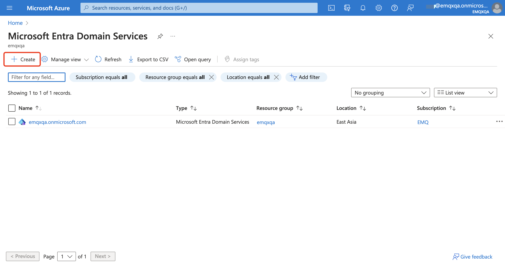
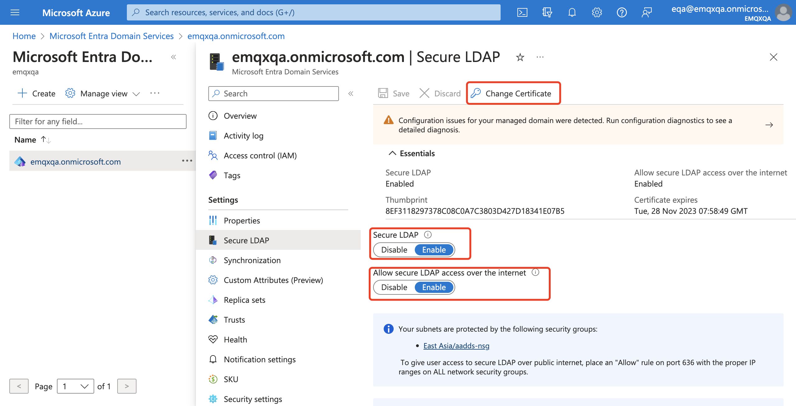
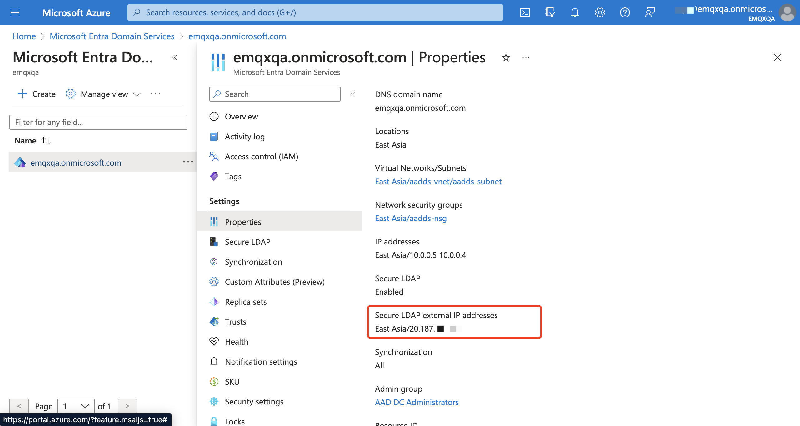
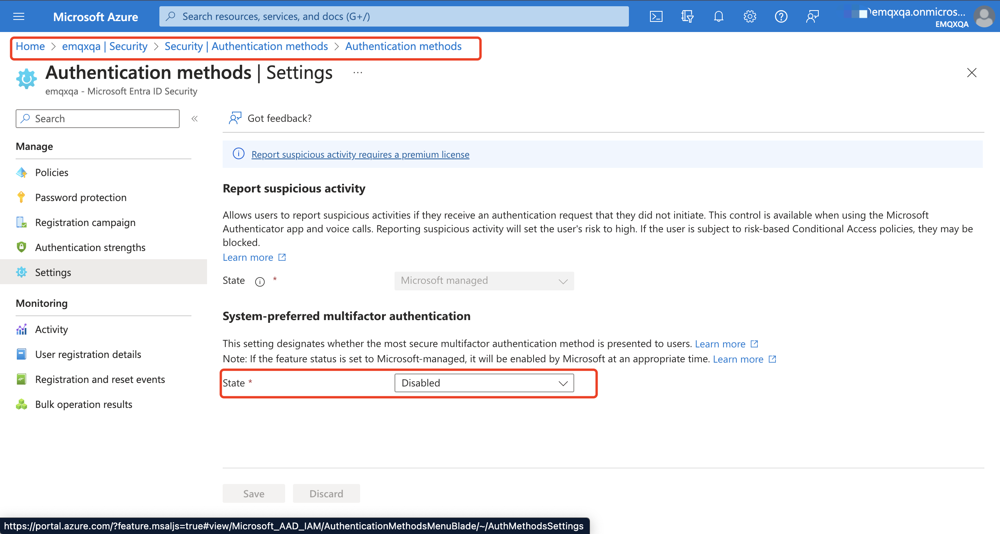
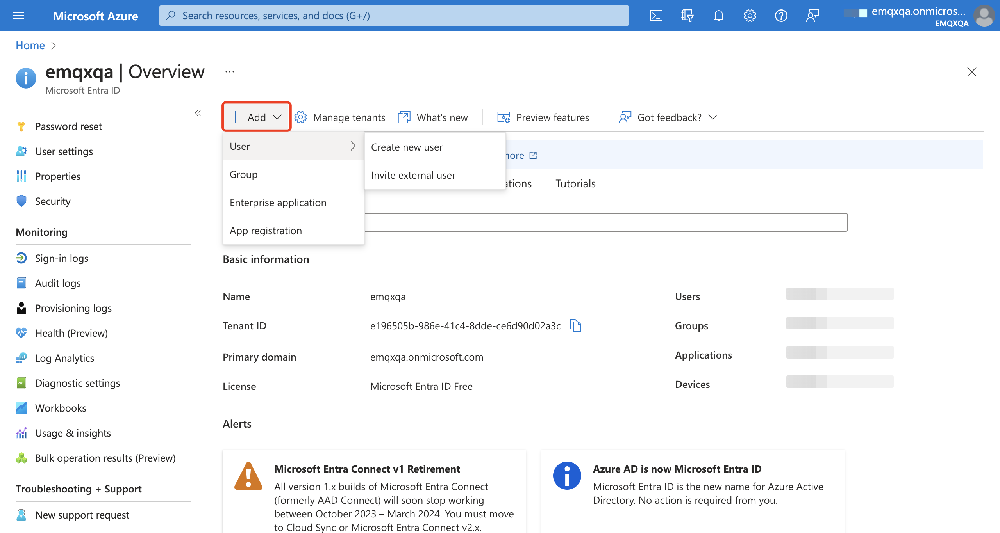
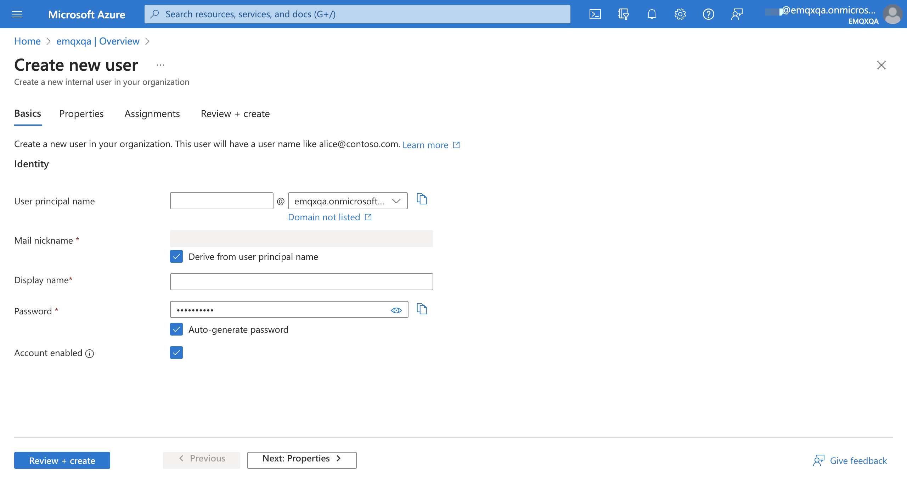
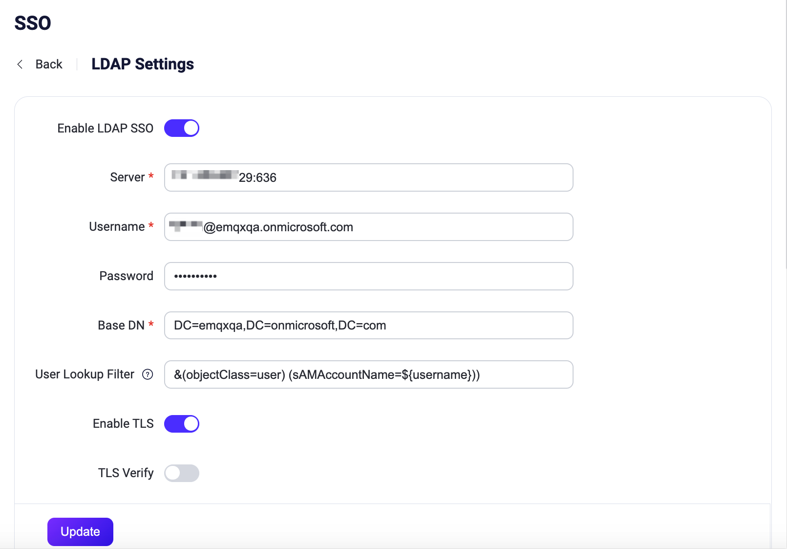
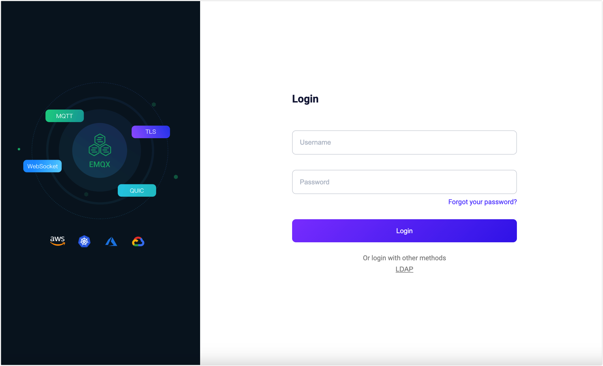
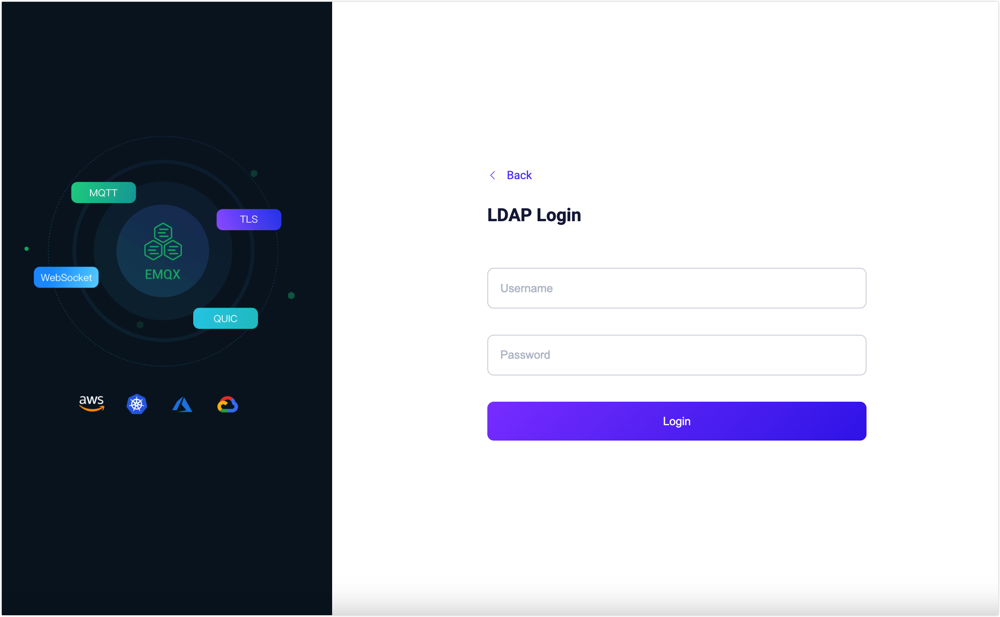

# OpenLDAP と Microsoft Entra ID SSO の設定

このページでは、Lightweight Directory Access Protocol（LDAP）に基づくシングルサインオン（SSO）の設定および使用方法について説明します。

EMQX は LDAPv3 プロトコルをサポートするディレクトリサービスと EMQX ダッシュボードを統合することで、LDAP ベースの SSO を実装しています。現在サポートされているディレクトリサービスプロバイダーは以下の通りです。

- [OpenLDAP](https://www.openldap.org/)
- [Microsoft Entra ID（旧 Azure AD）](https://azure.microsoft.com/en-in/products/active-directory)

::: tip 前提条件

[シングルサインオン（SSO）](./sso.md) の基本概念に慣れていることを推奨します。

:::

## OpenLDAP SSO の設定

このセクションでは、EMQX ダッシュボードで OpenLDAP SSO を有効化および設定する方法を案内します。

1. ダッシュボードにアクセスし、左側のナビゲーションメニューから **System Settings** -> **Single Sign-On** をクリックします。

2. **LDAP** オプションを選択し、**Enable** ボタンをクリックします。

3. **LDAP Settings** ページで設定情報を入力します。

   | オプション           | 説明                                                                                   |
   | -------------------- | -------------------------------------------------------------------------------------- |
   | Server               | OpenLDAP サーバーのアドレス。例：`localhost:389`                                     |
   | Username             | OpenLDAP サーバーにアクセスするための Bind DN                                        |
   | Password             | OpenLDAP サーバーにアクセスするためのユーザーパスワード                              |
   | Base DN              | OpenLDAP ディレクトリのベースオブジェクトエントリ名（またはルート）。ユーザー検索の起点となる場所 |
   | User Lookup Filter   | OpenLDAP でユーザーにマッチするフィルター。LDAP ユーザークエリ条件内の `${username}` は実際の入力ユーザー名に自動置換されます。 標準 LDAP の場合、デフォルトフィルターは `(&(objectClass=person)(uid=${username}))` です。 この変数置換機構により、異なるユーザー属性に基づく柔軟なクエリフィルターの構築が可能です。条件フォーマットの詳細は [LDAP Filters](https://ldap.com/ldap-filters/) を参照してください。 |
   | Enable TLS           | OpenLDAP へのアクセスに TLS セキュア通信を有効にするオプション。有効にする場合は証明書設定が必要です。詳細は [TLS for External Resource Access](./network/overview.md#tls-for-external-resource-access) を参照してください。 |

4. **Update** ボタンをクリックして設定を保存します。

これで OpenLDAP SSO が有効になり、[ログインとユーザー管理](#login-and-user-management) を参照して LDAP オプションを使ったダッシュボードへのログイン方法を確認できます。

## Microsoft Entra ID SSO の設定

このセクションでは、EMQX ダッシュボードで Microsoft Entra ID SSO を有効化および設定する方法を案内します。

### Microsoft Entra ID インスタンスの設定

ダッシュボードで Microsoft Entra ID SSO を設定する前に、Microsoft Entra ID インスタンスを設定して基本的な LDAP サーバー情報を取得する必要があります。

1. [Azure Portal](https://portal.azure.com) にサインインし、[このチュートリアル](https://learn.microsoft.com/en-us/entra/identity/domain-services/tutorial-create-instance) の手順に従って Microsoft Entra ドメインサービスを作成します。

   

2. セキュア LDAP 接続を有効にします。作成した Microsoft Entra ドメインサービスで、左の **Settings** メニューから **Secure LDAP** をクリックします。

   - **Secure LDAP** と **Allow secure LDAP access over the internet** のトグルスイッチを有効にします。
   - ページの指示に従い証明書を変更し、ネットワークセキュリティグループを設定して EMQX が Microsoft Entra ドメインサービスインスタンスにアクセスできるようにします。

   

3. ドメインサービスの **Setting** -> **Properties** をクリックし、**Secure LDAP external IP addresses** を取得します。これは EMQX が接続する LDAP サーバーの実際の IP アドレスとして保存してください。

   

4. [こちらのドキュメント](https://learn.microsoft.com/en-in/entra/fundamentals/create-new-tenant) の手順に従い、新しい Entra ID テナントを作成します。

5. EMQX で Microsoft Entra ID と SSO を設定するには、多要素認証を無効にする必要があります。Entra ID インスタンスで **Security** -> **Authentication Methods** -> **Settings** ページに移動し、**System-preferred multifactor authentication** を無効にします。

   

6. Entra ID インスタンスの **Overview** ページで **Add** -> **Users** -> **Create User** をクリックしユーザーを追加します。接続用ユーザーと EMQX ダッシュボードログイン用ユーザーの最低2名を追加してください。ユーザー追加後は Microsoft Entra ID に少なくとも一度ログインし、初期パスワードを変更する必要があります。その後、SSO を使ってダッシュボードにログイン可能になります。

   

   

### ダッシュボードでの Microsoft Entra ID SSO 設定

1. ダッシュボードにアクセスし、左側のナビゲーションメニューから **System Settings** -> **Single Sign-On** をクリックします。

2. **LDAP** オプションを選択し、**Enable** ボタンをクリックします。

3. **LDAP Settings** ページで LDAP サーバーの基本情報を入力します。

   - **Service**: Microsoft Entra ID のセキュア LDAP 外部 IP アドレスと暗号化 LDAP ポート `636` を `ip:port` 形式で入力します。

   - **Username**, **Password**: Entra ID への接続用に作成したユーザーとそのパスワードを入力します。

   - **Base DN**: Microsoft Entra ドメインサービスのドメイン名に基づいて入力します。例：`emqxqa.onmicrosoft.com` は `DC=emqxqa,DC=onmicrosoft,DC=com` と入力します。特定の部署やグループにユーザーを制限する属性を追加することも可能です。

   - **User Query Condition**: Microsoft Entra ID のデフォルトフィルターは `(&(objectClass=user)(sAMAccountName=${username}))` で、アカウント名（メールアドレス）でのログインを意味します。`sAMAccountName` を `mail` に置き換えてメールアドレスでのログインも可能です。

   - IP アドレス + セキュア LDAP 直接アクセスを使用するため、**Enable TLS** を有効にし、**Verify Server Certificate** は無効にしてください。

     

4. **Update** ボタンをクリックして設定を保存します。

これで Microsoft Entra ID SSO が有効になり、[ログインとユーザー管理](#login-and-user-management) を参照して LDAP オプションを使ったダッシュボードへのログイン方法を確認できます。

## ログインとユーザー管理

LDAP ベースの SSO を有効にすると、EMQX ダッシュボードのログインページに LDAP SSO オプションが表示されます。**LDAP** ボタンをクリックし、ユーザーに割り当てられた LDAP 認証情報（例：ユーザー名とパスワード）を入力して、**Login** ボタンをクリックしてください。

LDAP 認証に成功すると、EMQX は自動的にダッシュボードユーザーを追加します。追加されたユーザーは [Users](./dashboard/system.md#users) で管理可能で、役割や権限の割り当ても行えます。

## ログアウト

ユーザーはダッシュボード上部のナビゲーションバーにあるユーザー名をクリックし、ドロップダウンメニューの **Logout** ボタンをクリックしてログアウトできます。
