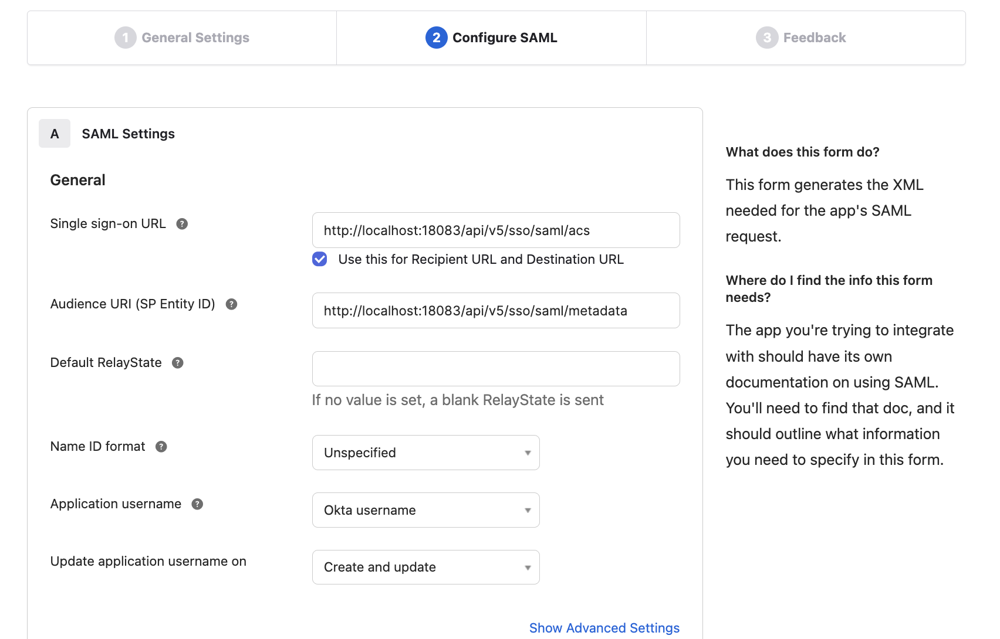
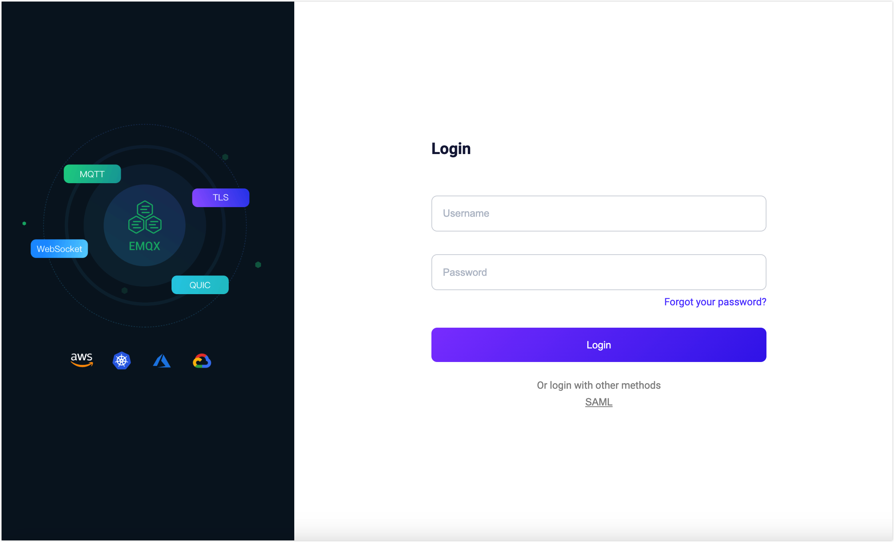

# SAMLベースのSSOの設定

このページでは、Security Assertion Markup Language（SAML）2.0標準プロトコルに基づくシングルサインオン（SSO）の設定および使用方法について説明します。

::: tip 前提条件

[シングルサインオン（SSO）](./sso.md)の基本概念に慣れていることを推奨します。

:::

## 対応しているSAMLサービス

EMQXダッシュボードは、SAML 2.0プロトコルをサポートするIDサービスと連携して、SAMLベースのSSOを有効にできます。対応例は以下の通りです。

- [Okta](https://www.okta.com/)
- [OneLogin](https://www.onelogin.com/)

その他のIDプロバイダーは現在統合中であり、今後のバージョンでサポート予定です。

## Oktaとの連携によるSSOの設定

このセクションでは、Oktaをアイデンティティプロバイダー（IdP）として使用し、SSOを設定する方法を案内します。Okta側とEMQXダッシュボード側の両方で設定を完了する必要があります。

### ステップ1：EMQXダッシュボードでOktaを有効化

1. ダッシュボードの **System** -> **SSO** に移動します。
2. **SAML 2.0**カードの **Enable** ボタンをクリックします。
3. 設定ページで以下の情報を入力します。
   - **Dashboard Address**：ユーザーが実際にアクセスするダッシュボードのアドレスを指定します。特定のパスは指定せず、例として `http://localhost:18083` のように入力してください。このアドレスはIdP側の設定に使う **SSO Address** と **Metadata Address** の生成に自動連結されます。
   - **SAML Metadata URL**：一旦空欄のままにしておき、ステップ2の設定完了後に入力します。
4. **Update** をクリックして設定を完了します。

### ステップ2：OktaのアプリケーションカタログにSAML 2.0アプリケーションを追加

1. 管理者としてOktaにログインし、**Okta Admin Console** にアクセスします。

2. **Applications -> Applications** ページに移動し、**Create App integration** ボタンをクリックします。ポップアップでサインイン方法として `SAML 2.0` を選択し、**Next** をクリックします。

3. **General Settings** タブでアプリケーション名を入力します。例：`EMQX Dashboard`。**Next** をクリックします。

4. **Configure SAML** タブで、ステップ1のダッシュボードで提供された情報を設定します。

   - **Single sign-on URL**：ダッシュボードで表示された **SSO Address** を入力します。例：`http://localhost:18083/api/v5/sso/saml/acs`
   - **Audience URI (SP Entity ID)**：ダッシュボードで表示された **Metadata Address** を入力します。例：`http://localhost:18083/api/v5/sso/saml/metadata`

   その他の情報は任意で、実際の要件に応じて設定してください。

5. 設定内容を確認し、**Next** をクリックします。

6. **Feedback** タブで **I'm an Okta customer adding an internal app** を選択し、必要に応じて他の情報を入力してから **Finish** をクリックし、アプリケーションの作成を完了します。

### ステップ3：Oktaでの設定完了とユーザー・グループの割り当て

1. Oktaの **Sign On** タブに移動し、**Metadata URL** をコピーします。
2. ダッシュボードに戻り、ステップ1の **SAML Metadata URL** にコピーしたURLを貼り付けて **Update** をクリックします。
3. Oktaの **Assignments** タブで、EMQXダッシュボードアプリケーションにユーザーやグループを割り当てます。ここで割り当てられたユーザーのみがこのアプリケーションにログイン可能です。

## ログインとユーザー管理

SAMLシングルサインオンを有効化すると、EMQXダッシュボードのログインページにSSOオプションが表示されます。**SAML** ボタンをクリックすると、IdPの事前設定されたログインページに遷移し、割り当てられたユーザーの認証情報を入力してログインできます。

SAML認証が成功すると、EMQXは自動的にダッシュボードユーザーを追加します。追加されたユーザーは[ユーザー管理](./dashboard/system.md#users)で管理でき、役割や権限の割り当ても可能です。

## ログアウト

ユーザーはダッシュボードの上部ナビゲーションバーにあるユーザー名をクリックし、ドロップダウンメニューの **Logout** ボタンを押してログアウトできます。ただし、これはダッシュボードからのログアウトのみであり、SAMLは現時点でシングルサインアウトをサポートしていませんのでご注意ください。
