# EMQX 概要
EMQX は「無制限の接続、シームレスな統合、どこでも展開」を実現する大規模分散型 MQTT メッセージングプラットフォームです。高性能かつスケーラブルな MQTT メッセージサーバーとして、EMQX Enterprise は IoT アプリケーション向けに信頼性の高いリアルタイムメッセージ伝送とデバイス接続ソリューションを提供します。EMQX は50カ国以上、2万社以上の法人ユーザーを有し、世界中で1億台以上の IoT デバイスを接続し、企業のデジタル化、リアルタイム化、インテリジェント化の変革を支えています。

商用のセルフホスト型 MQTT メッセージングプラットフォームである [EMQX Enterprise](https://www.emqx.com/en/products/emqx) は、クラスターあたり最大1億の同時 MQTT 接続をサポートします。単一サーバーで毎秒数百万の MQTT メッセージを処理しつつ、ミリ秒単位のレイテンシを維持します。強力な組み込みルールエンジンとデータ統合機能により、大量の IoT データのリアルタイム処理、変換、ルーティングを実現。IoT データを多様なバックエンドデータベースや分析ツールとシームレスに連携し、企業が競争力の高い IoT プラットフォームやアプリケーションを迅速に構築できるよう支援します。

## 主なメリット

- [**大規模スケール**](https://www.emqx.com/en/blog/how-emqx-5-0-achieves-100-million-mqtt-connections): 単一クラスター内で20ノード以上の水平スケールにより1億 MQTT 接続を実現。
- [**業務クリティカルな信頼性**](operate/cluster/mria-introduction.md): 組み込みの RocksDB データパーシステンスによりデータ損失を防止。
- [**データセキュリティ**](https://www.emqx.com/en/use-cases/mqtt-security): エンドツーエンドのデータ暗号化と細粒度アクセス制御でデータを保護。
- [**複数プロトコル対応**](https://www.emqx.com/en/blog/iot-protocols-mqtt-coap-lwm2m): MQTT、QUIC、CoAP、Stomp、LwM2M など多彩なプロトコルをサポート。
- [**完全な MQTT 5.0 対応**](https://www.emqx.com/en/blog/introduction-to-mqtt-5): MQTT 5.0 と 3.x 両方の標準に完全準拠し、スケーラビリティ、セキュリティ、信頼性を向上。
- [**高性能**](https://www.emqx.com/en/blog/mqtt-performance-benchmark-testing-emqx-single-node-supports-2m-message-throughput): ノードごとに毎秒数百万の MQTT メッセージを効率的に処理。
- [**低レイテンシ**](https://www.emqx.com/en/blog/mqtt-performance-benchmark-testing-emqx-single-node-message-latency-response-time): ソフトリアルタイムランタイムでミリ秒未満のメッセージ伝送を保証。
- [**完全な可観測性**](operate/dashboard/introduction.md): 監視、アラート、リアルタイム MQTT トレースによる高度なエンドツーエンド分析。
- [**クラウドネイティブ＆K8s 対応**](https://www.emqx.com/en/emqx-kubernetes-operator): Kubernetes Operator と Terraform を使いオンプレミスやパブリッククラウドに容易にデプロイ可能。

## 主なコンポーネント

EMQX Enterprise は複数のコンポーネントで構成され、強力かつスケーラブルな MQTT メッセージングプラットフォームを構築します。以下は EMQX Enterprise の主要コンポーネントです。

### デバイス接続

EMQX Enterprise は MQTT 5.0 と 3.x 仕様に100%準拠し、優れたスケーラビリティにより膨大な数の MQTT デバイスクライアント接続を容易に処理できます。[接続数の詳細](https://www.emqx.com/en/blog/reaching-100m-mqtt-connections)。同時に HTTP、QUIC、LwM2M/CoAP などのオープン標準プロトコルもサポートし、多様な IoT デバイスやシナリオに対応。ファイル転送や遅延パブリッシュなどの機能も拡張し、利用シーンを豊かにしています。

#### MQTT over QUIC

EMQX Enterprise は先駆的に [MQTT over QUIC](develop/mqtt-over-quic/introduction.md) プロトコルを導入し、IoT クライアントが QUIC 経由で EMQX に接続して通信可能にします。QUIC を利用することで接続性能やメッセージスループットが向上し、メッセージレイテンシを低減。特に、ネットワーク環境が不安定でリンクの切り替えが頻繁に発生するインターネット・オブ・ビークル（IoV）などのシナリオでリアルタイムかつ効率的なメッセージ伝送要件を満たします。

#### マルチプロトコルゲートウェイ

[マルチプロトコルゲートウェイ](develop/gateway/gateway.md) により、EMQX Enterprise は MQTT 以外の異なる通信プロトコルを使うデバイス接続もサポートします。ゲートウェイはデバイスの接続要求を受け付け、使用されている通信プロトコルを識別し、各プロトコル仕様に従ってデバイスから送信されるメッセージやコマンド、データを解析。これらを MQTT メッセージ形式に変換してメッセージ処理に渡します。

### メッセージルーティング

EMQX Enterprise は [パブリッシュ/サブスクライブ](get-started/messaging/introduction.md) パターンをサポートし、高信頼のメッセージ伝送機構を提供。メッセージが意図したデバイスやアプリケーションに確実に届くようにします。QoS 機構やセッション保持機能により、不安定なネットワーク環境下でも迅速かつ確実なデータ配信を実現し、業務の継続性と安定性を確保します。

### 分散クラスタリング

EMQX Enterprise はネイティブの [クラスタリング](operate/cluster/introduction.md) 機能を備え、シームレスかつ弾性的なスケーリングを可能にし、単一障害点を排除します。極限まで最適化された単一ノードは毎秒数百万の MQTT メッセージを低レイテンシで処理・配信可能。クラスターの水平スケールにより最大1億の同時 MQTT 接続をサポートし、IoV、産業オートメーション、スマートホームなど大規模 IoT 展開に不可欠な基盤を提供します。

### アクセス制御とデータセキュリティ

[TLS/SSL 暗号化](operate/network/overview.md)と[認証](operate/access-control/authn/authn.md)/[認可](operate/access-control/authz/authz.md)機構により、EMQX Enterprise はデバイス間のデータ送信の機密性と完全性を保証します。

ユーザー名/パスワード、JWT、拡張認証、PSK、X.509 証明書など複数のクライアント認証方式を提供。ACL に基づくパブリッシュ/サブスクライブ認可機構も備えています。認証・認可情報は LDAP、HTTP サービス、SQL、NoSQL データベースなど外部企業セキュリティシステムと連携・管理可能で、多様かつ柔軟なクライアントセキュリティ保護を実現。

さらに、EMQX Enterprise は[監査ログ](operate/dashboard/audit-log.md)、ロール・権限管理、[シングルサインオン](operate/dashboard/sso.md)を提供し、SOC 2 準拠や GDPR データプライバシー保護に対応。包括的なセキュリティ機能で業界標準に準拠した信頼性の高い IoT アプリケーション構築を支援します。

### ルールエンジンとデータ統合

EMQX Enterprise は強力な [ルールエンジン](develop/data-integration/rules.md) を備え、EMQX 内でルールを設定して受信データを要件に応じて処理・ルーティング可能。Sink 機能を使ってクラウドサービスやデータベースと連携し、IoT データをクラウドに転送して保存・分析できます。

#### リアルタイムデータ処理

組み込みの SQL ベースルールエンジン、スキーマレジストリ、メッセージコーデック、[Flow Designer](develop/flow-designer/introduction.md) により、デバイスイベントやメッセージ処理フローを簡単に作成・編集可能。IoT データのリアルタイム抽出、検証、フィルタリング、変換を実現します。

#### 企業向けデータ統合

標準搭載の Webhook や Sink/Source を通じて、Kafka、AWS RDS、MongoDB、Oracle、SAP、時系列データベースなど40以上のクラウドサービスや企業システムとシームレスに[統合](develop/data-integration/data-bridges.md)可能。企業は IoT デバイスのデータを効果的に管理・分析・活用し、多様なアプリケーションや業務ニーズに対応できます。

### 管理・監視ダッシュボード

EMQX Enterprise は [ダッシュボード](operate/dashboard/introduction.md) と呼ばれるグラフィカル管理システムを提供し、主要メトリクスや運用状況をリアルタイムで監視可能。クライアント接続や機能設定の管理を簡素化します。ダッシュボードはクライアントやクラスターの異常診断・デバッグも可能にし、MQTT デバイスのエンドツーエンドトラブルシューティングを支援、問題解決時間を大幅に短縮します。さらに、Prometheus、Datadog、OpenTelemetry 対応サービスなど外部サービスへの可観測性メトリクス統合もサポートし、運用監視能力を強化します。

## デプロイメントモードとエディション比較

EMQ は EMQX のデプロイメントとして、2つのマネージドサービス（EMQX Serverless と EMQX Dedicated）と1つのセルフホスト型（EMQX Enterprise）を提供しています。要件に最適なデプロイメントを選択できるよう、以下の表に各タイプの機能サポート比較を示します。詳細な機能比較は [Feature Comparison](get-started/feature-comparison.md) を参照してください。

<table>
<thead>
  <tr>
    <th colspan="1">セルフホスト</th>
    <th colspan="2">MQTT as a Service</th>
  </tr>
</thead>
<tbody>
  <tr>
    <td>EMQX Enterprise</td>
    <td>EMQX Serverless</td>
    <td>EMQX Dedicated</td>
  </tr>
  <tr>
    <td><a href="https://www.emqx.com/en/apply-licenses/emqx">無料トライアルライセンス取得</a></td>
    <td><a href="https://accounts.emqx.com/signup?continue=https%3A%2F%2Fcloud-intl.emqx.com%2Fconsole%2Fdeployments%2F0%3Foper%3Dnew">無料で開始</a></td>
    <td><a href="https://accounts.emqx.com/signup?continue=https%3A%2F%2Fcloud-intl.emqx.com%2Fconsole%2Fdeployments%2F0%3Foper%3Dnew">14日間無料トライアル開始</a></td>
  </tr>
  <tr>
    <td>✔️ Business Source License (BSL) 1.1 ✔️ MQTT over QUIC ✔️ RocksDB によるセッション永続化 ✔️ Kafka/Confluent、Timescale、InfluxDB、PostgreSQL、Redis など40以上の企業システムとのデータ統合 ✔️ 監査ログおよびシングルサインオン（SSO） ✔️ ロールベースアクセス制御（RBAC） ✔️ ファイル転送 ✔️ メッセージコーデック ✔️ OCPP、JT/808、GBT32960 などを含むマルチプロトコルゲートウェイ ✔️ 24時間365日のグローバル技術サポート  </td>
    <td>✔️ 従量課金制 ✔️ 毎月無料クォータ ✔️ 最大1000接続 ✔️ 数秒でデプロイ開始 ✔️ 自動スケーリング ✔️ 8時〜17時のグローバル技術サポート</td>
    <td>✔️ 14日間無料トライアル ✔️ 時間単位課金 ✔️ 世界中のマルチクラウドリージョン ✔️ 柔軟なスペック選択 ✔️ VPC ピアリング、NAT ゲートウェイ、ロードバランサーなど ✔️ 40以上のクラウドサービスとの即時統合 ✔️ 24時間365日のグローバル技術サポート  </td>
  </tr>
</tbody>
</table>

## ユースケース

EMQX Enterprise は包括的な IoT メッセージングプラットフォームとして、IoT デバイス接続やデータ伝送のさまざまな段階で重要な役割を果たし、多様なビジネスニーズに強力な機能と柔軟性を提供します。

パブリッシュ-サブスクライブのメッセージ配信モデルに基づき、数百万のトピックや多様なモードで柔軟なメッセージ通信を実現し、さまざまなシナリオのリアルタイムメッセージ配信ニーズに応えます。組み込みのルールエンジンや Sink/Source により、メッセージを各種クラウドサービスに送信し、デバイスデータを企業システムとシームレスに統合可能。データ処理、保存、分析、業務指令発行などのユースケースを容易にサポートします。以下は代表的なユースケースです。

### 双方向通信

EMQX Enterprise は多様なデバイスとアプリケーションエンドポイント間の接続をサポートし、双方向通信を実現します。例えばスマートホームでは、モバイルアプリが各種センサーのデータを取得し、必要に応じて制御コマンドをデバイスに送信可能。このモードにより、デバイス間およびデバイスとアプリケーション間で柔軟な1対1または1対多通信が可能です。

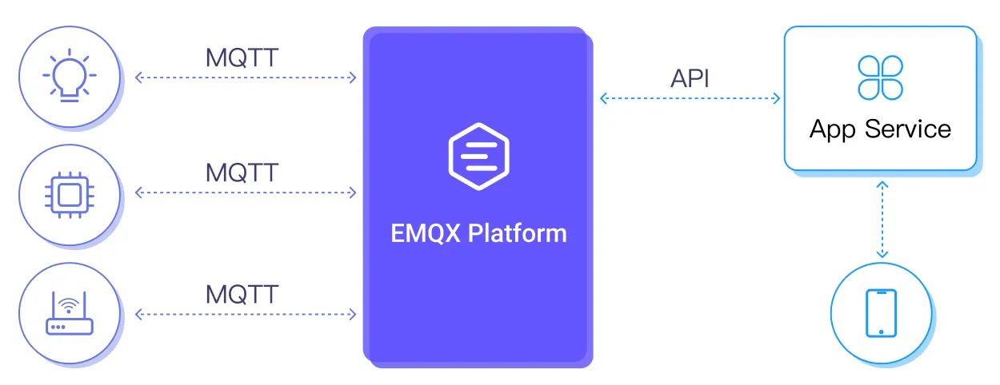

ミッションクリティカルなアプリケーションにおける双方向通信の主な利点は以下の通りです。

- **トピックベースのパブリッシュ/サブスクライブメッセージング**：EMQX のトピックベースモデルにより効率的かつ柔軟なメッセージルーティングを実現。
- **超低レイテンシ配信**：1ミリ秒以下のレイテンシで高速データ転送を実現し、リアルタイム応答性を確保。
- **包括的な QoS 保証**：EMQX はエンドツーエンドの多層 QoS 保証を提供し、信頼性と柔軟性の高いメッセージ配信を実現。

以下により具体的な利用シナリオを示します。

#### ピアツーピア通信

EMQX を使ってピアツーピア通信を構築可能です。非同期の Pub/Sub モデルでは、メッセージパブリッシャーとサブスクライバーは動的に追加・削除でき、相互に疎結合です。この疎結合性がアプリケーションやメッセージ通信の柔軟性を高めます。

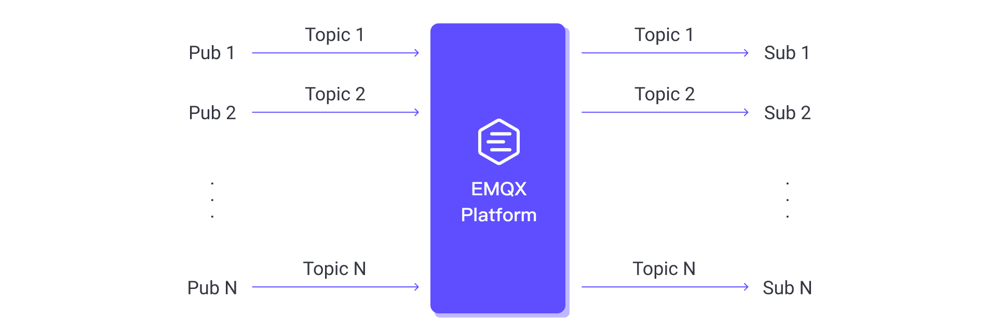

#### 大規模向けメッセージブロードキャスト

EMQX は金融市場の情報配信など1対多メッセージングが重要なシナリオに強みを発揮。多数のクライアントに対してタイムリーにメッセージをブロードキャストします。

#### 大規模エンドポイントからのデータ集約

EMQX の多対1メッセージパターンは工場プラント、近代的なビル、小売チェーン、電力網など大規模ネットワークのデータ集約に最適。ネットワーク内のエンドポイントから中央のバックエンドサーバー（クラウドまたはオンプレミス）へデータ転送・伝送を支援します。

#### リクエスト-レスポンス認識によるトレーサブル通信

EMQX は MQTT 5.0 のリクエスト-レスポンス機能をサポート。これにより非同期通信アーキテクチャにおける通信の認識性とトレーサビリティを向上させます。

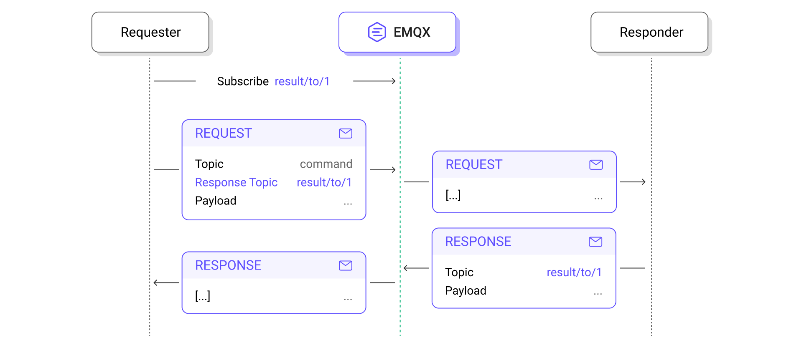

### 流れるデータの変換

強力な SQL ベースの [ルールエンジン](develop/data-integration/rules.md) により、EMQX は流れるデータをリアルタイムに抽出、フィルタリング、付加価値付与、変換可能。処理済みデータは外部 HTTP サーバーや MQTT サービスに容易に取り込めます。EMQX Enterprise では主流のデータベース、データストレージ、メッセージキューへの取り込みも可能です。

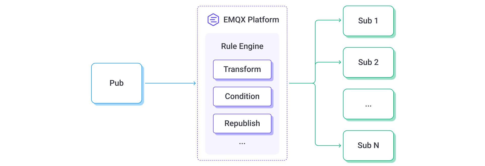

### 異なるネットワーク間のデータ統合

区切られた、または制限されたネットワーク環境でも、EMQX はデータ統合を実現し、シームレスなメッセージング環境を提供します。

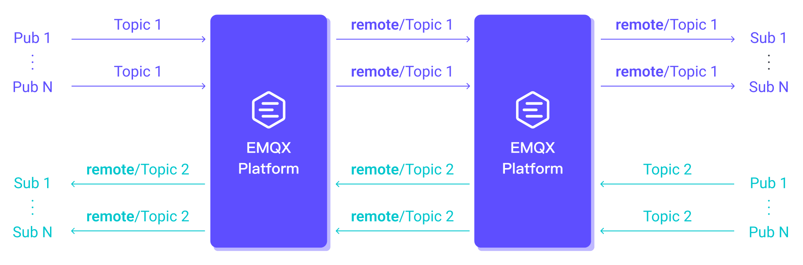

### テレメトリデータのアップロード

EMQX Enterprise はデバイスデータをクラウドにアップロードし、クラウド上で指定トピックのデータを処理・保存可能。例えば工業生産シナリオでは、工場の各種産業機器データをリアルタイム処理し、製品品質のトレーサビリティや生産分析のためデータベースに保存します。視覚的に設定でき、豊富なデータ処理機能を活用した迅速な開発を支援します。

### 大容量ファイルアップロード

EMQX Enterprise は MQTT プロトコルの[ファイル転送](develop/file-transfer/introduction.md)機能を提供し、デバイスから大容量ファイルをアップロードしてローカルまたは S3 ストレージに保存可能。例えば IoV シナリオでは、機械学習ログファイルやパッケージ化された CAN バスデータをクラウドストレージに送信し、インテリジェント運転アルゴリズムモデルの更新に活用します。構造化データとファイル型データを統一チャネルで扱い、アプリケーションの複雑さと保守コストを削減します。

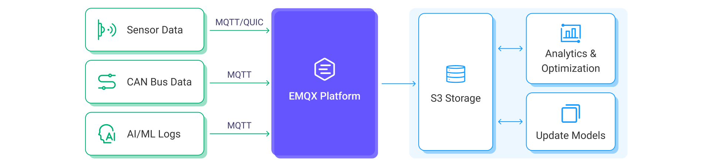

### クラウドベースの制御コマンド発行

EMQX Enterprise は MQTT メッセージ、REST API、Kafka などの Source を通じてメッセージ発行を可能にし、データプッシュやリモートデバイス制御を実現。例えば金融取引シナリオでは、クラウドサービスがユーザーのウォッチリストに基づくリアルタイムデータをグループにプッシュします。このモードはトピックマッピング、発行向けデータ処理、データ到達統計を提供し、柔軟かつ信頼性の高いデータ発行を可能にします。

## 業界ソリューション

EMQX Enterprise は多様な業界に対応した IoT ソリューションを提供し、信頼性の高いデータ接続、効率的な伝送、柔軟な処理を通じてイノベーションと業務効率化を推進します。

### 自動車

#### インターネット・オブ・ビークル（IoV）およびテレマティクスサービスプロバイダー

TSP プラットフォームの未来は「データ駆動」と「サービス指向」です。成功には車両との信頼性の高い接続、効率的なデータ伝送、柔軟なデータ処理が不可欠。EMQX は堅牢で高性能、かつメンテナンスが容易なデータインフラ構築に欠かせません。[**詳細はこちら →**](https://www.emqx.com/en/blog/revolutionizing-tsp-platforms)

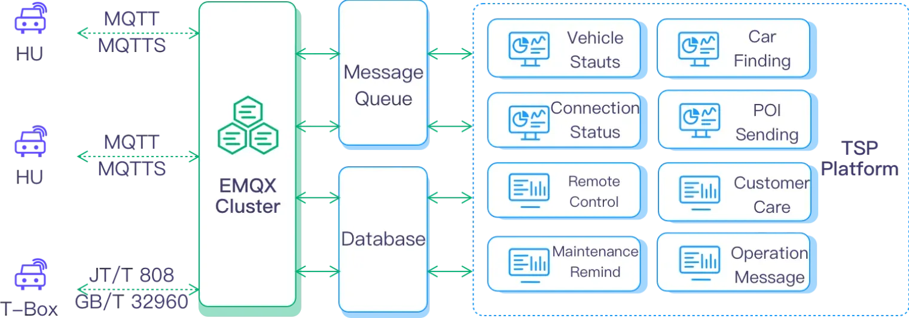

#### スマートコックピットおよび車載インフォテインメント

EMQ のクラウド側エンドツーエンド協調ソフトウェアアーキテクチャに基づき、自動車メーカーのスマートコックピットの中核機能構築を支援。車両とクラウドの連携を実現します。[**詳細はこちら →**](https://www.emqx.com/en/use-cases/smart-cockpit)

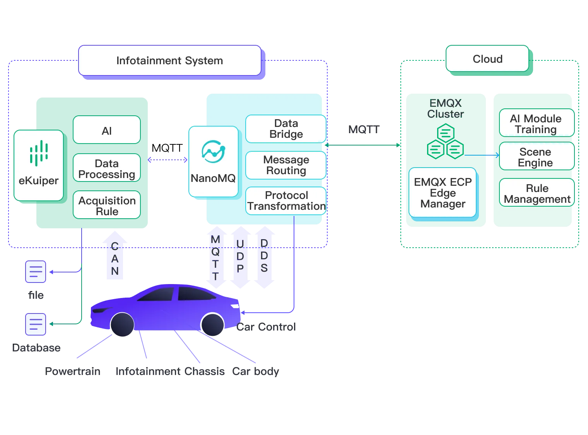

#### 電気自動車充電ネットワーク

EV Power は EMQX を活用し、分散した設備エリアの制御困難や過酷な展開環境の課題を解決する充電スタンド運用プラットフォームを構築。[**詳細はこちら →**](https://www.emqx.com/en/customers/ev-power)

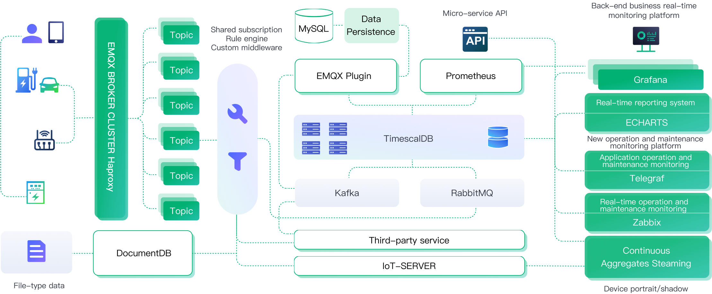

### 交通・輸送

#### 物流資産管理

EMQ は物流資産管理向けにデータ駆動型の包括的ソリューションを提供。データ収集、伝送、処理機能により、企業は資産をリアルタイムに監視し、有益な情報を得て管理の意思決定や競争力向上に活用可能。[**詳細はこちら →**](https://www.emqx.com/en/blog/a-data-driven-solution-for-logistics-asset-tracking-and-maintenance)

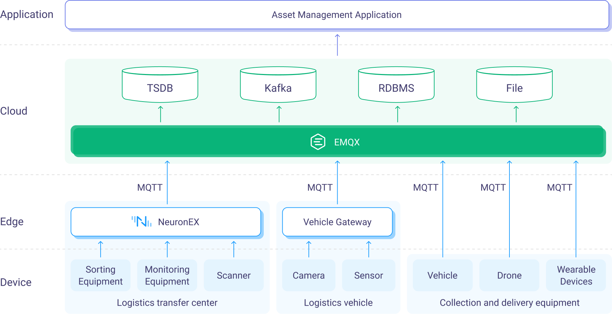

#### フリート管理

物流業界の複雑かつ動的な性質を踏まえ、輸送・配送過程での車両フリートの効果的な監視、スケジューリング、最適化が不可欠。貨物のタイムリーかつ信頼性の高い配送、コスト最適化、顧客満足は効率的なフリート管理に大きく依存。[**詳細はこちら →**](https://www.emqx.com/en/blog/how-emqx-revolutionizes-logistics-fleet-management)

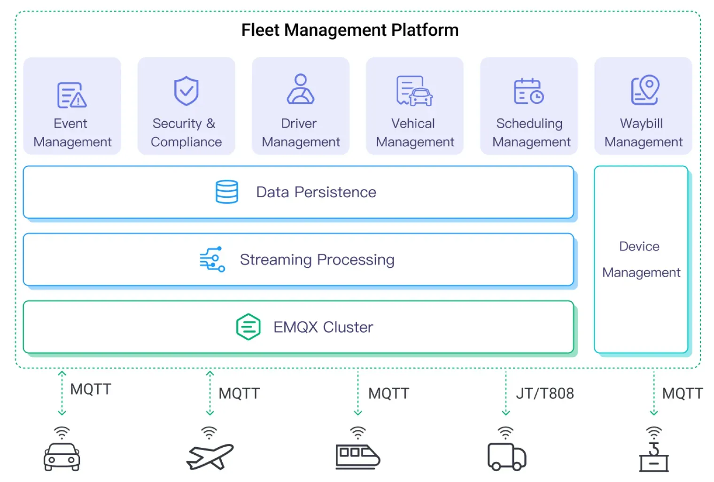

#### 車車間通信（V2X）

[V2X（vehicle-to-everything）](https://www.emqx.com/en/blog/what-is-v2x-and-the-future-of-vehicle-to-everything-connectivity) は車両が他の車両（V2V）、歩行者（V2P）、インフラ（V2I）、ネットワーク（V2N）など周囲の要素とデータ交換する通信技術。CVIS（協調型車両インフラシステム）はインテリジェント交通システムの有望な方向性であり、V2X 技術と各種センサー技術、クラウドコンピューティング、エッジコンピューティング、交通制御の統合が求められます。EMQX がこの全体像で果たす重要な役割をご覧ください。[**詳細はこちら →**](https://www.emqx.com/en/blog/enhancing-v2x-connectivity-with-emq)

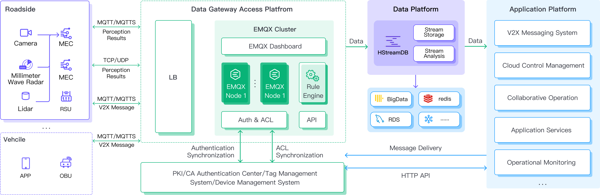

### 製造業および IIoT

EMQ スマートファクトリーソリューションは、包括的なデータ収集、伝送、分配などの仕組みを構築。設備の健康管理、エネルギー消費最適化、生産監視・分析、製品品質トレーサビリティ、サプライチェーンのパラメータ最適化、予知保全、不良検出など多様なインテリジェントアプリケーションの迅速展開を可能にします。[**詳細はこちら →**](https://www.emqx.com/en/blog/data-infrastructure-for-smart-factory)

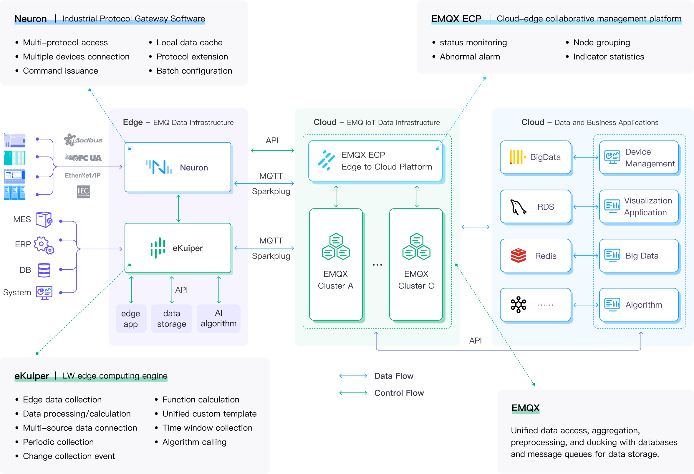

### 石油・ガス

EMQ は石油業界向けにリアルタイムデータ収集と油田 IoT 端末のクラウド側協調管理をサポートする IoT データ収集ソリューションを提供。[**詳細はこちら →**](https://www.emqx.com/en/use-cases/oil-extraction-transportation)

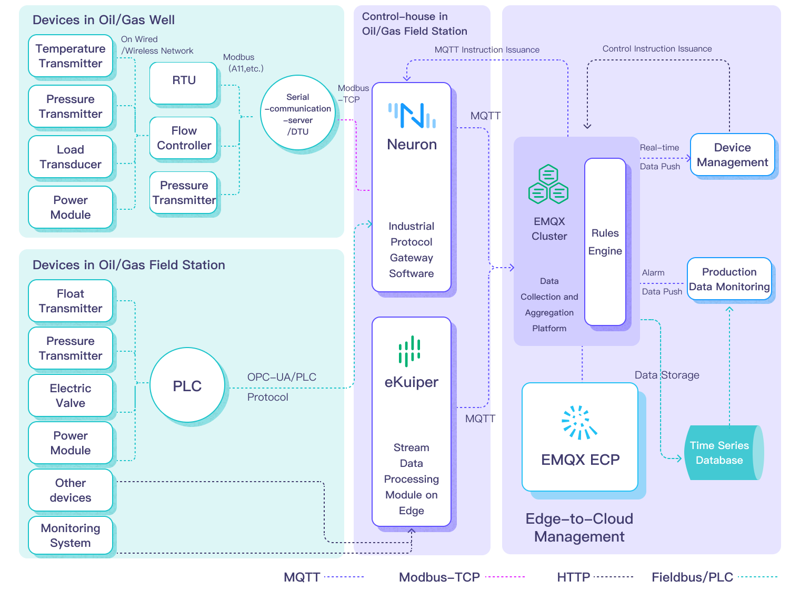

### 金融・決済

EMQ の金融決済業界向けソリューションは、24時間365日の連続サービスを実現し、企業ユーザー向けに5年以上にわたる安定稼働とサービスを提供し続けています。[**詳細はこちら →**](https://www.emqx.com/en/customers/emqx-in-finance-and-payment-iot)

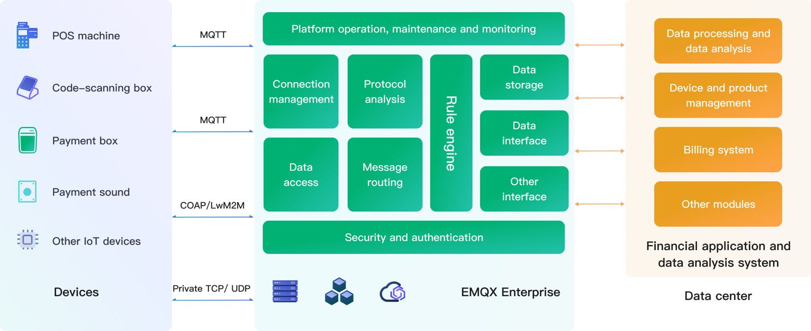

### エネルギー・公益事業

EMQ の IoT メッセージングミドルウェア技術と SGITG の国家電網技術・市場の強みを活かし、次世代電力 IoT 製品の共同開発を推進。[**詳細はこちら →**](https://www.emqx.com/en/customers/sgitg-sgcc)

### キャリア

EMQ との深い協力により、イーサーフィング IoT は CTWing を世界最大規模のグループレベル NB-IoT デバイス接続プラットフォームに構築。累計接続デバイス数は数百万に達しています。[**詳細はこちら →**](https://www.emqx.com/en/customers/china-telecom)

### 家電・AIoT

EMQX ベースの IoT データアクセスプラットフォームは、インテリジェントサービスロボット企業に安定かつ効率的なデータアクセスサービスを提供し、5000以上のエンドカスタマーへのリーチを支援しています。[**詳細はこちら →**](https://www.emqx.com/en/customers/intelligent-service-robot-aiot)
