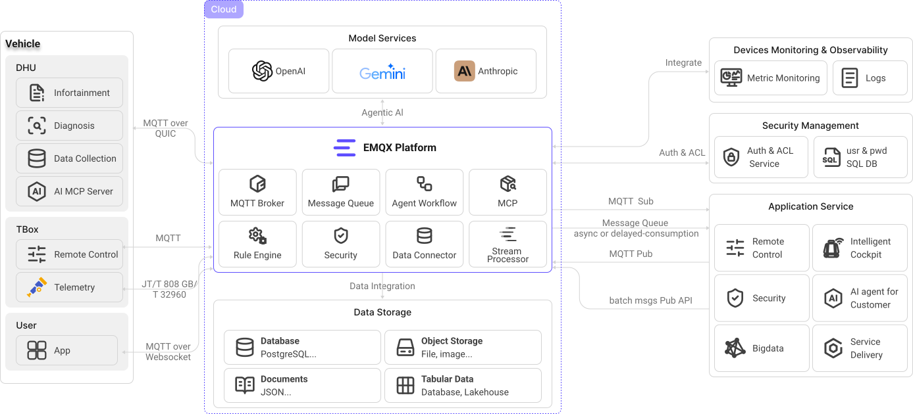
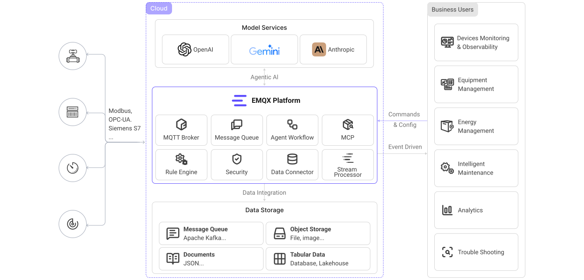
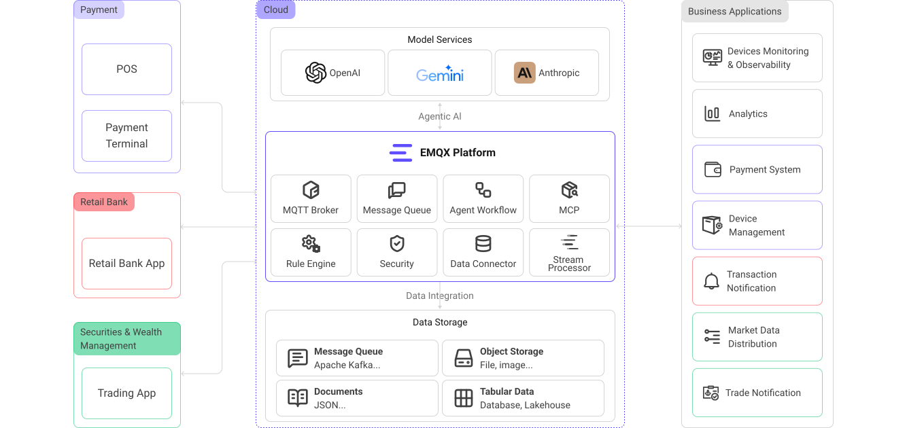
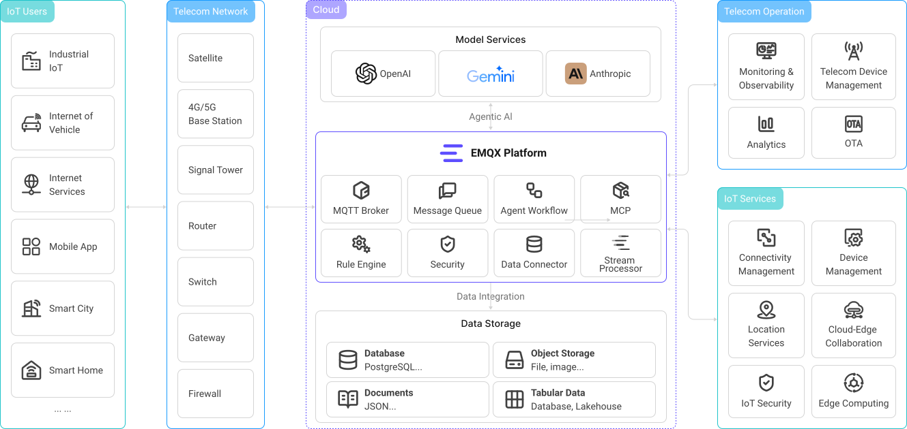
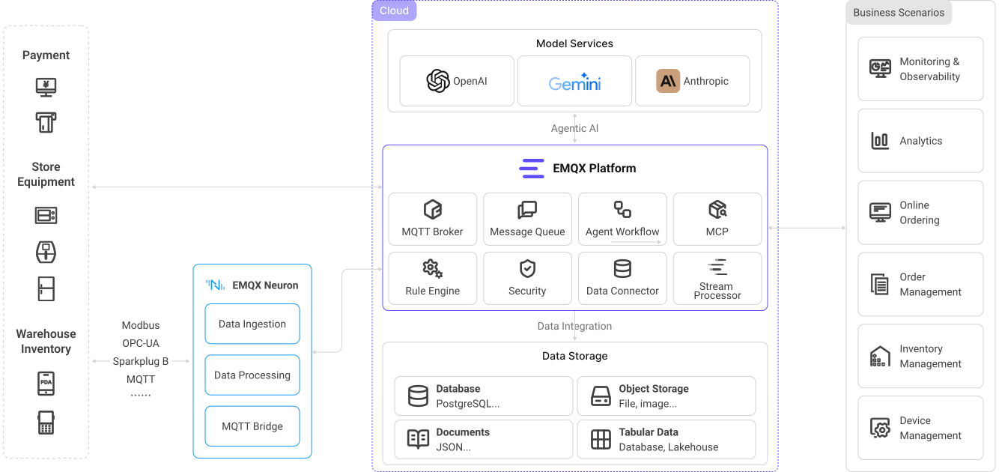

# EMQX概要
EMQXは「無制限の接続、シームレスな統合、どこでもデプロイ」を実現する大規模分散型MQTTメッセージングプラットフォームです。高性能かつスケーラブルなMQTTメッセージサーバーとして、EMQX EnterpriseはIoTアプリケーション向けに信頼性の高いリアルタイムメッセージ伝送とデバイス接続ソリューションを提供します。EMQXは50か国以上の2万社以上の企業ユーザーを有し、世界中で1億台以上のIoTデバイスを接続し、企業のデジタル化、リアルタイム化、インテリジェント化の変革を支えています。

商用のセルフホスト型MQTTメッセージングプラットフォームである[EMQX Enterprise](https://www.emqx.com/en/products/emqx)は、クラスターあたり最大1億の同時MQTT接続をサポートします。単一サーバーで毎秒数百万のMQTTメッセージを処理しつつ、ミリ秒単位のレイテンシを維持します。強力な組み込みルールエンジンとデータ統合機能により、EMQX Enterpriseは大量のIoTデータのリアルタイム処理、変換、ルーティングを実現します。IoTデータを様々なバックエンドデータベースや分析ツールとシームレスに統合し、企業が競争力のあるIoTプラットフォームとアプリケーションを迅速に構築できるよう支援します。

## 主なメリット

- [**大規模スケール**](https://www.emqx.com/en/blog/how-emqx-5-0-achieves-100-million-mqtt-connections)：単一ノードで150万MQTTデバイス接続を安定サポートし、クラスターは水平スケールで最大1億の同時MQTT接続を処理可能。
- [**業務重要性の高い信頼性**](./deploy/cluster/mria-introduction.md)：組み込みのRocksDBによるデータパーシステンスでデータ損失を防止。
- [**データセキュリティ**](./access-control/security-guide.md)：エンドツーエンドの暗号化と細粒度のアクセス制御でデータを保護。
- [**複数プロトコル対応**](https://www.emqx.com/en/blog/iot-protocols-mqtt-coap-lwm2m)：MQTT、QUIC、CoAP、Stomp、LwM2Mなどに対応。
- [**完全なMQTT 5.0対応**](https://www.emqx.com/en/blog/introduction-to-mqtt-5)：EMQXはMQTT 5.0および3.x規格に完全準拠し、優れたスケーラビリティ、セキュリティ、信頼性を提供。
- [**高性能**](https://www.emqx.com/en/blog/mqtt-performance-benchmark-testing-emqx-single-node-supports-2m-message-throughput)：ノードごとに毎秒数百万のMQTTメッセージを効率的に処理。
- [**低レイテンシ**](https://www.emqx.com/en/blog/mqtt-performance-benchmark-testing-emqx-single-node-message-latency-response-time)：ソフトリアルタイムランタイムによりミリ秒以下のメッセージ伝送を保証。
- [**完全な可観測性**](./dashboard/introduction.md)：リアルタイムMQTTトレーシングによる監視、アラート、高度なエンドツーエンド分析。
- [**クラウドネイティブ＆K8s対応**](./deploy/kubernetes/kubernetes.md)：**Kubernetes Operator**を利用しオンプレミスやパブリッククラウドに容易にデプロイ可能。

## 主なコンポーネント

EMQX Enterpriseは複数のコンポーネントで構成され、強力かつスケーラブルなMQTTメッセージングプラットフォームを構築します。以下はEMQX Enterpriseの主要コンポーネントです。

### デバイス接続

EMQX EnterpriseはMQTT 5.0および3.x仕様に100％準拠し、卓越したスケーラビリティにより膨大な数のMQTTデバイスクライアント[接続](https://www.emqx.com/en/blog/reaching-100m-mqtt-connections)を容易に処理します。同時にHTTP、QUIC、LwM2M/CoAPなどの他のオープン標準プロトコルもサポートし、幅広いIoTデバイスとシナリオの接続を可能にします。さらにファイル転送や遅延パブリッシュなどの機能も拡張し、利用ケースを豊富にしています。

#### MQTT over QUIC

EMQX Enterpriseは先駆的に[MQTT over QUIC](./mqtt-over-quic/introduction.md)プロトコルを導入し、IoTクライアントがQUIC経由でEMQXに接続して通信可能にします。QUICを利用するデバイスは接続性能とメッセージスループットを向上させ、メッセージレイテンシを低減します。これは特にネットワーク環境が不安定でリンクの変動が多いIoV（Internet of Vehicles）などのシナリオに適しています。MQTT over QUICはリアルタイムかつ効率的なメッセージ伝送の要件を満たします。

#### マルチプロトコルゲートウェイ

[マルチプロトコルゲートウェイ](./gateway/gateway.md)は、MQTT以外の異なる通信プロトコルを用いたデバイス接続をEMQX Enterpriseに可能にします。これらのゲートウェイはデバイスの接続要求を受け付け、使用されている通信プロトコルを識別し、各プロトコル仕様に基づいてデバイスから送信されたメッセージ、コマンド、データを解析します。解析したデータはMQTTメッセージ形式に変換され、以降のメッセージ処理に渡されます。

### メッセージルーティング

EMQX Enterpriseは[パブリッシュ／サブスクライブ](./messaging/introduction.md)パターンをサポートし、高信頼性のメッセージ伝送機構を提供します。これによりメッセージは対象デバイスやアプリケーションに確実に届きます。QoS機構とセッション保持機能により、不安定なネットワーク環境下でも迅速かつ確実にデータを届け、業務の継続性と安定性を確保します。

### 分散クラスター

EMQX Enterpriseはネイティブな[クラスタリング](./deploy/cluster/introduction.md)機能を備え、シームレスかつ弾力的なスケールアウトを可能にし、単一障害点を排除します。徹底的な最適化により単一ノードで毎秒数百万のMQTTメッセージを[低レイテンシ](https://www.emqx.com/en/blog/mqtt-performance-benchmark-testing-emqx-single-node-message-latency-response-time)で処理・配信可能です。クラスターの水平スケールにより最大1億の同時MQTT接続をサポートし、IoV、産業オートメーション、スマートホームなど大規模IoT展開に不可欠です。

### アクセス制御とデータセキュリティ

[TLS/SSL暗号化](./network/overview.md)および[認証](./access-control/authn/authn.md)/[認可](./access-control/authz/authz.md)機構により、EMQX Enterpriseはデバイスデータ伝送の機密性と完全性を保証します。

EMQX Enterpriseはユーザー名／パスワード、JWT、拡張認証、PSK、X.509証明書など複数のクライアント認証方式を備えています。ACLに基づくパブリッシュ／サブスクライブの認可機構も提供します。認証・認可データはLDAP、HTTPサービス、SQL／NoSQLデータベースなど外部企業セキュリティシステムと統合・管理可能で、多様かつ柔軟なクライアントセキュリティ保護を実現します。

さらにEMQX Enterpriseは[監査ログ](./dashboard/audit-log.md)、ロール・権限管理、[シングルサインオン](./dashboard/sso.md)を備え、SOC 2準拠やGDPRデータプライバシー保護に対応。包括的なセキュリティ機能により、企業が業界セキュリティ基準に準拠した信頼性の高いIoTアプリケーションを構築できます。

### ルールエンジンとデータ統合

EMQX Enterpriseは強力な[ルールエンジン](./data-integration/rules.md)を内蔵し、EMQX内でルールを設定して受信データを要件に応じて処理・ルーティング可能です。Sink機能を使い、クラウドサービスやデータベースと連携してIoTデータをクラウドに転送し、保存・分析を行うこともできます。

#### リアルタイムデータ処理

SQLベースのルールエンジン、スキーマレジストリ、メッセージコーデック、[Flowデザイナー](./flow-designer/introduction.md)を活用し、デバイスイベントやメッセージ処理フローを簡単に作成・編集可能。IoTデータのリアルタイム抽出、検証、フィルタリング、変換を実現します。

#### 企業向けデータ統合

標準搭載のWebhookやSink/Sourceを通じて、Kafka、AWS RDS、MongoDB、Oracle、SAP、時系列データベースなど40以上のクラウドサービスや企業システムとシームレスに[統合](./data-integration/data-bridges.md)可能。企業はIoTデバイスからのデータを効果的に管理・分析・活用し、多様なアプリケーションや業務ニーズを支援します。

### 管理・監視ダッシュボード

EMQX Enterpriseは[ダッシュボード](./dashboard/introduction.md)というグラフィカル管理システムを提供し、主要指標や運用状況をリアルタイムに監視可能です。クライアント接続や機能設定の管理を簡素化し、クライアントやクラスターの異常診断・デバッグを支援。MQTTデバイスのオンライン状態をエンドツーエンドでトラブルシューティングでき、問題解決時間を大幅に短縮します。また、Prometheus、Datadog、OpenTelemetry対応サービスなど外部サービスへの可観測性指標の統合もサポートし、運用監視機能を強化します。

## デプロイモードとエディション比較

EMQはEMQXのデプロイに3つの選択肢を提供しています。2つのマネージドサービス（EMQX Serverless、EMQX Dedicated）と1つのセルフホスト型（EMQX Enterprise）です。要件に最適なデプロイを選ぶため、以下の表に各デプロイタイプの機能サポート比較を示します。詳細な機能比較は[機能比較](./getting-started/feature-comparison.md)を参照してください。

<table>
<thead>
  <tr>
    <th colspan="1">セルフホスト</th>
    <th colspan="2">MQTT as a Service</th>
  </tr>
</thead>
<tbody>
  <tr>
    <td>EMQX Enterprise</td>
    <td>EMQX Serverless</td>
    <td>EMQX Dedicated</td>
  </tr>
  <tr>
    <td><a href="https://www.emqx.com/en/apply-licenses/emqx">無料トライアルライセンス取得</a></td>
    <td><a href="https://accounts.emqx.com/signup?continue=https%3A%2F%2Fcloud-intl.emqx.com%2Fconsole%2Fdeployments%2F0%3Foper%3Dnew">無料で始める</a></td>
    <td><a href="https://accounts.emqx.com/signup?continue=https%3A%2F%2Fcloud-intl.emqx.com%2Fconsole%2Fdeployments%2F0%3Foper%3Dnew">14日間無料トライアル開始</a></td>
  </tr>
  <tr>
    <td>✔️ Business Source License (BSL) 1.1 ✔️ MQTT over QUIC ✔️ RocksDBによるセッションパーシステンス ✔️ Kafka/Confluent、Timescale、InfluxDB、PostgreSQL、Redisなど40以上の企業システムとのデータ統合 ✔️ 監査ログとシングルサインオン（SSO） ✔️ ロールベースアクセス制御（RBAC） ✔️ ファイル転送 ✔️ メッセージコーデック ✔️ OCPP、JT/808、GBT32960対応のマルチプロトコルゲートウェイ ✔️ 24時間365日のグローバル技術サポート  </td>
    <td>✔️ 従量課金制 ✔️ 毎月無料クォータあり ✔️ 最大1000接続 ✔️ 数秒でデプロイ開始 ✔️ 自動スケーリング ✔️ 8時〜17時のグローバル技術サポート</td>
    <td>✔️ 14日間無料トライアル ✔️ 時間単位課金 ✔️ 世界各地のマルチクラウドリージョン ✔️ 柔軟なスペック選択 ✔️ VPCピアリング、NATゲートウェイ、ロードバランサーなど ✔️ 40以上のクラウドサービスとの標準統合 ✔️ 24時間365日のグローバル技術サポート  </td>
  </tr>
</tbody>
</table>

## ユースケース

EMQX Enterpriseは包括的なIoTメッセージングプラットフォームとして、IoTデバイス接続やデータ伝送の各段階で重要な役割を果たし、多様なビジネスニーズに強力な機能と柔軟性を提供します。

パブリッシュ・サブスクライブのメッセージ配信モデルに基づき、数百万のトピックと多様なモードで柔軟なメッセージ通信を実現し、様々なシナリオのリアルタイムメッセージ伝送要件に対応します。組み込みルールエンジンとSink/Sourceを通じて、メッセージを各種クラウドサービスに送信し、デバイスデータを企業システムとシームレスに統合可能です。データ処理、保存、分析、業務指令発行などのユースケースを容易にサポートします。以下は代表的なユースケースです。

### 双方向通信

EMQX Enterpriseは様々なデバイスとアプリケーションエンドポイント間の接続をサポートし、双方向通信を実現します。例えばスマートホームでは、モバイルアプリが複数のデバイスからセンサーデータを取得し、必要に応じて制御コマンドを送信できます。このモードはデバイス間およびデバイスとアプリケーション間の1対1または1対多の柔軟な通信を可能にします。

ミッションクリティカルなアプリケーションにおける双方向通信の主な利点は以下の通りです。

- **トピックベースのパブリッシュ／サブスクライブメッセージング**：EMQXのトピックベースモデルにより効率的かつ柔軟なメッセージルーティングを実現。
- **超低レイテンシ配信**：1ミリ秒以下のレイテンシで高速データ転送を実現し、リアルタイム応答性を確保。
- **包括的なQoS保証**：EMQXはエンドツーエンドの多層QoS保証を提供し、信頼性と柔軟性の高いメッセージ配信を実現。

以下により具体的な利用シナリオを示します。

#### ピアツーピア通信

EMQXを用いてピアツーピア通信を構築可能です。非同期のパブリッシュ／サブスクライブモデルでは、メッセージパブリッシャーとサブスクライバーは動的に追加・削除でき、相互に疎結合となります。この疎結合性がアプリケーションとメッセージ通信に柔軟性をもたらします。

#### 大規模向けメッセージブロードキャスト

EMQXは金融市場の情報配信など、1対多メッセージングが重要なシナリオに強みを発揮します。多数のクライアントに対して効果的にメッセージをブロードキャストし、タイムリーな情報伝達を実現します。

#### 大規模エンドポイントからのデータ集約

EMQXの多対1メッセージパターンは、工場プラント、近代的なビル、小売チェーン、電力網など大規模ネットワークのデータ集約に最適です。ネットワーク内のエンドポイントからのデータをクラウドまたはオンプレミスの集中バックエンドサーバーへ転送・伝送できます。

#### リクエスト・レスポンス認識によるトレーサブル通信

EMQXはMQTT 5.0のRequest-Response機能をサポートしています。この機能により非同期通信アーキテクチャにおける通信認識性とトレーサビリティを向上可能です。

### 流れるデータの変換

強力なSQLベースの[ルールエンジン](./data-integration/rules.md)を内蔵し、EMQXは流れるデータをリアルタイムに抽出、フィルタリング、強化、変換できます。処理済みデータは外部HTTPサーバーやMQTTサービスに容易に取り込めます。EMQX Enterpriseでは主流のデータベース、データストレージ、メッセージキューへの取り込みも可能です。

### 異なるネットワーク間のデータ統合

パーティション化された、または制限されたネットワーク環境でも、EMQXはデータ統合を構築し、シームレスなメッセージング環境を提供します。

### テレメトリデータアップロード

EMQX Enterpriseはデバイスデータのクラウドへのアップロードと、クラウド上での指定トピックのデータ処理・保存をサポートします。例えば産業生産シナリオでは、工場フロアの各種産業機器データをリアルタイムに処理し、製品品質のトレーサビリティや生産分析のためにデータベースに保存します。このモードは視覚的に設定可能で、豊富なデータ処理機能を活用した迅速な開発を実現します。

### 大容量ファイルアップロード

EMQX EnterpriseはMQTTプロトコルの[ファイル転送](./file-transfer/introduction.md)機能を提供し、デバイスが大容量ファイルデータをアップロードし、ローカルまたはS3ストレージに保存可能です。例えばIoVシナリオでは、機械学習ログファイルやパッケージ化されたCANバスデータをクラウドストレージに送信し、インテリジェント運転アルゴリズムモデルの更新に活用します。このモードは構造化データとファイル型データを統一チャネルで扱い、アプリケーションの複雑性と保守コストを削減します。

### クラウドベースの制御コマンド発行

EMQX EnterpriseはMQTTメッセージ、REST API、KafkaなどのSourceを通じてメッセージ発行を可能にし、データプッシュやリモートデバイス制御を実現します。例えば金融取引シナリオでは、クラウドサービスがユーザーのウォッチリストに基づくリアルタイムデータをグループにプッシュします。このモードはトピックマッピング、発行用データ処理、データ到達統計を提供し、柔軟かつ信頼性の高いデータ発行を可能にします。

## 業界別ソリューション

EMQX Enterpriseは多様な業界向けに汎用的なIoTソリューションを提供し、ミッションクリティカルなアプリケーションに信頼性の高いリアルタイム接続を実現します。コネクテッドビークルからスマート製造まで、EMQXは大規模なイノベーションを支えます。

### 自動車・コネクテッドビークル

EMQXはソフトウェア定義車両（SDV）の未来を支え、世界の主要自動車メーカー上位10社のうち5社の100以上の車種、3000万台以上の車両を接続しています。プラットフォームはミッションクリティカルなV2Xやテレマティクスアプリケーションのリアルタイムデータ基盤を提供し、不安定なネットワーク環境に最適化された[MQTT over QUIC](./mqtt-over-quic/introduction.md)を採用しています。

- **コネクテッドカー＆SDV**：グローバル車両群のリモート診断、双方向コマンド制御、OTAアップデートを実現。[**詳細はこちら →**](https://www.emqx.com/en/solutions/internet-of-vehicles)
- **フリートテレマティクス**：リアルタイムの位置追跡、利用ベース保険（UBI）、予知保全を超低レイテンシデータストリームで提供。[**詳細はこちら →**](https://www.emqx.com/en/solutions/fleet-telematics)
- **EV充電ネットワーク**：充電ステーション管理、スマート充電、V2G対応のスケーラブルMQTT接続。
- **自動車製造**：工場フロアのロボット、PLC、センサーを接続し、継続的な監視と品質保証を実現。[**詳細はこちら →**](https://www.emqx.com/en/solutions/industrial-iot)

SAICフォルクスワーゲンはEMQXを活用し、160万台超のコネクテッド車両向け次世代IoVプラットフォームを構築。リモート制御とリアルタイムデータ監視を支えています。[**事例紹介 →**](https://www.emqx.com/en/customers/saic-volkswagen)

### 輸送・物流

一秒を争う業界で、EMQXはリアルタイムの車両可視化、不安定ネットワーク下での信頼性あるデータ伝送、地理分散デプロイによるレイテンシ最小化を提供。数十万台の車両とデバイスを単一の統合基盤に接続します。

- **フリート管理**：車両位置追跡、ドライバー行動監視、リアルタイムルート最適化で燃料コスト削減と配送時間短縮を実現。[**詳細はこちら →**](https://www.emqx.com/en/solutions/fleet-management)
- **スマート都市交通**：大量の交通データを処理し、リアルタイム分析とインテリジェント交通システムを実現。
- **V2X通信**：安全性向上、交通効率化、自動運転支援のためのVehicle-to-Everything通信を可能に。[**詳細はこちら →**](https://www.emqx.com/en/solutions/software-defined-vehicles)
- **コールドチェーン監視**：温度・湿度をリアルタイム監視し、コンプライアンス遵守と腐敗防止を実現。

深圳都市交通計画センター（SUTPC）はEMQXを用いて170万台超の車両データを処理し、リアルタイム交通分析とインテリジェント交通システムを実現しています。[**事例紹介 →**](https://www.emqx.com/en/customers/sutpc)

### 製造・IIoT

EMQXは工場フロアからクラウドまで全ての機械、システム、アプリケーションを接続し、OTとITをAIネイティブなデータ基盤で橋渡しします。Modbus、OPC-UA、Siemens S7など100以上の産業プロトコルをサポートし、Sparkplug B対応の[統一ネームスペース（UNS）](https://www.emqx.com/en/solutions/unified-namespace)アーキテクチャを実現します。

- **予知保全**：リアルタイムセンサーデータとAIで機械故障を予測し、計画外ダウンタイムを防止、設備寿命を延長。
- **OEE最適化**：リアルタイムで総合設備効率を追跡し、最大25％のOEE向上と40％のダウンタイム削減を実現。
- **品質・トレーサビリティ**：品質異常を即検知、生産パラメータをリアルタイム監視し、製品の完全なトレーサビリティを提供。
- **ライブパフォーマンス監視**：EMQXの[メトリクスと可観測性](./observability/overview.md)機能を活用し、PrometheusやDatadogと連携した生産ライン全体のライブダッシュボードを実現。

主要半導体ファブはEMQXを活用し、1プラントあたり350万以上のデータタグを100ms収集率で処理、100％のデータ完全性を維持し精密製造を支えています。[**詳細はこちら →**](https://www.emqx.com/en/solutions/industrial-iot)

### エネルギー・公益事業

EMQXは現代のエネルギーグリッドを支え、1,000万以上のエンドポイントを100ms以下のレイテンシで接続し、重要なグリッド制御と保護アプリケーションを実現。レガシーOTプロトコルと最新ITシステムを[マルチプロトコルゲートウェイ](./gateway/gateway.md)で橋渡しします。

**スマートグリッド＆再生可能エネルギー**
- **グリッドバランシング**：分散型エネルギー資源（DER）を統合し、需給変動にリアルタイム対応してグリッド安定性を確保。
- **EV充電管理**：スマート充電とV2G機能を備えたスケーラブルなEV充電ネットワークを構築。
- **予知資産保全**：変電所、変圧器、再生可能エネルギー資産をリアルタイム監視し、故障予測と保全最適化を実現。

**石油・ガス**
- **遠隔資産監視**：井戸口、ポンプ、パイプラインなど遠隔資産をリアルタイム監視・制御。
- **パイプライン漏洩検知**：センサーのリアルタイム圧力・流量データを解析し、漏洩を即時検知・特定。

華北油田はEMQXを用いて4万以上のデータ収集ポイントを接続し、油田運用のリアルタイム監視とインテリジェント分析を実現しています。[**事例紹介 →**](https://www.emqx.com/en/customers/huabei-oilfield-company)

### ヘルスケア

EMQXはリアルタイム患者モニタリング、医療機器統合、次世代テレヘルスソリューションをスケーラブルかつ[セキュアなデータ基盤](./access-control/security-guide.md)で実現します。HIPAA準拠のセキュリティ機能として、[TLS/SSL暗号化](./network/overview.md)、堅牢な認証、細粒度アクセス制御を提供し、機微な患者データを保護します。

- **遠隔患者モニタリング（RPM）**：患者のバイタルサインや健康状態を自宅から継続監視し、早期介入と再入院削減を支援。
- **医療機器統合**：輸液ポンプ、人工呼吸器、検査機器のデータを統合し、患者ケアの統一ビューを提供。
- **スマート病院オートメーション**：医療資産管理から患者フロー、環境条件最適化まで病院運営を自動化。
- **テレヘルス・遠隔医療**：患者と医療提供者間のリアルタイム通信とデータ交換を実現し、遠隔診療を支援。

### 金融サービス

EMQXはミリ秒レベルのレイテンシ、銀行グレードのセキュリティ、24時間365日の連続稼働を備えたリアルタイム金融アプリケーションを支えています。企業レベルの金融ユーザーに5年以上安定稼働を提供しています。

- **リアルタイムPOS監視**：数百万のPOS端末を接続し、取引データとデバイス状態をリアルタイム監視、予防保全を実現。
- **不正検知**：取引データを即時分析し、不正行為を顧客影響前に検出・防止。
- **モダン決済システム**：モバイル決済、デジタルウォレット、リアルタイム決済・清算の信頼性高い低レイテンシ基盤を構築。
- **市場データ配信**：株価や取引などのリアルタイム市場データを数千クライアントに最小レイテンシで配信。

[**事例紹介 →**](https://www.emqx.com/en/customers/emqx-in-finance-and-payment-iot)

### 通信

EMQXはキャリアグレードのスケーラビリティを備え、単一プラットフォームで1億以上の同時デバイス接続をサポート。MQTT、CoAP、LwM2Mなどのマルチプロトコル対応によりIT/OT/CTのシームレス統合を実現します。

- **5G IoTプラットフォーム**：5Gネットワーク上で数億のIoTデバイスを安定接続し、付加価値サービスの基盤を提供。
- **ネットワーク監視**：ネットワークインフラの健全性・性能をリアルタイム監視し、問題を事前に検知・解決。
- **スマートシティ基盤**：交通システム、公共交通、公益事業、緊急サービスを接続するスマートシティのデータ基盤を構築。

中国電信はEMQXを活用し、全国IoTプラットフォームCTWingを構築。1億以上の同時デバイス接続を支えています。[**事例紹介 →**](https://www.emqx.com/en/customers/china-telecom)

### 小売・コンシューマIoT

EMQXは数百万の小売デバイスとコンシューマIoTエンドポイントを接続し、オムニチャネル体験、スマートホームオートメーション、インタラクティブアプリケーションのリアルタイムデータ移動を可能にします。

- **スマートリテール**：リアルタイム在庫管理、POS監視、パーソナライズ顧客エンゲージメント、動的価格設定を全店舗で実現。数千のセルフサービスキオスクを接続し、ピーク時もシームレスな顧客体験を提供。
- **スマートホーム**：数百万のスマートホームデバイスをスケーラブルな[パブリッシュ／サブスクライブメッセージング](./messaging/introduction.md)基盤で接続し、ホームオートメーション、エネルギー監視、AlexaやGoogle Assistantとの統合を実現。
- **ゲーム＆ソーシャル**：数百万の同時ユーザー向けに超低レイテンシ通信で応答性の高いオンラインゲームやソーシャルアプリを構築。ゲーム内チャット、リアルタイム通知、ライブイベントをサポート。

Signify（旧Philips Lighting）はEMQXを活用し、数百万の接続照明の信頼性高いリアルタイム制御を実現。位置情報ベースのソーシャルアプリJAGATはEMQXで数百万ユーザーのリアルタイムメッセージングを支えています。[**事例紹介 →**](https://www.emqx.com/en/customers/how-jagat-achieved-seamless-social-interaction-with-emqx)
