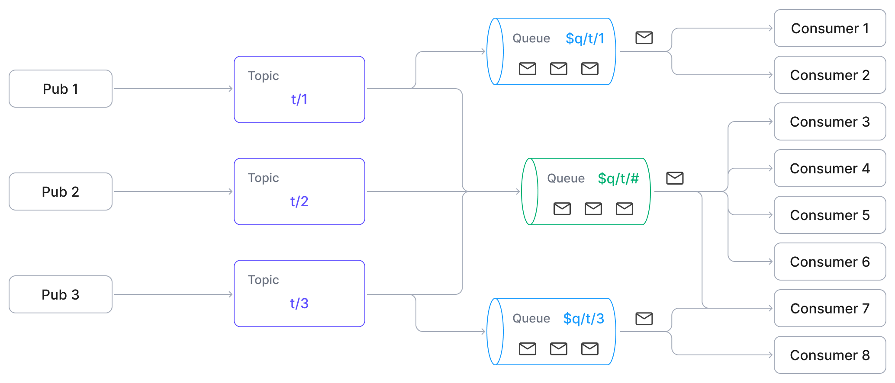

# メッセージキュー

EMQX 6.0で導入されたメッセージキュー機能は、MQTTのサブスクライブ／パブリッシュパターンを耐久性のあるキューセマンティクスで拡張し、信頼性の高い非同期メッセージ配信を可能にします。RabbitMQのようなエンタープライズグレードのメッセージキューで一般的に見られる機能を、追加のインフラなしでネイティブMQTTの機能に付加します。

本ページでは、EMQXのメッセージキュー機能の設計動機、主要概念、内部アーキテクチャ、メッセージフロー、実際の適用シナリオを包括的に解説します。

## メッセージキューとは？

EMQXにおけるメッセージキューは、サブスクライバーの有無に関係なくMQTTメッセージを保持する耐久性のあるサーバー側バッファです。各キューは特定のトピックフィルターに紐づけられており、その寿命の間にフィルターにマッチするすべてのメッセージを自動的に保存します。

従来のMQTTの動作とは異なり、メッセージキューはクライアントがオンラインでない場合でもメッセージを永続化します。クライアントは特別な`$q/{topic}`形式をサブスクライブすることでこれらのメッセージを消費できます。

メッセージキューは組み込みの耐久ストレージを使用します。メッセージキューを有効化する前に、EMQXのデータディレクトリがローカルファイルシステムを使用していることを確認してください。[組み込み耐久ストレージのバックエンド](../design/durable-storage.md#embedded-backends)はNFSやSMB/CIFSなどのネットワークファイルシステムをサポートしていません。

## なぜメッセージキューを使うのか？

MQTTは軽量で広く採用されているパブリッシュ／サブスクライブプロトコルですが、デフォルトの動作ではメッセージ配信がサブスクライバーのオンライン状態に強く依存しており、非同期や遅延消費のシナリオには制約があります。

### MQTTの制約

MQTTは[共有サブスクリプション](../messaging/mqtt-shared-subscription.md)（`$share/{group}/topic`）を通じてキューのような機能を一部サポートしていますが、以下の制限があります。

- サブスクライバーがオンラインでない場合、メッセージは保持されません。
- TTL（有効期限）、キューサイズ制限、オーバーフロー制御の組み込みサポートがありません。
- キーごとに最新値だけを保持するようなメッセージ重複排除機能がありません。
- キューの明示的なライフサイクル管理がありません。

これらの制限により、以下のようなパターンの実装が困難です。

- デバイスがオンラインになる前にコマンドを送信する。
- 常時接続していないワーカーにタスクを送る。
- 最新の状態や設定更新のみを保持する。

### メッセージキューによるMQTTの拡張

メッセージキューはEMQXにおけるMQTTプロトコルの拡張であり、サブスクライバーのオンライン状態に関係なくメッセージを永続化し、後続の処理を可能にします。主な特徴は以下の通りです。

- **クライアントがオフラインでもメッセージを永続化**：キューは厳密な順序付けを保証しませんが、信頼性の高い非同期配信を実現し、軽量なMQTT通信と高度なエンタープライズメッセージングのギャップを埋めます。
- **明示的なキュー宣言とプロパティ設定**：各キューはTTL、サイズ制限、ディスパッチ戦略などの設定が可能で、メッセージの保持と配信を細かく制御できます。
- **オプションの最新値セマンティクス**：同じキーを持つメッセージは前のものを上書きし、最新の状態や設定更新のみを保持する用途に最適です。

## メッセージキューの概念

- **キュー名**  
  キューを識別するMQTTトピックまたはトピックフィルター。マッチするトピックにパブリッシュされたメッセージは自動的にキューに格納されます。
- **キュー宣言**  
  耐久性のあるキューを作成し、動作を設定可能なプロパティで定義するプロセス。
- **キュー削除**  
  キューとそのすべての保存メッセージを削除する操作。
- **最新値セマンティクス**  
  キュー宣言時に**キューキー式**を設定することで有効化できるオプション機能。EMQXはキューに入る各メッセージから`キューキー`を抽出し、同じキーの未消費メッセージがあれば新しいメッセージで上書きします。状態管理や設定更新など、最新値のみが重要な用途に適しています。
- **トピックプレフィックス**  
  キューのサブスクリプションは特別な`$q/{topic}`プレフィックスを使用し、通常のMQTTサブスクリプションと区別されます。
- **キュープロパティ**  
  メッセージ保持時間やディスパッチ戦略など、キューの動作を制御するカスタマイズ可能な設定。
- **QoS（サービス品質）**  
  メッセージキュー内のすべてのメッセージは、パブリッシュやサブスクライブ時のQoSレベルに関わらずQoS 1（少なくとも一度配信）で配信されます。これにより信頼性の高いメッセージ配信が保証され、キューの配信動作が統一されます。
- **メッセージ永続化**  
  サブスクライバーが接続していなくてもメッセージは保持されます。デフォルトでは最新値セマンティクスが適用されます。キー式を設定しない通常のキューでは、受信順にメッセージが保存されます。

## メッセージキューの動作

EMQXのメッセージキュー機能は疎結合な拡張として実装されており、内部フックを使ってパブリッシュおよびサブスクライブ操作をインターセプトします。これらのフックはレジストリやストレージ層と連携し、メッセージの永続化と配信を信頼性高く行います。

### 主なコンポーネント

以下の主要コンポーネントが関与します。

- **メッセージキューレジストリ**  
  すべてのメッセージキューのライフサイクルを管理し、キューの作成、削除、参照を担当します。
- **メッセージキューメッセージDB**  
  キューにパブリッシュされた実際のメッセージを保存し、EMQXの[耐久ストレージ](../durability/durability_introduction.md#durable-storage-architecture)上に構築されています。
- **メッセージキューステートストレージ**  
  消費進捗やキューメタデータ（TTL、プロパティなど）を永続化します。
- **メッセージキューコンシューマー**  
  キューからメッセージを取得し、設定されたディスパッチ戦略に基づいて接続中のサブスクライバーに配信します。
- **メッセージキューサブスクリプションレジストリ**  
  どのチャネル（クライアント）がどのキューにサブスクライブしているかを追跡し、各チャネルのコンテキストにサブスクリプション状態を保存します。
- **メッセージキューフック**  
  パブリッシュおよびサブスクライブイベントにフックし、メッセージをキューやコンシューマーにルーティングします。

### メッセージキューデータフローダイアグラム

以下の図は、主要なメッセージキューコンポーネント間のデータフローを示しています。

### パブリッシュのワークフロー

1. クライアントが通常のトピック（例：`some/topic`）にメッセージをパブリッシュします。
2. 内部のMQフックがトリガーされ、メッセージを処理します。
3. フックはメッセージキューレジストリを参照し、パブリッシュされたトピックにマッチするキューがあるか確認します。
4. マッチするキューがあれば、そのキューのメッセージDBにメッセージを書き込みます。

### サブスクライブおよび消費のワークフロー

1. クライアントがトピックにサブスクライブします。
2. MQフックがトリガーされ、サブスクリプションを処理します。
3. トピックがメッセージキューのトピック（`$q/some/topic`）であれば、フックはクライアントセッションのコンテキストにサブスクリプションを初期化し、メッセージキューコンシューマーへの接続を確立します。
4. キューに対するコンシューマーが存在しなければ、新たにメッセージキューコンシューマーを起動します。
5. コンシューマーはメッセージ消費の進捗を復元し、メッセージDBからデータの取得を開始します。
6. コンシューマーは受信したメッセージを設定されたディスパッチ戦略に基づきサブスクライバーのクライアントセッションに配信します。
7. サブスクライバーのクライアントセッションは標準のMQTTメカニズムを通じてクライアントにメッセージを届けます。

## メッセージキューのコア機能

EMQXのメッセージキュー機能は、信頼性が高く疎結合で設定可能なメッセージ配信を実現する一連のコア機能を提供します。

- **メッセージのエンキュー**  
  宣言されたキューにマッチするトピックにパブリッシュされたメッセージは自動的にキューに格納されます。

  キューキー式（最新値セマンティクス用）が設定されている場合、EMQXは各メッセージに対して式を評価します。

  - キーが導出されれば、同じキーの未消費メッセージを置き換えます。
  - 最新値キューでキーが評価できない場合、そのメッセージは破棄されます。

- **メッセージのデキュー**  
  サブスクライブしたクライアントは設定されたディスパッチ戦略に従ってキューからメッセージを受信します。メッセージキュー内のすべてのメッセージはQoS 1で配信され、アック（ACK）によりメッセージはキューから削除されます。

- **ディスパッチ戦略**  
  メッセージのサブスクライバー間の配布方法を定義できます。

  - `random`：ランダムに配布
  - `round_robin`：利用可能なサブスクライバー間で順番に配布
  - `least_inflight`：処理中メッセージが少ないサブスクライバーを優先

- **キュー管理**  
  キューの作成、更新、削除、照会などのフルライフサイクル操作はREST APIで利用可能です。

## ユースケース

メッセージキューは、デバイスやコンシューマーが常時オンラインでない場合に特に重要な、信頼性の高い非同期メッセージングパターンを実現します。

- **デバイスコマンドキューイング**：クラウドアプリケーションがIoTデバイス向けのコマンドをキューに蓄積し、デバイスがオフラインでもコマンドが失われないようにします。
- **バッチ処理**：大規模なデータセットやワークロードを小さなタスクに分割し、ワーカークライアントに並列または遅延処理用に配布します。
- **センサーデータ処理**：高頻度のセンサーデータを一時的にキューに蓄積し、後でバッチ処理や集約、分析を行います。
- **最新設定の配信**：デバイスが常に最新の設定コマンドを取得・処理するようにし、同じ設定項目／キーの古い未処理コマンドはキュー内で上書きまたは無効化されます。

## 関連機能リファレンス

メッセージキューはMQTTを基盤とし、EMQXの他のメッセージング機能を補完します。

- [共有サブスクリプション](../messaging/mqtt-shared-subscription.md)：複数のサブスクライバー間でメッセージを分散しますが、クライアントがオンラインでない場合はメッセージを保持しません。
- [保持メッセージ](../messaging/mqtt-retained-message.md)：トピックごとに最後のメッセージを保存しますが、新規サブスクライバーに対して1つの保持メッセージのみ配信します。
- [MQTT耐久セッション](../durability/durability_introduction.md)：個々のクライアントのセッション状態（サブスクリプションやQoS 1/2メッセージ）を再接続間で保持します。
- [ルールエンジン](../data-integration/rules.md)：SQLライクなルールでキュー内メッセージのフィルタリングや処理、転送を可能にします。

## 次のステップ

メッセージキューの基本を理解したら、実際の活用方法を学びましょう。

- [キューの作成と設定](./message-queue-task.md)：ダッシュボードやREST APIでのキュー宣言、ディスパッチ戦略の定義、保持ポリシーの設定方法を解説します。
- [クイックスタートチュートリアル](./message-queue-quick-start.md)：MQTTXを使った実践的なパブリッシャー／サブスクライバーシナリオのステップバイステップガイドです。
