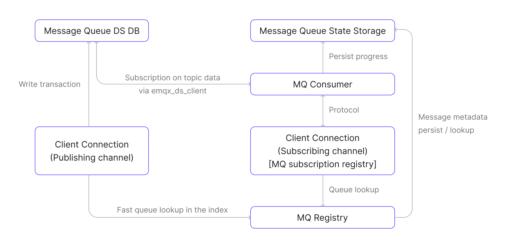

# メッセージキュー

EMQX 6.0で導入されたメッセージキュー機能は、MQTTのサブスクライブ／パブリッシュパターンを耐久性のあるキューセマンティクスで拡張し、信頼性の高い非同期メッセージ配信を可能にします。RabbitMQのようなエンタープライズグレードのメッセージキューで一般的に見られる機能を、追加のインフラなしでネイティブMQTTの機能に付加します。

本ページでは、EMQXのメッセージキュー機能について、その設計背景、主要な概念、内部アーキテクチャ、メッセージフロー、実際の適用シナリオまでを包括的に解説します。

## メッセージキューとは？

EMQXにおけるメッセージキューは、クライアントのサブスクライバーの有無に関係なくMQTTメッセージを保存する、名前付きの耐久性のあるサーバー側バッファです。各キューは一意のキュー名で識別され、トピックフィルターはどのパブリッシュされたメッセージをキューに格納するかを定義します（キューの識別子としては機能しません）。設定されたトピックフィルターにマッチするメッセージは、キューの保持およびディスパッチポリシーに従って自動的に永続化されます。

従来のMQTTの動作とは異なり、メッセージキューはクライアントがオンラインでない場合でもメッセージを保持します。クライアントは特別な形式のサブスクライブ、`$queue/<name>` または `$queue/<name>/<topic_filter>` を使ってこれらのメッセージを消費できます。

::: warning リスナーマウントポイントとの非互換性
メッセージキューは、[マウントポイント](../configuration/listener.md#mountpoint)が設定されたリスナー経由で接続されたクライアントには対応していません。EMQXはマウントポイントを`$queue/`プレフィックスのマッチングより先に適用するため、サブスクリプションはマウントされたリテラルトピックへの通常のサブスクリプションとして扱われ、クライアントにエラーは通知されません。
:::

メッセージキューは組み込みの耐久ストレージを使用します。メッセージキューを有効化する前に、EMQXのデータディレクトリがローカルファイルシステムを使用していることを確認してください。[組み込み耐久ストレージのバックエンド](../design/durable-storage.md#embedded-backends)はNFSやSMB/CIFSなどのネットワークファイルシステムをサポートしていません。


## なぜメッセージキューを使うのか？

MQTTは軽量で広く採用されているパブリッシュ／サブスクライブプロトコルですが、デフォルトの動作ではメッセージ配信がサブスクライバーのオンライン状態に強く依存しており、非同期や遅延消費のシナリオでは制約があります。

### MQTTの制限点

MQTTは[共有サブスクリプション](../messaging/mqtt-shared-subscription.md)（`$share/{group}/topic`）を通じてキューのような機能を一部サポートしていますが、以下の制限があります：

- サブスクライバーがオンラインでない場合、メッセージは保持されません。
- TTL（有効期限）、キューサイズ制限、オーバーフロー制御の組み込みサポートがありません。
- キーごとに最新値のみを保持するようなメッセージの重複排除機能がありません。
- キューの明示的なライフサイクル管理がありません。

これらの制限により、以下のようなパターンの実装が困難です：

- デバイスがオンラインになる前にコマンドを送信する。
- 常時接続していないワーカーにタスクを送る。
- 最新の状態や設定更新のみを保持する。

### メッセージキューによるMQTT拡張

メッセージキューはEMQXにおけるMQTTプロトコルの拡張であり、サブスクライバーのオンライン状態に関わらずメッセージを永続化し、後続処理を可能にします。主な特徴は以下の通りです：

- **クライアントがオフラインでもメッセージを永続化**：キューは厳密な順序付けは保証しませんが、信頼性の高い非同期配信を実現し、軽量なMQTT通信と高度なエンタープライズメッセージングの橋渡しをします。
- **明示的なキュー宣言とプロパティ設定**：TTL、サイズ制限、ディスパッチ戦略などの設定により、メッセージの保持と配信を細かく制御可能です。
- **オプションの最新値セマンティクス**：同じキーを持つメッセージは前のものを上書きし、最新の状態や設定更新のみを保持できます。

## メッセージキューの概念

- **キュー名**

   メッセージキューを一意に識別する名前です。

   キュー名に使用できる文字は以下に限定されます：

   - 英数字（`A–Z`、`a–z`、`0–9`）
   - アンダースコア（`_`）
   - ハイフン（`-`）
   - ドット（`.`）

   ::: tip

   EMQX 6.1.1以降、キューはトピックフィルターではなく名前でアドレス指定されます。トピックフィルターはキューの設定の一部ですが、識別子ではありません。

   :::

- **トピックフィルター**

   `devices/+/command` のようなMQTTトピックフィルターで、どのパブリッシュメッセージがキューに書き込まれるかを決定します。設定されたフィルターにマッチしたメッセージのみがキューに格納されます。1つのパブリッシュメッセージが複数のキューにマッチし、複数のキューに書き込まれることもあります。

   ::: tip

   トピックフィルターは名前付きキューの設定メタデータであり、キュー作成後に変更できません。

   :::

- **キューサブスクリプション**

   キューからメッセージを消費するための特別なMQTTサブスクリプションです。クライアントは以下の形式でサブスクライブします：

   ```
   SUBSCRIBE $queue/<name>
   SUBSCRIBE $queue/<name>/<topic_filter>
   ```

   ここで：

   - `<name>` はキュー名（必須）
   - `<topic_filter>` は既存キューにサブスクライブする際は省略可能
   - 自動作成が有効な場合、`$queue/<name>/<topic_filter>` によりキューが存在しなければ指定のトピックフィルターでキューを作成します。

   キューサブスクリプションは通常のMQTTサブスクリプションとは独立して動作し、メッセージキューのコンシューマーメカニズムで処理されます。

- **最新値セマンティクス**

   キュー宣言時に**キューキー式**を設定することで有効化できるオプション機能です。有効化すると、EMQXはキューに入る各メッセージから`queue key`を抽出します。同じキーの新しいメッセージは、未消費の既存メッセージを上書きします。この動作は状態管理や設定更新のように最新の値のみが重要で、古いメッセージを破棄してよい場合に適しています。

   詳細は[キューキー式](./message-queue-task.md#queue-key-expression)のセクションをご覧ください。

- **キュー宣言**

   耐久性のあるキューを作成し、トピックフィルター、ディスパッチ戦略、保持制限、キー式などの設定を通じて動作を定義するプロセスです。

- **キュー削除**

   キューとその保存されたメッセージおよび関連状態をすべて削除する操作です。

- **キューのプロパティ**

   メッセージ保持時間やディスパッチ戦略など、キューの動作を制御するカスタマイズ可能な設定です。

- **QoS（サービス品質）**

   メッセージキュー内のすべてのメッセージは、パブリッシュやサブスクライブ時のQoSレベルに関わらず、QoS 1（少なくとも一度配信）で配信されます。これにより信頼性の高いメッセージ配信が保証され、キューの配信動作が統一されます。

- **メッセージの永続化**

   サブスクライバーが接続していなくてもメッセージは保持されます。デフォルトでは最新値セマンティクスが適用されます。キー式が設定されていない通常のキューでは、受信順にメッセージが保存されます。

## メッセージキューの動作

EMQXのメッセージキュー機能は疎結合の拡張として実装されており、内部フックを使ってパブリッシュとサブスクライブの操作をインターセプトします。これらのフックはレジストリやストレージ層と連携し、メッセージの永続化と配信を信頼性高く行います。

### 主なコンポーネント

以下の主要コンポーネントが関与します：

- **メッセージキューレジストリ**：すべてのメッセージキューのライフサイクルを管理し、キューの作成、削除、検索を担当します。
- **メッセージキューメッセージDB**：キューにパブリッシュされた実際のメッセージを保存し、EMQXの[耐久ストレージ](../durability/durability_introduction.md#durable-storage-architecture)上に構築されています。
- **メッセージキュー状態ストレージ**：消費進捗やキューのメタデータ（TTL、プロパティなど）を永続化します。
- **メッセージキューコンシューマー**：キューからメッセージを取得し、接続されたサブスクライバーにディスパッチ戦略に基づいて配信します。
- **メッセージキューサブスクリプションレジストリ**：どのチャネル（クライアント）がどのキューにサブスクライブしているかを追跡し、各チャネルのコンテキストにサブスクリプション状態を保存します。
- **メッセージキューフック**：パブリッシュおよびサブスクライブイベントにフックし、メッセージをキューやコンシューマーにルーティングします。

### メッセージキューデータフローダイアグラム

以下の図は、主要なメッセージキューコンポーネント間のデータフローを示しています：



### パブリッシュのワークフロー

1. クライアントが `some/topic` のような通常のトピックにメッセージをパブリッシュします。
2. 内部のMQフックがトリガーされ、メッセージを処理します。
3. フックはメッセージキューレジストリを参照し、パブリッシュされたトピックにマッチするキューを検索します。
4. マッチするキューがあれば、メッセージをそのキューのメッセージDBに書き込みます。

### サブスクライブと消費のワークフロー

1. クライアントが `$queue/<name>` または `$queue/<name>/<topic_filter>` にサブスクライブします。
2. MQフックがトリガーされ、サブスクリプションを処理します。
3. フックはキュー名でキューを解決し、クライアントのセッションコンテキスト内にサブスクリプションを初期化し、メッセージキューコンシューマーへの接続を確立します。
4. キューに対応するコンシューマープロセスが存在しなければ、新たにメッセージキューコンシューマーを起動します。
5. コンシューマーはメッセージ消費の進捗を復元し、メッセージDBからデータの取得を開始します。
6. コンシューマーは設定されたディスパッチ戦略に従い、受信したメッセージをサブスクライバーのクライアントセッションに配信します。
7. サブスクライバーのクライアントセッションは標準のMQTTメカニズムを通じてクライアントにメッセージを届けます。

## メッセージキューのコア機能

EMQXのメッセージキュー機能は、信頼性が高く疎結合で設定可能なメッセージ配信を実現する一連のコア機能を提供します。

- **メッセージのエンキュー**

  キューの設定されたトピックフィルターにマッチするトピックにパブリッシュされたメッセージは自動的にキューに格納されます。

  キューキー式（最新値セマンティクス用）が設定されている場合、EMQXは各メッセージに対して式を評価します：

  - キーが導出されれば、同じキーの未消費メッセージを置き換えます。
  - 最新値キューでキーが評価できなければ、そのメッセージは破棄されます。

- **メッセージのデキュー**

  サブスクライブしたクライアントは設定されたディスパッチ戦略に従ってキューからメッセージを受け取ります。すべてのメッセージはQoS 1（少なくとも一度配信）で配信され、信頼性の高い配信を保証します。クライアントがメッセージをアックすると、そのメッセージはキューから削除されます。

- **ディスパッチ戦略**

   メッセージをサブスクライバー間でどのように分配するかを定義できます：

  - `random`：ランダムに分配
  - `round_robin`：利用可能なサブスクライバー間で順番に分配
  - `least_inflight`：処理中のメッセージ数が少ないサブスクライバーを優先

- **キュー管理**

   作成、更新、削除、クエリなどのキューのライフサイクル操作はREST APIで利用可能です。

## ユースケース

メッセージキューは、デバイスやコンシューマーが常時オンラインでないIoTやイベント駆動型アプリケーションにおいて、信頼性の高い非同期メッセージングパターンを実現します。

- **デバイスコマンドキューイング**：クラウドアプリケーションがIoTデバイス向けのコマンドをキューに格納し、デバイスがオフラインでもコマンドが失われないようにします。
- **バッチ処理**：大規模なデータセットやワークロードを小さなタスクに分割し、ワーカークライアントに並列または遅延処理で配布します。
- **センサーデータ処理**：高頻度のセンサーデータを一時的にキューに蓄積し、後でバッチ処理や集約、分析を行います。
- **最新設定の配信**：デバイスが常に最新の設定コマンドを取得・処理するようにし、同じ設定項目／キーに対する古い未処理コマンドはキュー内で上書きまたは無効化されます。

## 関連機能リファレンス

メッセージキューはMQTTを基盤とし、EMQXの他のメッセージング機能と補完関係にあります：

- [共有サブスクリプション](../messaging/mqtt-shared-subscription.md)：複数のサブスクライバー間でメッセージを分配しますが、クライアントがオンラインでない場合はメッセージを保持しません。
- [保持メッセージ](../messaging/mqtt-retained-message.md)：トピックごとに最後のメッセージを保存しますが、新規サブスクライバーに対して1つの保持メッセージのみ配信します。
- [MQTT耐久セッション](../durability/durability_introduction.md)：クライアントごとのセッション状態（サブスクリプションやQoS 1/2メッセージ）を再接続間で保持します。
- [ルールエンジン](../data-integration/rules.md)：SQLライクなルールでキュー内メッセージのフィルタリングや変換、転送を実現します。

## セキュリティ上の考慮点

EMQXはキューサブスクリプションに対して、`$queue/`プレフィックスとキュー名を含む完全なサブスクリプショントピックフィルターで認可を行います。完全なフィルターに対する書き込み認可ルールを作成してください。キューサブスクリプションは、サブスクリプション作成前にキューが保持していたメッセージも配信します。

### キューサブスクリプションには専用のルールが必要

通常のトピック空間に対するルールは、対応するキューサブスクリプションには適用されません：

- `t/#` に対するルールは `$queue/orders/t/#` には適用されません。EMQXはこれらを別のトピックとして扱います。
- `#` または `+` で始まる認可トピックフィルターは、`$`で始まるサブスクリプショントピックフィルターにマッチしません。デフォルトの`acl.conf`にある `{eq, "#"}` を含む `#` を拒否するルールは `$queue/orders/#` を拒否しません。

したがって、`#` を拒否されたクライアントでも `$queue/orders/#` にサブスクライブしてキュー内のすべてのメッセージを受信できます。`$queue/` ネームスペースに対して明示的なルールを追加し、キューのトピックフィルターに対する通常の認可ルールと同等かそれ以上に厳しくしてください：

```erlang
%% 自動作成を許可せず、事前作成済みの "orders" キューを1つのコンシューマーに読み取り許可。
{allow, {username, "order_worker"}, subscribe, ["$queue/orders"]}.

%% その他すべてのキューサブスクリプションを拒否（廃止予定のプレフィックスも含む）。
{deny, all, subscribe, ["$queue/#", "$q/#"]}.
```

クライアントがまだ `$q/` プレフィックスを使用している間は、ルールに `$q/` プレフィックスを残してください。[廃止予定のプレフィックス](#deprecated-prefix)も参照してください。

この動作は[共有サブスクリプション](../messaging/mqtt-shared-subscription.md)とは異なります。`$share/<group>/t/#` ではEMQXはプレフィックスを削除して `t/#` を認可しますが、`$queue/<name>/t/#` では完全なサブスクリプショントピックフィルターを認可します。

### 自動作成はクライアント指定のトピックフィルターを許可

キューの自動作成が有効な場合、サブスクライブするクライアントが新しいキューのトピックフィルターを決定します。EMQXは `$queue/<name>/<topic_filter>` の `<topic_filter>` を使ってキューを作成し、クライアントが `<topic_filter>` に直接サブスクライブする権限があるかは別途チェックしません。

例えば、クライアントが `$queue/+/#` にサブスクライブ可能な場合、`$queue/orders/#` にもサブスクライブできます。`orders` キューが存在しなければEMQXはトピックフィルター `#` でキューを作成します。するとキューは `$` で始まらないすべてのトピックのメッセージを保存し、クライアントは直接サブスクライブ権限のないトピックのメッセージも受信する可能性があります。

自動作成はデフォルトで最新値キューに対して有効、通常キューに対しては無効ですが、メッセージキュー機能が有効な場合にのみ適用されます。デフォルトの `mq.enable = auto` では、少なくとも1つのキューが存在してからメッセージキューが有効化されるため、最初のキューはサブスクライブによって作成できません。信頼できないクライアントを受け入れる環境では、`$queue/orders` のような特定の事前作成済みキューへのアクセスのみ許可し、その他の `$queue/#` や `$q/#` にマッチするサブスクリプションはすべて拒否してください。あるいは自動作成を無効化し、ダッシュボードやREST APIからキューを作成してください。[ダッシュボードからのキュー自動作成](./message-queue-task.md#automatically-create-queues-via-dashboard)も参照してください。

## 互換性に関する注意点

このセクションはEMQX 6.1.1で導入された互換性に関する注意点をまとめています。

### 名前付きキュー

EMQX 6.1.1以降、すべてのキューは明示的に名前付きリソースとなり、キューの識別はトピックフィルターではなく一意の名前に基づきます。

### 旧式キュー

以前に作成された名前なしキューには、トピックフィルターから派生した名前が自動的に割り当てられます。

派生名の形式：

```
/<topic_filter>
```

> この派生名は既存の `$q/<topic_filter>` サブスクリプションとの後方互換性を保ちます。

### 廃止予定のプレフィックス

`$q` プレフィックスは旧式のサブスクリプション向けに引き続きサポートされますが、廃止予定です。

新規展開では以下を使用してください：

```
$queue/<name>
```

### 共有サブスクリプションの制限

メッセージキューが有効な場合、`$queue/` プレフィックスはキューサブスクリプション専用に予約され、共有サブスクリプションには使用できません。

## 次のステップ

メッセージキューの基本を理解したら、実際の活用方法を学びましょう：

- [キューの作成と設定](./message-queue-task.md)：ダッシュボードやREST APIを使ったキューの宣言、ディスパッチ戦略の定義、保持ポリシーの設定方法を学べます。
- [クイックスタートチュートリアル](./message-queue-quick-start.md)：MQTTXを使った実践的なパブリッシャー／サブスクライバーシナリオのステップバイステップガイドです。
