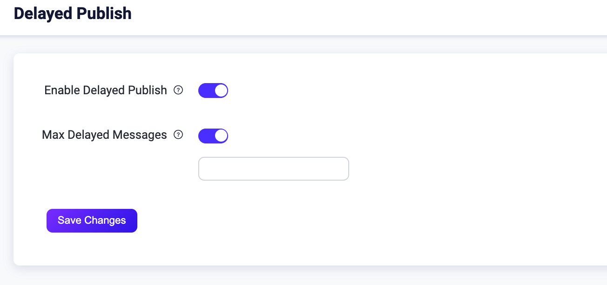
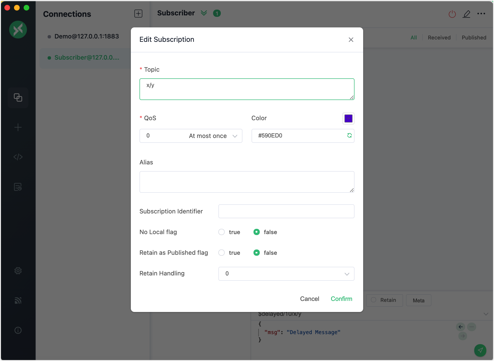
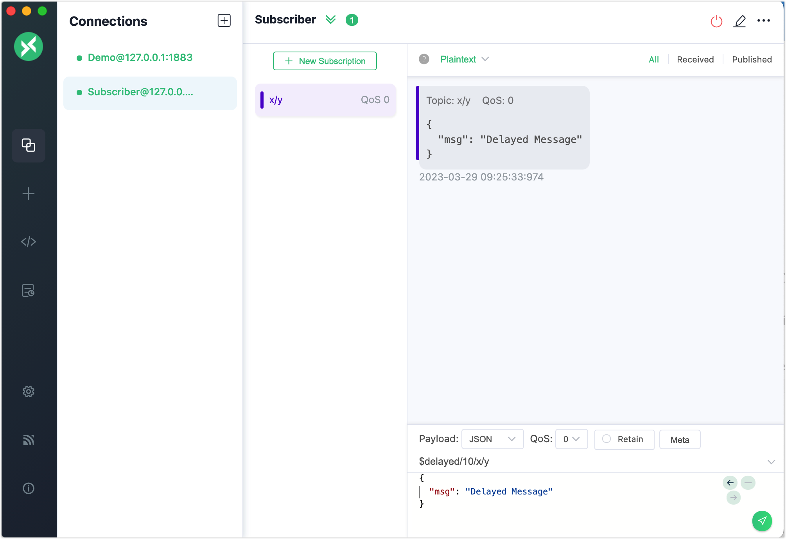

# 遅延パブリッシュ

遅延パブリッシュは、EMQXがサポートする拡張されたMQTT機能です。クライアントがトピックプレフィックス `$delayed/{DelayInterval}` を付けてEMQXにメッセージをパブリッシュすると、遅延パブリッシュ機能がトリガーされます。メッセージはユーザーが事前に定義した時間経過後にパブリッシュされます。

遅延パブリッシュのトピックの具体的な形式は以下の通りです。

```bash
$delayed/{DelayInterval}/{TopicName}
```

<<<<<<< HEAD
- `$delayed`：`$delayed`で始まるメッセージは遅延が必要なメッセージとして扱われます。遅延時間は次のトピックレベルの内容によって決まります。
- `{DelayTime}`：このMQTTメッセージのパブリッシュを遅延させる時間間隔またはタイムスタンプを秒単位で指定します。時間間隔の場合、最大許容間隔は42949669秒（約497日）です。タイムスタンプの場合、現在のシステム時刻から42949669秒以内でなければなりません。`{DelayTime}`が整数として解析できないか、または有効範囲外の場合、メッセージは破棄されます。
=======
- `$delayed`：`$delayed`で始まるメッセージは遅延が必要なメッセージとして扱われます。遅延時間は次のトピックレベルの内容で決まります。
- `{DelayTime}`：このMQTTメッセージのパブリッシュを遅延させる時間間隔またはタイムスタンプを秒単位で指定します。間隔の場合、最大許容値は42949669秒（約497日）です。タイムスタンプの場合は、現在のシステム時刻から前後42949669秒以内でなければなりません。`{DelayTime}`が整数として解析できないか、有効範囲外の場合はメッセージは破棄されます。
>>>>>>> origin/release-5.9
- `{TopicName}`：MQTTメッセージのトピック名です。

例：

- `$delayed/15/x/y`：15秒後にトピック `x/y` にMQTTメッセージをパブリッシュする
- `$delayed/60/a/b`：1分後にトピック `a/b` にMQTTメッセージをパブリッシュする
- `$delayed/1743490800/chat/id`：2025年4月1日9:00（ストックホルム時間）にトピック `chat/id` にメッセージをパブリッシュする
- `$delayed/3600/$SYS/topic`：1時間後にトピック `$SYS/topic` にMQTTメッセージをパブリッシュする

## ダッシュボードで遅延パブリッシュを設定する

<<<<<<< HEAD
1. EMQXダッシュボードを開きます。左側のナビゲーションメニューから **Management** -> **Delayed Publish** をクリックします。
=======
1. EMQXダッシュボードを開きます。左のナビゲーションメニューで **Management** -> **Delayed Publish** をクリックします。
>>>>>>> origin/release-5.9

2. **Delayed Publish** ページで以下の設定が可能です：

   - **Enable**：遅延パブリッシュを有効または無効にします。デフォルトでは有効です。
   - **Max Delayed Messages**：遅延メッセージの最大数を指定できます。
   



## MQTTX Desktopで遅延パブリッシュを試す

:::tip 前提条件

[MQTTX Desktop](./publish-and-subscribe.md#mqttx-desktop) を使った基本的なパブリッシュおよびサブスクライブ操作

:::

1. EMQXとMQTTX Desktopを起動します。**New Connection** をクリックしてパブリッシャーとしてクライアント接続を作成します。

   - **Name** フィールドに `Demo` と入力します。
<<<<<<< HEAD
   - **Host** にローカルホスト `127.0.0.1` を入力します（このデモの例として使用）。
   - 他の設定はデフォルトのままにして、**Connect** をクリックします。

   ::: tip

   MQTT接続の作成方法の詳細は [MQTTX Desktop](./publish-and-subscribe.md#mqttx-desktop) を参照してください。
=======
   - **Host** にローカルホストの `127.0.0.1` を入力します（このデモの例として）。
   - その他の設定はデフォルトのままにして **Connect** をクリックします。

   ::: tip

   MQTT接続の作成に関する詳細な手順は [MQTTX Desktop](./publish-and-subscribe.md#mqttx-desktop) に記載されています。
>>>>>>> origin/release-5.9

   :::

   

2. 別のMQTT接続を作成し、サブスクライバーとして設定します。

3. **Connections** ペインで `Demo` という名前の接続を選択します。トピックテキストボックスに `$delayed/10/x/y` と入力し、メッセージに `Delayed Message` と入力します。

   - `$delayed`：遅延メッセージであることを示します。
   - `10`：遅延時間が10秒であることを示します。
   - `x/y`：メッセージのトピック名を示します。

4. **Connections** ペインで `Subscriber` という名前の接続を選択します。**New Subscription** ボタンをクリックしてサブスクリプションを作成します。トピックテキストボックスに `x/y` と入力してこのトピックをサブスクライブします。**Confirm** をクリックします。

   

5. **Connections** ペインで `Demo` という名前の接続を選択し、送信ボタンをクリックしてトピック `$delayed/10/x/y` で `Delayed Message` を送信します。

6. 10秒待ちます。`Subscriber` という名前の接続が10秒後に遅延メッセージを受信するのが確認できます。

   

## MQTTX CLIで遅延パブリッシュを試す

::: tip 前提条件

[MQTTX CLI](./publish-and-subscribe.md#mqttx-cli) を使った基本的なパブリッシュおよびサブスクライブ操作

:::

1. 新しい接続をサブスクライバーとして作成し、トピック `t/1` をサブスクライブします。

   ```bash
   mqttx sub -t t/1 -v
   ```

<<<<<<< HEAD
2. ターミナルで新しいウィンドウを開き、パブリッシャーとして以下のコマンドを使って遅延メッセージを送信します。サブスクライバーは5秒後にメッセージを受信します。
=======
2. ターミナルで新しいウィンドウを開き、パブリッシャーとしてクライアントを起動します。以下のコマンドで遅延メッセージを送信します。サブスクライバーは5秒後にメッセージを受信します。
>>>>>>> origin/release-5.9

   ```bash
   mqttx pub -t "\$delayed/5/t/1" -m "Hello Delayed msg"
   ```
