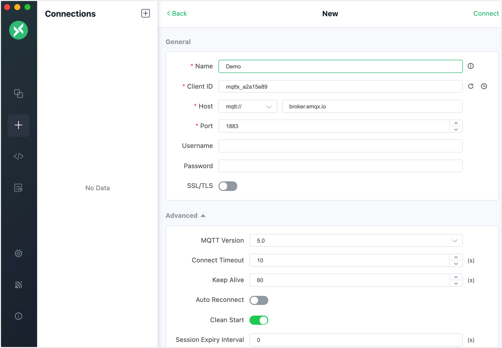
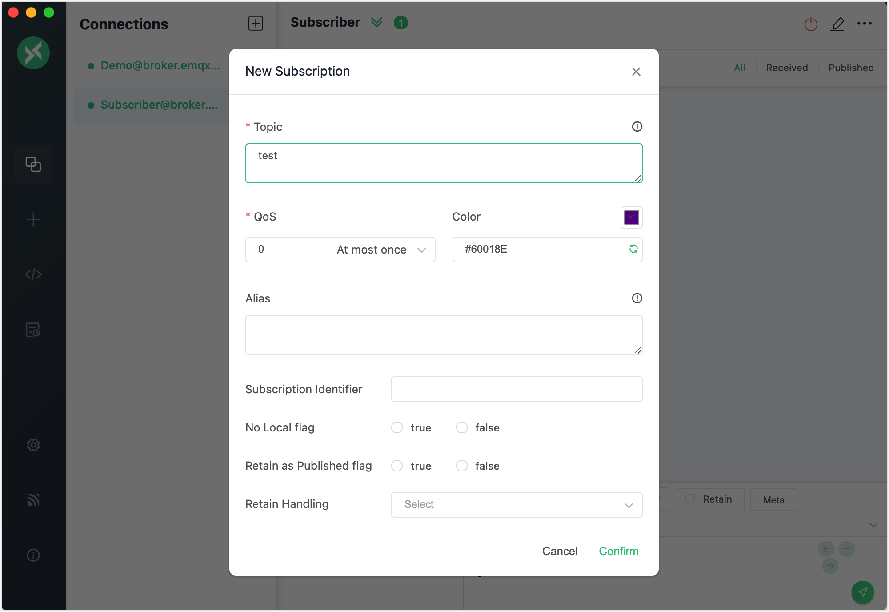
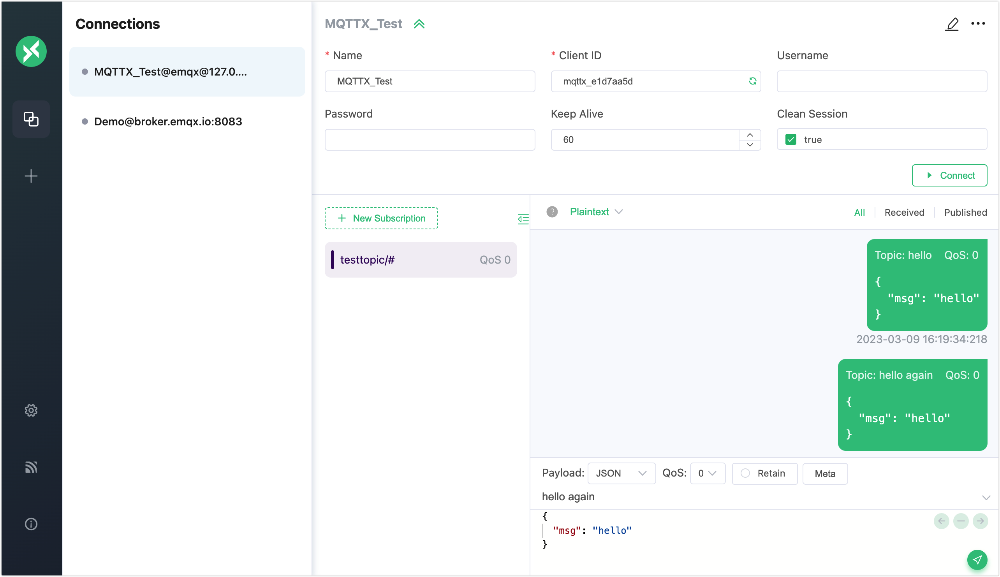
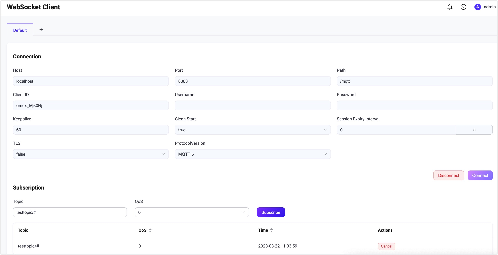

# MQTTクライアントによるテスト

<<<<<<< HEAD
リアルタイムデバイスをEMQXに接続しIoTアプリケーションを開発する前に、クライアントツールを使用してEMQXのメッセージングサービスをテストすることは、より安全かつ効率的です。

EMQXをローカルにデプロイする前でも、[EMQ](https://www.emqx.com)が提供する無料のオンラインパブリック[MQTTブローカー](https://www.emqx.com/en/mqtt/public-mqtt5-broker)およびMQTTクライアントツールを検証ツールとして活用し、MQTTメッセージングサービスやアプリケーション開発の迅速なテストが可能です。
=======
リアルタイムデバイスをEMQXに接続しIoTアプリケーションを開発する前に、クライアントツールを使ってEMQXのメッセージングサービスをテストすることは、より安全かつ効率的です。

EMQXをローカルにデプロイする前でも、EMQが提供する無料のオンラインパブリック[MQTTブローカー](https://www.emqx.com/en/mqtt/public-mqtt5-broker)やMQTTクライアントツールを検証ツールとして活用し、MQTTメッセージングサービスやアプリケーション開発の迅速なテストが可能です。
>>>>>>> origin/release-5.10


本セクションでは、一般的に使用されるMQTT 5.0クライアントツールを紹介し、以下のメッセージングサービスをテストするための簡単なデモを提供します。

- クライアント接続の確立
- トピックのサブスクライブ
- メッセージのパブリッシュ
- メッセージの受信および表示

## MQTTX

<<<<<<< HEAD
[MQTTX](https://mqttx.app)はEMQがオープンソースで提供する洗練されたクロスプラットフォームMQTT 5.0検証ツールです。以下の3種類のツールを含みます。
=======
[MQTTX](https://mqttx.app)はEMQがオープンソースで提供する洗練されたクロスプラットフォームMQTT 5.0検証ツールです。以下の3種類のツールが含まれています。
>>>>>>> origin/release-5.10

- MQTTX クライアント
- MQTTX CLI
- MQTT Web

### MQTTX デスクトップ

<<<<<<< HEAD
[MQTTX デスクトップ](https://mqttx.app)はクロスプラットフォーム対応のMQTTデスクトップクライアントツールです。使いやすいグラフィカルインターフェースを提供し、ユーザーは迅速にMQTT接続を作成し、MQTTメッセージのパブリッシュ／サブスクライブをテストできます。
=======
[MQTTX デスクトップ](https://mqttx.app)はクロスプラットフォーム対応のMQTTデスクトップクライアントツールです。使いやすいグラフィカルインターフェースを提供し、ユーザーが迅速にMQTT接続を作成、テストし、MQTTメッセージのパブリッシュ／サブスクライブを行えます。
>>>>>>> origin/release-5.10

テストを始める前に、MQTTXクライアントをダウンロードしてインストールしてください。

1. ご利用のOSに応じて、アプリケーションストアまたは[MQTTX公式サイト](https://mqttx.app/)からインストールパッケージをダウンロードします。
<<<<<<< HEAD
2. MQTTXクライアントをインストールします。詳細な手順は[MQTTX - インストール](https://mqttx.app/docs/downloading-and-installation)をご参照ください。

以下の手順に従い、MQTTXデスクトップクライアントを使った簡単なテストを行います。

1. MQTTXクライアントを起動し、**New Connection**をクリックしてMQTT接続を作成します。

2. 新しい接続をメッセージをパブリッシュするクライアントとして設定します。
=======
2. MQTTXクライアントをインストールします。詳細な手順は[MQTTX - インストール](https://mqttx.app/docs/downloading-and-installation)を参照してください。

以下の手順に従って、MQTTXデスクトップクライアントを使った簡単なテストを行います。

1. MQTTXクライアントを起動し、**New Connection**をクリックしてMQTT接続を作成します。

2. メッセージをパブリッシュするクライアントとして新しい接続を設定します。
>>>>>>> origin/release-5.10

   **General**セクションでクライアントの基本情報を入力します。

<<<<<<< HEAD
   - **Name**: 接続の`Name`を入力します。
   - **Client ID**: デフォルトのままで構いません。クライアント接続の一意識別子であり、リフレッシュボタンをクリックすると自動生成されます。
   - **Host**: 使用するプロトコルを選択します。`mqtt://`または`ws://`を選択してください。`SSL/TLS`認証接続を使用する場合は`mqtts://`または`wss://`を選択します。ホストIPアドレスはデフォルトで`broker.emqx.io`に設定されており、パブリックブローカーに接続します。自身のEMQXを使用する場合は実際のIPに置き換えてください。
   - **Port**: 選択したプロトコルに対応するポート番号を入力します。
   - **Username**および**Password**: ブローカーでユーザー認証が有効な場合はユーザー名とパスワードを入力し、無効の場合は空欄のままにします。
   - **SSL/TLS**: `SSL/TLS`認証接続を使用する場合はトグルボタンをクリックして有効にします。

   その他の設定はデフォルトのままにし、右上の**Connect**ボタンをクリックします。
=======
   - **Name**：接続の`Name`を入力します。
   - **Client ID**：デフォルトのままで構いません。クライアント接続の唯一の識別子であり、更新ボタンをクリックすると自動生成されます。
   - **Host**：使用するプロトコルを選択します。`mqtt://`または`ws://`を選択してください。`SSL/TLS`認証接続を使用する場合は`mqtts://`または`wss://`を選択します。ホストIPアドレスはデフォルトで`broker.emqx.io`に設定されており、パブリックブローカーに接続します。自身のEMQXを使用する場合は実際のIPに置き換えてください。
   - **Port**：選択したプロトコルに対応するポート番号を入力します。
   - **Username**および**Password**：ブローカーでユーザー認証が有効な場合はユーザー名とパスワードを入力し、無効の場合は空欄のままにします。
   - **SSL/TLS**：`SSL/TLS`認証接続を使用する場合はトグルボタンをクリックして有効にします。

   その他の設定はデフォルトのままにして、右上の**Connect**ボタンをクリックします。
>>>>>>> origin/release-5.10

   

3. 接続に成功したら、テキストボックスにトピック名`test`を入力し、スクリーンショットのようにメッセージを作成します。送信ボタンをクリックすると、`test`トピックにメッセージが表示されます。

   

4. **Connections**ペインの**+** -> **New Connection**をクリックし、メッセージを受信するクライアントとして新しい接続を作成します。名前を`Subscriber`に設定し、他の一般的な接続設定はクライアント`Demo`と同じにします。

5. **Connections**ペインでクライアント`Subscriber`を選択し、**+ New Subscription**をクリックします。

<<<<<<< HEAD
   **Topic**: テキストボックスに`test`を入力します。

   **QoS**: デフォルト値のままにします。

   **Color**: サブスクリプションを識別する色を選択できます。

   その他のオプションは空欄のままにし、**Confirm**ボタンをクリックします。

   

6. **Connections**ペインでクライアント`Demo`を選択し、トピック`test`に新しいメッセージをパブリッシュします。クライアント`Subscriber`が新しいメッセージを受信するのが確認できます。

   

これでMQTTXクライアントを使った基本的なパブリッシュとサブスクライブの操作を試しました。詳細かつ高度な操作については[MQTTX - パブリッシュとサブスクリプション](https://mqttx.app/docs/get-started#publish-and-subscription)をご参照ください。

### MQTTX CLI

[MQTTX CLI](https://mqttx.app/cli)はEMQが提供するオープンソースのMQTT 5.0コマンドラインツールです。グラフィカルインターフェースを必要とせず、コマンドライン上でMQTTサービスやアプリケーションのテストやデバッグが可能です。

以下の手順に従い、MQTTX CLIを使って接続、パブリッシュ／サブスクライブ、メッセージの表示を行います。

1. MQTT CLIをダウンロードしてインストールします。ここではmacOSを例に示します。その他のOSについては[MQTTX CLI - インストール](https://mqttx.app/docs/cli/downloading-and-installation)をご参照ください。
=======
   - **Topic**：テキストボックスに`test`を入力します。
   - **QoS**：デフォルト値のままにします。
   - **Color**：サブスクリプションを識別するための色を選択できます。

   その他のオプションは一般的なテストのため空欄のままにして、**Confirm**ボタンをクリックします。

   

6. **Connections**ペインでクライアント`Demo`を選択し、`test`トピックに新しいメッセージをパブリッシュします。クライアント`Subscriber`が新しいメッセージを受信するのが確認できます。

   

これでMQTTXクライアントを使用した基本的なパブリッシュとサブスクライブの操作を試しました。詳細かつ高度な操作については[MQTTX - Publish and Subscription](https://mqttx.app/docs/get-started#publish-and-subscription)を参照してください。

### MQTTX CLI

[MQTTX CLI](https://mqttx.app/cli)はEMQが提供するオープンソースのMQTT 5.0コマンドラインツールです。MQTTXのコマンドライン版であり、グラフィカルインターフェースを必要とせずにMQTTサービスやアプリケーションのテスト・デバッグが可能です。

以下の手順に従い、MQTTX CLIを使って接続、パブリッシュ／サブスクライブ、メッセージの表示を行います。

1. MQTT CLIをダウンロードしてインストールします。ここではmacOSを例に示します。その他のOSは[MQTTX CLI - インストール](https://mqttx.app/docs/cli/downloading-and-installation)を参照してください。
>>>>>>> origin/release-5.10

   ```bash
   # Homebrew
   brew install emqx/mqttx/mqttx-cli
   # Intelチップ用
   curl -LO https://www.emqx.com/zh/downloads/MQTTX/v1.9.0/mqttx-cli-macos-x64
   sudo install ./mqttx-cli-macos-x64 /usr/local/bin/mqttx
   # Apple Silicon用
   curl -LO https://www.emqx.com/zh/downloads/MQTTX/v1.9.0/mqttx-cli-macos-arm64
   sudo install ./mqttx-cli-macos-arm64 /usr/local/bin/mqttx
   ```

2. コマンドラインで以下のコマンドを実行し、EMQXに接続して`testtopic/#`トピックをサブスクライブします。

   ```shell
   mqttx sub -t 'testtopic/#' -q 1 -h 'localhost' -p 1883 'public' -v
   ```

   パラメータの説明：

   - `-t`：サブスクライブするトピック
   - `-q`：メッセージのQoS（デフォルト：0）
   - `-h`：リスナーのIPアドレス（デフォルト：`localhost`）
   - `-p`：ブローカーのポート（デフォルト：`1883`）
   - `-v`：メッセージの前にトピックを表示

<<<<<<< HEAD
   実行成功後、コマンドラインは受信待機状態となり、メッセージ受信時に内容を表示します。

   その他のパラメータについては[MQTTX CLI - サブスクライブ](https://mqttx.app/docs/cli/get-started#subscribe)をご参照ください。
=======
   実行に成功すると、コマンドラインは受信待ち状態になり、メッセージ受信後に内容を表示します。

   その他のパラメータについては[MQTTX CLI - Subscribe](https://mqttx.app/docs/cli/get-started#subscribe)を参照してください。
>>>>>>> origin/release-5.10

3. 新しいコマンドラインウィンドウを開き、以下のコマンドを実行してEMQXに接続し、`testtopic/#`トピックにメッセージをパブリッシュします。

   ```bash
   mqttx pub -t 'testtopic/1' -q 1 -h 'localhost' -p 1883 -m 'from MQTTX CLI'
   ```

   パラメータ：

<<<<<<< HEAD
   - `-t`: パブリッシュ先のトピック
   - `-q`: メッセージのQoS（デフォルト: 0）
   - `-h`: リスナーのIPアドレス（デフォルト: `localhost`）
   - `-p`: ブローカーのポート（デフォルト: `1883`）
   - `-m`: メッセージ本文
=======
   - `-t`：パブリッシュするトピック
   - `-q`：メッセージのQoS（デフォルト：0）
   - `-h`：リスナーのIPアドレス（デフォルト：`localhost`）
   - `-p`：ブローカーのポート（デフォルト：`1883`）
   - `-m`：メッセージ本文
>>>>>>> origin/release-5.10

   実行に成功すると、コマンドラインは接続を確立し、メッセージをパブリッシュした後にブローカーから切断します。ステップ2のコマンドラインウィンドウには以下のメッセージが表示されます。

   ```bash
   topic:  testtopic/1
   payload:  from MQTTX CLI
   ```

<<<<<<< HEAD
   その他のパラメータについては[MQTTX CLI - パブリッシュ](https://mqttx.app/docs/cli/get-started#publish)をご参照ください。

### MQTTX Web

[MQTTX Web](https://mqttx.app/web)はブラウザベースのMQTT 5.0 WebSocketクライアントツールです。ツールのダウンロードやインストール不要で、WebSocket経由のMQTT開発やデバッグを完結できます。MQTTX Webを使ったテスト操作は基本的に[MQTTXクライアント](#mqttx-デスクトップ)と同様です。
=======
   その他のパラメータについては[MQTTX CLI - Publish](https://mqttx.app/docs/cli/get-started#publish)を参照してください。

### MQTTX Web

[MQTTX Web](https://mqttx.app/web)はブラウザベースのMQTT 5.0 WebSocketクライアントツールです。ダウンロードやインストール不要で、WebSocket経由のMQTT開発やデバッグを完結できます。MQTTX Webを使ったテスト操作は、[MQTTX クライアント](#mqtt-x-デスクトップ)の使用方法と基本的に同じです。
>>>>>>> origin/release-5.10



## ダッシュボード WebSocket

<<<<<<< HEAD
[EMQX ダッシュボード](../dashboard/introduction.md)はWebSocketクライアントを提供しており、迅速かつ効果的なMQTTテストツールとして利用できます。このMQTT over WebSocketを使い、EMQXへの接続、トピックのサブスクライブ、メッセージのパブリッシュをテストできます。
=======
[EMQX ダッシュボード](../dashboard/introduction.md)はWebSocketクライアントを提供しており、迅速かつ効果的なMQTTテストツールとして利用できます。このMQTT over WebSocketを使い、EMQXへの接続、トピックのサブスクライブ、メッセージのパブリッシュをテスト可能です。
>>>>>>> origin/release-5.10

1. EMQXダッシュボードの左ナビゲーションメニューで**Diagnose** -> **WebSocket Client**をクリックします。

2. **Connection**セクションに接続情報を入力します。

<<<<<<< HEAD
   - **Host**: 対応するIPアドレスを入力します（デフォルト: `localhost`）。
   - **Port**: デフォルトのポート`8083`を使用します。
   - **Username**および**Password**: もし認証が設定されていれば入力し、アクセス制御がない場合は空欄のままにします。
=======
   - **Host**：対応するIPアドレスを入力します（デフォルト：`localhost`）。
   - **Port**：デフォルトのポート`8083`を使用します。
   - **Username**および**Password**：あれば入力し、アクセス制御を使用していなければ空欄のままにします。
>>>>>>> origin/release-5.10

   その他の設定はデフォルトのままにします。

3. **Connect**ボタンをクリックして接続を確立します。

<<<<<<< HEAD
4. **Subscription**セクションでサブスクライブするトピックを`testtopic/#`に設定し、**Subscribe**ボタンをクリックしてサブスクリプションを完了します。トピック`testtopic/#`が下のテーブルに追加されます。

   

   サブスクライブ後、該当トピックにマッチするすべてのメッセージがこの接続に転送されます。

5. **Publish**セクションでパブリッシュするメッセージのトピックを設定します。

   - **Topic**: `testtopic/1`に設定します（ワイルドカード`+`や`#`はサポートされません）。
   - **Payload**: `{"msg": 'Hello"}`に設定します。
   - **QoS**: デフォルト値の`0`に設定します。
   - **Retain**: メッセージを保持したい場合はチェックボックスを選択します。保持メッセージの詳細は[保持メッセージ](./mqtt-concepts.md)をご参照ください。

   **Publish**ボタンをクリックすると、**Published**セクションに1件のレコードが追加されます。メッセージはすべてのサブスクライバーにルーティングされます。このテストではパブリッシャーも受信者であるため、**Received**セクションにも新しいレコードが追加されます。

   
=======
4. **Subscription**セクションでサブスクライブするトピックを`testtopic/#`に設定します。**Subscribe**ボタンをクリックしてサブスクライブを完了します。`testtopic/#`トピックが下のテーブルに追加されます。

   

   サブスクライブ後、このトピックにマッチするすべてのメッセージがこの接続に転送されます。

5. **Publish**セクションでパブリッシュするメッセージのトピックを設定します。

   - **Topic**：`testtopic/1`に設定します（ワイルドカードの`+`や`#`はサポートされていません）。
   - **Payload**：`{"msg": 'Hello"}`に設定します。
   - **QoS**：デフォルト値`0`に設定します。
   - **Retain**：保持メッセージにしたい場合はチェックボックスを選択します。保持メッセージの詳細は[保持メッセージ](./mqtt-concepts.md)を参照してください。

   **Publish**ボタンをクリックすると、**Published**セクションに1件のレコードが追加されます。メッセージはすべてのサブスクライバーにルーティングされます。このテストではパブリッシャーも受信者であるため、**Received**セクションにも新しいレコードが追加されます。

   
>>>>>>> origin/release-5.10
