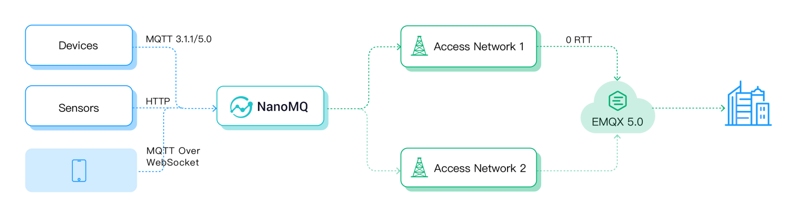

# MQTT over QUIC の利用

EMQX 5.0 では、MQTT over QUIC リスナーを導入し、IoT ユーザーが MQTT over QUIC の利点を享受できるようにしました。本セクションでは、MQTT over QUIC の利用方法をステップバイステップでご案内します。

::: tip 前提条件

[MQTT over QUIC](./introduction.md) の知識が必要です。
:::

## 環境

MQTT over QUIC リスナーをテストするには、Docker イメージの使用を推奨します。以下のコマンドでポート 14567 でリスナーを有効化できます。

```bash
docker run -d --name emqx \
  -p 1883:1883 -p 8083:8083 \
  -p 8084:8084 -p 8883:8883 \
  -p 18083:18083 \
  -p 14567:14567/udp \
  -e EMQX_LISTENERS__QUIC__DEFAULT__keyfile="etc/certs/key.pem" \
  -e EMQX_LISTENERS__QUIC__DEFAULT__certfile="etc/certs/cert.pem" \
  -e EMQX_LISTENERS__QUIC__DEFAULT__ENABLED=true \
emqx/emqx:@CE_VERSION@
```

Docker コンテナでの EMQX の起動方法については、[Deploy with Docker](../deploy/install-docker.md) をご参照ください。

## MQTT over QUIC の有効化

MQTT over QUIC はデフォルトで無効になっているため、以下の手順で手動でリスナーを有効化する必要があります。

1. 設定ファイル `etc/base.hocon` を開き、以下の設定を追加します。

```bash
listeners.quic.default {
  enabled = true
  bind = "0.0.0.0:14567"
  keyfile = "etc/certs/key.pem"
  certfile = "etc/certs/cert.pem"
}
```

この設定は、ポート `14567` で QUIC リスナーを有効化することを示しています。変更を保存し、EMQX を再起動して設定を反映させてください。

2. CLI で `emqx ctl listeners` を実行すると、MQTT over QUIC リスナーが有効になっていることが確認できます。

```bash
 > emqx ctl listeners
 quic:default
   listen_on       : :14567
   acceptors       : 16
   proxy_protocol  : undefined
   running         : true
 ssl:default
   listen_on       : 0.0.0.0:8883
   acceptors       : 16
   proxy_protocol  : false
   running         : true
   current_conn    : 0
   max_conns       : 512000
```

これで EMQX 上で MQTT over QUIC リスナーが有効になりました。次にクライアントの接続を進めます。

## クライアント SDK とツール

- [NanoSDK](https://github.com/nanomq/NanoSDK/)：EMQ NanoMQ チームが提供する C 言語の MQTT SDK。WebSocket や nanomsg/SP などのプロトコルもサポートしています。
- [NanoSDK-Python](https://github.com/wanghaEMQ/pynng-mqtt)：NanoSDK の Python バインディング。
- [NanoSDK-Java](https://github.com/nanomq/nanosdk-java)：NanoSDK の Java JNA バインディング。
- [emqtt](https://github.com/emqx/emqtt)：Erlang 製の MQTT クライアントライブラリで、QUIC をサポートしています。

クライアントライブラリに加え、EMQ はエッジコンピューティング製品 NanoMQ と連携した MQTT over QUIC ブリッジングも提供しています。NanoMQ を使うことで、QUIC を介してエッジデータをクラウドにブリッジでき、MQTT over QUIC リスナーを利用しつつ大きな開発や統合の手間をかけずに済みます。

## ネットワークフェイルオーバー

QUIC は UDP プロトコルをベースとしているため、多くの通信事業者は UDP パケットに対して特別なルーティング戦略を持っており、QUIC 接続の失敗やパケットロスが発生しやすい状況があります。

そのため、MQTT over QUIC クライアントはフォールバック機能を備えています。API 層は統一された操作でサービスを記述でき、トランスポート層はネットワーク状況に応じてリアルタイムに切り替わります。QUIC が利用できない場合は自動的に TCP/TLS 1.2 に切り替わり、様々なネットワーク環境下でのサービスを保証します。

## 例 1: NanoSDK を使った MQTT over QUIC

[NanoSDK](https://github.com/nanomq/NanoSDK/) は MsQuic をベースにした、C 言語で MQTT over QUIC を実装した最初の SDK であり、EMQX 5.0 とシームレスに互換性があります。完全非同期 IO 設計を採用し、QUIC ストリームと MQTT 接続のマッピングをバインド、0 RTT の高速ハンドシェイク再接続機能を内蔵し、マルチコアのタスク並列処理をサポートしています。

NanoSDK の API は MQTT over TCP とほぼ同様に動作します。以下のコマンドで QUIC ベースの MQTT クライアントを作成できます。

```bash
## NanoSDK で MQTT over Quic クライアントを作成
nng_mqtt_quic_client_open(&socket, url);
```

メッセージのサンプルコードは https://github.com/nanomq/NanoSDK/tree/main/demo をご参照ください。

コンパイル後、以下のコマンドでポート 14567 の EMQX 5.0 に接続してテストできます。

```bash
quic_client sub/pub mqtt-quic://127.0.0.1:14567 topic msg
```

NanoSDK は Java と Python のバインディングも提供しています。

- [Java MQTT over QUIC クライアント](https://github.com/nanomq/nanosdk-java/blob/main/demo/src/main/java/io/sisu/nng/demo/quicmqtt/MqttQuicClient.java)
- [Python MQTT over QUIC クライアント](https://github.com/wanghaEMQ/pynng-mqtt/blob/master/examples/mqtt_quic_sub.py)

## 例 2: NanoMQ を使った MQTT over QUIC ブリッジング

[NanoMQ](https://nanomq.io/) は超軽量かつ高速な IoT エッジ向けサービスで、クロスプラットフォーム対応、多スレッド処理、MQTT over QUIC ブリッジングをサポートしています。

従来の MQTT クライアントからのデータを QUIC パケットに変換し、クラウドの EMQX に送信できます。これにより、統合が難しい、または適切な MQTT over QUIC SDK がないエンド側 IoT デバイスでも QUIC プロトコルを利用可能にします。



1. NanoMQ をダウンロードしてインストールします。

```bash
git clone https://github.com/emqx/nanomq.git
cd nanomq ; git submodule update --init --recursive

mkdir build && cd build
cmake -G Ninja -DNNG_ENABLE_QUIC=ON ..
sudo ninja install
```

2. インストール後、設定ファイル `/etc/nanomq.conf` で MQTT over QUIC ブリッジ機能と関連トピックを設定します。URL プレフィックス `mqtt-quic` は QUIC を MQTT 伝送層として使用していることを示します。

```bash
## ブリッジ先アドレス: host:port
##
## 値の型: 文字列
bridge.mqtt.emqx.address=mqtt-quic://127.0.0.1:14567
```

詳細は [NanoMQ - MQTT over QUIC Bridge](https://nanomq.io/docs/en/latest/config-description/bridges.html#mqtt-over-quic-bridge) をご参照ください。

## MQTT over QUIC CLI ツール

NanoMQ はテストツール `nanomq_cli` も提供しており、MQTT over QUIC クライアントツールを含むため、EMQX 5.0 の MQTT over QUIC 機能を簡単にテストできます。

```bash
nanomq_cli quic --help
Usage: quic conn <url>
       quic sub  <url> \<qos> \<topic>
       quic pub  <url> \<qos> \<topic> \<data>

## サブスクライブ例
nanomq_cli quic sub mqtt-quic://54.75.171.11:14567 2 msg
```

まとめると、NanoSDK を直接プロジェクトに組み込むか、NanoMQ と組み合わせて利用することで、デバイス側からクラウドへの QUIC アクセスを実現できます。
