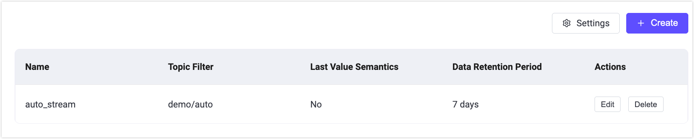

# MQTT Streams クイックスタート

<<<<<<< HEAD
このページでは、EMQX 6.1 の MQTT Streams 機能の使い方を説明します。MQTTX を使ってクライアントをシミュレートし、EMQX ダッシュボードからストリームを作成・管理し、メッセージの保存、再生、圧縮の仕組みを体験します。
=======
このページでは、EMQX 6.1 の MQTT Streams 機能の使い方を説明します。MQTTX を使ってクライアントをシミュレートし、EMQX ダッシュボードからストリームを作成・管理し、メッセージの保存、再生、圧縮の動作を体験します。
>>>>>>> origin/release-6.1

## 目的

このクイックスタートでは、EMQX MQTT Streams が以下を実現する方法を示します。

<<<<<<< HEAD
- サブスクライバーの有無に関わらずメッセージを永続化する
- タイムスタンプに基づく再生をサポートする
- 状態指向のメッセージングに適した Last-Value セマンティクスを有効にする
=======
- サブスクライバーの有無にかかわらずメッセージを永続化する
- タイムスタンプに基づく再生をサポートする
- 状態指向のメッセージングのための Last-Value セマンティクスを有効にする
>>>>>>> origin/release-6.1
- `$stream/` プレフィックスのサブスクライブによるストリームの自動作成を可能にする

## 前提条件

開始前に以下を準備してください。

- EMQX 6.1 以上が稼働していること
- [MQTTX](https://mqttx.app/)（または MQTT 5.0 対応のクライアント）
<<<<<<< HEAD
- EMQX ダッシュボードへのアクセス（デフォルト：`http://localhost:18083`）

## MQTT Streams 基本機能のテスト（レギュラーストリーム）

このセクションでは、MQTT Streams がメッセージを保存し、消費者が過去のデータを再生できることを示します。

### 前提条件

開始前に、MQTT Streams 機能が有効であり、自動作成の設定がこの例に影響しないことを確認してください。

1. 左メニューの **Streams** に移動します。

2. Message Stream が無効の場合は **Settings** をクリックします。**Management** -> **MQTT Settings** -> **Streams** ページにリダイレクトされます。

3. **Enable Streams** スイッチをオンにします。

4. 自動作成の設定を確認し、**Regular Stream** が使用されるようにします。

   - **Enable Auto Create Streams** が無効、または

   - **Auto Create Stream Type** が **Regular Stream** に設定されていること。

   > これにより、ストリームが Last-Value ストリームとして自動作成されるのを防ぎます。Last-Value ストリームはキーごとに最新のメッセージのみを保持します。

4. 変更を加えた場合は、**Save Changes** をクリックして適用します。

   

### ステップ 1: 名前付きストリームの作成

1. 左メニューの **Streams** に移動します。

2. ページ内の **Create Stream** または右上の **Create** をクリックします。

3. **Create Stream** ダイアログで以下の設定を行います。

=======
- EMQX ダッシュボードへのアクセス（デフォルト: `http://localhost:18083`）

## MQTT Streams 基本機能のテスト（レギュラーストリーム）

このセクションでは、MQTT Streams がメッセージを保存し、コンシューマーが過去のデータを再生できることを示します。

### 前提条件

開始前に、MQTT Streams 機能が有効であり、自動作成の設定が本例に影響しないことを確認してください。

1. 左メニューの **Streams** に移動します。

2. メッセージストリームが無効の場合は、**Settings** をクリックします。**Management** -> **MQTT Settings** -> **Streams** ページにリダイレクトされます。

3. **Enable Streams** スイッチをオンにします。

4. 自動作成設定を確認し、**Regular Stream** が使用されるようにします。

   - **Enable Auto Create Streams** が無効、または
   - **Auto Create Stream Type** が **Regular Stream** に設定されていること。

   > これにより、ストリームが Last-Value ストリームとして自動作成されることを防ぎます。Last-Value ストリームはキーごとに最新のメッセージのみを保持します。

4. 変更した場合は、**Save Changes** をクリックして適用します。

   

### ステップ 1: 名前付きストリームの作成

1. 左メニューの **Streams** に移動します。

2. ページ上の **Create Stream** をクリックするか、右上の **Create** をクリックします。

3. **Create Stream** ダイアログで以下の設定を行います。
>>>>>>> origin/release-6.1
   - **Name**: `my_stream`
   - **Topic Filter**: `demo/stream`
   - **Last-Value Semantics**: 無効
   - **Stream Key Expression**: `message.from`

   他のオプションはデフォルトのままにします。

4. **Create** をクリックします。

   

### ステップ 2: メッセージのパブリッシュ

MQTTX CLI を使ってパブリッシャークライアントをシミュレートします。

1. MQTTX CLI がインストールされていることを確認します。詳細は [インストール](https://mqttx.app/docs/cli/downloading-and-installation) を参照してください。

2. EMQX に接続します。

   ```bash
   mqttx conn -h 'localhost' -p 1883
   ```

3. トピック `demo/stream` に QoS 1 で複数のメッセージをパブリッシュします。

   例:

   ```bash
   mqttx pub -t 'demo/stream' -h 'localhost' -p 1883 -q 1 -m '{"value": 1}'
   mqttx pub -t 'demo/stream' -h 'localhost' -p 1883 -q 1 -m '{"value": 2}'
   mqttx pub -t 'demo/stream' -h 'localhost' -p 1883 -q 1 -m '{"value": 3}'
   ```

   期待される出力:

   ```bash
   ✔ Connected
   ✔ Message published
   ```

<<<<<<< HEAD
このストリームはレギュラーストリームなので、すべてのパブリッシュされたメッセージが保持ポリシーに従って保存されます。

### ステップ 3: ストリームからすべてのメッセージを再生

MQTTX CLI でストリームにサブスクライブし、MQTT 5 のサブスクリプションユーザープロパティ `stream-offset` を設定して最初からメッセージを再生します。
=======
レギュラーストリームなので、すべてのパブリッシュされたメッセージは保持ポリシーに従ってストリームに保存されます。

### ステップ 3: ストリームからすべてのメッセージを再生

MQTTX CLI を使い、MQTT 5 のサブスクリプションユーザープロパティ `stream-offset` を設定して、ストリームの先頭からメッセージを再生します。
>>>>>>> origin/release-6.1

```bash
mqttx sub -t \$stream/my_stream  -q 1  -h localhost -up "stream-offset: 0"
```

**期待される動作**:

これまでにパブリッシュされたすべてのメッセージがパブリッシュ順に受信されます。

```bash
topic: demo/stream, qos: 0, size: 10B, userProperties: [
  { key: 'key', value: 'mqttx_28c50267' },
  { key: 'ts', value: '1772161077594532' }
]
{"value": 1}

topic: demo/stream, qos: 0, size: 10B, userProperties: [
  { key: 'key', value: 'mqttx_1989d120' },
  { key: 'ts', value: '1772161084921509' }
]
{"value": 2}

topic: demo/stream, qos: 0, size: 10B, userProperties: [
  { key: 'key', value: 'mqttx_085ea00d' },
  { key: 'ts', value: '1772161094020511' }
]
{"value": 3}
```

これにより以下が確認できます。

<<<<<<< HEAD
- ストリームはレギュラーストリームであること
=======
- ストリームがレギュラーストリームであること
>>>>>>> origin/release-6.1
- `stream-offset` サブスクリプションプロパティが正しく機能していること
- メッセージが圧縮や上書きされていないこと

## 異なる位置からのメッセージ再生

<<<<<<< HEAD
MQTT Streams では、サブスクライブ時に `stream-offset` 値を指定することで、メッセージ再生の開始位置を制御できます。
=======
MQTT Streams では、サブスクライブ時に `stream-offset` を指定することで、メッセージ再生の開始位置を制御できます。
>>>>>>> origin/release-6.1

この例では、特定の時点以降にパブリッシュされたメッセージのみを再生する方法を示します。

### ステップ 1: 現在のタイムスタンプを取得

新しいメッセージをパブリッシュする前に、現在の Unix タイムスタンプ（マイクロ秒単位）を記録します。

ミリ秒単位の現在時刻は以下で取得可能です。

- **Linux / macOS**:

  ```bash
  date +%s000
  ```

- **JavaScript**:

  ```javascript
  Date.now()
  ```

例:

```
1772162409000
```

この値に 1000 を掛けてマイクロ秒単位に変換し、再生開始位置として保存します。

### ステップ 2: 新しいメッセージをパブリッシュ

<<<<<<< HEAD
ストリームに新しいメッセージをパブリッシュします。
=======
ストリームにさらにメッセージをパブリッシュします。
>>>>>>> origin/release-6.1

```bash
mqttx pub -t 'demo/stream' -h 'localhost' -p 1883 -q 1 -m '{"value": 4}'
mqttx pub -t 'demo/stream' -h 'localhost' -p 1883 -q 1 -m '{"value": 5}'
```

### ステップ 3: 記録したタイムスタンプから再生

<<<<<<< HEAD
保存したタイムスタンプを `stream-offset` に指定してストリームにサブスクライブします。
=======
保存したタイムスタンプを `stream-offset` として指定し、ストリームにサブスクライブします。
>>>>>>> origin/release-6.1

```bash
mqttx sub -t \$stream/my_stream  -q 1  -h localhost -up "stream-offset: 1772162409000000"
```

**期待される動作**:

この時刻以降にパブリッシュされたメッセージのみがサブスクライバーに配信されます。

```bash
topic: demo/stream, qos: 1, size: 12B, userProperties: [
  { key: 'key', value: 'mqttx_a5508c54' },
  { key: 'ts', value: '1772163340159513' }
]
{"value": 4}

topic: demo/stream, qos: 1, size: 12B, userProperties: [
  { key: 'key', value: 'mqttx_e0848366' },
  { key: 'ts', value: '1772163350666523' }
]
{"value": 5}
```

<<<<<<< HEAD
異なるコンシューマは同じストリームを異なる位置から独立して再生できます。

- あるコンシューマは最初から（`earliest`）再生
- 別のコンシューマは特定のタイムスタンプから再生
- さらに別のコンシューマは新しいメッセージのみ（`latest`）受信

各コンシューマの再生位置は独立しており、他のサブスクライバーに影響しません。

これにより、MQTT Streams のコンシューマ制御型再生が実証されます。

## Last-Value セマンティクスのテスト

このセクションでは、Last-Value MQTT Streams がキーごとに最新のメッセージのみを保持し、状態を表現するのに適していることを示します。

### ステップ 1: 既存のストリームを削除

1. ダッシュボードの **Streams** に移動します。

2. ストリーム `my_stream` を見つけます。

=======
異なるコンシューマーは同じストリームを異なる位置から独立して再生できます。

- あるコンシューマーは先頭（`earliest`）から再生
- 別のコンシューマーは特定のタイムスタンプから再生
- さらに別のコンシューマーは新しいメッセージのみ（`latest`）を受信

各コンシューマーの再生位置は独立しており、他のサブスクライバーに影響を与えません。

これにより、MQTT Streams におけるコンシューマー制御の再生が示されます。

## Last-Value セマンティクスのテスト

このセクションでは、Last-Value MQTT ストリームがキーごとに最新のメッセージのみを保持し、状態を表現するのに適していることを示します。

### ステップ 1: 既存ストリームの削除

1. ダッシュボードの **Streams** に移動します。
2. ストリーム `my_stream` を探します。
>>>>>>> origin/release-6.1
3. **Delete** をクリックし、確認します。

### ステップ 2: Last-Value メッセージストリームの作成

1. **Streams** ページで **Create** をクリックします。
<<<<<<< HEAD

2. 以下の設定を行います。

=======
2. 以下の設定を行います。
>>>>>>> origin/release-6.1
   - **Name**: `device_stream`
   - **Topic Filter**: `device/state`
   - **Data Retention Period**: `7` 日
   - **Last-Value Semantics**: 有効
   - **Stream Key Expression**: `message.from`
<<<<<<< HEAD

3. **Create** をクリックします。

キー式が `message.from` のため、同じキーのストリームでは最新のメッセージのみが保持されます。

### ステップ 3: 状態更新メッセージのパブリッシュ

同じクライアント ID `-i device-1` からメッセージをパブリッシュします。

```bash
mqttx pub -t 'device/state' -h 'localhost' -p 1883 -q 1 -i device-1 -m '{"status": "online"}'

mqttx pub -t 'device/state' -h 'localhost' -p 1883 -q 1 -i device-1 -m '{"status": "offline"}'
```

ストリームキー式が `message.from`（メッセージメタデータからクライアント ID を抽出）なので、両メッセージは同じストリームキーを共有し、2つ目のメッセージが1つ目を上書きします。

### ステップ 4: ストリームにサブスクライブ

ストリームにサブスクライブし、最初から再生します。
=======
3. **Create** をクリックします。

キー式が `message.from` に設定されているため、同じキーのストリーム内で最新のメッセージのみが保持されます。

### ステップ 3: 状態更新のパブリッシュ

同じクライアント ID `-i device-1` からメッセージをパブリッシュします。

```bash
mqttx pub -t 'device/state' -h 'localhost' -p 1883 -q 1 -i device-1 -m '{"status": "online"}'

mqttx pub -t 'device/state' -h 'localhost' -p 1883 -q 1 -i device-1 -m '{"status": "offline"}'
```

ストリームキー式がメッセージメタデータのクライアント ID をキーとして抽出するため、両メッセージは同じストリームキーを共有し、2つ目のメッセージが1つ目を上書きします。

### ステップ 4: ストリームへのサブスクライブ

ストリームにサブスクライブし、先頭から再生します。
>>>>>>> origin/release-6.1

```bash
mqttx sub -t '$stream/device_stream' -h 'localhost' -p 1883 -q 1 -up "stream-offset: 0"
```

**期待される動作**:

最新のメッセージのみが配信されます。

```bash
topic: device/state, qos: 1, size: 21B, userProperties: [
  { key: 'key', value: 'device-1' },
  { key: 'ts', value: '1772173666097076' }
]
{"status": "offline"}
```

<<<<<<< HEAD
これにより、MQTT Streams が Last-Value セマンティクスを使った状態指向メッセージングパターンをサポートしていることが示されます。

## ストリームの自動作成

EMQX の MQTT Streams は、クライアントが `$stream/` プレフィックス付きトピックにサブスクライブすると自動的にストリームを作成できます。これにより、ダッシュボードで手動作成せずにストリームを動的にプロビジョニング可能です。

このセクションでは、自動作成の有効化とテスト方法を説明します。
=======
これにより、MQTT Streams が Last-Value セマンティクスを使った状態指向メッセージングをサポートしていることが示されます。

## ストリームの自動作成

EMQX の MQTT Streams は、クライアントが `$stream/` プレフィックス付きトピックをサブスクライブすると、自動的にストリームを作成できます。これにより、ダッシュボードで手動作成することなくストリームを動的にプロビジョニングできます。

このセクションでは、自動作成を有効にしてテストする方法を示します。
>>>>>>> origin/release-6.1

1. ダッシュボードの **Management** -> **MQTT Settings** -> **Streams** に移動します。

2. **Enable Auto Create Streams** がオンになっていることを確認します。

3. ストリームタイプを選択します。

   - **Regular Stream**
   - **Last-Value Stream**

<<<<<<< HEAD
   > 自動作成で有効にできるのは一度に一つのタイプのみです。
=======
   > 自動作成で有効にできるタイプは一度に1つだけです。
>>>>>>> origin/release-6.1

4. 他のオプションはデフォルトのままにします。

5. **Save Changes** をクリックします。

6. 以下のコマンドでサブスクライブし、自動作成をトリガーします。

   ```bash
   mqttx sub -h localhost -p 1883 -q 1 -t '$stream/auto_stream/demo/auto' -up "stream-offset: earliest"
   ```

<<<<<<< HEAD
   手動作成ストリームと異なり、自動作成ストリームではサブスクリプションにトピックフィルター（この例では `demo/auto`）が必要です。

   ストリームが存在しない場合、EMQX は以下を行います。

   - `auto_stream` という名前の新しいストリームを作成
   - トピックフィルターを `demo/auto` に設定
   - 設定された自動作成タイプ（レギュラーまたは Last-Value）を適用

7. ダッシュボードの **Streams** ページで自動作成が確認できます。ストリーム一覧に新しい `auto_stream` が表示されます。
=======
   手動作成ストリームとは異なり、自動作成ストリームはサブスクリプションにトピックフィルター（この例では `demo/auto`）が必要です。

   ストリームが存在しない場合、EMQX は以下を実行します。

   - `auto_stream` という名前の新しいストリームを作成
   - トピックフィルターを `demo/auto` に設定
   - 設定された自動作成タイプ（レギュラーまたはラストバリュー）を適用

7. ダッシュボードの **Streams** ページで自動作成が反映されていることを確認します。ストリーム一覧に「auto_stream」が表示されます。
>>>>>>> origin/release-6.1

   
