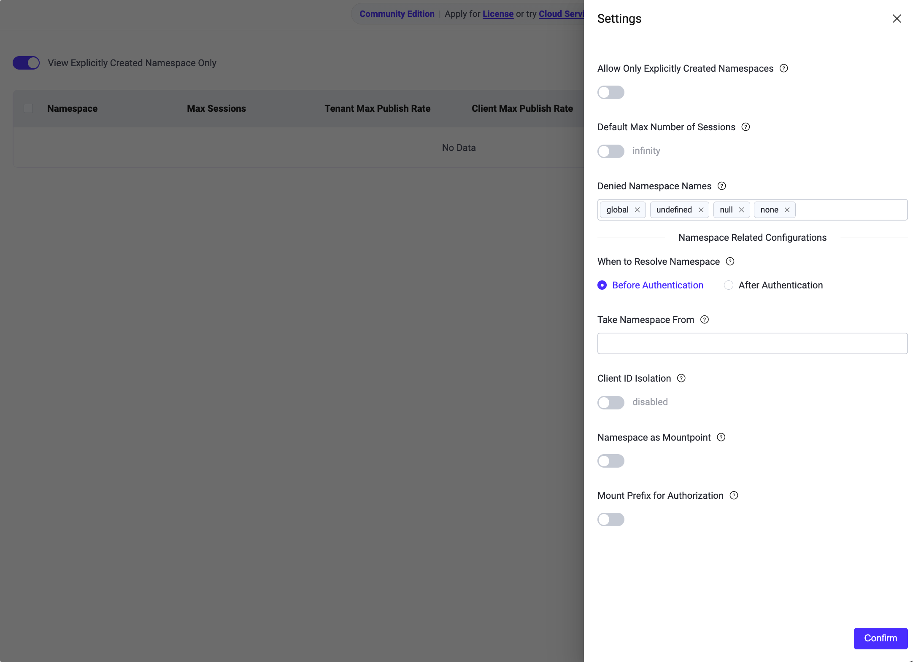

# グローバルネームスペース設定

EMQX 6.1では、個別のネームスペースインスタンスの設定に加えて、ネームスペースの識別方法、アイソレーション動作の適用方法、およびトピックや認可の取り扱いを制御するグローバルネームスペース設定が利用可能です。

これらの設定はクラスター全体に適用され、すべてのネームスペースおよびクライアント接続に影響します。通常、ネームスペース関連機能を有効化して使用する前に設定します。

グローバルネームスペース設定は、ダッシュボードの **Management -> Namespaces -> Settings** から管理できます。

::: tip 注意

後方互換性を保つために、EMQX 6.1のほとんどのグローバルネームスペース設定（Client ID Isolation、Namespace as Mountpoint、Mount Prefix for Authorizationなど）はデフォルトで無効になっています。

対応するアイソレーション機能を有効にするには、**Namespace Related Configurations** の下で明示的にオンにする必要があります。

:::



## 明示的に作成されたネームスペースのみ許可

この設定は、クライアントが明示的に作成されたネームスペースにのみ接続できるかどうかを制御します。

この設定が有効な場合、EMQXは接続プロセス中にクライアントのネームスペースを検証し、接続を許可するか拒否するかを判断します。

- **有効**:
  - ダッシュボードやREST APIで明示的に作成されていないネームスペースのクライアントは接続が拒否されます。
  - ネームスペースが解決できないクライアント（例えば、ネームスペースソースが設定されていないか有効な値を生成しない場合）も接続が拒否されます。
- **無効**:
  - 明示的に作成されていないネームスペースへの接続も許可されます。
  - ネームスペースソースが設定されている場合、EMQXは必要に応じてネームスペースを自動的に作成することがあります。

::: tip 注意

この設定を無効にする前に、**Take Namespace From** が適切に設定されており、すべての有効なクライアントが正常にネームスペースを解決できることを確認してください。

そうでないと、ネームスペースが解決できずにクライアントが拒否される可能性があります。

:::

## デフォルトの最大セッション数

この設定は、新規作成されたネームスペースの同時セッション最大数のデフォルト値を定義します。

- **有効**:
  - 新規作成されたネームスペースはこの最大セッション数制限を自動的に継承します。
- **無効**:
  - 新規作成されたネームスペースはデフォルトでセッション制限なし（`infinity`）となります。

この設定は、設定適用後に作成されたネームスペースにのみ適用されます。既存のネームスペースには影響せず、必要に応じて個別に更新する必要があります。

## Take Namespace From

この設定は、EMQXがクライアントの所属ネームスペースをどのように判定するかを指定します。

クライアントが接続すると、EMQXは設定された **Take Namespace From** ルールを評価し、クライアントの接続メタデータ（ユーザー名、SNI、その他の属性など）からネームスペース識別子を抽出します。抽出された値はクライアント属性 `client_attrs.tns` に格納されます。

::: tip

**Take Namespace From** ルールはVariform式で定義されます。構文や利用可能な関数の詳細は [Variform Expressions](../configuration/configuration.md#variform-expressions) を参照してください。

:::

この設定は以下の機能の前提条件です：

- 自動ネームスペース作成
- ネームスペースベースのトピックアイソレーション
- ネームスペースベースのClient IDアイソレーション
- ネームスペースレベルのセッション制限およびレート制限

**Take Namespace From** が設定されていない場合、`tns` 属性は生成されません。この場合、クライアントはどのネームスペースにも紐付けられず、ネームスペース関連のアイソレーションや制御機能はすべて無効のままになります。

### 例

以下はクライアントのユーザー名からネームスペース識別子を抽出するための **Take Namespace From** 設定例です：

```text
nth(1, tokens(username, '-'))
```

この設定により：

- クライアントはユーザー名 `tenantA-user1` で接続します。
- EMQXは設定を評価し、ユーザー名から `tenantA` を抽出します。
- 抽出された値はクライアント属性 `client_attrs.tns` に割り当てられます。
- `tenantA` がクライアントのネームスペース識別子となります。

## Client ID Isolation

Client IDアイソレーションは、異なるネームスペースのクライアントが同じClient IDを使用した場合の競合を防止します。

有効にすると、EMQXは内部的にクライアントのClient IDにネームスペースをプレフィックスとして付加しますが、クライアントから提供された元のClient IDは変更されません。

Client ID Isolationが有効な場合、ダッシュボードは推奨されるデフォルト式を自動的に入力します：

```
concat([client_attrs.tns, '-', clientid])
```

この設定により：

- 異なるネームスペースのクライアントが同じClient IDを安全に使用できます。
- 内部的に使用されるClient IDは常にネームスペースのプレフィックスを含みます。

この式は例示であり、結果として生成されるClient IDがグローバルに一意である限り、ビジネス要件に応じてカスタマイズ可能です。

### 動作例

ネームスペースソースがユーザー名からネームスペースを抽出するように設定されているとします：

```
nth(1, tokens(username, '-'))
```

Client IDアイソレーションはデフォルト式で有効化されています：

```
concat([client_attrs.tns, '-', clientid])
```

#### クライアント接続情報

| クライアント | ユーザー名       | Client ID |
| ------------ | ---------------- | --------- |
| A            | tenantA-user1    | client1   |
| B            | tenantB-user2    | client1   |

#### 内部的に使用されるClient ID

| ネームスペース | 元のClient ID | 実際のClient ID    |
| -------------- | ------------- | ------------------ |
| tenantA        | client1       | tenantA-client1    |
| tenantB        | client1       | tenantB-client1    |

## Namespace as Mountpoint

有効にすると、EMQXはクライアントのネームスペースをトピックのマウントポイントとして使用します（ネームスペースが正常に解決された後）。これによりネームスペースレベルのトピックアイソレーションが可能になります。

リスナーにすでに `mountpoint` が設定されている場合、この設定は無視され、リスナー設定が優先されます。

### 動作

**Namespace as Mountpoint** が有効になると、EMQXは以下のようにトピックをアイソレーションします：

- `PUBLISH`、`SUBSCRIBE`、`UNSUBSCRIBE`、およびWillメッセージ処理時に：
  - EMQXは内部的にトピックの先頭に `{namespace}/` を自動的に付加します。
- クライアントへのメッセージ配信時に：
  - ネームスペースのプレフィックスは自動的に取り除かれます。
- クライアントから見た場合：
  - パブリッシュおよびサブスクライブするトピック名は変更されません。
  - クライアントはネームスペースのプレフィックスを認識しません。

### 例

クライアントがネームスペース `n1` に属し、**Namespace as Mountpoint** が有効な場合を想定します。

#### クライアント側の動作

- クライアントは `sensors/#` をサブスクライブします。
- クライアントは `sensors/data` にパブリッシュします。

#### EMQX内部処理

- ブローカーはサブスクリプションを `n1/sensors/#` として登録します。
- ブローカーはメッセージを `n1/sensors/data` でルーティングします。
- メッセージはクライアントに `sensors/data` として配信されます。

結果として：

- ネームスペースのプレフィックスは内部でのみ使用されます。
- クライアントは常に元のトピック名で操作します。
- 異なるネームスペースのクライアントが同じトピックを使用しても、お互いのメッセージを受信しません。

## Mount Prefix for Authorization

この設定は、認可（ACL）チェックの前にトピックマウントポイントのプレフィックスを対象トピックやトピックフィルターに付加するかどうかを制御します。

マウントポイントのプレフィックスは通常、**Namespace as Mountpoint** が有効な場合のネームスペースから取得し、以下の形式になります：

```
{namespace}/
```

### 動作

**Mount Prefix for Authorization** が有効な場合：

- EMQXはACLルールや認可バックエンドのマッチング前に、トピックマウントポイントを対象トピックやトピックフィルターの先頭に付加します。
- 認可チェックはプレフィックス付きのトピックを用いて実施されます。

この動作は以下の操作に適用されます：

- `PUBLISH`
- `SUBSCRIBE`
- `UNSUBSCRIBE`
- Willメッセージ

### 例

以下の設定が有効なとします：

- **Namespace as Mountpoint**
- **Mount Prefix for Authorization**
- クライアントのネームスペース：`n1`

#### クライアント操作

クライアントは以下をサブスクライブしようとします：

```
sensors/#
```

#### 認可に使用されるトピック

認可時にEMQXは `n1/sensors/#` を評価します。したがって、対応するACLルールは `sensors/#` ではなく `n1/sensors/#` として定義する必要があります。

### 推奨

トピックアイソレーションのために **Namespace as Mountpoint** を有効にしている場合は、**Mount Prefix for Authorization** も有効にすることを推奨します。これにより、認可チェックがブローカー内部で使用されるトピック名と一致し、認可結果と実際のメッセージルーティングの不整合を防止できます。
