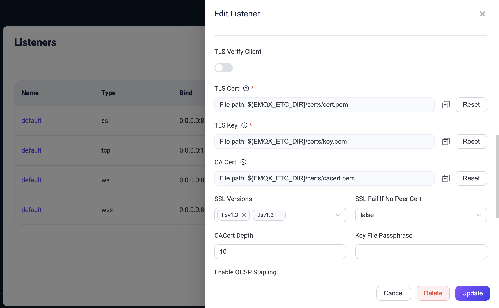

# SSL/TLS接続の有効化

<<<<<<< HEAD
EMQXは、MQTTクライアントのアクセスを受け入れる際にSSL/TLSを介して安全な接続を確立できます。SSL/TLS暗号化機能はトランスポート層でネットワーク接続を暗号化し、通信データのセキュリティを強化しつつ、その完全性を保証します。
=======
EMQXは、MQTTクライアントのアクセスを受け入れる際に、SSL/TLSを介して安全な接続を確立できます。SSL/TLS暗号化機能はトランスポート層でネットワーク接続を暗号化し、通信データのセキュリティを強化しつつ、その完全性を保証します。
>>>>>>> origin/release-5.10

本ページでは、SSL/TLS接続の機能と利点、およびクライアントとEMQX間でSSL/TLS接続を確立する方法について紹介します。

## セキュリティ上の利点

<<<<<<< HEAD
SSL/TLS接続を有効にすると、以下のセキュリティ上の利点があります：

1. **強力な認証**：通信の両当事者は、相手が保持するX.509デジタル証明書を検証してお互いの身元を確認します。これらの証明書は通常、信頼された認証局（CA）によって発行されており、偽造が困難です。
2. **機密性**：各セッションは両当事者が交渉したセッションキーで暗号化されます。第三者が通信内容を知ることはできず、たとえセッションキーが漏洩しても他のセッションの安全性には影響しません。
=======
SSL/TLS接続を有効にすることで、以下のセキュリティ上の利点が得られます。

1. **強力な認証**：通信の両当事者は、相手が保有するX.509デジタル証明書を検証することで互いの身元を確認します。これらの証明書は通常、信頼された認証局（CA）によって発行されており、偽造は困難です。
2. **機密性**：各セッションは双方で交渉されたセッションキーを用いて暗号化されます。第三者が通信内容を知ることはできず、たとえセッションキーが漏洩しても他のセッションの安全性には影響しません。
>>>>>>> origin/release-5.10
3. **完全性**：暗号化通信におけるデータ改ざんの可能性は極めて低いです。

## 2つの利用モード

<<<<<<< HEAD
MQTT接続を含むすべての接続に対してSSL/TLS暗号化接続を有効にし、アクセスとメッセージ送信のセキュリティを確保できます。クライアントのSSL/TLS接続については、利用シナリオに応じて以下の2つのモードから選択可能です：

| 利用モード                                                   | 利点                                                         | 欠点                                                         |
| ------------------------------------------------------------ | ------------------------------------------------------------ | ------------------------------------------------------------ |
| クライアントとEMQX間で直接SSL/TLS接続を確立する。             | 簡単に使用でき、追加のコンポーネントは不要。                   | EMQXのリソース消費が増加し、接続数が多い場合はCPUやメモリの消費が高くなる可能性がある。 |
| プロキシまたはロードバランサーでTLS接続を終了させる。          | EMQXのパフォーマンスに影響を与えず、ロードバランシング機能を提供。 | TCP SSL/TLS終了をサポートするクラウドベンダーのロードバランサーは限られている。加えて、ユーザー自身でHAProxyなどのソフトウェアをデプロイする必要がある。 |

プロキシまたはロードバランサーでTLS接続を終了させる方法については、[クラスターのロードバランシング](../deploy/cluster/lb.md)を参照してください。

## 一方向／双方向認証

EMQXは包括的なSSL/TLS機能をサポートしており、X.509証明書を用いたクライアント／サーバー間の一方向認証および双方向相互認証を実現できます：

| 認証方式               | 説明                                                         | 検証方法                                                     | 長所と短所                                                  |
| ---------------------- | ------------------------------------------------------------ | ------------------------------------------------------------ | ------------------------------------------------------------ |
| 一方向認証             | クライアントがサーバーの身元を検証するが、サーバーはクライアントの身元を検証しない。 | クライアントは通常証明書を提供する必要がなく、サーバー証明書が信頼された認証局（CA）によって発行されていることを検証するだけ。 | 通信データの機密性と完全性は保証できるが、通信当事者の身元保証はできない。 |
| 双方向認証             | サーバーとクライアントが互いに身元を検証し合う。             | 各デバイスに証明書を発行し、サーバーはクライアント証明書を検証して正当性を確認する。 | サーバーとクライアント間の相互信頼を確保し、中間者攻撃を防止できる。 |

## SSL/TLS証明書

SSL/TLS接続を確立する前に、認証用のSSL/TLS証明書を準備する必要があります。EMQXはテスト目的でのみ使用可能なSSL/TLS証明書セット（インストールパッケージの`etc/certs`ディレクトリにあります）を提供しています。本番環境で使用する場合は、信頼されたCAによって署名された信頼性の高い証明書を使用してください。証明書の取得方法については、[SSL/TLS証明書の取得](./tls-certificate.md)を参照してください。

## 一方向認証でのSSL/TLS有効化

EMQXはデフォルトでポート`8883`にSSL/TLSリスナーを有効にし、一方向認証を設定しています。証明書の差し替えやその他の設定変更は、ダッシュボードや設定ファイルから行えます。

### ダッシュボードでの有効化

1. EMQXダッシュボードにアクセスし、左側のナビゲーションメニューから **Management** -> **Listeners** をクリックします。

2. **Listeners**ページで、SSLリスナーの**Name**列にある**default**をクリックします。

   - **TLS Verify**：一方向認証のためデフォルトで無効です。

   - **Session Tickets**：TLS 1.3のセッション再開を有効にします。クライアントはサーバーが発行した暗号化されたセッションチケットを提示することで、再接続時に以前確立したTLSセッションを再利用でき、完全なTLSハンドシェイクを回避し、レイテンシとCPU使用率を削減します。

     - **`disabled`**：セッションチケットを無効化（デフォルト）。接続ごとに完全なTLSハンドシェイクを実行します。
     - **`stateless`**：ステートレスセッションチケットを有効化。サーバーはセッション状態を保持せず、再接続性能が向上します。セッション再開後はTLSクライアント証明書情報が利用できないため、証明書ベースの認証や認可が不要な場合に適しています。
     - **`stateless_with_cert`**：証明書情報を含むステートレスセッションチケットを有効化。セッション再開後も証明書情報が利用可能で、mTLSなど証明書ベースの認証に適していますが、ネットワーク帯域の使用量が若干増加します。

     ::: tip 注意

     セッションチケットを生成するには、ノードレベルのオプション`node.tls_stateless_tickets_seed`に空でない文字列（例：`node.tls_stateless_tickets_seed = "averysecuresecret"`）を設定する必要があります。リスナーでセッションチケットを有効にしてもこのオプションが設定されていない場合、セッションチケットは生成されません。

     セッションチケットはTLS 1.3でのみサポートされ、クラスター環境でのスケーラビリティを確保するためステートレスモードのみ対応しています。EMQXはTLS 1.2のステートフルセッション再開をサポートしていません。

     また、EMQXはクライアントの早期データ送信（0-RTT）をサポートしていません。クライアントはTLSハンドシェイク完了までMQTTデータを送信できません。

     :::

   - **TLS Cert**、**TLS Key**、および**CA Cert**：**Reset**ボタンをクリックして、現在の証明書ファイルをプライベート証明書ファイルに差し替えます。

   - **SSL Versions**：すべてのTLS/DTLSバージョンをサポートします。デフォルトは`tlsv1.3`と`tlsv1.2`です。PSK認証にPSK暗号スイートを使用する場合は、ここに`tlsv1.2`、`tlsv1.1`、`tlsv1`を設定してください。PSK認証の詳細は[PSK認証の有効化](./psk-authentication.md)を参照してください。

   - **Fail If No Peer Cert**：**TLS Verify**が有効な場合に使用します。デフォルトは`false`です。
     - `true`に設定すると、クライアントが空の証明書を送信した場合に検証が失敗し、SSL/TLS接続が拒否されます。
     - `false`に設定すると、クライアントが無効な証明書を送信した場合のみ検証が失敗し、空の証明書は有効とみなされます。つまり一方向認証の場合です。

   - **Intermediate Certificate Depth**：証明書パスの最大深度。デフォルトは`10`です。

   - **Key Password**：秘密鍵ファイルにパスワードが設定されている場合は入力します。

   - **Enable OCSP Stapling**：デフォルトで無効。SSL/TLS証明書の失効状況を取得する必要がある場合はトグルスイッチで有効化します。詳細は[OCSP Stapling](./ocsp.md)を参照してください。

   - **Enable CRL Check**：デフォルトで無効。接続クライアント証明書の失効確認が必要な場合はトグルスイッチで有効化します。詳細は[CRL Check](./crl.md)を参照してください。

3. 編集が完了したら、**Update**ボタンをクリックします。

### 設定ファイルでの有効化

設定ファイルの`listeners.ssl.default`設定グループを変更してSSL/TLS接続を有効にすることもできます。

1. プライベートSSL/TLS証明書ファイルをEMQXの`etc/certs`ディレクトリに配置します。

2. 設定ファイル`base.hocon`（インストール方法により`./etc`または`/etc/emqx/etc`ディレクトリにあります）を開きます。

3. `listeners.ssl.default`設定グループを編集し、証明書ファイルを自身の証明書ファイルに置き換えます。

   一方向認証を有効にする場合は、`verify = verify_none`を追加してください：
=======
MQTT接続を含むすべての接続に対してSSL/TLS暗号化接続を有効にし、アクセスおよびメッセージ送信のセキュリティを確保できます。クライアントのSSL/TLS接続では、利用シナリオに応じて以下の2つのモードから選択可能です。

| 利用モード                                                   | 利点                                                         | 欠点                                                         |
| ------------------------------------------------------------ | ------------------------------------------------------------ | ------------------------------------------------------------ |
| クライアントとEMQX間で直接SSL/TLS接続を確立する。           | 利用が簡単で、追加コンポーネントが不要。                      | EMQXのリソース消費が増加し、接続数が多い場合はCPUおよびメモリ消費が高くなる可能性がある。 |
| プロキシまたはロードバランサーを介してTLS接続を終端する。     | EMQXのパフォーマンスに影響を与えず、ロードバランシング機能を提供。 | TCP SSL/TLS終端をサポートするクラウドベンダーのロードバランサーは限られている。また、ユーザー自身でHAProxyなどのソフトウェアをデプロイする必要がある。 |

プロキシまたはロードバランサーを介したTLS接続終端の詳細は、[クラスターのロードバランシング](../deploy/cluster/lb.md)を参照してください。

## 一方向／双方向認証

EMQXは包括的なSSL/TLS機能を提供し、X.509証明書を用いた一方向認証および双方向（相互）認証の両方をサポートします。

| 認証方式                | 説明                                                         | 検証方法                                                     | 長所と短所                                                  |
| ---------------------- | ------------------------------------------------------------ | ------------------------------------------------------------ | ------------------------------------------------------------ |
| 一方向認証             | クライアントはサーバーの身元を検証するが、サーバーはクライアントの身元を検証しない。 | クライアントは通常証明書を提供せず、サーバーの証明書が信頼された認証局（CA）によって発行されていることのみを検証する。 | 通信データの機密性と完全性は保証できるが、通信当事者の身元保証はできない。 |
| 双方向認証             | サーバーとクライアントが互いに身元を検証する。               | 各デバイスに証明書を発行し、サーバーはクライアント証明書の正当性を検証する。 | サーバーとクライアント間の相互信頼を保証し、中間者攻撃を防止できる。 |

## SSL/TLS証明書

SSL/TLS接続を確立する前に、認証用のSSL/TLS証明書を準備する必要があります。EMQXはテスト目的でのみ、インストールパッケージの`etc/certs`ディレクトリに証明書セットを提供しています。実運用環境では、信頼された認証局によって署名された信頼性のある証明書を使用してください。証明書の取得方法については[SSL/TLS証明書の取得](./tls-certificate.md)を参照してください。

## 一方向認証でSSL/TLSを有効化

EMQXはデフォルトでポート`8883`にSSL/TLSリスナーを有効化し、一方向認証を設定しています。ダッシュボードや設定ファイルを通じて、証明書の差し替えやその他の設定変更が可能です。

### ダッシュボードでの有効化

1. EMQXダッシュボードにアクセスし、左側メニューの**管理** -> **リスナー**をクリックします。

2. **リスナー**ページで、SSLリスナーの**名前**列から**default**をクリックします。

   - **TLS Verify**：一方向認証のためデフォルトで無効です。
   - **TLS Cert**、**TLS Key**、**CA Cert**：**リセット**ボタンをクリックして、現在の証明書ファイルをプライベート証明書ファイルに差し替えます。
   - **SSL Versions**：すべてのTLS/DTLSバージョンをサポートします。デフォルトは`tlsv1.3`と`tlsv1.2`です。PSK認証にPSK暗号スイートを使用する場合は、`tlsv1.2`、`tlsv1.1`、`tlsv1`を設定してください。PSK認証の詳細は[PSK認証の有効化](./psk-authentication.md)を参照してください。
   - **Fail If No Peer Cert**：**TLS Verify**が有効な場合に使用します。デフォルトは`false`です。
     - `true`に設定すると、クライアントが空の証明書を送信した場合に検証が失敗し、SSL/TLS接続が拒否されます。
     - `false`の場合は、クライアントが無効な証明書を送信した場合のみ検証が失敗し、空の証明書は有効とみなされます。SSL/TLS接続は拒否されます。
   - **Intermediate Certificate Depth**：証明書パスの最大深度。デフォルトは`10`です。
   - **Key Password**：秘密鍵ファイルにパスワードが設定されている場合は入力します。
   - **Enable OCSP Stapling**：デフォルトで無効。SSL/TLS証明書の失効状況を取得する必要がある場合はトグルスイッチで有効化します。詳細は[OCSP Stapling](./ocsp.md)を参照してください。
   - **Enable CRL Check**：デフォルトで無効。接続するクライアント証明書の失効確認が必要な場合はトグルスイッチで有効化します。詳細は[CRL Check](./crl.md)を参照してください。

3. 編集が完了したら、**更新**ボタンをクリックします。

   

### 設定ファイルでの有効化

設定ファイルの`listeners.ssl.default`設定グループを変更してSSL/TLS接続を有効化することも可能です。

1. プライベートSSL/TLS証明書ファイルをEMQXの`etc/certs`ディレクトリに配置します。

2. インストール方法により`./etc`または`/etc/emqx/etc`ディレクトリにある設定ファイル`base.hocon`を開きます。

3. `listeners.ssl.default`設定グループを修正し、証明書ファイルを自身の証明書ファイルに置き換えます。

   一方向認証を有効にする場合は、`verify = verify_none`を追加してください。
>>>>>>> origin/release-5.10

```bash
listeners.ssl.default {
  bind = "0.0.0.0:8883"
  ssl_options {
    # クライアント証明書の真正性を検証するためにリスナーが使用する信頼されたCA（認証局）証明書を含むPEMファイル。
<<<<<<< HEAD
    # 一方向認証の場合、このファイルの内容は空でもよい。
    cacertfile = "etc/certs/rootCAs.pem"
    # リスナー用のSSL/TLS証明書チェーンを含むPEMファイル。
    # 証明書がルートCAから直接発行されていない場合は、中間CA証明書をリスナー証明書の後ろに連結してチェーンを形成する。
    certfile = "etc/certs/server-cert.pem"
    # SSL/TLS証明書に対応する秘密鍵を含むPEMファイル。
    keyfile = "etc/certs/server-key.pem"
    # クライアント証明書の真正性を検証するための設定。双方向認証（mTLS）では必ず 'verify_peer' に設定する必要がある。
    # 任意のクライアントの接続を許可する場合は 'verify_none' に設定する。
    verify = verify_none
    # クライアントが証明書を送信しない場合にハンドシェイクを失敗させるかどうか。双方向認証（mTLS）では必ずtrueに設定する必要がある。
    # falseの場合は、クライアントが無効な証明書を送信した場合のみ失敗する（一方向認証の場合）。
=======
    # 一方向認証の場合、ファイル内容は空でもかまいません。
    cacertfile = "etc/certs/rootCAs.pem"
    # リスナー用のSSL/TLS証明書チェーンを含むPEMファイル。
    # 証明書がルートCAから直接発行されていない場合、中間CA証明書をリスナー証明書の後に連結してチェーンを形成します。
    certfile = "etc/certs/server-cert.pem"
    # SSL/TLS証明書に対応する秘密鍵を含むPEMファイル。
    keyfile = "etc/certs/server-key.pem"
    # クライアント証明書の真正性を検証するために`verify_peer`を設定します。双方向認証（mTLS）では必須です。
    # どのクライアントも接続可能にする場合は`verify_none`を設定します。
    verify = verify_none
    # クライアントが証明書を送信しない場合にハンドシェイクを失敗させるかどうか。双方向認証（mTLS）では`true`に設定します。
    # `false`の場合は無効な証明書を送信した場合のみ失敗し、空の証明書は有効とみなされます（一方向認証）。
>>>>>>> origin/release-5.10
    fail_if_no_peer_cert = true
  }
}
```

### EMQX v4の設定

**EMQXでは、`mqtt:ssl`のデフォルトリスニングポートは8883です。**

<<<<<<< HEAD
OpenSSLツールで生成した`emqx.pem`、`emqx.key`、`ca.pem`ファイルをEMQXの`etc/certs/`ディレクトリにコピーし、以下の設定を参考に`base.hocon`を修正します：

```shell
## listener.ssl.$name はMQTT/SSLのIPアドレスとポートです
=======
OpenSSLツールで生成した`emqx.pem`、`emqx.key`、`ca.pem`ファイルをEMQXの`etc/certs/`ディレクトリにコピーし、以下の設定を参考に`base.hocon`を修正します。

```shell
## listener.ssl.$name はMQTT/SSLのIPアドレスとポート
>>>>>>> origin/release-5.10
## 値: IP:Port | Port
listener.ssl.external = 8883

# SSL/TLS証明書に対応する秘密鍵を含むPEMファイル
listener.ssl.external.keyfile = etc/certs/emqx.key

<<<<<<< HEAD
# （省略）

=======
# SSL/TLS証明書チェーンを含むPEMファイル
>>>>>>> origin/release-5.10
        fail_if_no_peer_cert = false
      }
    }
```

4. 設定を反映するためにEMQXを再起動します。

## 一方向認証でのクライアント接続テスト

<<<<<<< HEAD
[MQTTX CLI](https://mqttx.app/cli)を使ってテスト可能です。一方向認証では通常、クライアントはCA証明書を提供し、サーバーの身元を検証します：
=======
[MQTTX CLI](https://mqttx.app/cli)を使用してテストできます。一方向認証では、クライアントがCA証明書を提供し、サーバーの身元を検証します。
>>>>>>> origin/release-5.10

```bash
mqttx sub -t 't/1' -h localhost -p 8883 \
  --protocol mqtts \
  --ca certs/rootCA.crt
```

<<<<<<< HEAD
サーバー証明書のCommon Name（CN）がクライアントが接続時に指定したサーバーアドレスと一致しない場合、以下のエラーが発生します：
=======
サーバー証明書のCommon Name（CN）がクライアント接続時に指定したサーバーアドレスと一致しない場合、以下のエラーが発生します。
>>>>>>> origin/release-5.10

```bash
Error [ERR_TLS_CERT_ALTNAME_INVALID]: Hostname/IP does not match certificate's altnames: Host: localhost. is not cert's CN: Server
```

<<<<<<< HEAD
この場合、クライアント証明書のCNをサーバーアドレスに合わせるか、`--insecure`オプションで証明書CN検証を無視できます：
=======
この場合、クライアント証明書のCNをサーバーアドレスに合わせるか、`--insecure`オプションで証明書CNの検証を無視できます。
>>>>>>> origin/release-5.10

```bash
mqttx sub -t 't/1' -h localhost -p 8883 \
  --protocol mqtts \
  --ca certs/rootCA.crt \
  --insecure
```

<<<<<<< HEAD
## 双方向認証でのSSL/TLS有効化

双方向認証は一方向認証の拡張であり、EMQXがクライアント証明書も検証してクライアントの正当性を保証するように設定します。

これに加えて、クライアント用の証明書を発行する必要があります。具体的な操作は[クライアント証明書の発行](./tls-certificate.md#issue-client-certificates)を参照してください。

ダッシュボードでの方法では、**TLS Verify**を**Enable**にし、**Fail if No Peer Cert**オプションを`true`に設定して双方向認証を強制できます。

設定ファイルの`listeners.ssl.default`設定グループに以下を追加しても構いません：
=======
## 双方向認証でSSL/TLSを有効化

双方向認証は一方向認証の拡張であり、EMQXがクライアント証明書を検証してクライアントの正当性を保証するようにさらに設定します。

これに加えて、クライアント用の証明書を発行する必要があります。具体的な操作は[クライアント証明書の発行](./tls-certificate.md#issue-client-certificates)を参照してください。

ダッシュボードでは、**TLS Verify**を**有効**にし、**Fail if No Peer Cert**を`true`に設定して双方向認証を強制できます。

設定ファイルの`listeners.ssl.default`設定グループには、以下のように追加します。
>>>>>>> origin/release-5.10

```bash
listeners.ssl.default {
  ...
  ssl_options {
    ...
    # ピア検証を有効化
    verify = verify_peer
    # 双方向認証を強制。クライアントが証明書を提供できない場合、SSL/TLS接続は拒否される。
    fail_if_no_peer_cert = true
  }
}
```

## 双方向認証でのクライアント接続テスト

<<<<<<< HEAD
[MQTTX CLI](https://mqttx.app/cli)を使ってテスト可能です。双方向認証ではCA証明書に加え、クライアント自身の証明書も提供する必要があります：
=======
[MQTTX CLI](https://mqttx.app/cli)を使用してテストできます。双方向認証では、CA証明書に加えてクライアント自身の証明書も提供する必要があります。
>>>>>>> origin/release-5.10

```bash
mqttx sub -t 't/1' -h localhost -p 8883 \
  --protocol mqtts \
  --ca certs/rootCA.crt \
  --cert certs/client-0001.crt \
  --key certs/client-0001.key
```

<<<<<<< HEAD
サーバー証明書のCNがクライアントが接続時に指定したサーバーアドレスと一致しない場合、以下のエラーが発生します：
=======
サーバー証明書のCNがクライアント接続時に指定したサーバーアドレスと一致しない場合、以下のエラーが発生します。
>>>>>>> origin/release-5.10

```bash
Error [ERR_TLS_CERT_ALTNAME_INVALID]: Hostname/IP does not match certificate's altnames: Host: localhost. is not cert's CN: Server
```

<<<<<<< HEAD
この場合、クライアント証明書のCNをサーバーアドレスに合わせるか、`--insecure`オプションで証明書CN検証を無視できます：
=======
この場合、クライアント証明書のCNをサーバーアドレスに合わせるか、`--insecure`オプションで証明書CNの検証を無視できます。
>>>>>>> origin/release-5.10

```bash
mqttx sub -t 't/1' -h localhost -p 8883 \
  --protocol mqtts \
  --ca certs/rootCA.crt \
  --cert certs/client-0001.crt \
  --key certs/client-0001.key \
  --insecure
```

## SSL/TLS証明書の更新

<<<<<<< HEAD
プライベートSSL/TLS証明書ファイルの有効期限が切れた場合は、`./etc`または`/etc/emqx/etc`ディレクトリ内の古い証明書を新しいものに差し替えて手動で更新する必要があります。

EMQXは再起動なしでSSL/TLS証明書のローテーションをサポートしています。デフォルトでEMQXは120秒ごとにSSL/TLS証明書をリロードします。
=======
プライベートSSL/TLS証明書ファイルの有効期限が切れた場合は、`./etc`または`/etc/emqx/etc`ディレクトリ内の古い証明書を新しいものに手動で差し替えて更新してください。

EMQXは再起動なしでSSL/TLS証明書のローテーションをサポートしています。デフォルトでは、EMQXは120秒ごとにSSL/TLS証明書をリロードします。
>>>>>>> origin/release-5.10
