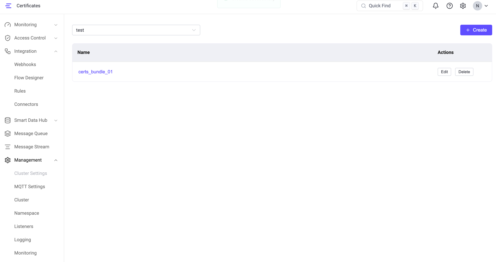

# SSL/TLS 証明書

SSL/TLS 証明書は EMQX のセキュリティアーキテクチャの中核をなす要素です。これにより、ネットワーク通信の認証、暗号化、およびデータの整合性が提供されます。EMQX では、以下のシナリオで安全な接続を確立するために SSL/TLS 証明書が必要です。

- TLS 上の MQTT 接続（MQTTS）
- WebSocket Secure（WSS）上の MQTT 接続
- HTTPS サービスおよびダッシュボードアクセス
- TLS 対応の外部接続（例：データ統合）

EMQX 6.1 以降では、証明書は単なるファイルパスではなく再利用可能なリソースとして扱われます。EMQX は以下の2つの証明書管理方式をサポートしています。

1. パスベース証明書（従来方式）：設定ファイル内で直接ファイルパスを参照する証明書。
2. 管理証明書（EMQX 6.1 以降）：再利用可能なリソースとして管理され、名前で参照される証明書。

どちらの方式も標準の PEM エンコードファイルを使用し、EMQX の SSL/TLS 実装と完全に互換性があります。

本ページでは以下のトピックを扱います。

- SSL/TLS 証明書の取得方法
- EMQX における証明書管理
- 複数証明書のサポート
- SSL/TLS 証明書の更新

## SSL/TLS 証明書の取得

EMQX で証明書を使用する前に、信頼できるソースから証明書を取得する必要があります。取得方法は環境やセキュリティ要件によって異なります。

### 証明書取得の選択肢

TLS 証明書は以下の方法で取得可能です。

- **自己署名証明書**

    独自の認証局（CA）が発行する証明書です。テストや管理された環境でのみ推奨され、デフォルトでは信頼されません。

- **信頼された CA が発行する証明書の申請または購入**

    公共または企業の CA から取得する証明書で、例として以下があります。

    - [Let's Encrypt](https://letsencrypt.org/)
    - クラウドプロバイダー（例：Huawei Cloud、Tencent Cloud）
    - 商用 CA（例：[DigiCert](https://www.digicert.com/)）

    本番環境や企業展開では、OV（組織認証）以上の保証レベルの証明書が一般的に推奨されます。

<!-- **ACME を使った自動発行** -->

<!--EMQX は ACME プロトコル（例：Let’s Encrypt）を利用してサーバー証明書の自動取得および更新が可能です。-->

### 自己署名 CA 証明書の作成

自己署名証明書はテスト、開発、プライベート環境に適しています。

::: tip 前提条件

[OpenSSL](https://www.openssl.org/) がインストールされていること。

:::

1. 以下のコマンドを実行して鍵ペアを生成します。コマンド実行時に鍵を保護するためのパスワード入力が求められます。このパスワードは証明書の生成、発行、検証時に必要となるため、安全に保管してください。

   ```bash
   openssl genrsa -des3 -out rootCA.key 2048
   ```

2. 次に、鍵ペアの秘密鍵を使って CA 証明書を生成します。コマンド実行時に証明書の識別名（DN）を設定するよう求められます。

   ```bash
   openssl req -x509 -new -nodes -key rootCA.key -sha256 -days 3650 -out rootCA.crt
   ```

### サーバー証明書の発行

先ほど生成した CA 証明書を使って、EMQX のリスナーがクライアントに自身の正当性を証明するためのサーバー証明書を発行します。サーバー証明書は通常、ホスト名、サーバー名、またはドメイン名（例：[www.emqx.com](https://www.emqx.com/en)）に対して発行されます。サーバー証明書の生成には、CA の秘密鍵（rootCA.key）、CA 証明書（rootCA.crt）、およびサーバーの証明書署名要求（CSR）（server.csr）が必要です。

1. サーバー証明書用の鍵ペアを生成します。

   ```bash
   openssl genrsa -out server.key 2048
   ```

2. サーバー鍵ペアを使って CSR を作成します。CSR は CA の秘密鍵で署名されると、証明書の公開鍵ファイルが生成され、ユーザーに発行されます。このコマンド実行時にも識別名（DN）の設定が求められます。

   ```bash
   openssl req -new -key server.key -out server.csr
   ```

   以下のような情報入力が求められます。各項目の意味は下記の通りです。

   ```bash
   You are about to be asked to enter information that will be incorporated
   into your certificate request.
   What you are about to enter is what is called a Distinguished Name or a DN.
   There are quite a few fields but you can leave some blank
   For some fields there will be a default value,
   If you enter '.', the field will be left blank.
   -----
   Country Name (2 letter code) [AU]: # 国・地域
   State or Province Name (full name) [Some-State]: # 州・都道府県
   Locality Name (eg, city) []: # 市区町村
   Organization Name (eg, company) [Internet Widgets Pty Ltd]: # 組織名（会社名）、例：EMQ
   Organizational Unit Name (eg, section) []: # 部署名、例：EMQX
   Common Name (e.g. server FQDN or YOUR name) []: # サーバーの完全修飾ドメイン名（FQDN）、例：mqtt.emqx.com
   ...
   ```

3. サーバー CSR を使ってサーバー証明書を生成し、有効期限を指定します。ここでは365日と設定しています。

   ```bash
   openssl x509 -req -in server.csr -CA rootCA.crt -CAkey rootCA.key -CAcreateserial -out server.crt -days 365
   ```

   これで証明書のセットが完成します。

   ```bash
   .
   ├── rootCA.crt
   ├── rootCA.key
   ├── rootCA.srl
   ├── server.crt
   ├── server.csr
   └── server.key
   ```

### クライアント証明書の発行

クライアント証明書は双方向（相互）TLS 認証に使用されます。

発行手順はサーバー証明書の発行とほぼ同様ですが、以下の点が異なります。

- Common Name（CN）はクライアントを一意に識別する値（例：ユーザー名やクライアント ID）にします。
- 証明書は同じ CA 証明書で署名されます。したがって、クライアント証明書も前述の CA 証明書で署名可能です。

## EMQX における証明書管理

証明書取得後、EMQX では以下の2つの方法で証明書を管理および参照できます。

### パスベース証明書

パスベース証明書はリスナーやコネクターの SSL オプションで明示的にファイルパスを指定して設定します。例：

- `certfile`
- `keyfile`
- `cacertfile`

パスベース証明書の特徴：

- 証明書ファイルはユーザーまたは外部ツールが完全に管理します。
- リスナーは証明書ファイルを直接参照します。
- 証明書の更新は通常、ディスク上のファイルを置き換えることで行います。

EMQX はテスト用に `etc/certs` ディレクトリにサンプル証明書を提供しています。

パスベース証明書は引き続き完全にサポートされ、すべての EMQX バージョンと互換性があります。

### 管理証明書

EMQX 6.1 以降では、管理証明書という集中管理機構が導入されました。これにより TLS 証明書ファイルを複数コンポーネントで再利用可能なリソースとして管理できます。

管理証明書は以下の複数リソースで参照・再利用可能です。

- MQTT SSL リスナー
- WSS リスナー
- HTTPS / ダッシュボードリスナー
- TLS 対応コネクター（例：データ統合）

管理証明書はダッシュボードまたは REST API から作成・管理でき、EMQX のデータディレクトリ `data/certs2/` に保存されます。

内部的には Erlang/OTP の SSL ライブラリと連携する際にパスベースの PEM パスを使用し、以下を実現しています。

- 既存の TLS 動作との完全な下位互換性
- 証明書の自動リロード
- 証明書更新時にリスナーやコネクターの再起動不要

#### 管理証明書バンドル

管理証明書バンドルは TLS 関連ファイルの論理的なセットを表します。内容は以下を含みます。

- サーバー証明書
- 秘密鍵
- 任意の CA 証明書

各バンドルは名前と任意のネームスペースで識別され、複数のリスナーやコネクターで参照可能です。

管理証明書は再利用可能なリソースであり、バンドルを更新するとそれを参照するすべてのリスナーやコネクターに自動的に反映されます。

#### 証明書フォーマットとファイル構成

管理証明書は EMQX の既存の TLS 証明書展開方式と同様に PEM エンコードファイルを使用します。

PEM ファイルを使う利点は以下の通りです。

- **透明性**：`openssl` などの標準ツールで簡単にファイル内容の検査や検証が可能。
- **互換性**：Erlang/OTP の SSL ライブラリがネイティブにサポートし、
  - ファイルベースの証明書キャッシュ
  - 更新された証明書ファイルの自動リロード
を提供。

##### 証明書ファイル構成

管理証明書バンドルは、証明書名とネームスペースで識別されるディレクトリとしてディスクに保存されます。

例：

```
mqtt.example.com
tenant1/certs1
```

管理証明書バンドルには以下のファイルが含まれる場合があります。

| ファイル名            | 必須 | 説明                                         |
| --------------------- | ---- | -------------------------------------------- |
| `key.pem`             | 必須 | 秘密鍵                                       |
| `chain.pem`           | 必須 | 証明書チェーン（ルート CA を除く）            |
| `ca.pem`              | 任意 | ピア検証に使用するルート CA バンドル           |
| `key-password.pem`    | 任意 | 秘密鍵が暗号化されている場合の復号パスワード     |

#### SNI による複数証明書の対応

同一リスナーに複数の管理証明書バンドルが設定されている場合、EMQX は Server Name Indication（SNI）に基づいて動的に証明書を選択します。

SNI は TLS 拡張機能で、クライアントが TLS ハンドシェイク中に接続先のホスト名を指定できます。

##### SNI の利用方法

- 各管理証明書参照は任意で `sni` 値を指定できます。
- TLS ハンドシェイク時に、
  1. クライアントが SNI ホスト名を送信
  2. EMQX が設定済みの証明書エントリと照合
  3. 一致する証明書バンドルを使用
  4. 一致しなければリストの最初の証明書をデフォルトとして使用

この仕組みにより、単一リスナーで同一 IP・ポート上に複数ドメインやテナントの異なる TLS 証明書を安全に提供可能です。

##### 例

```hocon
listeners.ssl.default {
  bind = "0.0.0.0:8883"

  ssl_options {
    managed_certs = [
      {
        bundle_name = "default-cert"
        sni = "example.com"
      },
      {
        bundle_name = "example-cert-1"
        sni = "mqtt.example.com"
      }
    ]
  }
}
```

## 管理証明書バンドルの作成と管理

このセクションでは、ダッシュボードおよび REST API を使った管理証明書バンドルの作成と管理方法を説明します。作成後は証明書バンドルが選択可能となり、複数のリスナーやコネクターで再利用できます。

### ダッシュボードからの証明書バンドル作成

ダッシュボードから直接管理証明書バンドルを作成できます。

1. **管理** -> **証明書** に移動します。

2. **+ 作成** をクリックします。

3. **管理証明書の作成** パネルで以下の情報を入力します。

   - **名前**（必須）：管理証明書バンドルの一意な名前。

   - **ネームスペース**：管理証明書バンドルをグローバルネームスペースか特定のテナントネームスペースに作成するかを制御します。

     デフォルトではオフで、バンドルはグローバル（`global`）ネームスペースに作成されます。有効にするとテナントネームスペースを選択してその中に作成可能です。

     - グローバル管理者は `global` ネームスペースおよび任意のテナント（非グローバル）ネームスペースに作成可能。
     - ネームスペーススコープのユーザーは自身のネームスペース内のみ作成可能。

   - **TLS 証明書**（必須）：PEM 形式のサーバー証明書。証明書内容を直接貼り付けるか、**ファイル選択** でアップロード可能。必要に応じて完全な証明書チェーンを含めるべきです。

   - **TLS 鍵**（必須）：サーバー証明書に対応する秘密鍵（PEM 形式）。内容を直接貼り付けるかファイルアップロード可能。

   - **鍵パスワード**：秘密鍵が暗号化されている場合のパスフレーズ（任意）。

   - **CA 証明書**：PEM 形式の認証局証明書（任意）。通常、以下の場合に必要です。

     - 双方向（相互）TLS 認証を行う場合
     - CA 証明書を必要とするコネクターで再利用する場合

4. **作成** をクリックして管理証明書バンドルを保存します。

### ダッシュボードでの証明書バンドル管理

証明書バンドル作成後、ダッシュボードの証明書一覧に表示され、管理可能です。

- ページ上部のネームスペースドロップダウンでグローバルネームスペースと特定テナント（非グローバル）ネームスペースを切り替え可能。選択に応じて一覧が自動更新されます。
- 各証明書バンドルは **名前** と利用可能な **操作** が表示されます。

この画面から以下が行えます。

- 選択したネームスペース内の証明書バンドル一覧の閲覧
- 証明書バンドルの編集（証明書内容、秘密鍵、CA 証明書の更新）
- 不要になった証明書バンドルの削除

#### 証明書バンドルの削除

証明書バンドルの **削除** をクリックすると、EMQX は現在そのバンドルを参照しているリスナーやコネクターがあるかを確認します。

- 依存がなければ即座に削除されます。
- 依存がある場合は警告が表示され、強制削除するか確認されます。強制削除を実行すると、参照中でもバンドルは削除されます。

::: caution
使用中の証明書バンドルを強制削除すると、依存するリスナーやコネクターは証明書設定を失います。影響を受けたコネクターはエラーを報告し、新しい TLS 接続の確立に失敗する可能性があります。強制削除後は依存リソースの更新または再設定を行ってください。
:::

管理証明書バンドルはディスクに保存され、EMQX によって自動的にリロードされます。更新時に EMQX の再起動は不要です。



### REST API による証明書バンドル管理

ダッシュボードに加え、EMQX は TLS 証明書ファイル管理用の REST API を提供しています。API で作成した管理証明書はダッシュボードで作成したものと同一で、リスナーやコネクターから同様に参照可能です。

#### 証明書ファイルのアップロード

管理証明書バンドルの作成または更新のために証明書ファイルをアップロードします。

対応ファイル種別：

- `key`：秘密鍵
- `chain`：証明書チェーン（ルート CA を除く）
- `ca`：CA 証明書バンドル
- `key-password`：秘密鍵復号用パスワード

指定ネームスペースに証明書ファイルをアップロード：

```
POST /certs/ns/:namespace/name/:name?file=key|chain|ca|key-password
```

グローバルネームスペースに証明書ファイルをアップロード：

```
POST /certs/global/name/:name?file=key|chain|ca|key-password
```

#### 証明書バンドル一覧の取得

ネームスペース内の管理証明書バンドル一覧を取得：

```
GET /certs/ns/:namespace/list
```

グローバルネームスペースの管理証明書バンドル一覧を取得：

```
GET /certs/global/list
```

#### 証明書バンドルの削除

管理証明書バンドルまたはバンドル内の個別ファイルを削除する前に、EMQX は全ネームスペースの設定が参照しているかを確認します。依存がある場合、`force_delete=true` が指定されていなければ `400 BAD_REQUEST` エラーで失敗します。

ネームスペースから管理証明書バンドル全体を削除：

```
DELETE /certs/ns/:namespace/name/:name
```

グローバルネームスペースから管理証明書バンドル全体を削除：

```
DELETE /certs/global/name/:name
```

同様に、`kind` クエリパラメータ指定時はバンドル内の個別ファイル削除にも `force_delete` パラメータが適用されます。

**クエリパラメータ**

| パラメータ       | 型       | デフォルト | 説明                                                                                   |
| ---------------- | -------- | ---------- | -------------------------------------------------------------------------------------- |
| `force_delete`   | Boolean  | `false`    | `true` の場合、他の設定が参照していてもバンドルまたはファイルを削除します。`false`（デフォルト）では依存設定がある場合に `400` エラーで失敗します。 |

削除がブロックされた場合、`400` レスポンスボディに `referencing_configs` フィールドが含まれ、参照している設定がネームスペースごとに示されます。例：

```json
{
  "code": "BAD_REQUEST",
  "message": "Cannot delete file or bundle while configurations are depending on it",
  "referencing_configs": {
    "global": [
      ["connectors", "http", "my-connector"]
    ]
  }
}
```

::: caution
`force_delete=true` を設定すると、アクティブな依存関係があっても証明書バンドルが削除されます。削除されたバンドルを参照していたリスナーやコネクターは TLS 証明書設定を失い、新しい安全な接続の確立に失敗する可能性があります。強制削除後は影響を受けたリソースの再設定が必要です。
:::

<!--## ACME による自動証明書発行（管理証明書のみ）

EMQX は ACME プロトコル（例：Let’s Encrypt）を使ったサーバー側 TLS 証明書の自動発行および更新をサポートします。この機能は、クライアントが公開ドメイン名を使って直接 EMQX に TLS 接続する展開向けです。ロードバランサーで TLS 終端する場合やプライベート・内部ホスト名のみの場合は適していません。

ACME は EMQX 管理者が設定ファイルで有効化・設定し、ダッシュボードやネームスペーススコープユーザーからは有効化できません。

ACME は MQTTS、HTTPS／ダッシュボード、WSS リスナーで使うサーバー証明書にのみ適用され、クライアント証明書には適用されません。

### 管理証明書と ACME の連携

ACME 有効時：

1. EMQX は ACME クライアントとして設定済みの ACME CA に証明書を要求。
2. 証明書は期限切れ前に自動更新。
3. 生成されたファイルは管理証明書ディレクトリに書き込まれ、バンドルには以下が含まれる。
   - `key.pem`
   - `chain.pem`
   - `acc-key.pem`（該当する場合）
4. EMQX は自動的に管理証明書バンドルを作成。

ACME 発行証明書は手動アップロードの管理証明書と同様に動作し、ユーザーはリスナー設定時に生成済みの管理証明書バンドルを選択するだけで済みます。

### 設定ファイルによる ACME 有効化

操作には以下が必要：

- EMQX ホストへのアクセス
- EMQX 設定ファイルの編集権限
- 展開の管理権限

設定例：

```hocon
## ACME CA ディレクトリ URL（例：Let's Encrypt）
acme.directory_url = "https://acme-v02.api.letsencrypt.org/directory"

## ACME アカウント登録用連絡先メール
acme.contact_email = "admin@example.com"

## 証明書に含めるドメイン
## ドメイン所有権は HTTP-01 チャレンジで検証
acme.domains = ["mqtt1.example.com", "mqtt2.example.com"]

## 発行証明書保存ディレクトリ
## 管理証明書と連携
acme.cert_dir = "${EMQX_MANAGED_CERTS_DIR}"
```

-->

## SSL/TLS 証明書の更新

SSL/TLS 証明書は期限切れ前に更新し、安全な接続を維持する必要があります。EMQX での証明書更新方法は利用している証明書管理方式によって異なります。

### パスベース証明書の更新

パスベース証明書は設定内でファイルパスを直接参照しています（例：`certfile`、`keyfile`、`cacertfile`）。

更新手順：

1. 既存の証明書ファイルを `./etc` または `/etc/emqx/etc` ディレクトリ内の新しい証明書、鍵、CA ファイルに置き換えます。
2. 設定で参照しているファイルパスは変更しないようにします。

EMQX は更新された証明書ファイルを自動的にリロードします。

- 証明書ファイルは定期的にチェック・リロードされます。
- デフォルトでは120秒ごとにリロードされます。
- 多くの場合、リスナーの再起動は不要です。

### 管理証明書の更新

管理証明書は証明書バンドルを修正することで更新します。

更新方法：

- ダッシュボードまたは管理証明書 API を使い、既存の管理証明書バンドルに新しい証明書、秘密鍵、または CA 証明書をアップロードします。

更新後：

- 管理証明書を参照しているすべてのリスナーや TLS 対応コンポーネントは自動的に更新後の証明書を使用します。
- リスナーや EMQX の再起動は不要です。

管理証明書は再利用を前提として設計されており、バンドル更新はそれを参照するすべてのリソースに影響します。

<!--### ACME による自動更新（管理証明書のみ）

ACME 発行の管理証明書は以下をサポートします。

- EMQX は期限切れ前に証明書を自動更新。
- 更新された証明書ファイルは管理証明書ディレクトリに書き込まれる。
- 対応する管理証明書バンドルは自動的に更新される。

ACME 有効化後：

- 手動アップロードは不要。
- リスナーは同じ管理証明書バンドルを参照し続ける。
- 証明書ローテーションはサービス停止なしで行われる。-->

## 次のステップ

SSL/TLS 証明書を取得したら、クライアントの SSL/TLS 接続を有効化できます。

- [SSL/TLS 接続の有効化](./emqx-mqtt-tls.md)
