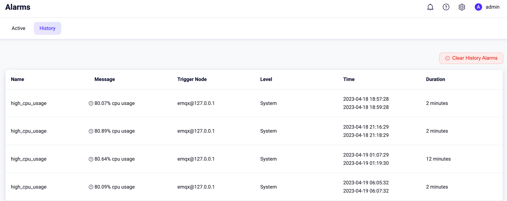
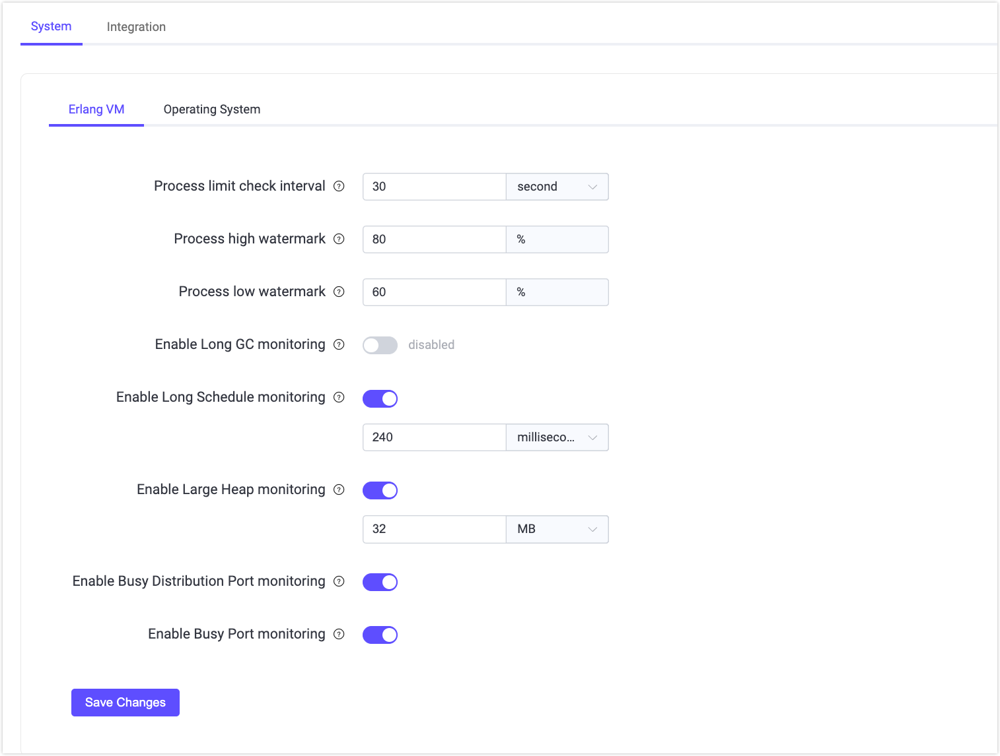

# アラーム

EMQX は、CPU 使用率、システムおよびプロセスメモリ使用率、プロセス数、ルールエンジンのリソース状態、クラスターのパーティションや修復状況などの内部状態変化を監視するための組み込みの監視およびアラーム機能を提供しています。これらの変化が閾値を超えたり期待値から逸脱した場合に EMQX はアラームをトリガーして記録し、状態が回復するとリストから削除します。

本ページでは、EMQX が提供するアラーム情報、詳細なアラーム情報の取得・確認方法、および EMQX におけるアラーム設定や閾値の構成方法について紹介します。監視およびアラーム機能により、運用中の潜在的な問題を通知し続けます。適切な閾値を設定してアラームを構成することで、EMQX の安全性、安定性、信頼性を確保できます。

## アラーム一覧

以下の表は、システム監視中に潜在的な問題を示すためにトリガーされる可能性のあるアラームを一覧にしたものです。

::: tip

アラームはシステムへの影響度や重大度に応じて、3つのレベルに分類されます。

- **Error（エラー）**: ユーザー設定によるエラー。クライアントはエラーを認識し再試行可能です。

- **Warning（警告）**: 時折発生するエラー。頻発する場合は注意が必要です。

- **Critical（重大）**: クライアントとサーバー間で不可逆的なデータ損失が発生し、通信や業務に支障をきたします。

これらのレベルは開発者視点で定義されており、あくまで推奨です。ビジネスニーズに応じて独自のアラームレベルを定義可能です。

:::

| **アラーム**                        | レベル    | 説明                                                        | **詳細**                                    | **閾値**                                                    |
| :--------------------------------- | -------- | :----------------------------------------------------------- | :------------------------------------------ | :----------------------------------------------------------- |
| high_system_memory_usage            | Warning  | システムメモリ使用率が高い                                  | システムメモリ使用率が約 ~p% を超えている   | `os_mon.sysmem_high_watermark = 70%`                         |
| high_process_memory_usage           | Warning  | 単一の Erlang プロセスのメモリ使用率が高い（システムメモリ使用率に対する割合） | プロセスメモリ使用率が約 ~p% を超えている  | `os_mon.procmem_high_watermark = 5%`                         |
| high_cpu_usage                      | Warning  | CPU 使用率が高い                                            | 約 ~p% の CPU 使用率                         | `os_mon.cpu_high_watermark = 80%` `os_mon.cpu_low_watermark = 60%` |
| too_many_processes                  | Warning  | プロセス数が多すぎる                                       | 約 ~p% のプロセス使用率                      | `vm_mon.process_high_watermark = 80%` `vm_mon.process_low_watermark = 60%` |
| license_quota                      | Warning  | ライセンスの接続数が上限を超えている                        | ライセンス：接続数が % を超えている          | `license.connection_high_watermark_alarm = 80%` `license.connection_low_watermark_alarm = 75%` |
| license_expiry                     | Critical | ライセンスが期限切れ                                         | ライセンスは % に期限切れとなる予定          | -                                                            |
| mnesia_transaction_manager_overload | Warning  | mnesia が過負荷。メールボックスサイズ：N                    | メールボックスサイズ = N                     | `sysmon.mnesia_tm_mailbox_threshold = 500`                   |
| broker_pool_overload               | Warning  | ブローカープールが過負荷。メールボックスサイズ：N           | メールボックスサイズ = N                     | `sysmon.broker_pool_mailbox_threshold = 500`                 |
| partition                         | Critical | ノードでパーティションが発生                                 | ノード ~s でパーティションが発生             | -                                                            |
| resource                          | Critical | リソースが切断されている                                   | リソース ~s(~s) がダウン                      | -                                                            |
| conn_congestion                   | Critical | 接続プロセスが輻輳している                                 | 接続が輻輳している                            | -                                                            |

## アラームの取得

EMQX では、アラームの取得および詳細情報の確認方法を複数提供しています。1つは EMQX ダッシュボードを使う方法で、アクティブなアラームと履歴アラームの両方をユーザーフレンドリーなインターフェースで閲覧できます。これにより、トリガーされたアラームの概要を一元的に確認可能です。

また、MQTT のシステムトピックをサブスクライブすることで、システムアラームのリアルタイム通知を受け取ることもできます。さらに、Webhook 統合を利用してアラームイベントを外部の HTTP サービスに送信し、追加処理を行うことも可能です。アラームはログや REST API からも取得できます。

### ダッシュボードでアラームを確認する

EMQX ダッシュボードで、**Monitoring** -> **Alarms** をクリックします。次に、**Active** または **History** タブを選択すると、現在アクティブなアラームや履歴アラームの一覧が表示されます。

### システムトピックでアラームを取得する

アラームがトリガーまたは解除されると、EMQX は MQTT メッセージをシステムトピック `$SYS/brokers/<Node>/alarms/activate` または `$SYS/brokers/<Node>/alarms/deactivate` にパブリッシュします。ユーザーはこれらのトピックをサブスクライブしてアラーム通知を受け取れます。

アラーム通知メッセージのペイロードは JSON 形式で、以下のフィールドを含みます。

| フィールド名       | 型               | 説明                                                        |
| ------------------ | ---------------- | ------------------------------------------------------------ |
| `name`             | string           | アラーム名                                                  |
| `details`          | object           | アラームの詳細                                              |
| `message`          | string           | 人間が読みやすいアラームの説明                              |
| `activate_at`      | integer          | アラームが有効化された時刻をマイクロ秒単位の UNIX タイムスタンプで表現 |
| `deactivate_at`    | integer / string | アラームが無効化された時刻をマイクロ秒単位の UNIX タイムスタンプで表現。有効化中のアラームは `infinity` となる。 |
| `activated`        | boolean          | アラームが有効かどうか                                      |

例えば、システムメモリ使用率が高いアラームの場合、以下のようなアラームメッセージを受け取ります。

同じ種類のアラームは繰り返し報告されません。例えば高 CPU 使用率のアラームが有効化されると、同じタイプの別のアラームは生成されません。監視対象の指標が正常に戻ると自動的にアラームは解除されるか、手動で解除可能です。

### ログからアラームを取得する

アラームの有効化・無効化はログ（コンソールまたはファイル）に記録されます。メッセージ送信やイベント処理中に障害が発生した場合、詳細情報がログに記録され、ログ解析を通じてアラートを捕捉することも可能です。以下はログに出力される詳細なアラーム情報の例です。ログレベルは `warning` で、`msg` フィールドは `alarm_is_activated` または `alarm_is_deactivated` となっています。

### REST API でアラームを取得する

API を通じてアラームの照会や管理が可能です。UI の左側ナビゲーションメニューで **Alarms** をクリックすると、この API リクエストを実行できます。EMQX API の利用方法については [REST API](../admin/api.md) を参照してください。

### Webhook 統合でアラームイベントを送信する

EMQX バージョン 5.8.5 以降、ルールエンジンは以下の2つの新しいアラームイベントをサポートしています。

- [$events/sys/alarm_activated](../data-integration/rule-sql-events-and-fields.md#system-alarm-activated-event-events-sys-alarm-activated)
- [$events/sys/alarm_deactivated](../data-integration/rule-sql-events-and-fields.md#system-alarm-deactivated-event-events-sys-alarm-deactivated)

これらのイベントにより、Webhook 統合を通じて外部 HTTP サービスへアラームの発生・解除通知を受け取れます。

Webhook 統合の設定手順は以下の通りです。

1. EMQX ダッシュボードで **Monitoring** -> **Alarms** に移動します。
2. 右上の **Set Up Webhook** ボタンをクリックして Webhook 統合設定ページを開きます。
3. Webhook 統合の名前と任意のメモを入力します。**Trigger** フィールドには `Alarm Activated` と `Alarm Deactivated` が事前選択されています。
4. 通知を送信する Webhook URL を入力します。
5. その他の設定オプションについては [Create Webhook](../data-integration/webhook.md) を参照してください。
6. 設定が完了したら **Save** をクリックします。

## アラーム設定

アラーム設定には、アラームの動作設定と閾値設定が含まれます。アラームの動作設定はアラームメッセージの表示方法や保存方法を決定し、閾値設定は潜在的な問題を検知してアラームをトリガーするための限界値や値を定めます。これにより、ビジネスニーズに応じてアラームの設定や閾値をカスタマイズできます。

### アラームの動作設定

アラームの動作設定は、設定ファイル内の設定項目を変更することでのみ構成可能です。以下の表はアラーム動作設定に利用できる設定項目の一覧です。

| 設定項目             | 説明                                                        | デフォルト値          | 選択可能な値       |
| -------------------- | ------------------------------------------------------------ | -------------------- | ------------------ |
| alarm.actions        | アラームのログ（コンソールまたはファイル）への書き込みおよび、システムトピック `$SYS/brokers/<node_name>/alarms/activate` と `$SYS/brokers/<node_name>/alarms/deactivate` への MQTT メッセージのパブリッシュを行うアクション。アラームの有効化・無効化時にトリガーされる。 | `["log", "publish"]`  | -                  |
| alarm.size_limit     | 無効化されたアラームの履歴として保持する最大数。上限を超えると最も古い無効化アラームから削除される。 | `1000`               | `1-3000`           |
| alarm.validity_period | 無効化されたアラームの保持期間。アラームは無効化後すぐに削除されず、一定期間経過後に削除される。 | `24h`                | -                  |

### ダッシュボードでアラーム閾値を設定する

アラーム閾値は EMQX ダッシュボードで設定可能です。閾値設定用の **Monitoring** ページを開く方法は2通りあります。

1. **Alarms** ページで **Setting** ボタンをクリックすると **Monitoring** ページに遷移します。
2. 左側ナビゲーションメニューから **Management** -> **Monitoring** をクリックします。

**Monitoring** -> **System** タブの **Erlang VM** タブを開くと、Erlang 仮想マシンのシステムパフォーマンスに関する以下の項目を設定できます。

- **Process limit check interval**: プロセス数の定期チェック間隔を秒単位で指定します。デフォルトは `30` 秒です。
- **Process high watermark**: ローカルノードで同時に存在可能なプロセス数の閾値（割合）を指定します。この割合を超えるとアラームが発生します。デフォルトは `80` パーセントです。
- **Process low watermark**: ローカルノードで同時に存在可能なプロセス数の閾値（割合）を指定します。この割合まで下がるとアラームが解除されます。デフォルトは `60` パーセントです。
- **Enable Long GC monitoring**: デフォルトは無効。有効にすると、Erlang プロセスが長時間ガベージコレクションを行った場合に警告レベルのログ `long_gc` が出力され、システムトピック `$SYS/sysmon/long_gc` に MQTT メッセージがパブリッシュされます。
- **Enable Long Schedule monitoring**: デフォルトで有効。Erlang VM が長時間スケジュールされたタスクを検知すると警告レベルのログ `long_schedule` が出力されます。タスクの適切なスケジュール時間をテキストボックスで設定可能です。デフォルトは `240` ミリ秒です。
- **Enable Large Heap monitoring**: デフォルトで有効。Erlang プロセスが大きなヒープメモリを消費した場合に警告レベルのログ `large_heap` が出力され、システムトピック `$SYS/sysmon/large_heap` に MQTT メッセージがパブリッシュされます。ヒープサイズの制限をテキストボックスで設定可能です。デフォルトは `32` MB です。
- **Enable Busy Distribution Port monitoring**: デフォルトで有効。クラスター内の他ノードと通信するための RPC 接続が過負荷状態になると警告レベルのログ `busy_dis_port` が出力され、システムトピック `$SYS/sysmon/busy_dist_port` に MQTT メッセージがパブリッシュされます。
- **Enable Busy Port monitoring**: デフォルトで有効。ポートが過負荷状態になると警告レベルのログ `busy_port` が出力され、システムトピック `$SYS/sysmon/busy_port` に MQTT メッセージがパブリッシュされます。

設定完了後は **Save Changes** をクリックしてください。

**Operating System** タブをクリックすると、システムパフォーマンスに関する以下の項目を設定できます。

- **The time interval of the periodic CPU check**: CPU 使用率の定期チェック間隔を秒単位で指定します。デフォルトは `60` 秒です。
- **CPU high watermark**: システム CPU 使用率の上限閾値を指定します。この割合を超えるとアラームが発生します。デフォルトは `80` パーセントです。
- **CPU low watermark**: システム CPU 使用率の下限閾値を指定します。この割合まで下がるとアラームが解除されます。デフォルトは `60` パーセントです。
- **Mem check interval**: メモリ使用率の定期チェック間隔を秒単位で指定します。デフォルトは `60` 秒で有効です。
- **SysMem high watermark**: システムメモリ使用率の上限閾値を指定します。この割合を超えるとアラームが発生します。デフォルトは `70`% です。
- **ProcMem high watermark**: 単一の Erlang プロセスが使用するメモリの上限閾値を指定します。この割合を超えるとアラームが発生します。デフォルトは `5`% です。

設定完了後は **Save Changes** をクリックしてください。

### 設定項目でアラーム閾値を設定する

設定ファイルのアラーム閾値用設定項目を編集することでも閾値を設定可能です。現在変更可能な設定項目は以下の通りです。

| 設定項目                          | 説明                                                        | デフォルト値   |
| --------------------------------- | ------------------------------------------------------------ | ------------- |
| sysmon.os.cpu_check_interval      | CPU 使用率のチェック間隔                                     | `60s`         |
| sysmon.os.cpu_high_watermark      | CPU 使用率の上限閾値。これを超えるとアラームが有効化される。 | `80%`         |
| sysmon.os.cpu_low_watermark       | CPU 使用率の下限閾値。これを下回るとアラームが解除される。   | `60%`         |
| sysmon.os.mem_check_interval      | メモリ使用率のチェック間隔                                  | `60s`         |
| sysmon.os.sysmem_high_watermark   | システムメモリ使用率の上限閾値。これを超えるとアラームが有効化される。 | `70%`         |
| sysmon.os.procmem_high_watermark  | プロセスメモリ使用率の上限閾値。単一プロセスの使用率がこれを超えるとアラームが有効化される。 | `5%`          |
| sysmon.vm.process_check_interval  | プロセス数のチェック間隔                                   | `30s`         |
| sysmon.vm.process_high_watermark  | プロセス占有率の上限閾値。作成済みプロセス数／最大数の割合で測定。これを超えるとアラームが有効化される。 | `80%`         |
| sysmon.vm.process_low_watermark   | プロセス占有率の下限閾値。これを下回るとアラームが解除される。 | `60%`         |
| sysmon.vm.long_gc                 | Long GC 監視を有効にするかどうか                           | `disabled`    |
| sysmon.vm.long_schedule           | Long Schedule 監視を有効にするかどうか                     | `disabled`    |
| sysmon.vm.large_heap              | Large Heap 監視を有効にするかどうか                        | `disabled`    |
| sysmon.vm.busy_dist_port          | Busy Distribution Port 監視を有効にするかどうか            | `true`        |
| sysmon.vm.busy_port               | Busy Port 監視を有効にするかどうか                          | `true`        |
| sysmon.top.num_items              | 監視グループごとのトッププロセス数                         | `10`          |
| sysmon.top.sample_interval        | トッププロセスのチェック間隔                               | `2s`          |
| sysmon.top.max_procs              | VM 内のプロセス数がこの値を超えた場合、データ収集を停止    | `1000000`     |

EMQX Enterprise では、ライセンスの期限が30日未満になるか、接続数が上限を超えた場合にアラームを発生させます。接続数の上限・下限閾値は設定ファイルの以下の設定項目で調整可能です。ライセンス設定の詳細は [License](../configuration/license.md) を参照してください。

| 設定項目                             | 説明                                                        | デフォルト値   |
| ----------------------------------- | ------------------------------------------------------------ | ------------- |
| license.connection_high_watermark_alarm | ライセンスがサポートする最大接続数の上限閾値。これを超えるとアラームが有効化される。アクティブ接続数／最大接続数の割合で測定。 | `80%`         |
| license.connection_low_watermark_alarm  | ライセンスがサポートする最大接続数の下限閾値。これを下回るとアラームが解除される。アクティブ接続数／最大接続数の割合で測定。 | `75%`         |
