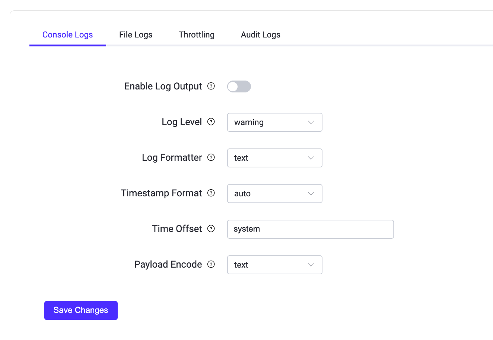

# ログ

ログはトラブルシューティングやシステムパフォーマンスの最適化において信頼できる情報源を提供します。EMQXのログからアクセス状況、動作状況、ネットワークの問題に関する記録を確認できます。

EMQXはコンソールログとファイルログの両方をサポートしています。ログデータの出力方法は2種類あり、必要に応じて出力方法を選択するか、両方を併用することも可能です。コンソールログはログデータをコンソールやコマンドラインインターフェースに出力することを指し、開発やデバッグ時にリアルタイムでログを素早く確認できるため一般的に使用されます。ファイルログはログデータをファイルに出力する方法であり、分析やトラブルシューティングのためにログデータを長期間保存する必要がある本番環境で主に使用されます。

システムのデフォルトのログ処理動作は環境変数 `EMQX_DEFAULT_LOG_HANDLER` で設定可能で、以下の値を受け付けます。

- `file`: ログ出力をファイルに向ける
- `console`: ログ出力をコンソールに向ける

環境変数 `EMQX_DEFAULT_LOG_HANDLER` のデフォルトは `console` ですが、systemdの `emqx.service` ファイルを介してEMQXを起動した場合は明示的に `file` に設定されます。

ログデータが多すぎる場合やログ書き込みが遅い場合など、ログがシステム動作に与える影響を最小限に抑えるために、EMQXはデフォルトで過負荷保護機構を有効にしてユーザーにより良いサービスを提供しています。

## ログレベル

EMQXのログレベルは8段階のうち6段階を採用しており（[RFC 5424](https://www.ietf.org/rfc/rfc5424.txt)準拠）、デフォルトは `warning` です。低い順に以下のレベルがあります。

```bash
debug < info < notice < warning < error < critical
```

以下の表は各ログレベルの意味と出力内容の例を示しています。

| ログレベル | 意味                                                         | 出力例                                                         |
| ---------- | ------------------------------------------------------------ | -------------------------------------------------------------- |
| debug      | プログラム内部の詳細情報で、コードのデバッグや診断に役立ちます。<br />本番環境で直接出力することは推奨されません。代わりに特定のクライアントに対して[Log Trace](./tracer.md)を有効にしてください。 | 変数の値、関数呼び出しのスタックトレースなど詳細なデバッグ情報。 |
| info       | debugレベルより一般的な有用情報。                             | 認可拒否などの軽微な異常や、設定変更成功などの管理操作結果。   |
| notice     | イベント発生を示す重要なシステム情報で、特に対応は不要。       | ダッシュボードやCLIからのリクエストによるコンポーネント再起動。 |
| warning    | 対応が必要な潜在的な問題やエラー。重大問題になる前の監視に使用。 | 切断、接続タイムアウト、認証失敗などのイベント。               |
| error      | エラー発生を示し、管理者が迅速に問題を検出・解決できるようにする。 | 外部データベース接続失敗、存在しないトピックのサブスクライブ失敗、設定ファイル解析失敗など。 |
| critical   | システムクラッシュや機能停止を引き起こす重大なエラー。即時対応が必要。 | 設定ミスによりコンポーネントが起動・正常動作できない場合。     |

::: warning 重要なお知らせ

接続およびパーサーエラーのログに含まれる生のMQTTパケットデータはデフォルトでマスクされています。トラブルシューティングのために一時的に生パケットデータをログに記録するには、リスナーの `allow_log_packet_data_from` オプションに信頼できるクライアントのIPアドレスまたはCIDRレンジを追加してください。このオプションは信頼できるクライアントに対してのみ、かつ診断時のみ有効にしてください。生パケットデータには認証情報やその他の機密情報が含まれる可能性があります。

:::

## ダッシュボードによるログ設定

このセクションでは主にEMQXダッシュボードを用いたログ設定方法を説明します。変更はノードの再起動なしに即時反映されます。

EMQXダッシュボードにアクセスし、左側ナビゲーションメニューの **Management** -> **Logging** をクリックします。コンソールログまたはファイルログの設定はそれぞれ対応するタブを選択して行います。

### コンソールログの設定

**Logging** ページで **Console Log** タブを選択します。



コンソールログハンドラーの以下の設定を行います。

- **Enable Log Handler**: トグルスイッチをクリックしてコンソールログハンドラーを有効化します。

- **Log Level**: ドロップダウンリストから使用するログレベルを選択します。デフォルトは `warning` です。

- **Log Formatter**: ドロップダウンリストからログフォーマットを選択します。選択肢は `text` と `JSON` で、デフォルトは `text` です。

- **Timestamp Format**: ログのタイムスタンプ形式を選択します。選択肢は以下の通りです。
  - `auto`: 使用しているログフォーマッターに応じて自動判別します。textフォーマッターの場合は `rfc3339`、JSONフォーマッターの場合は `epoch` 形式を使用します。
  - `epoch`: マイクロ秒精度のUnixエポック形式でタイムスタンプを表現します。
  - `rfc3339`: RFC3339準拠の日時文字列形式。例：`2024-03-26T11:52:19.777087+00:00`

- **Time Offset**: ログのUTCに対する時差を定義します。デフォルトはシステムに従い、値は `system` です。

設定が完了したら **Save Changes** をクリックします。

### ファイルログの設定

**Logging** ページで **File Log** タブを選択します。


ファイルログハンドラーの以下の設定を行います。

- **Enable Log Handler**: トグルスイッチをクリックしてファイルログハンドラーを有効化します。

- **Log File Name**: ログファイル名を入力します。デフォルトは `log/emqx.log` です。

- **Max Log Files Number**: ローテーションする最大ログファイル数を指定します。デフォルトは `10` です。

- **Rotation Size**: ログファイルが指定サイズに達したらローテーションします。デフォルトで有効です。テキストボックスに具体的なサイズを入力できます。無効にすると値は `infinity` となり、ログファイルは無制限に成長します。

- **Log Level**: 使用するログレベルをドロップダウンリストから選択します。選択肢は `debug`、`info`、`notice`、`warning`、`error`、`critical` で、デフォルトは `warning` です。

- **Log Formatter**: ログフォーマットをドロップダウンリストから選択します。選択肢は `text` と `JSON` で、デフォルトは `text` です。

- **Timestamp Format**: ログのタイムスタンプ形式を選択します。選択肢は以下の通りです。

  - `auto`: 使用しているログフォーマッターに応じて自動判別します。textフォーマッターの場合は `rfc3339`、JSONフォーマッターの場合は `epoch` 形式を使用します。

  - `epoch`: マイクロ秒精度のUnixエポック形式でタイムスタンプを表現します。

  - `rfc3339`: RFC3339準拠の日時文字列形式。例：`2024-03-26T11:52:19.777087+00:00`

- **Time Offset**: ログのUTCに対する時差を定義します。デフォルトはシステムに従い、値は `system` です。

設定が完了したら **Save Changes** をクリックします。

ファイルログが有効（`log.to = file` または両方）になると、ログディレクトリに以下のファイルが生成されます。

- **emqx.log.N:** `emqx.log` を接頭辞としたログファイルで、EMQXのすべてのログメッセージを含みます。例：`emqx.log.1`、`emqx.log.2` など。
- **emqx.log.siz` と `emqx.log.idx`:** ログローテーション情報を記録するシステムファイルです。**手動で変更しないでください。**

## 設定ファイルによるログ設定

EMQXのログは設定ファイルからも設定可能です。例えば、警告レベルのログをファイルに出力したりコンソールに出力したい場合は、`base.hocon` の `log` 以下の設定項目を以下のように変更します。設定はノード再起動後に反映されます。設定ファイルによるログ設定の詳細は [Configuration - Logs](../configuration/logs.md) を参照してください。

```bash
log {
  file {
    default {
      enable = true
      formatter = text
      level = warning
      path = "/Users/emqx/Downloads/emqx-560/log/emqx.log"
      rotation_count = 10
      rotation_size = 50MB
      time_offset = system
      timestamp_format = auto
  }
  console {
    formatter = json
    level = debug
    time_offset = system
    timestamp_format = auto
  }
}
```

## ログフォーマット

ログメッセージのフォーマット（各フィールドはスペースで区切られます）は以下の通りです。

```
**timestamp level tag clientid msg peername username ...**
```

各フィールドの意味は以下の通りです。

- **timestamp:** ログエントリが作成された日時を示すRFC-3339形式のタイムスタンプ。
- **level:** ログの重大度レベルをブラケットで囲んだもの。例：`[info]`、`[warning]`、`[error]` など。
- **tag:** ログの分類に使われる全大文字の単語。検索や分析を容易にするためのもの。例：MQTT、AUTHN、AUTHZ
- **clientid:** 特定のクライアントに関するログの場合に含まれ、そのクライアントを識別します。
- **msg:** ログメッセージの内容。検索性と可読性を高めるため、多くは `snake_case` 形式（例：`mqtt_packet_received`）ですが、すべてがこの形式とは限りません。
- **peername:** クライアントの送信元IPアドレスとポート番号（`IP:port`形式）。接続元を示します。
- **username:** クライアントに指定された空でないユーザー名がある場合に含まれ、そのユーザー名を示します。
- **...:** msgフィールドの後に任意の追加フィールドが続くことがあります。

### ログメッセージ例

```bash
2024-03-20T11:08:39.568980+01:00 [warning] tag: AUTHZ, clientid: client1, msg: cannot_publish_to_topic_due_to_not_authorized, peername: 127.0.0.1:47860, username: user1, topic: republish-event/1, reason: not_authorized
```

## ログスロットリング

ログスロットリングは、指定された時間ウィンドウ内で繰り返されるイベントのログ出力を制限し、ログの洪水を防ぐ機能です。最初のイベントのみをログに記録し、その後の同一イベントを抑制することで、観測性を損なわずにログ管理の効率化を図ります。

ダッシュボードで **Management** -> **Logging** を選択し、**Throttling** タブをクリックすることでスロットリングの時間ウィンドウを設定できます。デフォルトは1分、最小値は1秒です。


設定ファイルで直接時間ウィンドウを指定することも可能です。

```
log {
  throttling {
    time_window = "5m"
  }
}
```

ログスロットリングはデフォルトで有効で、認証失敗やメッセージキューのオーバーフローなど特定のログイベントに適用されます。ただし、`console` または `file` のログレベルが `debug` に設定されている場合はトラブルシューティングのためにスロットリングは無効になります。

スロットリングが適用されるログイベントは以下の通りです。

- "authentication_failure"
- "authorization_permission_denied"
- "cannot_publish_to_topic_due_to_not_authorized"
- "cannot_publish_to_topic_due_to_quota_exceeded"
- "connection_rejected_due_to_license_limit_reached"
- "data_bridge_buffer_overflow"
- "dropped_msg_due_to_mqueue_is_full"
- "dropped_qos0_msg"
- "external_broker_crashed"
- "failed_to_fetch_crl"
- "failed_to_retain_message"
- "handle_resource_metrics_failed"
- "retain_failed_for_payload_size_exceeded_limit"
- "retain_failed_for_rate_exceeded_limit"
- "retained_delete_failed_for_rate_exceeded_limit"
- "socket_receive_paused_by_rate_limit"
- "transformation_failed"
- "unrecoverable_resource_error"
- "validation_failed"

::: tip 補足
スロットリング対象イベントのリストは更新される可能性があります。
:::

時間ウィンドウ内にスロットリングされたイベントがある場合、各イベントタイプごとにドロップされた件数を集約した警告メッセージがログに記録されます。例えば、1分間に5回の認可拒否が発生した場合、以下のようにログが出力されます。

```
2024-03-13T15:45:11.707574+02:00 [warning] clientid: test, msg: authorization_permission_denied, peername: 127.0.0.1:54870, username: test, topic: t/#, action: SUBSCRIBE(Q0), source: file
2024-03-13T15:45:53.634909+02:00 [warning] msg: log_events_throttled_during_last_period, period: 1 minutes, 0 seconds, dropped: #{authorization_permission_denied => 4}
```

最初の "authorization_permission_denied" イベントは完全にログに記録され、次の4件はドロップされますが、その件数は "log_events_throttled_during_last_period" の統計に記録されます。

## 本番環境でのログ集中管理

本番環境では、各EMQXノードのログをEMQXクラスター外の中央システムに送信してください。ブローカーのホスト上にのみログを保持すると、ノードやストレージの障害時にログが利用できなくなる可能性があります。中央集約により、CoreノードとReplicantノード間のイベント相関や、メトリクスや組み込みアラームで検出できない条件のアラートも可能になります。

### 収集方法の選択

以下の収集パターンのいずれかを使用してください。

- Kubernetesなどのコンテナ化環境では、JSONログをコンソールに出力し、プラットフォームのログエージェントでコンテナ出力を収集します。
- ファイルログの場合は、`emqx.log.N` ファイルを収集し、ローテーションを重複なく処理し、構造化フィールドを保持できるログエージェントを使用します。
- [OpenTelemetryログハンドラー](./opentelemetry/logs.md)を使用して、ログをOpenTelemetryコレクターおよび対応バックエンドにエクスポートします。

### コンテキストの追加とログ保護

収集パイプラインでクラスター、ノード、ノードロール、EMQXバージョン、アベイラビリティゾーンなどのデプロイメントメタデータを追加してください。

集中管理されたログは運用データとして保護してください。ログフィールドにはクライアントID、ユーザー名、トピック、ピアアドレス、エラー詳細などが含まれる可能性があります。

### 収集パイプラインの監視

コレクターやトランスポートのヘルス指標、またはアプリケーションログ量に依存しない明示的なハートビートを用いて収集経路を監視してください。以下の条件でアラートを設定します。

- コレクターまたはトランスポートが異常
- コレクターまたはトランスポートがレコードを拒否または破棄
- 中央バックエンドのストレージ容量が逼迫

到達可能なEMQXノードがログを出力しないだけでアラートを発生させないでください。アイドル状態または正常なノードは、設定された重大度で報告すべきログがない場合があります。

### ログアラートポリシーの定義

安定した構造化フィールド（例：`level`、`msg`）に基づいてログベースのアラートを選択的に作成してください。

- **Warningイベント:** 早期警告信号として有用ですが、クライアントの通常動作によるものもあります。個別のイベントで対応不要な場合は、レートや通常のベースラインからの逸脱を用いて監視してください。
- **ErrorまたはCriticalイベント:** レプリケーション喪失、設定同期、リスナー起動、永続ストレージなどに関わるイベントは通常即時アラートが推奨されます。

Mriaレプリケーションシグナルを含む推奨されるメトリクスおよびログベースのアラートセットについては、[Production Monitoring Best Practices](./monitoring-best-practices.md#centralize-logs-and-alert-selectively) を参照してください。
