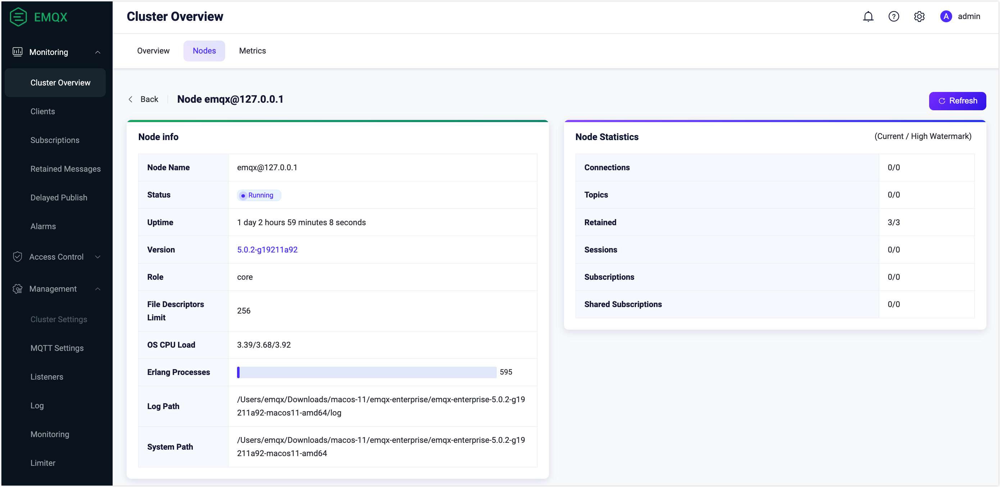
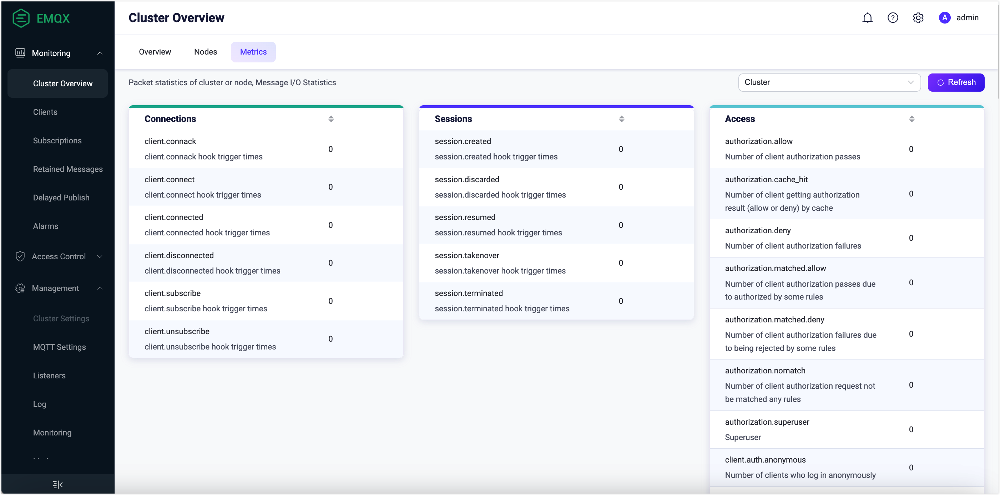
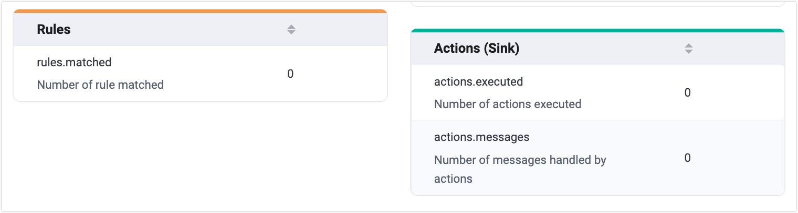
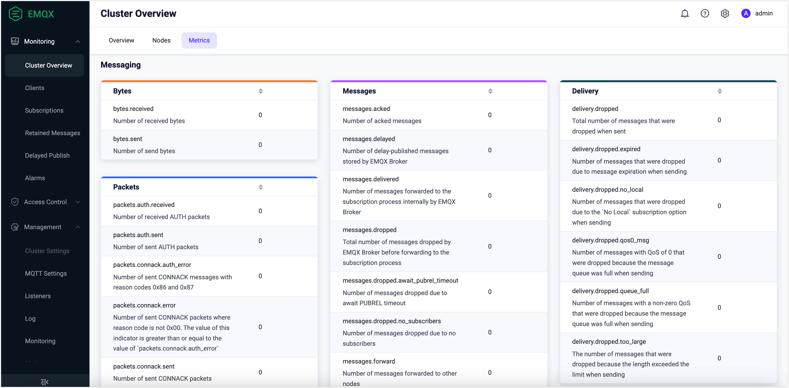
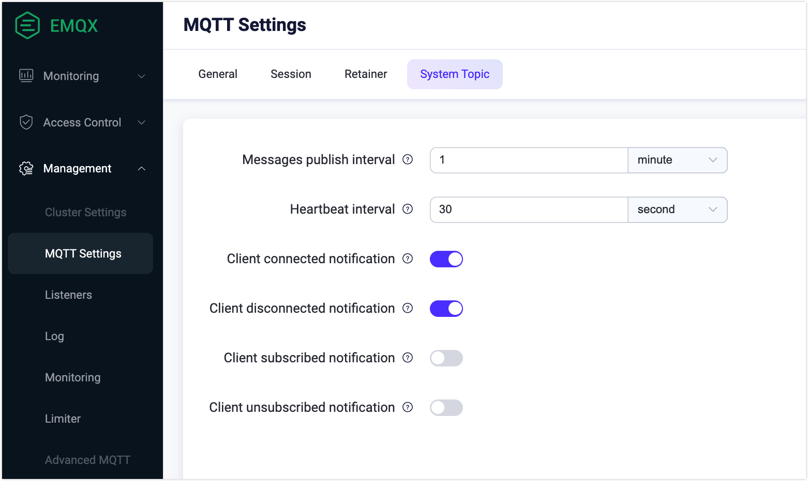

# 統計とメトリクス

EMQXはメトリクス監視機能を提供しており、これにより運用・保守担当者は現在のサービス状況を監視し、システムの潜在的な不具合をトラブルシューティングできます。

EMQXは監視状態を統計（Statistics）とメトリクス（Metrics）に分類しています。

- 統計は整数型のゲージで、メトリクスが要求された時点の単一の値を返します。
- メトリクスは整数型のカウンターで、送受信されたバイト数やメッセージ数などの単純な増減を測定します。

EMQXはユーザーに複数の方法で統計とメトリクスを表示する手段を提供しています。最も直接的には、EMQXダッシュボード上でこれらのデータを確認できます。ダッシュボードへのアクセスが不便な場合は、[REST API](#request-monitoring-status-via-rest-api)や[システムトピック](#get-monitoring-status-via-system-topics)のメッセージを通じてデータを取得することも可能です。さらに、監視機能を独自の監視システムと簡単に統合することもできます。詳細は[Prometheusとの統合](./prometheus.md)をご覧ください。

## ダッシュボードで統計を表示する

EMQXダッシュボードの左側ナビゲーションメニューで **Monitoring** -> **Cluster Overview** をクリックします。**Cluster Overview** ページで **Nodes** タブをクリックし、ノード名をクリックすると右側に統計の詳細が表示されます。

統計には現在値と過去の最大値の2つの値が含まれます。例えば、現在のサブスクリプション数と過去の最大サブスクリプション数です。以下はEMQXの統計一覧です。

| 統計項目                    | 説明                                                         |
| -------------------------- | ------------------------------------------------------------ |
| connections.count          | 現在の接続数                                                 |
| connections.max            | 過去の最大接続数                                             |
| live_connections.count     | 現在のライブ接続数                                           |
| live_connections.max       | 過去の最大ライブ接続数                                       |
| channels.count             | `sessions.count` と同じ                                     |
| channels.max               | `sessions.max` と同じ                                       |
| sessions.count             | 現在のセッション数                                           |
| sessions.max               | 過去の最大セッション数                                       |
| topics.count               | 現在のトピック数                                           |
| topics.max                 | 過去の最大トピック数                                       |
| suboptions.count           | `subscriptions.count` と同じ                                |
| suboptions.max             | `subscriptions.max` と同じ                                  |
| subscribers.count          | 現在のサブスクライバー数                                     |
| subscribers.max            | 過去の最大サブスクライバー数                                 |
| subscriptions.count        | 現在のサブスクリプション数（共有サブスクリプションを含む） |
| subscriptions.max          | 過去の最大サブスクリプション数                               |
| subscriptions.shared.count | 現在の共有サブスクリプション数                               |
| subscriptions.shared.max   | 過去の最大共有サブスクリプション数                           |
| retained.count             | 現在保持されているメッセージ数                               |
| retained.max               | 過去の最大保持メッセージ数                                   |
| delayed.count              | 現在遅延しているメッセージ数                                 |
| delayed.max                | 過去の最大遅延メッセージ数                                   |

## ダッシュボードでメトリクスを表示する

EMQXダッシュボードの左側ナビゲーションメニューで **Monitoring** -> **Cluster Overview** をクリックします。**Cluster Overview** ページで **Metrics** タブをクリックすると、クラスターまたは特定ノードのランタイムメトリクスを確認できます。

EMQXのメトリクスはカウンターとして実装されており、ノード起動以降の特定イベントの累積発生回数を記録します。これらのメトリクスはシステムの挙動観察、負荷パターンの評価、問題のトラブルシューティングに役立ちます。

ダッシュボード上のメトリクスは以下のカテゴリに分類されています。

- **接続とセッションのメトリクス**：クライアント接続、セッション、アクセス制御イベント
- **ルールとアクション（シンク）のメトリクス**：データ統合のためのルールマッチングとアクション実行
- **メッセージングのメトリクス**：バイト数、パケット数、メッセージ数、配信統計

### 接続とセッションのメトリクス

このセクションでは、クラスターまたはノードに関するイベント関連のメトリクスを表示します。対象は[クライアント接続](#connections)、[接続セッション](#sessions)、[クライアントアクセス](#access)です。

#### Connections（接続）

| メトリクス             | 説明                                                         |
| ---------------------- | ------------------------------------------------------------ |
| client.connack         | クライアントが受信した接続確認（`CONNACK`）メッセージの数   |
| client.connect         | クライアントからの接続要求数（成功・失敗を含む）             |
| client.connected       | 成功したクライアント接続数                                   |
| client.disconnected    | クライアント切断数（正常・異常切断を含む）                   |
| client.subscribe       | 成功したサブスクライブ数                                     |
| client.unsubscribe     | 成功したサブスクリプション解除数                             |

#### Sessions（セッション）

| メトリクス            | 説明                                                         |
| --------------------- | ------------------------------------------------------------ |
| session.created       | 作成されたセッション数                                       |
| session.discarded     | 廃棄されたセッション数                                       |
| session.resumed       | 再開されたセッション数                                       |
| session.takenover     | 引き継がれたセッション数                                     |
| session.terminated    | 終了したセッション数                                         |

#### Access（アクセス）

| メトリクス                     | 説明                                                         |
| ------------------------------ | ------------------------------------------------------------ |
| authorization.allow            | クライアントの認可成功数。キャッシュヒット（認可結果取得）とポリシールールにマッチした認可要求の合計。 |
| authorization.deny             | クライアントの認可失敗数。キャッシュヒットとポリシールールにマッチしなかった認可要求の合計。 |
| authorization.matched.allow    | ルールに基づく認可成功数                                     |
| authorization.matched.deny     | ルールにより拒否された認可失敗数                             |
| authorization.nomatch          | どのルールにもマッチしなかった認可要求数                     |
| authorization.cache_hit        | キャッシュによって認可結果（許可または拒否）を取得したクライアント数 |
| authorization.superuser        | スーパーユーザーとして認可されたクライアント数               |
| client.auth.anonymous          | 匿名ログインしたクライアント数                               |
| client.authenticate            | 認証がトリガーされた回数                                     |
| client.authorize               | 認可がトリガーされた回数                                     |

### ルールとアクション（シンク）

このセクションはデータ統合に関連するメトリクスを提供し、ルールがマッチした回数やアクション（シンク）が実行された回数を把握できます。

これらのメトリクスはルールの効果測定、下流データフローの監視、全体的なデータ統合の利用状況評価に役立ちます。

#### ルール

| メトリクス       | 説明                                                         |
| ---------------- | ------------------------------------------------------------ |
| rules.matched    | メッセージやイベントがルールエンジンを通過した際にルールが正常にマッチした回数 |

#### アクション（シンク）

| メトリクス          | 説明                                                         |
| ------------------- | ------------------------------------------------------------ |
| actions.executed    | ルールマッチにより実行されたアクション（シンク）の回数       |
| actions.messages   | アクション実行で処理されたメッセージ数。単一のアクション実行で複数メッセージを処理するため、`actions.executed`以上の値となる。 |

### メッセージング

**Metrics** ページをスクロールダウンすると、[バイト数](#bytes)、[パケット数](#packets)、[メッセージ](#message-publish-packet)、[配信](#delivery)に関するメトリクスを確認できます。

#### バイト数

| メトリクス          | 説明                         |
| ------------------- | ---------------------------- |
| bytes.received      | 受信したバイト数             |
| bytes.sent          | 送信したバイト数             |

#### パケット数

| メトリクス                      | 説明                                                         |
| ------------------------------ | ------------------------------------------------------------ |
| packets.received               | 受信したパケット数                                           |
| packets.sent                   | 送信したパケット数                                           |
| packets.connect.received       | 受信したCONNECTパケット数                                    |
| packets.connack.auth_error     | 理由コード0x86および0x87のCONNACKメッセージ送信数          |
| packets.connack.error          | 0x00以外の理由コードを持つCONNACKパケット送信数。`packets.connack.auth_error`以上の値。 |
| packets.connack.sent           | 送信したCONNACKパケット数                                   |
| packets.publish.received       | 受信したPUBLISHパケット数                                   |
| packets.publish.sent           | 送信したPUBLISHパケット数                                   |
| packets.publish.inuse          | パケット識別子が使用中の受信PUBLISHパケット数               |
| packets.publish.auth_error     | ACLチェックに失敗した受信PUBLISHパケット数                   |
| packets.publish.error          | パブリッシュできなかった受信PUBLISHパケット数               |
| packets.puback.received        | 受信したPUBACKパケット数                                    |
| packets.puback.sent            | 送信したPUBACKパケット数                                    |
| packets.puback.inuse           | 識別子が使用中の受信PUBACKメッセージ数                      |
| packets.puback.missed          | 不明な識別子の受信PUBACKパケット数                          |
| packets.pubrec.received        | 受信したPUBRECパケット数                                    |
| packets.pubrec.sent            | 送信したPUBRECパケット数                                    |
| packets.pubrec.inuse           | 識別子が使用中の受信PUBRECメッセージ数                      |
| packets.pubrec.missed          | 不明な識別子の受信PUBRECパケット数                          |
| packets.pubrel.received        | 受信したPUBRELパケット数                                    |
| packets.pubrel.sent            | 送信したPUBRELパケット数                                    |
| packets.pubrel.missed          | 不明な識別子の受信PUBRELパケット数                          |
| packets.pubcomp.received       | 受信したPUBCOMPパケット数                                   |
| packets.pubcomp.sent           | 送信したPUBCOMPパケット数                                   |
| packets.pubcomp.inuse          | 識別子が使用中の受信PUBCOMPメッセージ数                     |
| packets.pubcomp.missed         | 失われたPUBCOMPパケット数                                   |
| packets.subscribe.received     | 受信したSUBSCRIBEパケット数                                 |
| packets.subscribe.error        | 失敗したサブスクリプションを含む受信SUBSCRIBEパケット数     |
| packets.subscribe.auth_error   | ACLチェックに失敗した受信SUBACKパケット数                    |
| packets.suback.sent            | 送信したSUBACKパケット数                                    |
| packets.unsubscribe.received   | 受信したUNSUBSCRIBEパケット数                               |
| packets.unsubscribe.error      | 失敗したサブスクリプション解除を含む受信UNSUBSCRIBEパケット数 |
| packets.unsuback.sent          | 送信したUNSUBACKパケット数                                  |
| packets.pingreq.received       | 受信したPINGREQパケット数                                   |
| packets.pingresp.sent          | 送信したPINGRESPパケット数                                  |
| packets.disconnect.received    | 受信したDISCONNECTパケット数                                |
| packets.disconnect.sent        | 送信したDISCONNECTパケット数                                |
| packets.auth.received          | 受信したAUTHパケット数                                      |
| packets.auth.sent              | 送信したAUTHパケット数                                      |

#### メッセージ（PUBLISHパケット）

| メトリクス                      | 説明                                                         |
| ------------------------------ | ------------------------------------------------------------ |
| messages.acked                 | アック（ACK）されたメッセージ数                             |
| messages.delayed               | EMQXにより遅延パブリッシュとして保存されているメッセージ数   |
| messages.delivered             | EMQX内部でサブスクリプション処理に転送されたメッセージ数     |
| messages.dropped               | EMQXがサブスクリプション処理に転送する前に破棄したメッセージ数 |
| messages.dropped.no_subscribers | サブスクライバーがいないため破棄されたメッセージ数           |
| messages.dropped.await_pubrel_timeout | PUBREL待機タイムアウトにより破棄されたメッセージ数       |
| messages.dropped.quota_exceeded | クォータ超過（通常は接続数）により破棄されたメッセージ数     |
| messages.dropped.receive_maximum | Receive Maximumに達したため破棄されたメッセージ数           |
| messages.forward              | 他ノードに転送されたメッセージ数                             |
| messages.publish              | システムメッセージを除くパブリッシュされたメッセージ数       |
| messages.qos0.received        | クライアントから受信したQoS 0メッセージ数                    |
| messages.qos1.received        | クライアントから受信したQoS 1メッセージ数                    |
| messages.qos2.received        | クライアントから受信したQoS 2メッセージ数                    |
| messages.qos0.sent            | クライアントへ送信したQoS 0メッセージ数                      |
| messages.qos1.sent            | クライアントへ送信したQoS 1メッセージ数                      |
| messages.qos2.sent            | クライアントへ送信したQoS 2メッセージ数                      |
| messages.received             | クライアントから受信したメッセージ数。`messages.qos0.received`、`messages.qos1.received`、`messages.qos2.received`の合計。 |
| messages.sent                 | クライアントへ送信したメッセージ数。`messages.qos0.sent`、`messages.qos1.sent`、`messages.qos2.sent`の合計。 |

#### 配信

| メトリクス                     | 説明                                                         |
| ----------------------------- | ------------------------------------------------------------ |
| delivery.dropped              | 配信中に破棄されたメッセージの総数                           |
| delivery.dropped.expired      | メッセージの有効期限切れにより配信中に破棄されたメッセージ数 |
| delivery.dropped.no_local     | `No Local`サブスクリプションオプションにより配信中に破棄されたメッセージ数 |
| delivery.dropped.qos0_msg     | `mqueue_store_qos0`が`false`に設定されているため配信中に破棄されたQoS 0メッセージ数 |
| delivery.dropped.queue_full   | 配信キューの満杯により破棄されたメッセージ数                 |
| delivery.dropped.too_large    | 長さ制限超過により破棄されたメッセージ数                     |

## REST APIによる監視状態の取得

APIを通じてメトリクスや統計を取得することも可能です。UIの左側ナビゲーションメニューで **Metrics** をクリックすると、このAPIリクエストを実行できます。EMQX APIの利用方法については[REST API](../admin/api.md)をご参照ください。

## システムトピックによる監視状態の取得

EMQXは実行状況、メッセージ統計、クライアントのオンライン・オフラインイベントに関するメッセージをシステムトピックを通じて定期的にパブリッシュします。クライアントはトピック名の前に`$SYS/`プレフィックスを付けてシステムトピックをサブスクライブできます。システムトピックの種類については[システムトピック](./mqtt-system-topics.md)をご覧ください。

システムトピックの設定はダッシュボード上で行えます。左側ナビゲーションメニューで **Management** -> **MQTT Settings** をクリックし、**System Topic** タブを選択してください。

- **Messages publish interval**：`$SYS`トピックを送信する間隔を設定します。
- **Heartbeat interval**：ハートビートメッセージを送信する間隔を設定します。
- **Client connected notification**：デフォルトで有効。クライアント接続イベントメッセージがパブリッシュされます。
- **Client disconnected notification**：デフォルトで有効。クライアント切断イベントメッセージがパブリッシュされます。
- **Client subscribed notification**：デフォルトで無効。有効にすると、クライアントのトピックサブスクライブイベントメッセージがパブリッシュされます。
- **Client unsubscribed notification**：デフォルトで無効。有効にすると、クライアントのトピックサブスクリプション解除イベントメッセージがパブリッシュされます。
