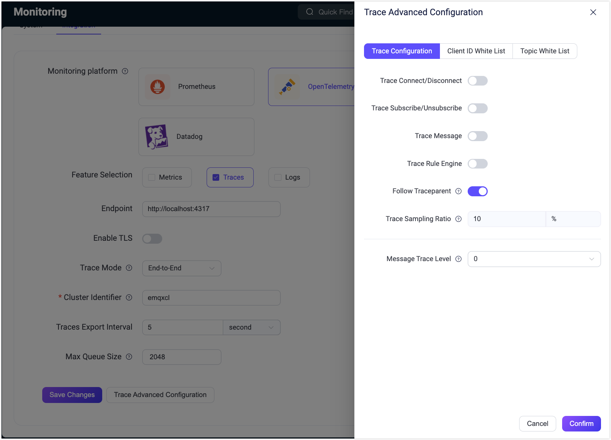

# OpenTelemetryベースのエンドツーエンドMQTTトレーシング

現代の分散システムにおいて、リクエストの流れを追跡しパフォーマンスを分析することは、信頼性と可観測性を確保するために不可欠です。エンドツーエンドトレーシングは、リクエストの開始から終了までの全経路をキャプチャすることを目的とした概念であり、システムの挙動やパフォーマンスに関する深い洞察を得ることができます。

EMQXはバージョン5.8.3以降、MQTTプロトコルに特化したOpenTelemetryベースのエンドツーエンドトレーシング機能を統合しています。この機能により、特にマルチノードクラスター環境において、メッセージのパブリッシュ、ルーティング、配信を明確にトレースできます。これにより、システムパフォーマンスの最適化だけでなく、迅速な障害箇所の特定やシステム信頼性の向上にも役立ちます。

本ページでは、MQTTメッセージのフローを包括的に可視化するために、EMQXでエンドツーエンドトレーシング機能を有効化する方法を詳しく解説します。

## OpenTelemetry Collectorのセットアップ

設定の詳細については、[OpenTelemetry Collectorのセットアップ](./traces.md#setting-up-opentelemetry-collector)を参照してください。

## EMQXでエンドツーエンドトレーシングを有効化する

::: tip

エンドツーエンドトレーシングはシステムパフォーマンスに影響を与える可能性があるため、必要な場合のみ有効化してください。

:::

このセクションでは、EMQXでOpenTelemetryベースのエンドツーエンドトレーシングを有効化する手順と、マルチノード環境でのMQTT分散トレーシング機能のデモを紹介します。

### ダッシュボードからエンドツーエンドトレーシングを設定する

1. ダッシュボードの左メニューから **Management** -> **Monitoring** をクリックします。  
2. Monitoringページで **Integration** タブを選択します。  
3. 以下の設定を行います：  
   - **Monitoring platform**: `OpenTelemetry` を選択します。  
   - **Feature Selection**: `Traces` を選択します。  
   - **Endpoint**: トレースデータのエクスポート先アドレスを設定します。デフォルトは `http://localhost:4317` です。  
   - **Enable TLS**: 必要に応じてTLS暗号化を有効にします。通常、本番環境のセキュリティ要件に合わせて設定します。  
   - **Trace Mode**: `End-to-End` を選択し、エンドツーエンドトレーシング機能を有効化します。  
   - **Cluster Identifier**: span属性に追加するプロパティ値を設定し、どのEMQXクラスターからのデータかを識別できるようにします。プロパティキーは `cluster.id` です。通常はシンプルで識別しやすい名前やクラスター名を設定します。デフォルトは `emqxcl` です。  
   - **Traces Export Interval**: トレースデータのエクスポート間隔を秒単位で設定します。デフォルトは `5` 秒です。  
   - **Max Queue Size**: トレースデータキューの最大サイズを設定します。デフォルトは `2048` エントリです。  

4. 必要に応じて **Trace Advanced Configuration** をクリックし、詳細設定を行います。  

   - **Trace Configuration**: クライアント接続やメッセージ送受信、ルールエンジンの実行など、特定イベントのトレース有無を設定できます。  
     - **Follow Traceparent**: `traceparent` を追跡するかどうかを設定します。`true` に設定すると、EMQXはクライアントから送信された `User-Property` 内の `traceparent` 識別子を取得し、エンドツーエンドトレーシングに紐付けます。`false` の場合は新規トレースを生成します。デフォルトは `true` です。  
   - **Client ID White List**: トレース対象とするクライアント接続やメッセージを制限するホワイトリストを設定できます。不要なトレースを避け、システムリソースの消費を抑制できます。  
   - **Topic White List**: トピックのホワイトリストを設定し、マッチするトピックのみをトレース対象とします。クライアントホワイトリストと同様にトレース範囲の制御に役立ちます。  

   設定後、**Confirm** をクリックして設定を保存しウィンドウを閉じます。  

5. **Save Changes** をクリックして設定を保存します。



### 設定ファイルからエンドツーエンドトレーシングを設定する

EMQXがローカルで稼働している前提で、`cluster.hocon` ファイルに以下の設定を追加します。

設定オプションの詳細は、[EMQXダッシュボード監視統合のOpenTelemetry項目](http://localhost:18083/#/monitoring/integration)を参照してください。

```bash
opentelemetry {
  exporter { endpoint = "http://localhost:4317" }
  traces {
   enable = true
   # エンドツーエンドトレーシングモード
   trace_mode = e2e
   # エンドツーエンドトレーシングオプション
   e2e_tracing_options {
     ## クライアント接続/切断イベントをトレース
     client_connect_disconnect = true
     ## クライアントのサブスクライブ/アンインサブスクライブイベントをトレース
     client_subscribe_unsubscribe = true
     ## クライアントのメッセージングイベントをトレース
     client_messaging = true
     ## ルールエンジンの実行をトレース
     trace_rule_engine = true
     ## クライアントIDホワイトリストの最大長
     clientid_match_rules_max = 30
     ## トピックフィルターホワイトリストの最大長
     topic_match_rules_max = 30
     ## クラスター識別子
     cluster_identifier = emqxcl
     ## メッセージトレースレベル（QoS）
     msg_trace_level = 2
     ## ホワイトリスト外イベントのサンプリング率
     ## 注：トレースが有効な場合のみサンプリングが適用されます
     sample_ratio = "100%"
     ## traceparentの追跡
     ## クライアントから渡された`traceparent`をエンドツーエンドトレーシングで追跡するか
     follow_traceparent
    }
  }
  max_queue_size = 50000
  scheduled_delay = 1000
 }
}
```

## EMQXでのエンドツーエンドトレーシングのデモ

1. EMQXノードを起動します。例として、`emqx@172.19.0.2` と `emqx@172.19.0.3` の2ノードクラスターを起動し、分散トレーシング機能をデモします。

2. MQTTX CLIをクライアントとして使用し、異なるノードで同じトピックをサブスクライブします。

   - `emqx@172.19.0.2` ノードでサブスクライブ：

     ```bash
     mqttx sub -t t/1 -h 172.19.0.2 -p 1883
     ```

   - `emqx@172.19.0.3` ノードでサブスクライブ：

     ```bash
     mqttx sub -t t/1 -h 172.19.0.3 -p 1883
     ```

3. 約5秒後（EMQXのトレースデータエクスポートのデフォルト間隔）、[http://localhost:16686](http://localhost:16686/) のJaeger WEB UIにアクセスし、トレースデータを確認します。

   `emqx` サービスを選択し、**Find Traces** をクリックします。`emqx` サービスがすぐに表示されない場合は、少し待ってページを更新してください。クライアント接続およびサブスクライブイベントのトレースが確認できます：

   

4. メッセージをパブリッシュします：

   ```bash
   mqttx pub -t t/1 -h 172.19.0.2 -p 1883
   ```

5. 少し待つと、Jaeger WEB UIでMQTTメッセージの詳細なトレースが確認できます。

   トレースをクリックすると、詳細なspan情報とトレースタイムラインが表示されます。サブスクライバー数、ノード間のメッセージルーティング、QoSレベル、`msg_trace_level` 設定により、MQTTメッセージのトレースに含まれるspan数は異なります。

   以下は、2クライアントがQoS 2でサブスクライブし、パブリッシャーがQoS 2のメッセージを送信、`msg_trace_level` が2に設定されている場合のトレースタイムラインとspan情報の例です。

   特に、クライアント `mqttx_9137a6bb` がパブリッシャーとは異なるEMQXノードに接続しているため、ノード間の送信を表す2つの追加span（`message.forward` と `message.handle_forward`）が表示されています。

   

   また、メッセージやイベントがルールエンジンの実行をトリガーする場合、ルールエンジンのトラッキングオプションが有効であれば、ルールおよびアクションの実行トラッキング情報も取得可能です。

   

   ::: tip

   ルールエンジンの実行を含むエンドツーエンドトレーシング機能は、EMQXバージョン5.9.0以降でサポートされています。

   :::

   ::: warning 重要なお知らせ

   この機能は慎重に有効化してください。メッセージやイベントが複数のルールやアクションをトリガーすると、単一のトレースで大量のspanが生成され、システム負荷が増加します。  
   メッセージ量やルール・アクション数に応じて適切なサンプリング率を見積もってください。

   :::

## トレースspanのオーバーロード管理

EMQXはトレースspanを蓄積し、定期的にバッチでエクスポートします。エクスポート間隔は `opentelemetry.trace.scheduled_delay` パラメータで制御され、デフォルトは5秒です。バッチトレースspanプロセッサにはオーバーロード保護機能があり、最大蓄積数（デフォルト2048span）を超えると新規spanは破棄されます。以下の設定でこの制限を調整可能です。

```yaml
opentelemetry {
  traces {
    max_queue_size = 50000
    scheduled_delay = 1000
  }
}
```

`max_queue_size` の上限に達すると、現在のキューがエクスポートされるまで新規トレースspanは破棄されます。

::: tip 補足

トレース対象メッセージが多数のサブスクライバーに配信される場合や、メッセージ量が多くサンプリング率が高い場合、オーバーロード保護により多くのspanが破棄され、エクスポートされるspanはごく一部になる可能性があります。

エンドツーエンドトレーシングモードでは、メッセージ量やサンプリング率に応じて `max_queue_size` を増やし、`scheduled_delay` を短縮してspanのエクスポート頻度を上げることを検討してください。これによりオーバーロード保護によるspanの損失を抑制できます。

**ただし、エクスポート頻度の増加やキューサイズの拡大はシステムリソース消費を増加させるため、メッセージTPSや利用可能なシステムリソースを十分に見積もった上で適切に設定してください。**

:::
