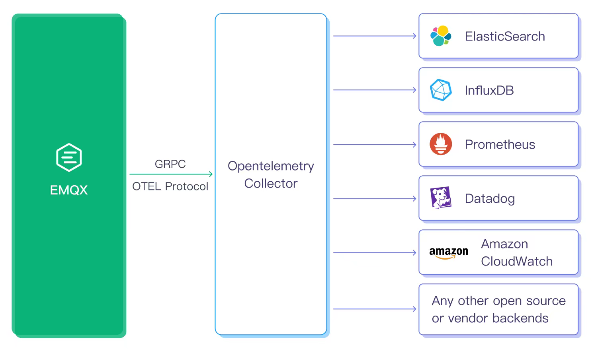

# OpenTelemetryとの統合

<<<<<<< HEAD
[OpenTelemetry](https://opentelemetry.io/docs/what-is-opentelemetry/)は、トレース、メトリクス、ログなどのテレメトリデータを作成および管理するためのオブザーバビリティフレームワークおよびツールキットです。重要な点として、OpenTelemetryはベンダーやツールに依存しないため、JaegerやPrometheusなどのオープンソースツールや商用製品を含む幅広いオブザーバビリティバックエンドと連携可能です。

EMQXはgRPC OTELプロトコルを介してテレメトリデータをOpenTelemetryコレクターに直接プッシュすることをサポートしており、その後コレクターを通じてデータを任意のバックエンド（Jaegerや[Prometheus](../../observability/prometheus.md)など）に転送、フィルタリング、変換して保存および可視化に利用できます。OpenTelemetryとの統合により、EMQXのメトリクス収集、メッセージパブリッシュの分散トレーシング、およびログの統合収集とコンテキスト関連付けが最適化されます。この統合は、EMQXの可視化監視やアラート通知の実現、異なるシステムやサービス間のメッセージフローの追跡に役立ちます。これにより、継続的なパフォーマンス最適化、問題の迅速な特定、システム監視が容易になります。

本セクションでは、EMQXがOpenTelemetryコレクターとテレメトリデータを統合し、以下のオブザーバビリティ情報に対して完全な組み込みOpenTelemetryサポートを実現する方法を紹介します。
=======
[OpenTelemetry](https://opentelemetry.io/docs/what-is-opentelemetry/)は、トレース、メトリクス、ログなどのテレメトリデータを生成・管理するためのオブザーバビリティフレームワークおよびツールキットです。重要な点として、OpenTelemetryはベンダーやツールに依存しないため、JaegerやPrometheusなどのオープンソースツールから商用製品まで、幅広いオブザーバビリティバックエンドと連携可能です。

EMQXは、gRPC OTELプロトコルを介してテレメトリデータをOpenTelemetry Collectorに直接プッシュし、その後Collectorを通じてデータを転送、フィルタリング、変換し、Jaegerや[Prometheus](../../observability/prometheus.md)などの任意のバックエンドに統合して保存および可視化できます。OpenTelemetryとの統合により、EMQXのメトリクス収集、メッセージパブリッシュの分散トレーシング、ログの統合収集およびコンテキスト関連付けが最適化されます。この統合は、EMQXの可視化監視やアラート通知、異なるシステムやサービス間のメッセージフロー追跡を実現し、継続的なパフォーマンス最適化、迅速な問題特定、システム監視に非常に役立ちます。

本セクションでは、EMQXがOpenTelemetry Collectorとテレメトリデータを統合し、以下のオブザーバビリティ情報に対する完全な組み込みOpenTelemetryサポートを可能にする方法を紹介します。
>>>>>>> origin/release-6.1

- [メトリクス](./metrics.md)
- [トレース](./traces.md)
- [ログ](./logs.md)

<<<<<<< HEAD
さらに、EMQXバージョン5.8.3以降では、OpenTelemetryに基づくエンドツーエンドトレーシングもサポートしています。
=======
さらに、EMQXバージョン5.8.3以降では、OpenTelemetryに基づくエンドツーエンドトレーシングもサポートされています。
>>>>>>> origin/release-6.1

- [エンドツーエンドトレース](./e2e-traces.md)
