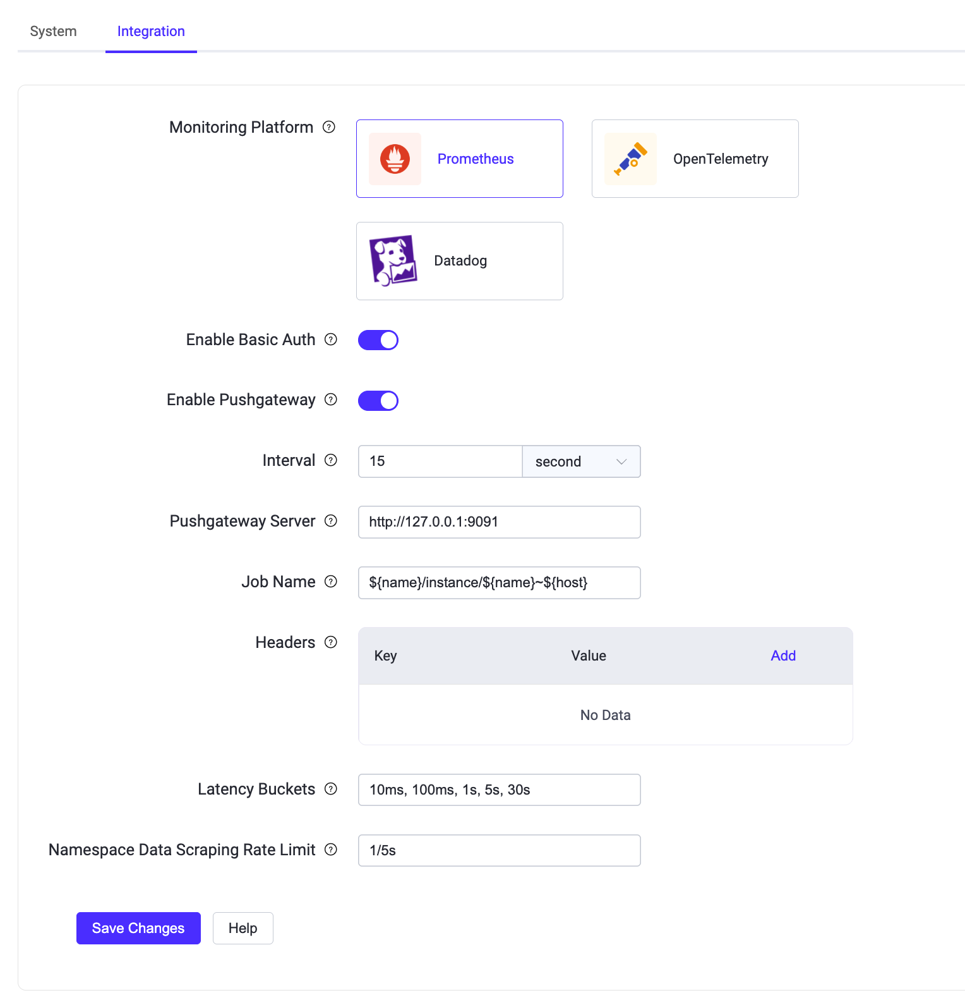

# Prometheusとの連携

EMQXは、[Prometheus](https://prometheus.io/)などのサードパーティ監視システムとの連携をサポートしています。PrometheusはSoundCloudがオープンソース化した監視ソリューションで、多次元データモデルのサポート、柔軟なクエリ言語、強力なアラーム管理など多彩な機能を提供します。

サードパーティ監視システムを利用することで、以下のようなメリットがあります。

- EMQXの監視データを他のシステムの監視データと統合した完全な監視システムを構築可能。例えば、サーバーホストの監視情報も取得できます。
- [Grafanaダッシュボード](#use-grafana-to-visualize-EMQX-metrics)を用いたEMQXメトリクスの可視化など、より直感的な監視レポートを作成可能。
- Prometheus Alertmanagerを使ったアラームルールや通知方法の設定など、多様なアラーム通知オプションを利用可能。

EMQXはPrometheusメトリクス監視の統合方法として、以下の2つの方式をサポートしています。

- **Pullモード**：PrometheusがEMQXのREST APIを通じてメトリクスを直接収集する方式。
- **Pushモード**：EMQXがメトリクスをPushgatewayサービスにプッシュし、Prometheusがそこからメトリクスを収集する方式。

本ページでは両方式の設定手順を紹介します。以下のエンドポイントで公開されるメトリクスシリーズの厳選リファレンス（アラート対象に適したものを含む）は、[Broker Health Indicators](./broker-health-indicators.md)をご参照ください。EMQXダッシュボードの左ナビゲーションメニューから**Management** -> **Monitoring**をクリックし、**Integration**タブで**Prometheus**を選択すると設定が可能です。また、ページ内の**Help**ボタンから各モードの具体的な設定手順を確認できます。

## Pullモード連携の設定

EMQXはPrometheusがシステムメトリクスを収集するために、以下のREST APIを提供しています。

- `/api/v5/prometheus/stats`：EMQXの基本的なメトリクスとカウンター。
- `/api/v5/prometheus/auth`：認証・認可を含むアクセス制御に関する主要メトリクスとカウンター。
- `/api/v5/prometheus/data_integration`：ルールエンジン、コネクター、アクション、Sink/Source、エンコード/デコードに関連するメトリクスとカウンター。

これらのAPIを呼び出してメトリクスを取得する際、URLクエリパラメータ`mode`を使用して異なるタイプのメトリクスデータを取得できます。各パラメータの意味は以下の通りです。

:::: tabs type: card

::: tab シングルノードモード

```
mode=node
```

デフォルトモードで、現在リクエストを受けたノードのメトリクスを返します。特に指定しない場合はこのモードが適用されます。

:::

::: tab クラスター集約モード

```
mode=all_nodes_aggregated
```

クラスター内の全稼働ノードのメトリクスを集約し、*算術和*または*論理和*を返します。

- 「オン状態」や「稼働状態」などのメトリクスは論理和で返されます。すべてのノードがオンまたは稼働中なら1、それ以外は0を返します。

- CPUやメモリ使用率などノードごとに独立したメトリクスは集約値を返さず、ノード名をラベルとして付与して区別します。例：

  ```bash
  emqx_vm_cpu_use{node="emqx@172.17.0.2"} 7.6669163995887715
  emqx_vm_cpu_idle{node="emqx@172.17.0.2"} 92.33308360041123

  emqx_vm_cpu_use{node="emqx@172.17.0.3"} 7.676007766679973
  emqx_vm_cpu_idle{node="emqx@172.17.0.3"} 92.32399223332003
  ```

- クラスター内のどのノードでも値が一貫しているべきメトリクスは、APIリクエストを受けたノードの値をそのまま返します。集約せず、ノード名のラベルも付きません。例：

  ```bash
  emqx_topics_count 3
  emqx_cert_expiry_at{listener_type="ssl",listener_name="default"} 1904285225
  emqx_cert_expiry_at{listener_type="wss",listener_name="default"} 1904285225
  ```

- その他のメトリクスは算術和を返します。すなわち、全ノードのメトリクスの合計値が返されます。

:::

::: tab クラスター非集約モード

```
mode=all_nodes_unaggregated
```

クラスター内の全稼働ノードの個別メトリクスを返すモードです。

- ノード名をラベルとして付与し、ノードごとのメトリクスを区別します。例：

  ```bash
  emqx_connections_count{node="emqx@127.0.0.1"} 0
  ```

- クラスター内のどのノードでも値が一貫しているべきメトリクス（例：「ブラックリスト数」「保持メッセージ数」など）は、APIリクエストを受けたノードの値をそのまま返し、ノード名ラベルは付きません。例：

  ```bash
  emqx_retained_count 3
  ```

:::

::::

PrometheusのPullエンドポイントの詳細は、[EMQX Enterprise APIドキュメント](https://docs.emqx.com/en/enterprise/v@EE_MINOR_VERSION@/admin/api-docs.html)をご参照ください。

::: tip

PullモードAPIはデフォルトで認証不要です。ページ上の**Enable Basic Auth**スイッチをオンにすると、インターフェースにベーシック認証を有効化できます。有効化後は、EMQX上で[APIキー](../admin/api.md#authentication)を作成し、Prometheus設定に適用してメトリクスを取得してください。

:::

### Prometheus設定例（参考）

```yaml
# prometheus.yaml
global:
  scrape_interval:     10s # デフォルトのスクレイプ間隔は10秒ごと
  evaluation_interval: 10s # デフォルトの評価間隔は10秒ごと
  # このマシン上の全時系列がデフォルトでエクスポートされます
  external_labels:
    monitor: 'emqx-monitor'
scrape_configs:
  - job_name: 'emqx_stats'
    static_configs:
      - targets: ['127.0.0.1:18083']
    metrics_path: '/api/v5/prometheus/stats'
    scheme: 'http'
    basic_auth:
      username: ''
      password: ''

  - job_name: 'emqx_auth'
    static_configs:
      - targets: ['127.0.0.1:18083']
    metrics_path: '/api/v5/prometheus/auth'
    scheme: 'http'
    basic_auth:
      username: ''
      password: ''

  - job_name: 'emqx_data_integration'
    static_configs:
      - targets: ['127.0.0.1:18083']
    metrics_path: '/api/v5/prometheus/data_integration'
    scheme: 'http'
    basic_auth:
      username: ''
      password: ''
```

## Pushモード連携の設定

EMQXはメトリクスをPushgatewayにプッシュし、Prometheusがそこから収集する方式をサポートしています。Pushgatewayサービスはデフォルトで無効化されています。DashboardのPrometheus設定ページで**Enable Pushgateway**トグルスイッチをオンにすると有効化できます。



ビジネス要件に応じて以下の項目を設定し、**Save Changes**をクリックしてください。

- **Interval**：Pushgatewayに監視メトリクスデータを報告する間隔を秒単位で指定します。デフォルトは`15`秒です。
- **Pushgateway Server**：PrometheusサーバーのURLを入力します。デフォルトは`http://127.0.0.1:9091`です。
- **Job Name**：EMQXクラスター名、ノード名、ホスト名を含む変数を指定します。デフォルトは`${name}/instance/${name}~${host}`です。例えば、EMQXノード名が`emqx@127.0.0.1`の場合、`name`変数は`emqx`、`host`変数は`127.0.0.1`となります。
- **Headers**：Pushgatewayにプッシュする監視メトリクスのHTTPヘッダーのキーと値を入力します。**Add**ボタンをクリックして複数のヘッダーを追加可能です。型は文字列で、例：{ Authorization = "some-authz-tokens"}。

同時に、**Help**ボタンをクリックし、**Use Pushgateway**タブの手順を参照して設定してください。

::: tip

Pushモードは現状、`/api/v5/prometheus/stats`エンドポイントの基本的なメトリクスとカウンターのみを含むため、Pullモードの利用がより推奨されます。

:::

また、設定ファイルに以下の設定を追加してPushgatewayを有効化・設定することも可能です。設定項目の詳細は[Configuration - Prometheus](../configuration/prometheus.md)をご参照ください。

```bash
prometheus {
  push_gateway_server = "http://127.0.0.1:9091"
  interval = 15s
  headers {}
  job_name = "${name}/instance/${name}~${host}"
}
```

## GrafanaでEMQXメトリクスを可視化する

GrafanaとPrometheusを組み合わせてEMQXメトリクスを可視化することも可能です。GrafanaにEMQXのテンプレートファイルをインポートすることで実現できます。テンプレートのダウンロードは、[EMQX | Grafana Dashboard](https://grafana.com/grafana/dashboards/17446-emqx/)をクリックするか、**Monitoring**ページの**Integration**タブ下部の**Help**ボタンから行えます。

::: tip

詳細な操作手順は[Monitoring MQTT broker with Prometheus and Grafana](https://www.emqx.com/en/blog/emqx-prometheus-grafana)をご参照ください。

:::
