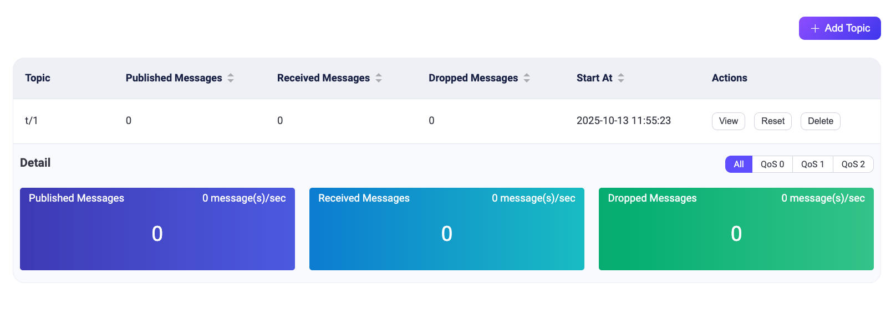

# トピックメトリクス

EMQXのトピックメトリクス機能は、指定したトピックに関する詳細な統計情報を提供します。これには、送受信されたメッセージ数、メッセージレート、その他関連するメトリクスが含まれます。この機能にアクセスするには、EMQXダッシュボードの **Diagnostics Tools** -> **Topic Metrics** に移動してください。あるいは、REST APIを通じてトピックメトリクスを取得することも可能です。

## ダッシュボードでトピックメトリクスを確認する

<<<<<<< HEAD
トピックメトリクス機能を有効化した後、ページ右上の **Add Topic** ボタンをクリックして新しいトピック監視ルールを追加できます。なお、`+` や `#` といったワイルドカードを含むトピックフィルターは現時点でサポートされていません。特定のトピック名を指定する必要があります。

**Actions** 列の **View** ボタンをクリックすると、指定したトピックの1秒あたりの受信、送信、およびドロップされたメッセージ数の詳細情報を確認できます。異なるQoSレベルごとにフィルタリングすることも可能です。
=======
トピックメトリクス機能を有効にした後、ページ右上の **Add Topic** ボタンをクリックして新しいトピック監視ルールを追加できます。なお、`+` や `#` といったワイルドカードを含むトピックフィルターは現時点でサポートされていません。特定のトピック名を指定する必要があります。

**Actions** 列の **View** ボタンをクリックすると、指定したトピックの受信、送信、ドロップされたメッセージ数（秒あたり）に関する詳細情報を確認できます。また、異なるQoSレベルごとに情報をフィルタリングすることも可能です。
>>>>>>> origin/release-6.1

トピックメトリクス一覧には以下の項目が含まれます：

- **Topic**: 監視対象のトピック名
<<<<<<< HEAD
- **Incoming messages**: 現在のトピックにおける受信メッセージの合計数および1秒あたりの受信メッセージ数
- **Outgoing Messages**: 現在のトピックにおける送信メッセージの合計数および1秒あたりの送信メッセージ数
- **Dropped Messages**: 現在のトピックでドロップされたメッセージの合計数および1秒あたりのドロップメッセージ数
=======
- **Incoming messages**: 現在のトピックにおける受信メッセージの総数および秒あたりの受信メッセージ数
- **Outgoing Messages**: 現在のトピックにおける送信メッセージの総数および秒あたりの送信メッセージ数
- **Dropped Messages**: 現在のトピックにおけるドロップされたメッセージの総数および秒あたりのドロップ数
>>>>>>> origin/release-6.1
- **Start at**: このトピック監視レコードを作成した日時
- **Actions**: このトピック監視レコードに対して実行可能な操作
  - **View**: 異なるQoSレベルごとのトピック詳細メトリクスを表示
  - **Reset**: 監視を再起動
  - **Delete**: レコードを削除

## REST APIでトピックメトリクスを取得する

<<<<<<< HEAD
APIを通じてトピックメトリクスを取得することも可能です。EMQX APIの利用方法については、[REST API](../admin/api.md)をご参照ください。
=======
トピックメトリクスはAPI経由でも取得可能です。EMQXのAPIの利用方法については、[REST API](../admin/api.md) を参照してください。
>>>>>>> origin/release-6.1

