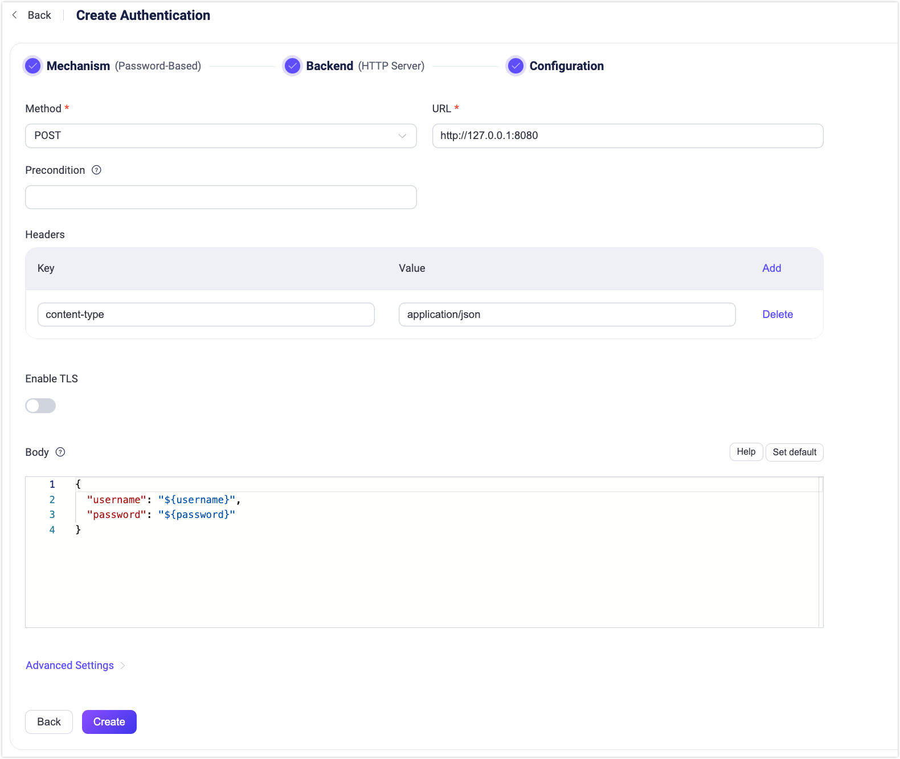

# HTTPサービスの利用

EMQXは、パスワード認証に外部のHTTPサービスを利用することをサポートしています。有効化すると、クライアントが接続要求を開始した際に、EMQXは受け取った情報を使ってHTTPリクエストを構築し、クエリ結果に基づいて要求を受け入れるかどうかを判断し、複雑な認証ロジックを実現します。

::: tip 前提条件

[基本的なEMQX認証の概念](../authn/authn.md)の知識

:::

## HTTPリクエストとレスポンス

認証プロセスはHTTP APIコールに似ており、EMQXはリクエストクライアントとして「API」が要求する形式でHTTPサービスにリクエストを構築・送信し、HTTPサービスは「クライアント」が要求する形式で結果を返します。

- レスポンスのエンコーディング形式 `content-type` は `application/json` である必要があります。
- 認証結果はボディ内の `result` で示し、オプション値は `allow`、`deny`、`ignore` です。
- スーパーユーザーはボディ内の `is_superuser` で示し、オプション値は `true` または `false` です。
- EMQX v5.7.0以降、オプションの `client_attrs` フィールドを使って[クライアント属性](../../../develop/client-attributes/client-attributes.md)を設定可能です。キーと値は両方とも文字列である必要があります。
- EMQX v5.8.0以降、レスポンスボディにオプションの `acl` フィールドを設定してクライアントの権限を指定できます。詳細は[アクセスコントロールリスト（ACL）](./acl.md)を参照してください。
- EMQX v5.8.0以降、レスポンスボディにオプションの `expire_at` フィールドを設定してクライアント認証の有効期限を指定可能です。これによりクライアントは切断され、再接続時に再認証が強制されます。値は秒単位のUnixタイムスタンプです。
- HTTPレスポンスのステータスコードは `200` または `204` であるべきです。`4xx/5xx` のステータスコードが返された場合はボディを無視し、結果を `ignore` として認証チェーンを継続します。

レスポンス例:

```js
HTTP/1.1 200 OK
Headers: Content-Type: application/json
...
Body:
{
    "result": "allow", // "allow" | "deny" | "ignore"
    "is_superuser": false, // オプション値: true | false、デフォルト値: false
    "client_attrs": { // オプション（v5.7.0以降）
        "role": "admin",
        "sn": "10c61f1a1f47"
    }
    "expire_at": 1654254601, // オプション（v5.8.0以降）
    "acl": // オプション（v5.8.0以降）
    [
        {
            "permission": "allow",
            "action": "subscribe",
            "topic": "eq t/1/#",
            "qos": [1]
        },
        {
            "permission": "deny",
            "action": "all",
            "topic": "t/3"
        }
    ]
}
```

::: tip EMQX 4.xとの互換性について

EMQX 4.xではHTTPステータスコードのみが使用され、ボディは破棄されます。例えば、`200` は `allow`、`403` は `deny` を示します。表現力が不足していたため、HTTPボディを活用する形に再設計されており、EMQX 5.0とは互換性がありません。

:::

## ダッシュボードでの設定

EMQXダッシュボードから関連設定を完了できます。

1. EMQXダッシュボードの左ナビゲーションメニューで **Access Control** -> **Authentication** をクリックします。
2. **Authentication** ページの右上にある **Create** をクリックします。
3. **Mechanism** に **Password-Based** を、**Backend** に **HTTP Server** を選択し、**Configuration** タブに進みます。以下のように表示されます。



4. 以下の指示に従い認証バックエンドを設定します。

   - **Method**: HTTPリクエストメソッドを選択します。選択肢は `get`、`post` です。

     :::tip

     `POST` メソッドの利用を推奨します。`GET` メソッドを使う場合、パスワードなどの機微な情報がHTTPサーバーログに平文で記録される可能性があります。また、信頼できない環境ではHTTPSを使用してください。
      :::

   - **URL**: HTTPサービスのURLアドレスを入力します。
   - **Precondition**: [Variform式](../../configuration/configuration.md#variform-expressions)で、HTTPサーバー認証器をクライアント接続に適用するかどうかを制御します。式はクライアントの属性（`username`、`clientid`、`listener`など）に対して評価され、結果が文字列の `"true"` の場合のみ認証器が呼び出されます。それ以外の場合はスキップされます。詳細は[認証の前提条件](./authn.md#authentication-preconditions)を参照してください。
   - **Headers**（オプション）: HTTPリクエストヘッダーです。複数追加可能で、キーと値には[プレースホルダー](./authn.md#authentication-placeholders)を使用できます。
   - **Enable TLS**: TLSを有効にする場合はトグルスイッチをオンにします。TLS有効化の詳細は[ネットワークとTLS](../../network/overview.md)を参照してください。
   - **Body**: リクエストテンプレートです。`POST` リクエストの場合はJSON形式でリクエストボディに送信され、`GET` リクエストの場合はURLのクエリ文字列にエンコードされます。キーと値には[プレースホルダー](./authn.md#authentication-placeholders)を使用可能です。
   - **詳細設定**:
     - **Pool size**（オプション）: EMQXノードからHTTPサーバーへの同時接続数を整数で指定します。デフォルトは `8` です。

     - **Connect Timeout**（オプション）: EMQXが接続タイムアウトとみなすまでの待機時間を指定します。単位はミリ秒、秒、分、時間が利用可能です。

     - **HTTP Pipelining**（オプション）: 応答を待たずに送信可能な最大HTTPリクエスト数を正の整数で指定します。デフォルトは `100` です。

     - **Request Timeout**（オプション）: EMQXがリクエストタイムアウトとみなすまでの待機時間を指定します。単位はミリ秒、秒、分、時間が利用可能です。

5. 設定が完了したら **Create** をクリックします。

## 設定項目による設定

EMQXの設定項目でHTTP認証器を設定できます。 <!--詳細は[authn-http:post](../../configuration/configuration-manual.html#authn-http:post)および[authn-http:get](../../configuration/configuration-manual.html#authn-http:get)を参照してください。-->

以下はHTTPの `POST` と `GET` リクエストの例です。

:::: tabs type:card

::: tab POSTリクエスト

```hcl
{
    mechanism = password_based
    backend = http

    method = post
    url = "http://127.0.0.1:8080/auth?clientid=${clientid}"
    body {
        username = "${username}"
        password = "${password}"
    }
    headers {
        "Content-Type" = "application/json"
        "X-Request-Source" = "EMQX"
    }
}
```

:::

::: tab GETリクエスト

注：`body` はクエリ文字列に変換されます。

```hcl
{
    mechanism = password_based
    backend = http

    method = get
    url = "http://127.0.0.1:32333/auth"
    body {
        username = "${username}"
        password = "${password}"
    }
    headers {
        "X-Request-Source" = "EMQX"
    }
}
```

:::

::::
